# Lab 01: Provisioning Azure OpenAI resource and exploring Azure AI Studio Playground

**Introduction**

Azure OpenAI Service brings the generative AI models developed by OpenAI
to the Azure platform, enabling you to develop powerful AI solutions
that benefit from the security, scalability, and integration of services
provided by the Azure cloud platform. The first step to use an Azure
Open AI model is to provision an Azure OpenAI resource. In this lab,
you’ll learn how to get started with Azure OpenAI service by
provisioning Azure OpenAI resource in the Azure portal.

**Objectives**

- To configure VM settings and register necessary Azure resource
  providers.

- To create an Azure OpenAI resource and retrieve key and endpoint.

- To install the required Python libraries.

## **Task 0: Sync Host environment time**

1.  In your VM, navigate and click in the **Search bar**, type
    **Settings** and then click on **Settings** under **Best match**.

> 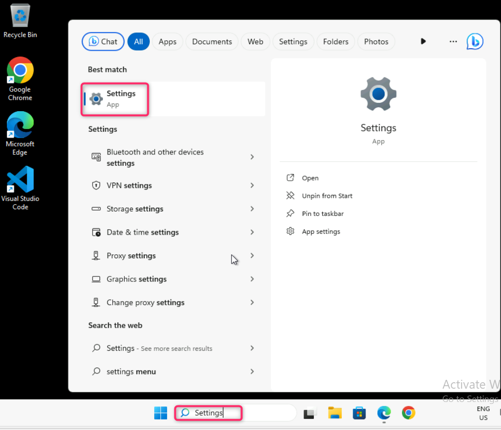 style="width:4.65394in;height:3.99955in" />

2.  On Settings window, navigate and click on **Time & language**.

3.  On **Time & language** page, navigate and click on **Date & time**.

4.  Scroll down and navigate to **Additional settings** section, then
    click on **Syn now** button. It will take 3-5 minutes to syn.

5.  Close the **Settings** window.

## **Task 1: Register the required Resource providers**

1.  Open your browser, navigate to the address bar, type or paste the
    following URL:
    [<u>https://portal.azure.com/</u>](https://portal.azure.com/), then
    press the **Enter** button.

>  alt="A screenshot of a computer Description automatically generated" />

2.  In the **Sign in** window, enter the **Username** and click on the
    **Next** button.

3.  Then, enter the password and click on the **Sign in** button**.**

> 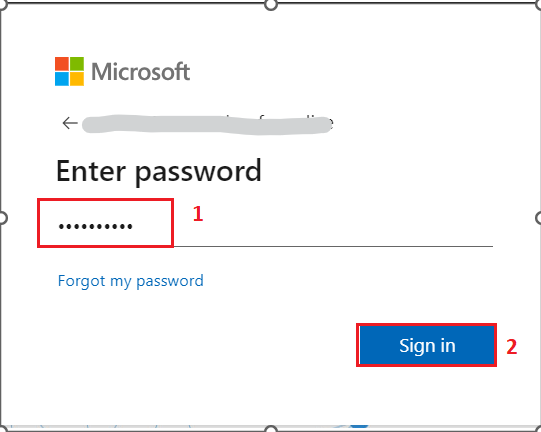 alt="A login screen with a log in box Description automatically generated" />

4.  In **Stay signed in?** window, click on the **Yes** button.

>  alt="Graphical user interface, application Description automatically generated" />

5.  On **Welcome to Microsoft Azure** dialog box, click on **Maybe
    later** button.

>  alt="A screenshot of a computer Description automatically generated" />

6.  In the Azure portal search box, type **Subscriptions**, then click
    on **Subscriptions** under **Services**.

7.  In the **Subscriptions** page, navigate and click on **Azure Pass –
    Sponsorship**.

8.  In the **Azure Pass – Sponsorship** page left-sided navigation menu,
    navigate to the **Settings** section, then click on the **Resource
    Providers**.

9.  In the **Azure Pass – Sponsorship \| Resource providers** page,
    navigate to the search box and type **Microsoft.Storage**. Select
    the **Microsoft.Storage** under **Provider**, then click on the
    **Register** as shown in the below image.

10. You’ll see a notification stating - **Successfully registered
    resource provider** once the registration is successful. You can
    also view the notification by clicking on the bell icon in the Azure
    portal.

11. In the **Azure Pass – Sponsorship \| Resource providers** page,
    navigate to the search box and type **Microsoft.Security**. Select
    the **Microsoft.Security** under **Provider**, then click on the
    **Register** as shown in the below image.

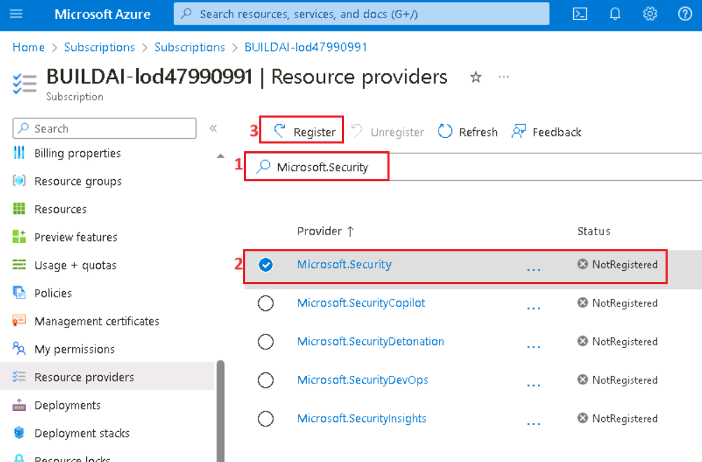

12. You’ll see a notification stating - **Successfully registered
    resource provider** once the registration is successful. You can
    also view the notification by clicking on the bell icon in the Azure
    portal.

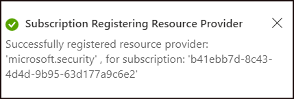

13. Repeat the steps \#10 and \#11 to register the following Resource
    providers.

    - **Microsoft.CognitiveServices**

    - **Microsoft.Search**

    - **Microsoft.Sql**

    - **Microsoft.Web**

    - **Microsoft.ManagedIdentity**

## **Task 2: Create Azure OpenAI resource**

1.  From the Azure portal home page, click on **Azure portal menu**
    represented by three horizontal bars on the left side of the
    Microsoft Azure command bar as shown in the below image.

> 

2.  Navigate and click on **+ Create a resource**.

> 

3.  On **Create a resource** page, in the **Search services and
    marketplace** search bar, type **Azure OpenAI**, then press the
    **Enter** button.

>  style="width:4.77917in;height:4.19021in" />

4.  In the **Marketplace** page, navigate to the **Azure OpenAI**
    section, click on the Create button dropdown, then select **Azure
    OpenAI** as shown in the image. (In case, you’ve already clicked on
    the **Azure** **OpenAI** tile, then click on the **Create** button
    on the **Azure OpenAI page**).

> 

5.  In the **Create Azure OpenAI** window, under the **Basics** tab,
    enter the following details and click on the **Next** button.

<table>
<colgroup>
<col style="width: 45%" />
<col style="width: 54%" />
</colgroup>
<thead>
<tr class="header">
<th><blockquote>

<strong>Subscription</strong>

</blockquote></th>
<th><blockquote>

Select the assigned subscription

</blockquote></th>
</tr>
</thead>
<tbody>
<tr class="odd">
<td><blockquote>

<strong>Resource group</strong>

</blockquote></td>
<td>Click on <strong>Create new</strong>&gt; enter
<strong>AOAI-RGXX</strong>(XX can be a unique number, you can add more
digits after XX to make the name unique)</td>
</tr>
<tr class="even">
<td><blockquote>

<strong>Region</strong>

</blockquote></td>
<td>For this lab, you will use a <strong>GPT-4O</strong> model. This
model is currently only available in <a
href="https://learn.microsoft.com/azure/ai-services/openai/concepts/models#embeddings-models">certain
regions</a>. Please select a region from this list, In this lab
<strong>East US 2</strong> is using for this resource.</td>
</tr>
<tr class="odd">
<td><blockquote>

<strong>Name</strong>

</blockquote></td>
<td>Azure-openai-testXX (XX can be a unique number, you can add more
digits after XX to make the name unique) (here, we entered
<strong>Azure-open-test39</strong>)</td>
</tr>
<tr class="even">
<td><blockquote>

<strong>Pricing tier</strong>

</blockquote></td>
<td><blockquote>

Select <strong>Standard S0</strong>

</blockquote></td>
</tr>
</tbody>
</table>

> 
>
> 

6.  In the **Network** tab, leave all the radio buttons in the default
    state, and click on the **Next** button.

>  style="width:5.58101in;height:5.89583in" />

7.  In the **Tags** tab, leave all the fields in the default state, and
    click on the **Next** button.

>  style="width:5.85157in;height:4.8375in" />

8.  In the **Review+submit** tab, once the Validation is Passed, click
    on the **Create** button.

>  style="width:6.48333in;height:7.51667in" />

9.  Wait for the deployment to complete. The deployment will take around
    2-3 minutes.

10. On **Microsoft.CognitiveServicesOpenAI** window, after the
    deployment is completed, click on the **Go to resource** button.

## Task 3: Create a Speech resource in the Azure portal

1.  Open your browser, navigate to the address bar, and paste the
    following URL:
    <https://portal.azure.com/#create/Microsoft.CognitiveServicesSpeechServices>
    then press the **Enter** button.

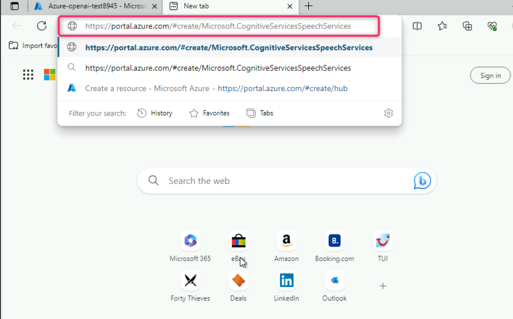

2.  On the **Create Speech Services** page, enter the following
    information, then click on **Review+create** button.

| **Field** | **Description** |
|----|----|
| **Subscription** | Select your Azure OpenAI subscription |
| **Resource group** | Select your Resource group (that you have created in **Lab 1**) |
| **Region** | East US |
| **Name** | SpeechChat-testXX (XX can be unique number) |
| **Pricing Tier** | Standard S0 |

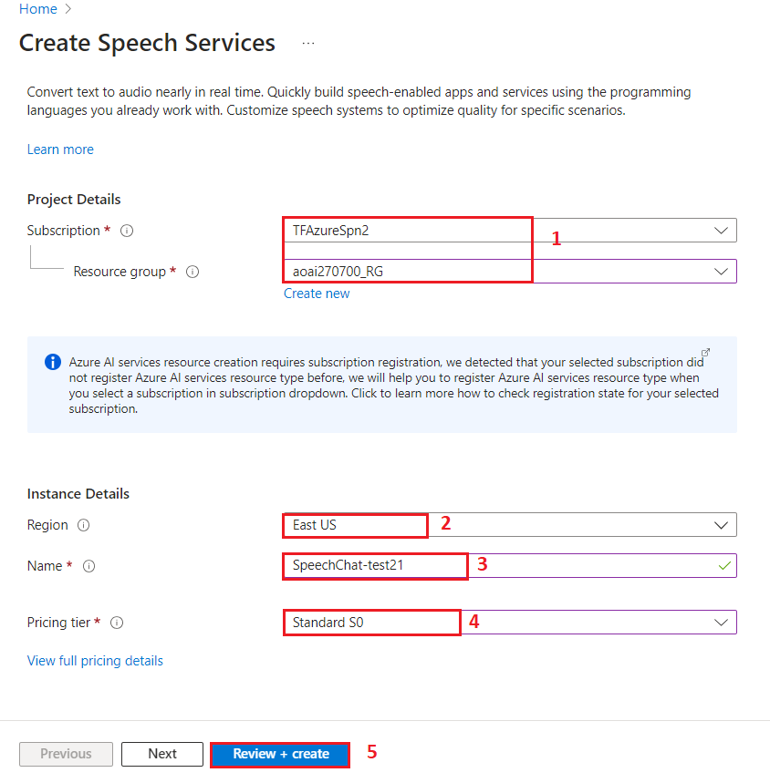

3.  Once the Validation is passed, click on the **Create** button.

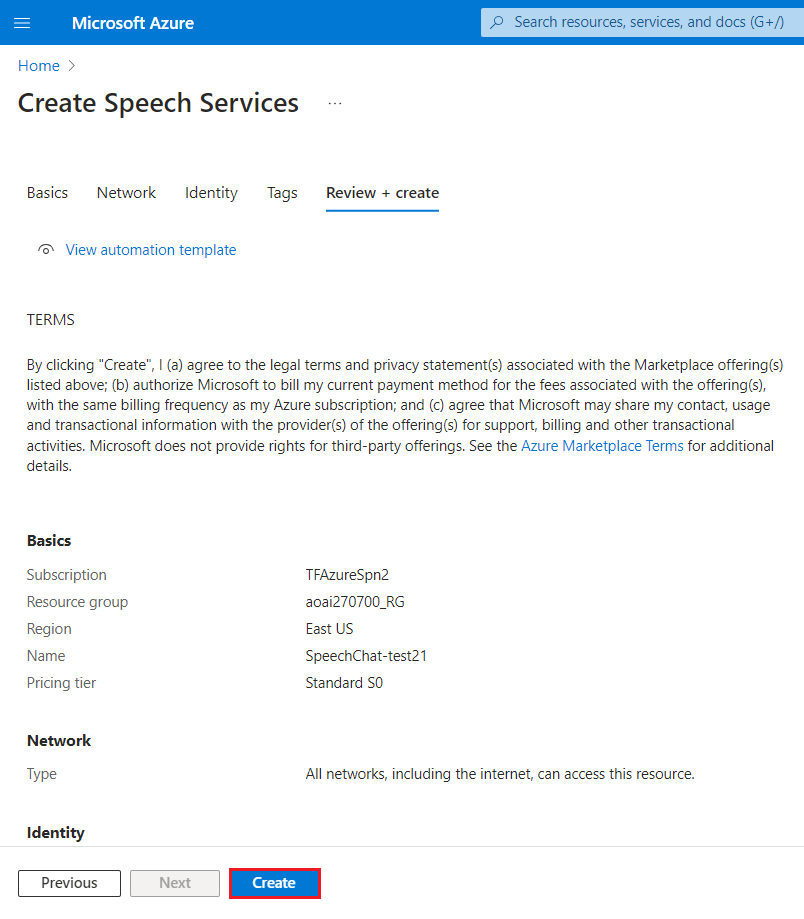

4.  Wait for few minutes until the deployment is completed.

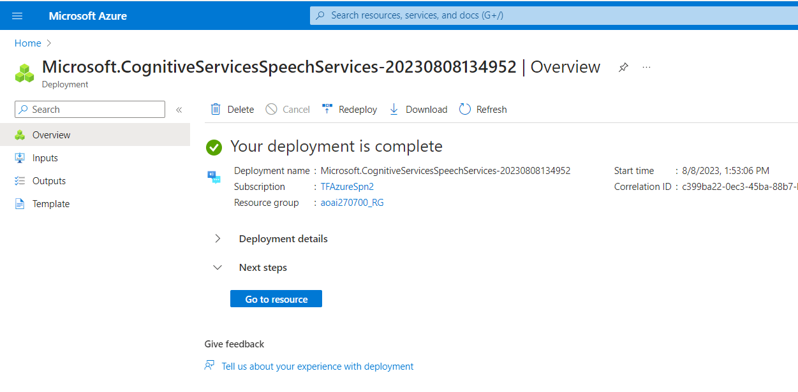

## **Task 4: Create the project using Azure AI Studio**

1.  After the deployment is completed, click on **Home** at the top left
    corner of the page to go back to Azure portal. In the Azure portal,
    navigate and click on **Resource groups** under **Azure services**.

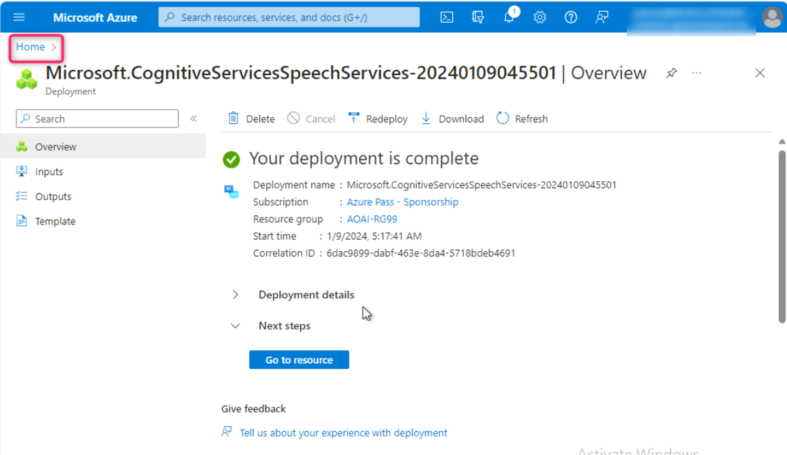

>  alt="A screenshot of a computer Description automatically generated" />

2.  Select the resource group that you’ve created in **Lab \#1**.

> 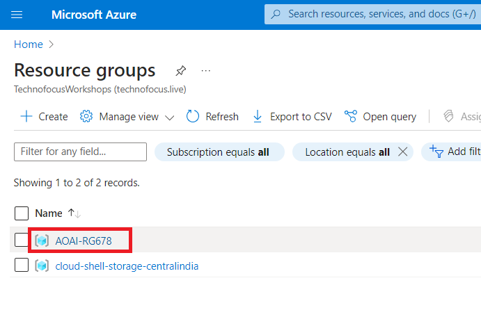 style="width:5.75833in;height:3.90833in" />

3.  In the **AOAI-RGXX Resource group** page, navigate and click on
    **Azure-openai-testXX** as shown in the below image.

>  style="width:6.49167in;height:3.07917in" />

4.  In **Azure-openai-testXX** page, click on **Overview** in the
    left-sided navigation menu, scroll down and click on **Explore Azure
    AI Studio** button as shown in the below image.

>  style="width:6.49167in;height:4.08333in" />
>
> 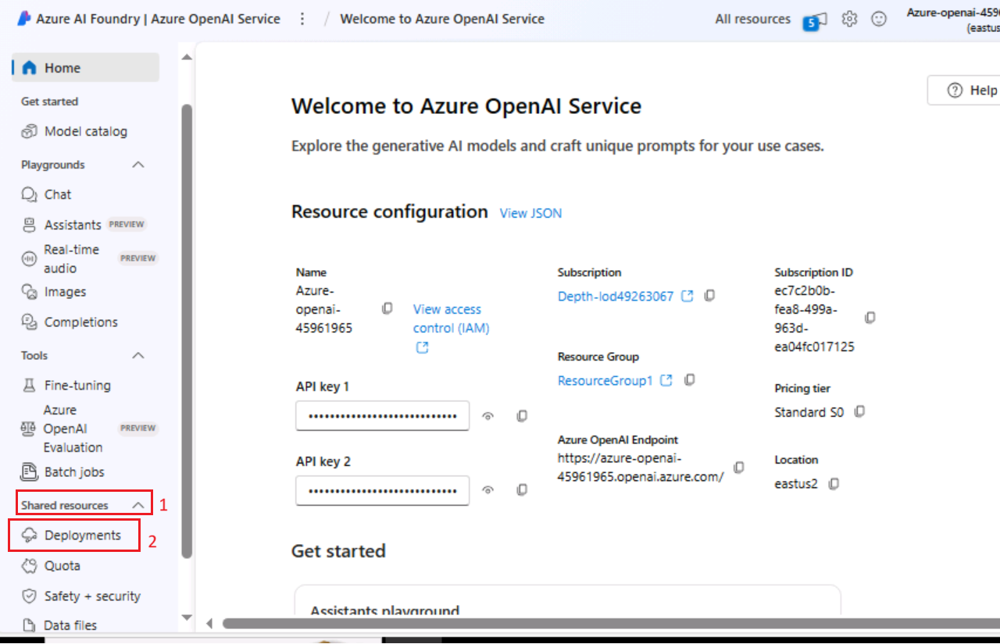

5.  On **Azure AI Studio** window, click on **Create now** button.

6.  On Create an AI project tab, click on **Create a new project and
    continue**

7.  On Create an AI project tab, click on **Create a new project** .

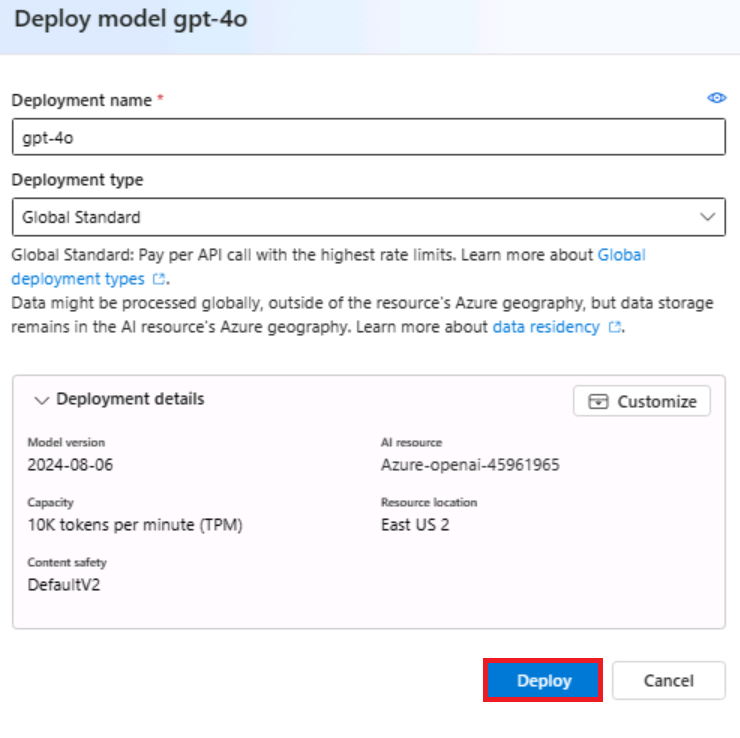

8.  On Create an AI project tab, click on **Next** button.

9.  On Create an AI project tab, click on **Next** button.

10. On Create an AI project tab, click on **Create Project** button.

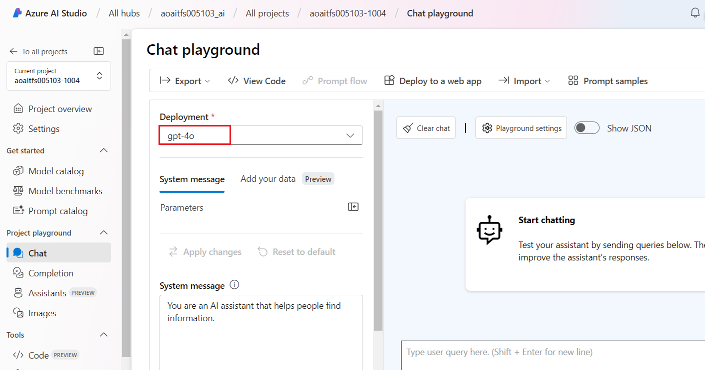

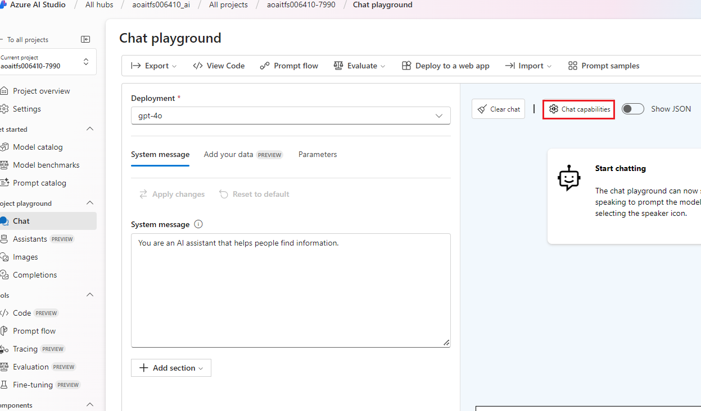

11. Now, you’re directed to the **Azure AI Studio** home page,

> 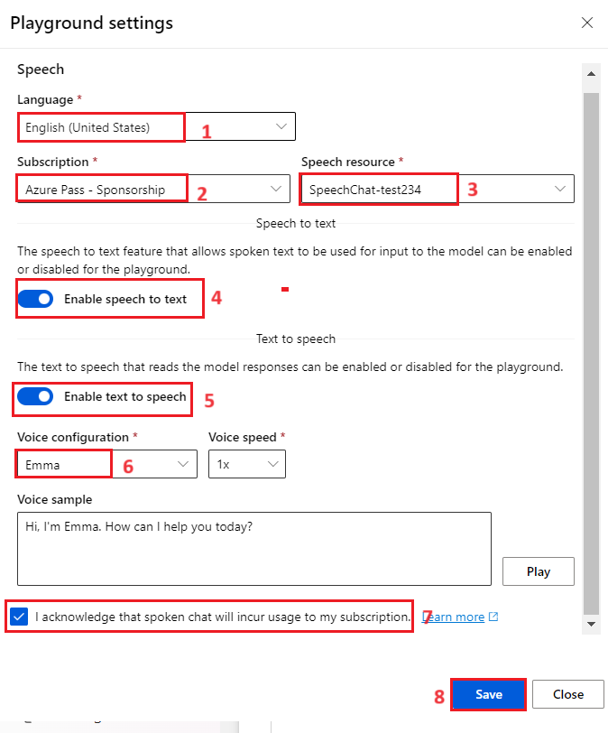 alt="A screenshot of a computer Description automatically generated" />

## **Task 5: Hear and speak with chat models in the Azure AI Studio playground**

Give your app the ability to hear and speak by pairing Azure OpenAI
Service with Azure AI Speech to enable richer interactions.

The speech to text and text to speech features can be used together or
separately in the Azure AI Studio playground. You can use the playground
to test your chat model before deploying it.

In this chat session, you use both speech to text and text to speech.
You use the speech to text feature to speak to the assistant, and the
text to speech feature to hear the assistant's response.

1.  In the **Azure AI Studio Preview** page, navigate to **Components**
    section and click on **Deployments**.

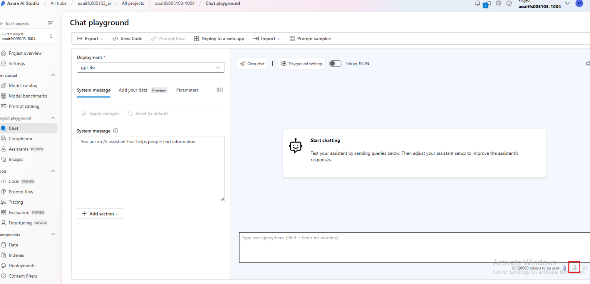

2.  In the **Deployments** window, drop down the **+Deploy model** and
    select **Deploy base model.**

3.  In the **Select a model** dialog box, navigate and carefully select
    **gpt-4o**, then click on **Confirm** button.

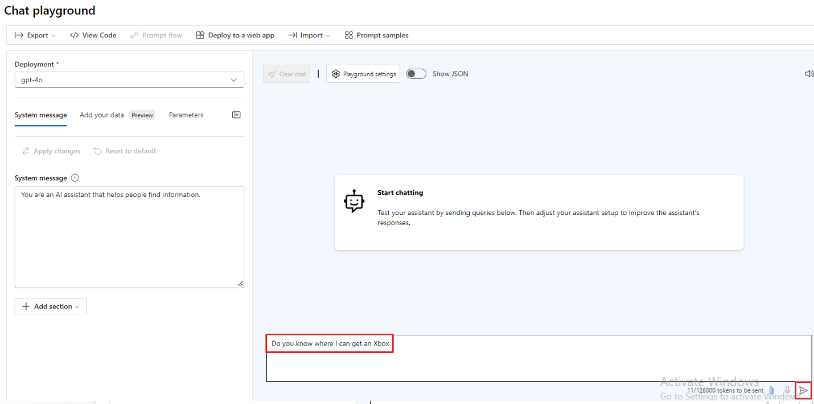

4.  In the **Deploy model gpt-4o** dialog box, under the **Deployment
    name** field, ensure that **gpt-4o**, then click on the **Deploy**
    button.

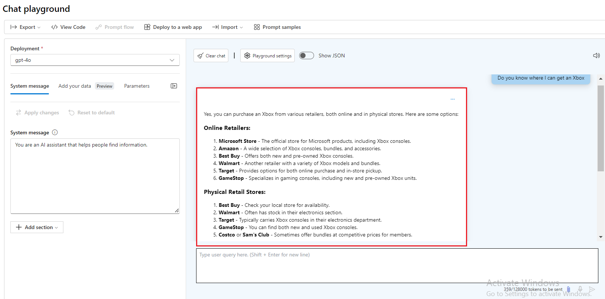

5.  **gpt-4o** deployment is successful.

6.  In **gpt-4o** pane, click on **Open in Playground** button.

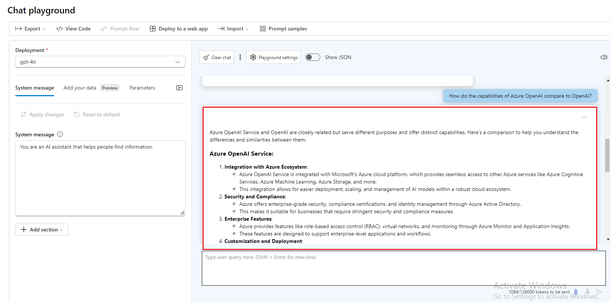

7.  Ensure that **gpt-4o** is selected under **Deployment**.

8.  Now, navigate to the Chat session section and click on **Chat
    capabilities**.

** Note:** You should also see the options to select the microphone or
speaker buttons. If you select either of these buttons but haven't yet
enabled speech to text or text to speech, you are prompted to enable
them in **Playground Settings**.

9.  On the **Playground Settings** page, provide the following
    information and then click on the **Save** button.

| **Language** | Select the language locale and voice you want to use for speaking and hearing. (In this lab, we are selecting **English**). |
|----|----|
| **Subscription** | Select your Azure OpenAI subscription |
| **Speech resource** | Select your speech resource group that you’ve created in **Task \#1**. |
| **Voice configuration** | Emma |

- **Select the check box**-I acknowledge that spoken chat will incur
  usage to my subscription.

- Select **Enable speech to text** and **Enable text to speech**.

**Note**: Optionally, you can enter some sample text and
select **Play** to try the voice.

10. Select the microphone button and speak to the assistant. For
    example, you can say "**Do you know where I can get an Xbox**".

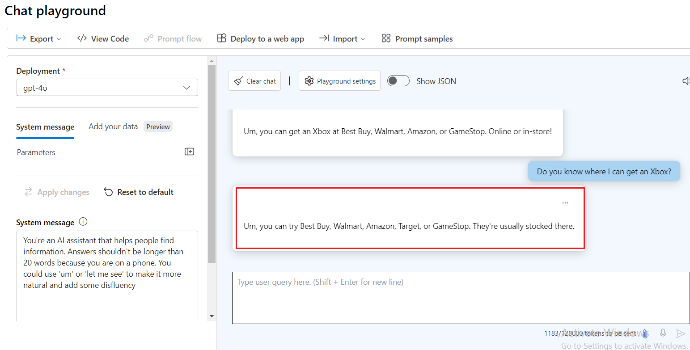

12. In case, use your microphone dialog box appears, then click on the
    **Allow** button.

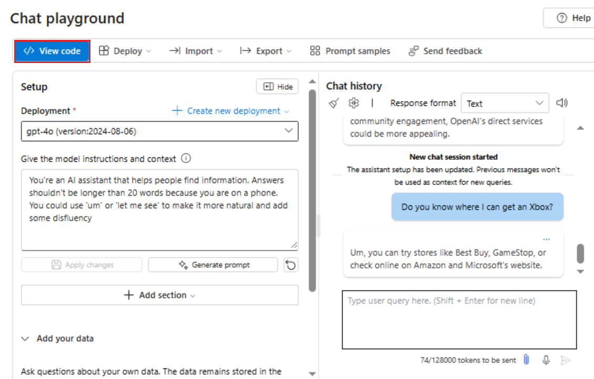

13. Click on the **Send** button (represented by right arrow) to send
    your message to the assistant. The assistant's response is displayed
    in the chat session pane.

> 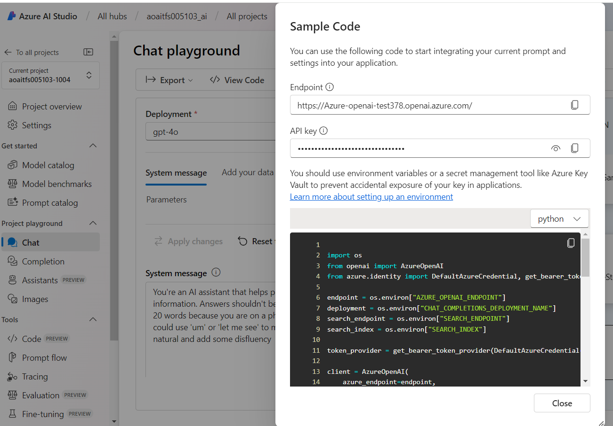 style="width:6.97917in;height:3.47615in" />

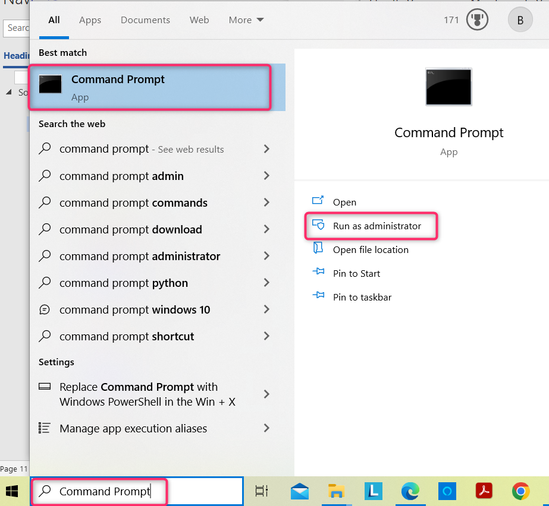

** Note:** If the speaker button is turned on, you'll hear the
assistant's response. If the speaker button is turned off, you won't
hear the assistant's response, but the response will still be displayed
in the chat session pane.

14. Select the microphone button and speak to the assistant. You can say
    " **How do the capabilities of Azure OpenAI compare to OpenAI?”**

15. Click on the **Send** button (represented by right arrow) to send
    your message to the assistant. The assistant's response is displayed
    in the chat session pane.

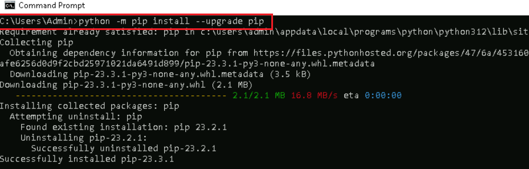

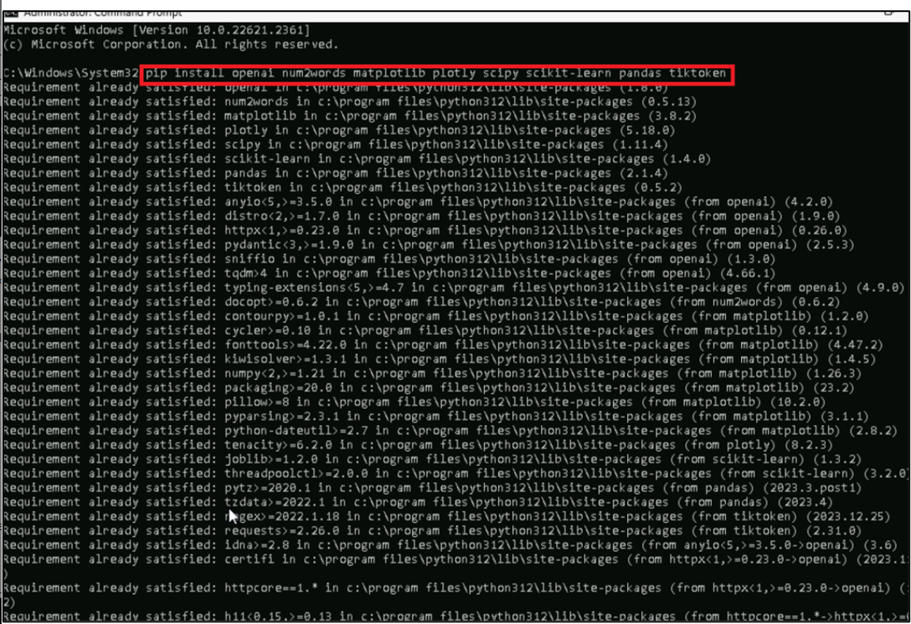

16. Navigate to **Assistant setup** section. You can change the system
    prompt to change the assistant's response format or style. Paste the
    following content under **System message** box, then click on
    **Apply changes** as shown in the below image.

> Copy
>
> "You're an AI assistant that helps people find
> information. Answers shouldn't be longer than 20 words because you are
> on a phone. You could use 'um' or 'let me see' to make it more natural
> and add some disfluency."
>
> 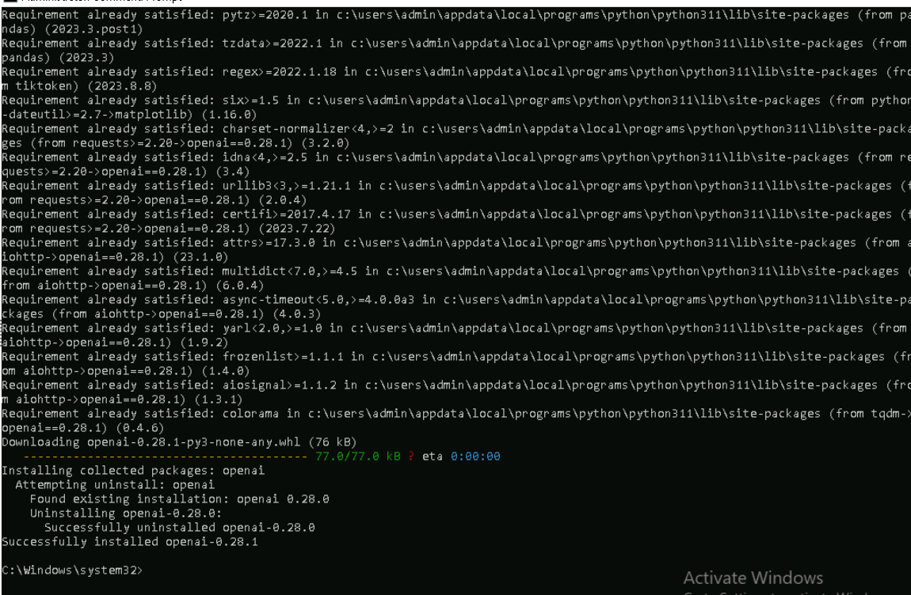

17. In the **Update system message?** dialog box, click on the
    **Continue button.**

>  style="width:3.51528in;height:2.67431in" />

18. Select the microphone button and speak to the assistant. You can say
    "**Do you know where I can get an Xbox?”**

19. Click on the Send button (represented by right arrow) to send your
    message to the assistant. The assistant's response is displayed in
    the chat session pane.

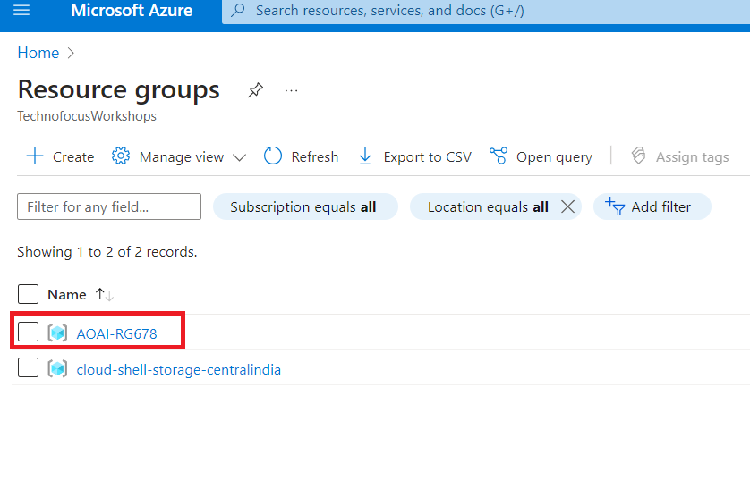

20. Select the **View Code** button to view and copy the sample code,
    which includes configuration for Azure OpenAI and Speech services.
    You can use the sample code to enable speech to text and text to
    speech in your application.

> 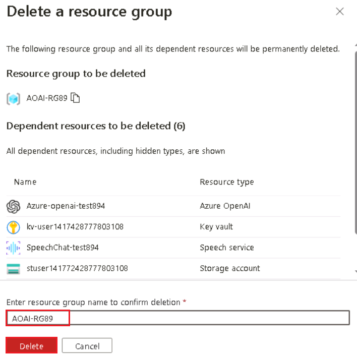
>
> 

## Task 6: Install Python libraries and pip updating 

1.  In your windows search bar, type **Command Prompt**. In the
    **Command Prompt App** dialog box, navigate and click on **Run as
    administrator**. If you see the dialog box - **Do you want to allow
    this app to make changes to your device?** then click on the **Yes**
    button.

2.  Move into the folder where the Python was installed and run the
    **pip** command. i.e., **C:\Users\Admin**

> copy
>
> **python -m pip install --upgrade pip**
>
>  alt="A screenshot of a computer screen Description automatically generated" />

3.  Run the following command to install Python libraries - openai,
    num2words, matplotlib, plotly, scipy, scikit-learn, pandas, tiktoken

Copy

pip install openai num2words matplotlib plotly scipy
scikit-learn pandas tiktoken

4.  Run the below command to install the Transformers package:

> Copy
>
> pip install transformers

## **Task 7: Clean up resources**

To avoid incurring unnecessary Azure costs, you should delete the
resources you created in this quick start if they're no longer needed.
To manage resources, you can use the [Azure
portal](https://portal.azure.com/?azure-portal=true).

1.  To delete the storage account, navigate to **Azure portal Home**
    page, click on **Resource groups**.

>  alt="A screenshot of a computer Description automatically generated" />

2.  Click on the resource group that you’ve created.

>  alt="A screenshot of a computer Description automatically generated" />

3.  In the **Resource group** home page, select the **delete resource
    group** .

4.  In the Delete a resource group tab, enter your resource group name
    and click on **Delete button**.

5.  In the **Delete Resources** pane that appears on the right side,
    navigate to **Enter “delete” to confirm deletion** field, type
    **delete**, then click on the **Delete** button.

6.  On **Delete confirmation** dialog box, click on **Delete** button.

>  alt="A screenshot of a computer Description automatically generated" />

7.  Click on the bell icon, you’ll see the notification – **Executed
    delete command on 4 selected items.**

**Summary**

In this lab, you’ve set the VM time, registered the necessary Azure
resource providers, then provisioned Azure OpenAI resource. You’ve
learned how to retrieve keys and endpoint information that will be used
for deploying Azure OpenAI models in the upcoming labs. Finally, you’ve
successfully installed Python libraries.

This lab focuses on hands-on exploration of Azure AI Studio and Azure
Cognitive Services for Speech and OpenAI integration. In this lab,
you’ve created and deployed resources, developed and tested text
completions, and engaged in chat sessions with AI models. At the end of
the lab, you’ve deleted the resources to avoid incurring unnecessary
Azure costs. In this lab, you’ve acquired practical skills in AI model
deployment, customization, and integration with speech capabilities,
making it a comprehensive learning experience in Azure AI technologies.
