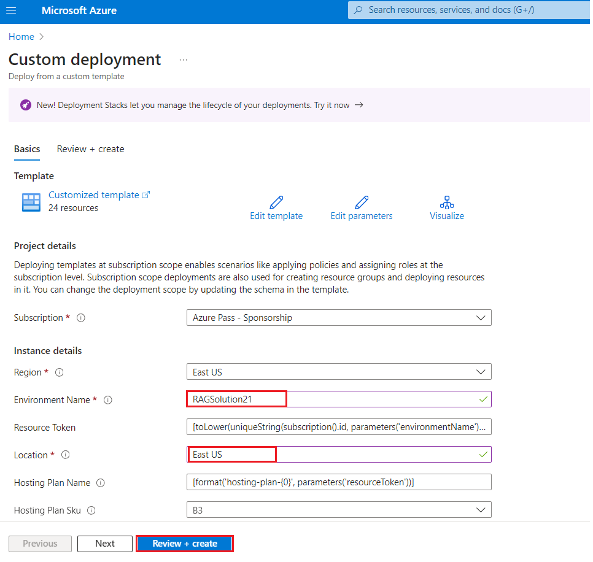
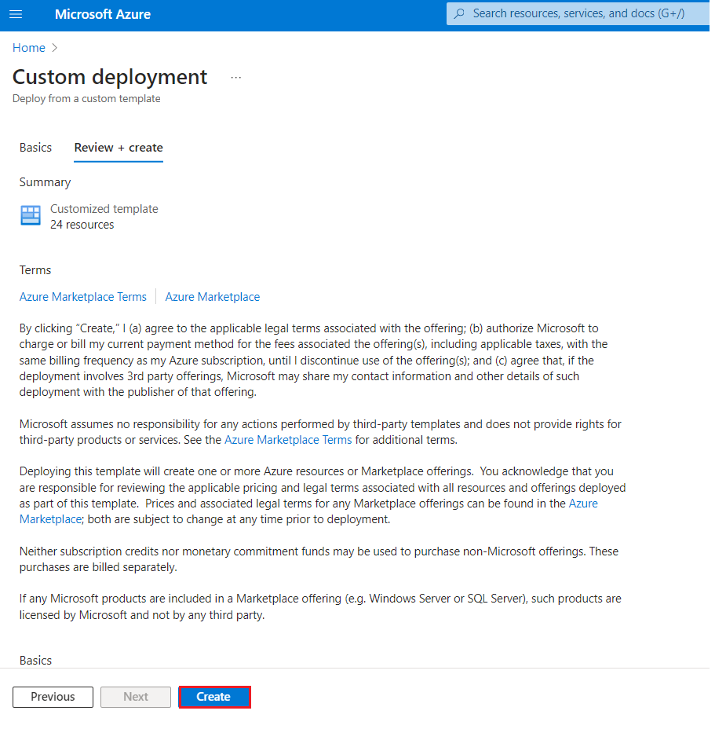
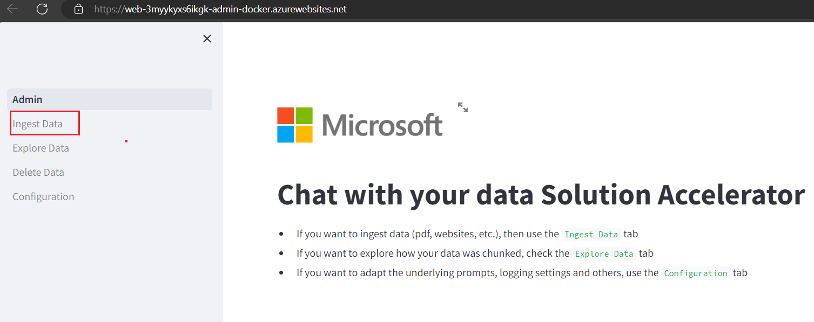
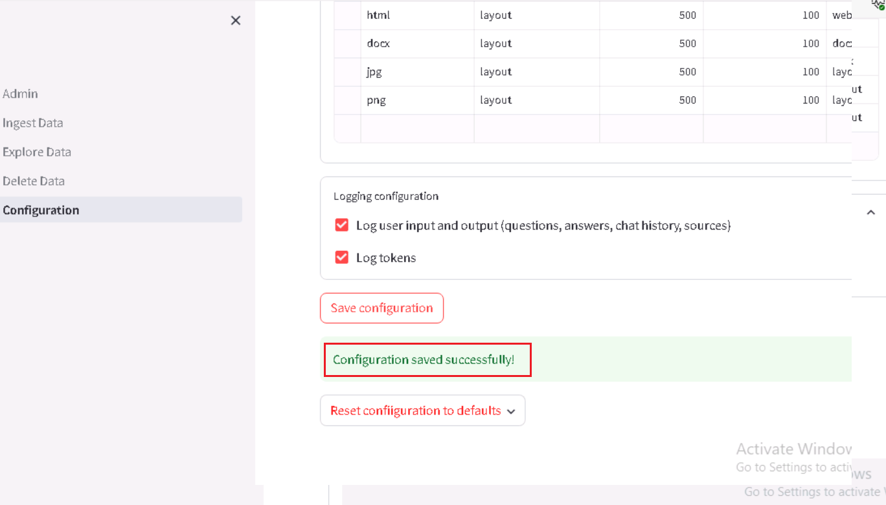
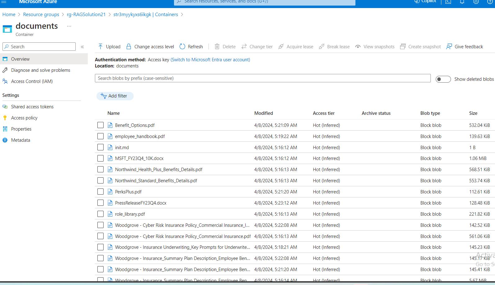
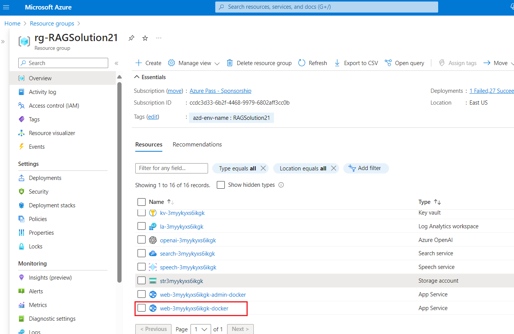
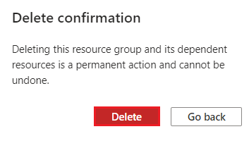

# Lab 11 -Chat with your data using RAG Solution accelerator

**Introduction**

 The *Chat with your data* Solution accelerator is a powerful tool that
combines the capabilities of Azure AI Search and Large Language Models
(LLMs) to create a conversational search experience. This solution
accelerator uses an Azure OpenAI GPT model and an Azure AI Search index
generated from your data, which is integrated into a web application to
provide a natural language interface, including speech-to-text
functionality, for search queries. Users can drag and drop files, point
to storage, and take care of technical setup to transform documents.
There is a web app that users can create in their own subscription with
security and authentication.

The sample data illustrates how this accelerator could be used in the
financial services industry (FSI).

In this scenario, a financial advisor is preparing for a meeting with a
potential client who has expressed interest in Woodgrove Investments’
Emerging Markets Funds. The advisor prepares for the meeting by
refreshing their understanding of the emerging markets fund's overall
goals and the associated risks.

Now that the financial advisor is more informed about Woodgrove’s
Emerging Markets Funds, they're better equipped to respond to questions
about this fund from their client.

Note: Some of the sample data included with this accelerator was
generated using AI and is for illustrative purposes only.

## Task 1: Deploy infrastructure from template

1.  Open your browser, navigate to the address bar, and type or paste
    the following UR: !!
    [www.portal.azure.com/](https://portal.azure.com/) !!then press the
    **Enter** button.

2.  In the **Microsoft Azure** window, enter your **Sign-in**
    credentials, and click on the **Next** button.

>  alt="A screenshot of a computer Description automatically generated" />

3.  Then, enter the password and click on the **Sign in** button**.**

>  alt="A screenshot of a login box Description automatically generated" />

4.  In **Stay signed in?** window, click on the **Yes** button.

>  alt="Graphical user interface, application Description automatically generated" />

5.  Open a new browser and enter the following URL in the address bar:
    <https://portal.azure.com/#create/Microsoft.Template/uri/https%3A%2F%2Fraw.githubusercontent.com%2FAzure-Samples%2Fchat-with-your-data-solution-accelerator%2Fmain%2Finfra%2Fmain.json>
    to open the Azure Portal.

6.  On **Custom deployment** window, under the **Basics** tab, enter the
    following details to deploy the custom template and then click on
    **Review + create.**

| **Environment Name** | Enter RAGSolutionXX(XXXcan be a unique name) |
|----------------------|----------------------------------------------|
| **Location**         | East US                                      |

7.  On **Review + create** tab, once the Validation is Passed, click on
    the **Create** button.

8.  Wait for the deployment to complete. The deployment will take around
    17-19 minutes.

9.  Click on the **Go to Subscription** button

## Task 2: Verify deployed resources in the Azure portal

1.  On the Home page, click on **Resource Groups**.

> 

2.  Click on your resource group name **rg-RAGSolutionXX**

> 

3.  Make sure the below resource got deployed successfully into East US
    region

- Azure App Service

- Azure Application Insights

- Azure Bot

- Azure OpenAI

- Azure Document Intelligence

- Azure Function App

- Azure Search Service

- Azure Storage Account

- Azure Speech Service

## Task 3: Testing the deployment

1.  On the resource group and click on **Web-** {RESOURCE_TOKEN} **-
    admin-docker** resource name.

2.  Navigate to the admin site
    https://web-{RESOURCE_TOKEN}-admin.azurewebsites.net/

3.  In **Chat with your data Solution Accelerator** page, from the left
    navigation menu select **Ingest Data.**

4.  In the Add documents Batch pane, Click on **Browse file** and
    navigate to **C:\Labfiles \data** location and select **all files,**
    then click on **Open** button.

5.  To upload files will take 1-2 minutes

6.  Click on the **Reprocess all documents in the Azure Storage
    account.**

7.  In **Chat with your data Solution Accelerator** page, from the left
    navigation menu select **Configuration** and select the **check box-
    Enable post-answering prompt.**

8.  In the configuration pane , Click on the **Save configuration.**

9.  Go back to the resource group page and click on **the Storage
    account** name

10. From the left navigation menu, click on **Containers.**

11. In the Containers page, select **documents**.

12. Make sure all the files should be deployed successfully

13. Go back to the resource group page

14. In the resource group page, select App service as
    **web-{RESOURCE_TOKEN}-docker**

15. On Web App **Overview** page, navigate to the command bar and click
    on **Browse**, it will navigate you to the web application.

16. In the **Azure AI** web app page, enter the following text and click
    on the **Submit icon** as shown in the below image.

**Describe in more detail the risks from market volatility**

17. In the **Chat session** section, select the references link and
    observe the details of search document on right side of the page.

18. In the **Azure AI** web app page, enter the following text and click
    on the **Submit icon** as shown in the below image.

**CodeCopy**

**How does Woodgrove Financial handle payroll taxes for employees
outside the U.S.?**

19. In the **Azure AI** web app page, enter the following text and click
    on the **Submit icon** as shown in the below image.

What is FORM 10-K and explain?

## **Task 4: Delete Azure OpenAI Resource**

1.  To Azure OpenAI resource , type **Resource groups** in the Azure
    portal search bar, navigate and click on **Resource groups** under
    **Services**.

>  alt="A screenshot of a computer Description automatically generated" />

2.  Click on your resource group.

> 

3.  On an overview page of resource group Select the **Delete resource
    group**

4.  In the **Delete Resources** pane that appears on the right side,
    enter the **resource group name** and click on **Delete** button.

5.  On **Delete confirmation** dialog box, click on D**elete** button.

