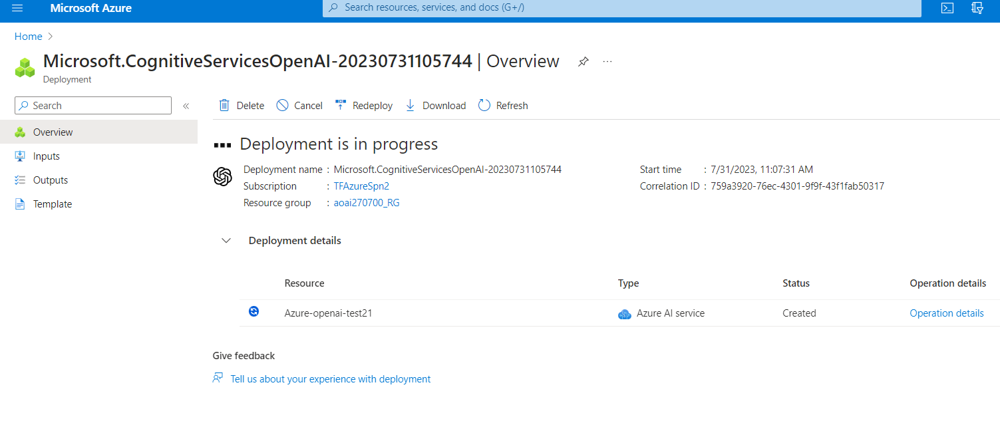
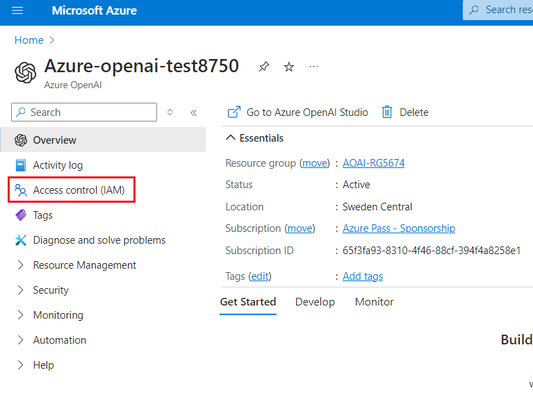
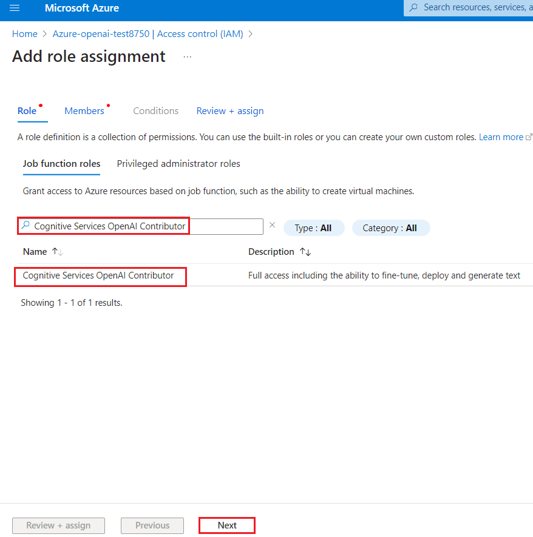
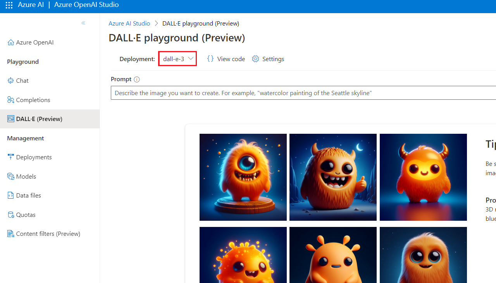
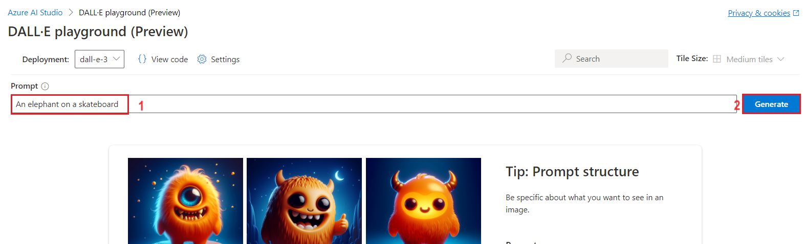

# Lab 02- Exploring Azure AI Studio Playground

**Introduction**

You can use the Azure AI Studio Playground for text completions, viewing
python, json, C#, and curl code samples prefilled according to your
selected settings, providing your app the ability to hear and speak by
pairing Azure OpenAI Service with Azure AI Speech to enable richer
interactions, etc. You can use Azure OpenAI Service and Azure AI Speech
to:

- Speak to the assistant via speech to text.

- Hear the assistant's response via text to speech.

The speech to text and text to speech features can be used together or
separately in the Azure AI Studio playground. You can also use the
playground to test your chat model before deploying it.

**Objectives**

- To explore Azure AI Studio by creating and deploying a Speech
  resource, setting up projects, and deploying an Azure OpenAI model for
  text completions.

- To enable voice interactions in the Azure AI Studio playground by
  pairing Azure OpenAI with Speech services, conducting chat sessions,
  and customizing the AI assistant's behavior.

- To review and extract code samples for Azure OpenAI and Speech
  services, gaining insights into integrating speech-to-text and
  text-to-speech functionalities in applications.

## Task 1: Create a Speech resource in the Azure portal

1.  Open your browser, navigate to the address bar, and paste the
    following URL:
    <https://portal.azure.com/#create/Microsoft.CognitiveServicesSpeechServices>
    then press the **Enter** button.

2.  On the **Create Speech Services** page, enter the following
    information, then click on **Review+create** button.

| **Field** | **Description** |
|----|----|
| **Subscription** | Select your Azure OpenAI subscription |
| **Resource group** | Select your Resource group (that you have created in **Lab 1**) |
| **Region** | East US |
| **Name** | SpeechChat-testXX (XX can be unique number) |
| **Pricing Tier** | Standard S0 |

3.  Once the Validation is passed, click on the **Create** button.

4.  Wait for few minutes until the deployment is completed.

## **Task 2: Create the project using Azure AI Studio**

1.  After the deployment is completed, click on **Home** at the top left
    corner of the page to go back to Azure portal. In the Azure portal,
    navigate and click on **Resource groups** under **Azure services**.

>  alt="A screenshot of a computer Description automatically generated" />

2.  Select the resource group that you’ve created in **Lab \#1**.

>  style="width:5.75833in;height:3.90833in" />

3.  In the **AOAI-RGXX Resource group** page, navigate and click on
    **Azure-openai-testXX** as shown in the below image.

>  style="width:6.49167in;height:3.07917in" />

4.  In **Azure-openai-testXX** page, click on **Overview** in the
    left-sided navigation menu, scroll down and click on **Explore Azure
    AI Studio** button as shown in the below image.

>  style="width:6.49167in;height:4.08333in" />

5.  On **Azure AI Preview** window, **Welcome to Azure AI Studio
    Preview** dialog box appear. Navigate and click on **Sign in**
    button on the right side. Then, navigate to **Welcome to Azure AI
    Studio Preview** dialog box and click on **Create now** button.

> 
>
>  alt="A screenshot of a computer Description automatically generated" />

6.  Now, you’re directed to the **Azure AI Studio** home page,

>  alt="A screenshot of a computer Description automatically generated" />

## **Task 3: Hear and speak with chat models in the Azure AI Studio playground**

Give your app the ability to hear and speak by pairing Azure OpenAI
Service with Azure AI Speech to enable richer interactions.

The speech to text and text to speech features can be used together or
separately in the Azure AI Studio playground. You can use the playground
to test your chat model before deploying it.

In this chat session, you use both speech to text and text to speech.
You use the speech to text feature to speak to the assistant, and the
text to speech feature to hear the assistant's response.

1.  In the **Azure AI Studio Preview** page, under **Build** tab,
    navigate to **Components** section and click on **Deployments**.

> 

2.  In the **Deployments** window, drop down the **+Create** and select
    Real-time endpoint.

>  style="width:6.39167in;height:4.99167in" />

3.  In the **Select a model** dialog box, navigate and carefully select
    **gpt-4**, then click on **Confirm** button.

4.  In the **Deploy model** dialog box, under the **Deployment name**
    field, ensure that **gpt-4** and model version is **0125-preview**
    is selected, then click on the **Deploy** button.

>  alt="A screenshot of a computer Description automatically generated" />

5.  **gpt-4** deployment is successful.

> 

6.  In **gpt-4** pane, click on **Open in Playground** button.

>  style="width:6.49167in;height:4.63333in" />

7.  Click on the dropdown beside **Mode** and select **Chat**. Navigate
    to **Configuration** section and ensure that **gpt-4** is selected
    under **Deployment**.

> 

8.  Now, navigate to the Chat session section and click on **Playground
    Settings**.

** Note:** You should also see the options to select the microphone or
speaker buttons. If you select either of these buttons but haven't yet
enabled speech to text or text to speech, you are prompted to enable
them in **Playground Settings**.

9.  On the **Playground Settings** page, provide the following
    information and then click on the **Save** button.

| **Language** | Select the language locale and voice you want to use for speaking and hearing. (In this lab, we are selecting **English**). |
|----|----|
| **Subscription** | Select your Azure OpenAI subscription |
| **Speech resource** | Select your speech resource group that you’ve created in **Task \#1**. |
| **Voice configuration** | Emma |

- **Select the check box**-I acknowledge that spoken chat will incur
  usage to my subscription.

- Select **Enable speech to text** and **Enable text to speech**.

**Note**: Optionally, you can enter some sample text and
select **Play** to try the voice.

>  style="width:6.20833in;height:7.13333in" />

10. Select the microphone button and speak to the assistant. For
    example, you can say "**Do you know where I can get an Xbox**".

7.  In case, use your microphone dialog box appears, then click on the
    **Allow** button.

8.  Click on the **Send** button (represented by right arrow) to send
    your message to the assistant. The assistant's response is displayed
    in the chat session pane.

** Note:** If the speaker button is turned on, you'll hear the
assistant's response. If the speaker button is turned off, you won't
hear the assistant's response, but the response will still be displayed
in the chat session pane.

9.  Select the microphone button and speak to the assistant. You can say
    " **How do the capabilities of Azure OpenAI compare to OpenAI?”**

10. Click on the **Send** button (represented by right arrow) to send
    your message to the assistant. The assistant's response is displayed
    in the chat session pane.

11. Navigate to **Assistant setup** section. You can change the system
    prompt to change the assistant's response format or style. Paste the
    following content under **System message** box, then click on
    **Apply changes** as shown in the below image.

> Copy
>
> "You're an AI assistant that helps people find
> information. Answers shouldn't be longer than 20 words because you are
> on a phone. You could use 'um' or 'let me see' to make it more natural
> and add some disfluency."

12. In the **Update system message?** dialog box, click on the
    **Continue** button**.**

>  style="width:3.51528in;height:2.67431in" />

13. Select the microphone button and speak to the assistant. You can say
    "**Do you know where I can get an Xbox?”**

14. Click on the Send button (represented by right arrow) to send your
    message to the assistant. The assistant's response is displayed in
    the chat session pane.

15. Select the **View Code** button to view and copy the sample code,
    which includes configuration for Azure OpenAI and Speech services.
    You can use the sample code to enable speech to text and text to
    speech in your application.

## Task 4: Clean up resources

To avoid incurring unnecessary Azure costs, you should delete the
resources you created in this quick start if they're no longer needed.
To manage resources, you can use the [Azure
portal](https://portal.azure.com/?azure-portal=true).

1.  To delete the storage account, navigate to **Azure portal Home**
    page, click on **Resource groups**.

>  alt="A screenshot of a computer Description automatically generated" />

2.  Click on the resource group that you’ve created.

>  alt="A screenshot of a computer Description automatically generated" />

3.  Carefully select all resources except Azure Open AI service that you
    have created in **Lab \#1**.

**Note**: Don’t select Azure OpenAI service.

4.  In the Resource group page, navigate to
    the command bar and click on **Delete**.

**Important Note**: Don’t click on **Delete resource group**. If you
don’t see the **Delete** option in the command bar, then click on the
horizontal ellipses.

5.  In the **Delete Resources** pane that appears on the right side,
    navigate to **Enter “delete” to confirm deletion** field, type
    **delete**, then click on the **Delete** button.

6.  On **Delete confirmation** dialog box, click on **Delete** button.

>  alt="A screenshot of a computer Description automatically generated" />

7.  Click on the bell icon, you’ll see the notification – **Executed
    delete command on 4 selected items.**

**Summary**

This lab focuses on hands-on exploration of Azure AI Studio and Azure
Cognitive Services for Speech and OpenAI integration. In this lab,
you’ve created and deployed resources, developed and tested text
completions, and engaged in chat sessions with AI models. At the end of
the lab, you’ve deleted the resources to avoid incurring unnecessary
Azure costs. In this lab, you’ve acquired practical skills in AI model
deployment, customization, and integration with speech capabilities,
making it a comprehensive learning experience in Azure AI technologies.

**Important Note: Please do not delete the Resource Group. If deleted,
you’ll not be able to proceed with the next lab or create a new Resource
Group.**
