# Lab 2 - Generating images using DALL-E and DALL-E3 

**Introduction**

The DALL-E models, currently in preview, generate images from text
prompts that the user provides. This generative AI model presents myriad
opportunities for developers, artists, designers, educators, and others.
It can bridge the gap between what you can imagine and what you can
create. This generative model allows for cross-domain, general
understanding, and zero-shot translation between text prompt and images,
often with a remarkable degree of realism. The main capability of the
Azure OpenAI DALL·E is to take text prompt and generate images.

**Objective**

- To generate image using text in DALL-E playground.

**Important Note:** If you’re facing any **API issues**, please consider
changing the available region
"https://learn.microsoft.com/en-us/azure/ai-services/openai/concepts/models"

# Exercise 1: Explore image-generation in the DALL-E playground

## Task 1: Create Azure OpenAI resource

1.  From the Azure portal home page, click on **Azure portal menu**
    represented by three horizontal bars on the left side of the
    Microsoft Azure command bar as shown in the below image.

>  alt="A screenshot of a computer Description automatically generated" />

2.  Navigate and click on **+ Create a resource**.

>  alt="A screenshot of a computer Description automatically generated" />

3.  On **Create a resource** page, in the **Search services and
    marketplace** search bar, type **Azure OpenAI**, then press the
    **Enter** button.

>  alt="A screenshot of a computer Description automatically generated" />

4.  In the **Marketplace** page, navigate to the **Azure OpenAI**
    section, click on the Create button dropdown, then select **Azure
    OpenAI** as shown in the image. (In case, you’ve already clicked on
    the **Azure** **OpenAI** tile, then click on the **Create** button
    on the **Azure OpenAI page**).

> 

5.  In the **Create Azure OpenAI** window, under the **Basics** tab,
    enter the following details and click on the **Next** button.

<table>
<colgroup>
<col style="width: 45%" />
<col style="width: 54%" />
</colgroup>
<thead>
<tr class="header">
<th><blockquote>

<strong>Subscription</strong>

</blockquote></th>
<th><blockquote>

Select the assigned subscription

</blockquote></th>
</tr>
</thead>
<tbody>
<tr class="odd">
<td><blockquote>

<strong>Resource group</strong>

</blockquote></td>
<td>Click on <strong>Create new</strong>&gt; enter
<strong>AOAI-RGXX</strong>(XX can be a unique number, you can add more
digits after XX to make the name unique)</td>
</tr>
<tr class="even">
<td><blockquote>

<strong>Region</strong>

</blockquote></td>
<td>For this lab, you will use a <strong>DALL-E3</strong> model. This
model is currently only available in <a
href="https://learn.microsoft.com/azure/ai-services/openai/concepts/models#embeddings-models">certain
regions</a>. Please select a region from this list, In this lab
<strong>Sweden Central</strong> is using for this resource.</td>
</tr>
<tr class="odd">
<td><blockquote>

<strong>Name</strong>

</blockquote></td>
<td><strong>Azure-openai-testXX</strong> (XX can be a unique number, you
can add more digits after XX to make the name unique) (here, we entered
<strong>Azure-open-test39</strong>)</td>
</tr>
<tr class="even">
<td><blockquote>

<strong>Pricing tier</strong>

</blockquote></td>
<td><blockquote>

Select <strong>Standard S0</strong>

</blockquote></td>
</tr>
</tbody>
</table>

>  alt="A screenshot of a computer Description automatically generated" />
>
> 

6.  In the **Network** tab, leave all the radio buttons in the default
    state, and click on the **Next** button.

>  alt="A screenshot of a computer Description automatically generated" />

7.  In the **Tags** tab, leave all the fields in the default state, and
    click on the **Next** button.

>  alt="A screenshot of a computer Description automatically generated" />

8.  In the **Review+submit** tab, once the Validation is Passed, click
    on the **Create** button.

> 

9.  Wait for the deployment to complete. The deployment will take around
    2-3 minutes.

10. On **Microsoft.CognitiveServicesOpenAI** window, after the
    deployment is completed, click on the **Go to resource** button.

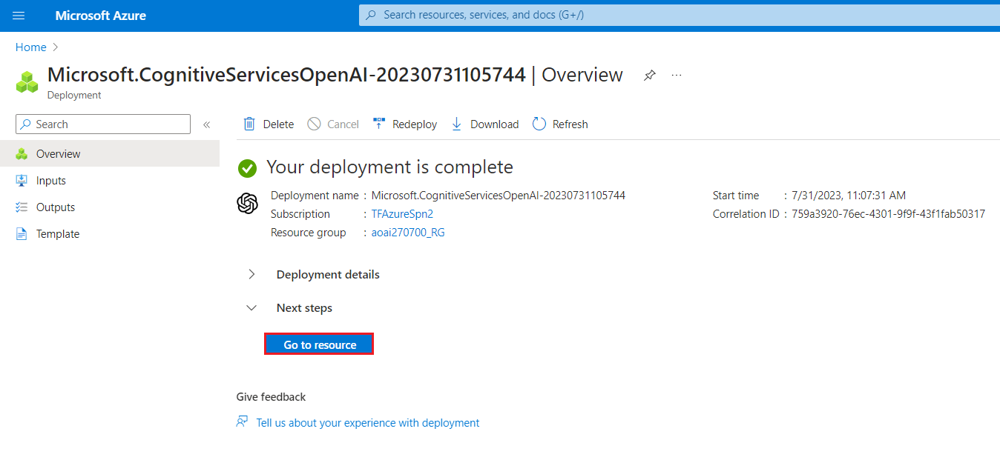

## Task 2: Retrieve the key and endpoint of Azure OpenAI service

1.  In your **Azure-open-testXX \| Model deployments** window, navigate
    to the **Resource Management** section, and click on **Keys and
    Endpoints**.

2.  In **Keys and Endpoints** page, copy **KEY1, KEY 2,** and
    **Endpoint** values and paste them in a notepad as shown in the
    below image, then **Save** the notepad to use the information in the
    upcoming lab.

***Note:** You can use either KEY1 or KEY2. Always having two keys
allows you to securely rotate and regenerate keys without causing a
service disruption*.

## Task 3: [Cognitive Services OpenAI Contributor](https://learn.microsoft.com/en-us/azure/ai-services/openai/how-to/role-based-access-control#cognitive-services-contributor) for the Azure OpenAI resource

1.  From the left menu, click on the **Access control(IAM).**

2.  On the Access control(IAM) page, Click +**Add** and select **Add
    role assignments.**

3.  Type the [**Cognitive Services OpenAI
    Contributor**](https://learn.microsoft.com/en-us/azure/ai-services/openai/how-to/role-based-access-control#cognitive-services-contributor)
    in the search box and select it. Click **Next**

4.  In the **Add role assignment** tab, select Assign access to User
    group or service principal. Under Members, click **+Select members**

5.  On the Select members tab , search your Azure OpenAI subscription
    and click **Select.**

6.  In the **Add role assignment** page, Click **Review + Assign**, you
    will get a notification once the role assignment is complete.

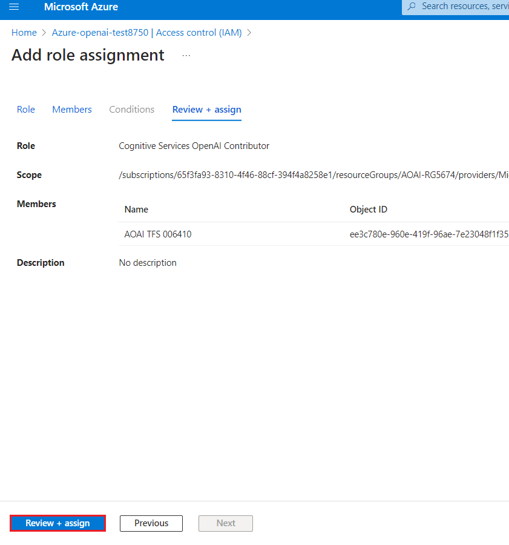

7.  You will see a notification – added as [**Cognitive Services OpenAI
    Contributor**](https://learn.microsoft.com/en-us/azure/ai-services/openai/how-to/role-based-access-control#cognitive-services-contributor)
    for Azure Pass-Sponsorship.

##  Task 4: Create image-generation in the DALL-E playground

1.  In **Azure-openai-testXX** page, click on **Overview** in the
    left-sided navigation menu, scroll down and click on **Go to Azure
    OpenAI Studio** button as shown in the below image.

> 

2.  Wait for the Azure OpenAI studio to launch.

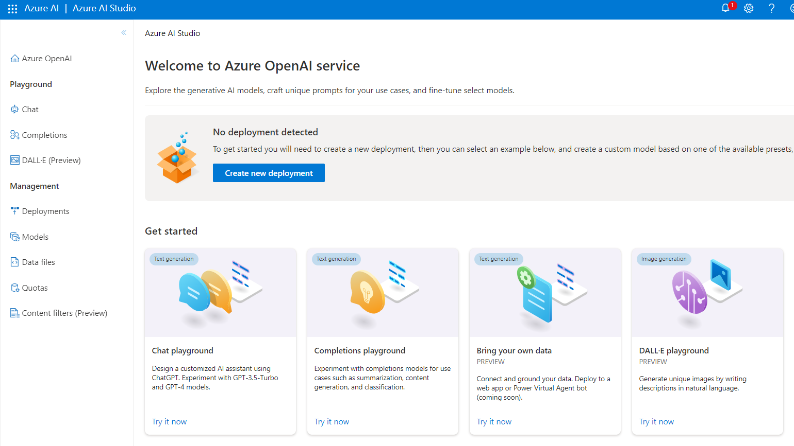

3.  In the **Azure AI Studio** landing page, navigate and click on
    **DALL-E playground** to use the image generation APIs.

4.  Start exploring Azure OpenAI capabilities with a no-code approach
    through the **DALL-E playground** .

# Exercise 2: Generate images using DALl-E-3 with Azure OpenAI Service

## Task 1: Generate images using DALL-E-3

1.  In Azure OpenAI Studio Home page, under **Playground**, select the
    **DALL-E**.

2.  Make sure to choose the **dall-e-3** model from the Deployment
    dropdown.

3.  In **DALL-E playground** window, under **Prompt**, enter your image
    prompt in the text box - **An elephant on a skateboard** as shown in
    the below image and click on the **Generate** button.

4.  Select **View code** near the top of the page, you can use this code
    to write an application that completes the same task.

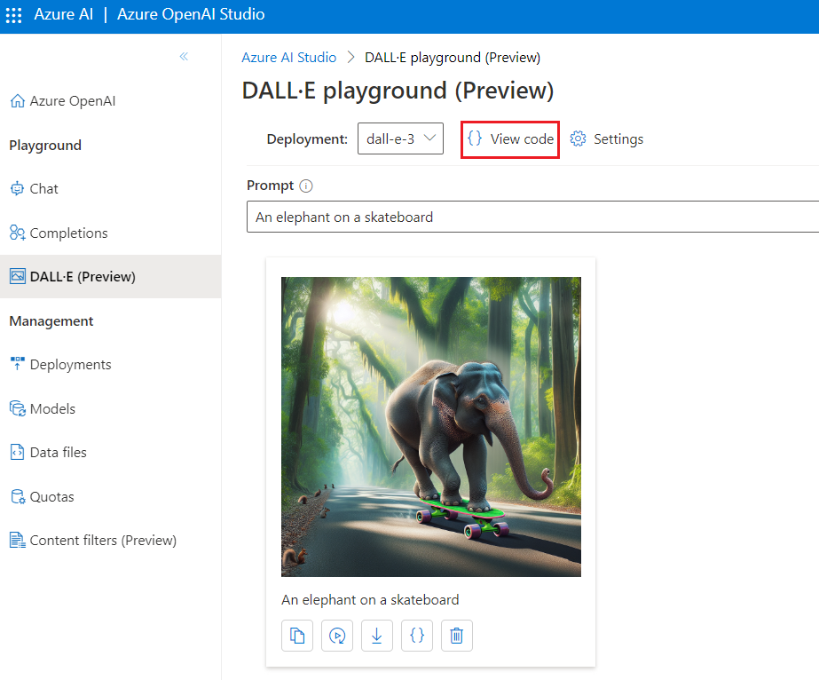

5.  In the **Deployments** window, copy **Deployment name** and paste
    them in a notepad (as shown in the image), and then **Save** the
    notepad to use the information in the upcoming task.

## Task 2: Install Microsoft .NET SDK

1.  Open your browser, navigate to the address bar, type or paste the
    following URL:
    <https://download.visualstudio.microsoft.com/download/pr/9f9ad302-a698-4fab-9765-e313f7e14151/8ad751b6cfc11276b4e2adef4e319db7/dotnet-sdk-8.0.200-win-x64.exe>
    , then press the **Enter** button

2.  **Dotnet-sdk-8.0.200-win-x64.exe** file will be downloaded. Click on
    the downloaded file to install the .NET SDK software

>  alt="A black text on a white background Description automatically generated" />

3.  Click on **Install** button.

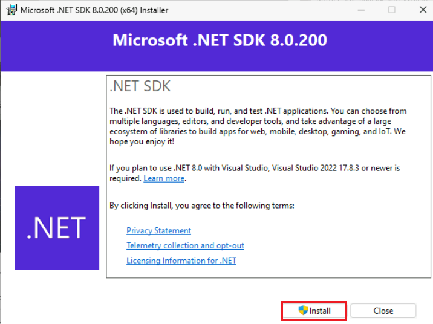

4.  On User Account control tab, click on the Yes button

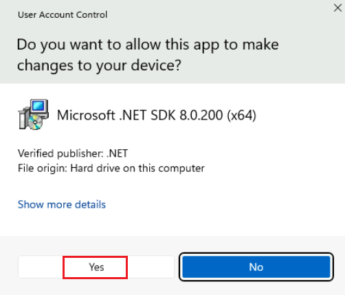

5.  After installation was successful , click on close button

## Task 3: Azure DALL·E- 3 image generation example

1.  Click on your Windows search box, type **Visual Studio Code**, then
    click on **Visual Studio Code** under Best match.

>  alt="A screenshot of a computer Description automatically generated" />

2.  In the **Visual Studio Code** editor, click on **File**, then
    navigate and click on **Open File**.

3.  Navigate and select **DALL-E-3** notebook from **C:\LabFiles** and
    click on the **Open** button.

4.  In case, **Do you want to allow untrusted files in this window?**
    dialog box appears, then click on the **Open** button.

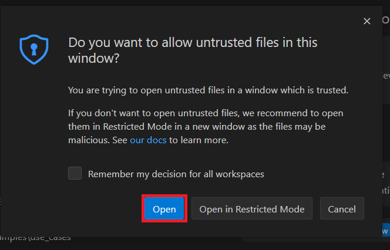

5.  Install the Azure Open AI SDK using the command. Click on **Execute
    cell start icon** as shown in the image.

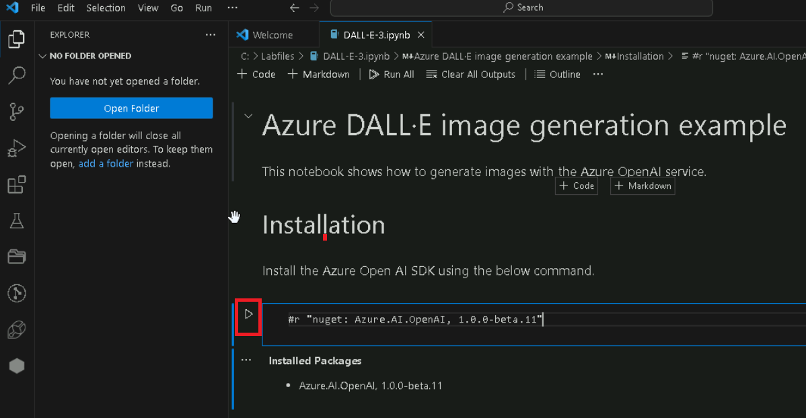

6.  If prompted to select the environment, then select **.NET
    Interactive** as shown in the image.

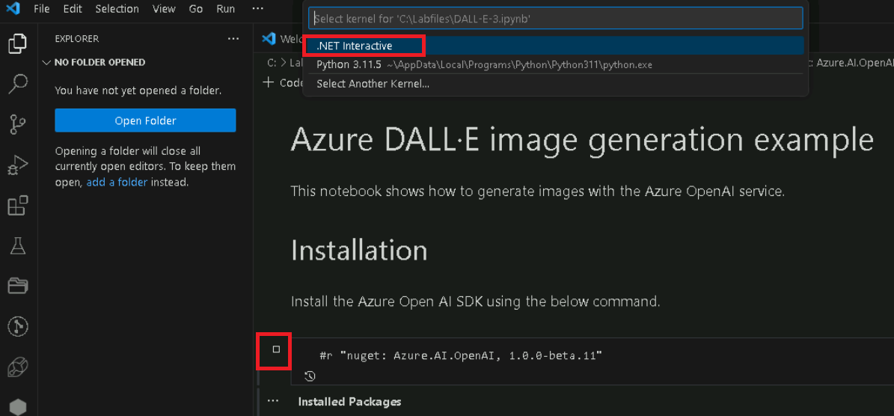

7.  Execute the **2nd cell** by clicking on the **start
    icon**.

8.  Run this cell, it will prompt you for the apiKey, endPoint, and
    imageGeneration deployment name.

9.  Once the resource is created, then add azure openai endpoint. Beside
    the comment **\#Add your key ,#Add your endpoint here** (you’ve
    saved in a notepad in Lab 1\> Task \#3.) and **\#Add your** **image
    deployment name** replace the URL with endpoint URL that you’ve
    saved in a notepad in Exercise 2\>Task \#2. Then, execute the cell
    by clicking on the **start icon**.

10. In case, a notification stating **enter to API key** appears, then
    click on the **enter**.

11. In case, a notification stating **enter to Endpoint** appears, then
    click on the **enter**.

12. In case, a notification stating **image deployment** appears, then
    click on the **enter**.

13. Import namesapaces and create an instance of OpenAiClient using the
    azureOpenAIEndpoint and the azureOpenAIKey. Then, execute the cell
    by clicking on the **start icon**.

14. Import namesapaces and create an instance of OpenAiClient using the
    azureOpenAIEndpoint and the azureOpenAIKey. Replace the existing
    code with the below code.** **Then, execute the cell by clicking on
    the **start icon**.

> **OpenAIClient client = new (new Uri(azureOpenAIEndpoint), new
> AzureKeyCredential(azureOpenAIKey));**
>
>  alt="A screenshot of a computer program Description automatically generated" />

15. Import SkiaSharp to display images. Then, execute the cell by
    clicking on the **start icon**.

16. The method returns the SKSurface object, which now contains the
    drawn image. Then, execute the cell by clicking on the **start
    icon**.

17. With setup and authentication complete, you can now generate images
    on the Azure OpenAI service and retrieve them from the returned
    URLs.

18. The first step in this process is to actually generate the images.
    Then, execute the cell by clicking on the **start icon**.

19. Create the image using the response and SkiaSharp and display it.
    Then, execute the cell by clicking on the **start icon**.

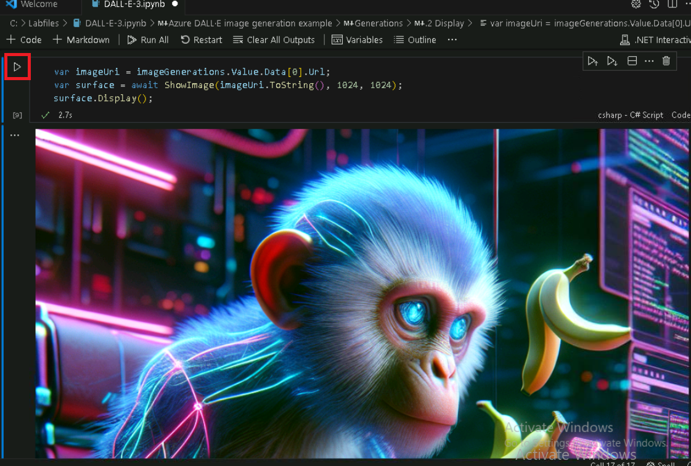

## Task 4: Clean up resources

To avoid incurring unnecessary Azure costs, you should delete the
resources you created in this quick start if they're no longer needed.
To manage resources, you can use the [Azure
portal](https://portal.azure.com/?azure-portal=true).

1.  To delete the storage account, navigate to **Azure portal Home**
    page, click on **Resource groups**.

>  alt="A screenshot of a computer Description automatically generated" />

2.  Click on the resource group that you’ve created.

>  alt="A screenshot of a computer Description automatically generated" />

3.  In the **Resource group** home page, select the **delete resource
    group** .

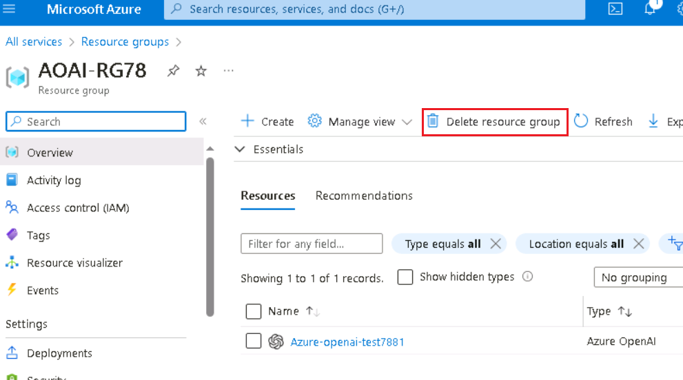

4.  In the **Delete Resources** pane that appears on the right side,
    navigate to **Enter “resource group name” to confirm deletion**
    field, then click on the **Delete** button.

5.  On **Delete confirmation** dialog box, click on **Delete** button.

> 

6.  Click on the bell icon, you’ll see the notification –**Deleted
    resource group AOAI-RG89.**

**Summary**

In this lab, you’ve used DALL-E playground and generated images using
text. Then, you’ve used Azure Dalle-E image generation code in Visual
Studio for generating images with the Azure OpenAI service and viewed
the downloaded image in Visual Studio as well as browser.
