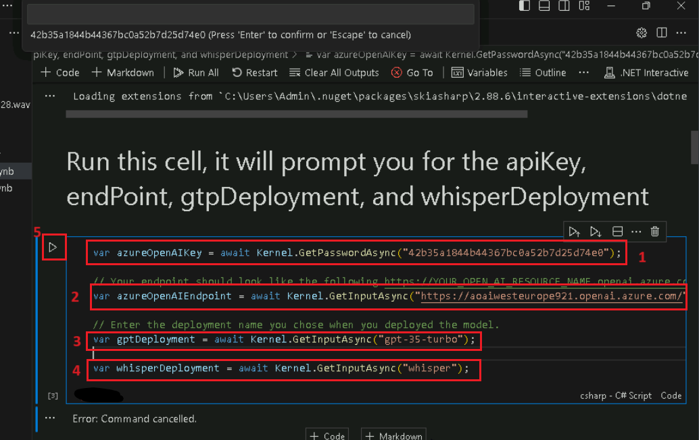

# Lab 3 - Generating images using DALL-E and DALL-E3 

**Introduction**

The DALL-E models, currently in preview, generate images from text
prompts that the user provides. This generative AI model presents myriad
opportunities for developers, artists, designers, educators, and others.
It can bridge the gap between what you can imagine and what you can
create. This generative model allows for cross-domain, general
understanding, and zero-shot translation between text prompt and images,
often with a remarkable degree of realism. The main capability of the
Azure OpenAI DALL·E is to take text prompt and generate images.

**Objective**

- To generate image using text in DALL-E playground.

**Prerequisites**

- Before starting the Lab 03 complete the Lab 01- Provisioning Azure
  OpenAI resource

# Exercise 1: Explore image-generation in the DALL-E playground

## Task 1: Create image-generation in the DALL-E playground

1.  Open your Edge browser, navigate to the address bar, and type or
    paste the following URL:
    [<u>https://oai.azure.com/</u>](https://oai.azure.com/) then press
    the **Enter** button. If you are directed to the **Azure OpenAI
    Studio** home page, then skip steps \#2 to \#4, else continue.

> 

2.  In the **Microsoft Azure** window, enter your **Sign-in**
    credentials, and click on the **Next** button.

> 

3.  Then, enter the password and click on the **Sign in** button**.**

> 

4.  In **Stay signed in?** window, click on the **Yes** button.

>  alt="Graphical user interface, application Description automatically generated" />

5.  On the **Welcome to Azure OpenAI Studio** dialog box, under the
    **Subscription** field, enter your subscription, and in the
    **Resource** field, enter the assigned Resource, and click on the
    **Use resource** button.

6.  Wait for the Azure OpenAI studio to launch.

7.  In the **Azure AI Studio** landing page, navigate and click on
    **DALL-E playground** to use the image generation APIs.

8.  Start exploring Azure OpenAI capabilities with a no-code approach
    through the **DALL-E playground (Preview)**.

9.  In **DALL-E playground** window, in **Deployment** field select
    **DALL.E2** and **Prompt** field, enter your image prompt in the
    text box - **An elephant on a skateboard** as shown in the below
    image and click on the **Generate** button.

10. When the AI-generated image is ready, it will appear on the page.

11. Modify the prompt to provide a more specific description. Under
    **Prompt** field, enter your image prompt in the text box - ***An
    elephant on a skateboard in the style of Picasso*** and click on the
    **Generate** button.

**Note:** The image generation APIs come with a content moderation
filter. If the service recognizes your prompt as harmful content, it
won't return a generated image.

12. In the **DALL-E** **playground**, you can also view Python and cURL
    code samples, which are pre-filled according to your settings. Click
    on **View code** under **Playground** tab as shown in the below
    image.

13. You can use this code to write an application that completes the
    same task.

# Exercise 2: Generate images using DALl-E-3 with Azure OpenAI Service

## Task 1: Generate images using DALL-E-3

1.  In Azure OpenAI Studio Home page, under **Playground**, select the
    **DALL-E**.

2.  Make sure to choose the **dall-e-3** model from the Deployment
    dropdown.

3.  In **DALL-E playground** window, under **Prompt**, enter your image
    prompt in the text box - **An elephant on a skateboard** as shown in
    the below image and click on the **Generate** button.

4.  Select **View code** near the top of the page, you can use this code
    to write an application that completes the same task.

5.  In the **Deployments** window, copy **Deployment name** and paste
    them in a notepad (as shown in the image), and then **Save** the
    notepad to use the information in the upcoming task.

## Task 2: Install Microsoft .NET SDK

1.  Open your browser, navigate to the address bar, type or paste the
    following URL:
    <https://download.visualstudio.microsoft.com/download/pr/9f9ad302-a698-4fab-9765-e313f7e14151/8ad751b6cfc11276b4e2adef4e319db7/dotnet-sdk-8.0.200-win-x64.exe>
    , then press the **Enter** button

2.  **Dotnet-sdk-8.0.200-win-x64.exe** file will be downloaded. Click on
    the downloaded file to install the .NET SDK software

3.  Click on **Install** button.

4.  On User Account control tab, click on the Yes button

5.  After installation was successful , click on close button

## Task 3: Azure DALL·E- 3 image generation example

1.  Click on your Windows search box, type **Visual Studio Code**, then
    click on **Visual Studio Code** under Best match.

>  alt="A screenshot of a computer Description automatically generated" />

2.  In the **Visual Studio Code** editor, click on **File**, then
    navigate and click on **Open File**.

3.  Navigate and select **DALL-E-3** notebook from **C:\LabFiles** and
    click on the **Open** button.

4.  In case, **Do you want to allow untrusted files in this window?**
    dialog box appears, then click on the **Open** button.

5.  Install the Azure Open AI SDK using the command. Click on **Execute
    cell start icon** as shown in the image.

6.  If prompted to select the environment, then select **.NET
    Interactive** as shown in the image.

7.  Execute the **2nd cell** by clicking on the **start
    icon**.

8.  Run this cell, it will prompt you for the apiKey, endPoint, and
    imageGeneration deployment name.

9.  Once the resource is created, then add azure openai endpoint. Beside
    the comment **\#Add your key ,#Add your endpoint here** (you’ve
    saved in a notepad in Lab 1\> Task \#3.) and **\#Add your** **image
    deployment name** replace the URL with endpoint URL that you’ve
    saved in a notepad in Exercise 2\>Task \#2. Then, execute the cell
    by clicking on the **start icon**.

10. In case, a notification stating **enter to API key** appears, then
    click on the **enter**.

11. In case, a notification stating **enter to Endpoint** appears, then
    click on the **enter**.

12. In case, a notification stating **image deployment** appears, then
    click on the **enter**.

13. Import namesapaces and create an instance of OpenAiClient using the
    azureOpenAIEndpoint and the azureOpenAIKey. Then, execute the cell
    by clicking on the **start icon**.

14. Import namesapaces and create an instance of OpenAiClient using the
    azureOpenAIEndpoint and the azureOpenAIKey. Replace the existing
    code with the below code.** **Then, execute the cell by clicking on
    the **start icon**.

> **OpenAIClient client = new (new Uri(azureOpenAIEndpoint), new
> AzureKeyCredential(azureOpenAIKey));**
>
>  alt="A screenshot of a computer program Description automatically generated" />

15. Import SkiaSharp to display images. Then, execute the cell by
    clicking on the **start icon**.

16. The method returns the SKSurface object, which now contains the
    drawn image. Then, execute the cell by clicking on the **start
    icon**.

17. With setup and authentication complete, you can now generate images
    on the Azure OpenAI service and retrieve them from the returned
    URLs.

18. The first step in this process is to actually generate the images.
    Then, execute the cell by clicking on the **start icon**.

19. Create the image using the response and SkiaSharp and display it.
    Then, execute the cell by clicking on the **start icon**.

## Task 4: Delete the Deployed Model

To avoid incurring unnecessary Azure costs, you should delete the
resources you created in this quickstart if they're no longer needed. To
manage resources, you can use the [Azure
portal](https://portal.azure.com/?azure-portal=true).

1.  In Azure OpenAI Studio, on the left pane, under the **Management**
    section, click on **Deployments**.

>  alt="A screenshot of a computer Description automatically generated" />

2.  Select **Dalle3** deployment name and click on **Delete
    deployment**.

3.  In the **Confirm delete** dialog box, click on the **Delete**
    button. You will see the notification – **Successfully Deleted
    deployment** (In case, you did not see the notification, then click
    on the bell icon beside **Azure AI\|Azure AI Studio**).

> 
>
>  alt="A screenshot of a computer Description automatically generated" />

**Summary**

In this lab, you’ve used DALL-E playground and generated images using
text. Then, you’ve used Azure Dalle-E image generation code in Visual
Studio for generating images with the Azure OpenAI service and viewed
the downloaded image in Visual Studio as well as browser.
