**Introduction**

The OpenAI Whisper model is an encoder-decoder Transformer that can
transcribe audio into text in 57 languages. Additionally, it offers
translation services from those languages to English, producing
English-only output.

Users of Azure AI Speech can leverage OpenAI’s Whisper model in
conjunction with the Azure AI Speech batch transcription API. This
enables customers to easily transcribe large volumes of audio content at
scale. This capability is particularly useful for processing extensive
collections of audio data stored within the Azure platform.

Users of Whisper in Azure AI Speech benefit from existing features
including async processing, [speaker
diarization](https://portal.azure.com/), customization (available soon),
and larger file sizes.

- Large file sizes: Azure AI Speech enhances Whisper transcription by
  enabling files up to 1GB in size and the ability to process large
  amounts of files by allowing you to batch up to 1000 files in a single
  request.

- Time stamps: Using Azure AI Speech, the recognition result includes
  word-level timestamps, providing the ability to identify where in the
  audio each word is spoken.

- Speaker diarization: This is another beneficial feature of Azure AI
  Speech that identifies individual speakers in an audio file and labels
  their speech segments. This feature allows customers to distinguish
  between speakers, accurately transcribe their words, and create a more
  organized and structured transcription of audio files.

## **Task 1: Create Azure OpenAI resource**

1.  Open your browser, navigate to the address bar, and type or paste
    the following URL:
    [<u>https://portal.azure.com/</u>](https://techcommunity.microsoft.com/t5/azure-ai-services-blog/announcing-the-public-preview-of-real-time-diarization-in-azure/ba-p/3876802),
    then press the **Enter** button.

>  alt="A screenshot of a computer Description automatically generated" />

2.  In the **Microsoft Azure** window, enter your **Sign-in**
    credentials, and click on the **Next** button.

3.  Then, enter the password and click on the **Sign in** button**.**

>  alt="A screenshot of a login box Description automatically generated" />

4.  In **Stay signed in?** window, click on the **Yes** button.

>  alt="Graphical user interface, application Description automatically generated" />

5.  On the Azure portal menu, click on **+ Create a resource**.

>  alt="Graphical user interface, application Description automatically generated" />

6.  On the **Create a resource** page, in the search services and
    marketplace field, type **Azure OpenAI**, then press the **Enter**
    button.

>  alt="A screenshot of a computer Description automatically generated" />

7.  In the Marketplace page, navigate to the Azure OpenAI section, click
    on the Create V chevron button, then click on **Azure OpenAI** as
    shown in the image. (In case, you clicked on the Azure **OpenAI
    section**, then click on the **Create** button on the **Azure OpenAI
    page**).

>  alt="A screenshot of a computer Description automatically generated" />

8.  In the **Create Azure OpenAI** window, under the **Basics** tab,
    enter the following details and click on the **Next** button.

<table>
<colgroup>
<col style="width: 19%" />
<col style="width: 80%" />
</colgroup>
<thead>
<tr class="header">
<th><strong>Subscription</strong></th>
<th><blockquote>

Select the assigned subscription

</blockquote></th>
</tr>
</thead>
<tbody>
<tr class="odd">
<td><strong>Resource group</strong></td>
<td>Click on <strong>Create new</strong>&gt; enter
<strong>AOAI-RGXX</strong>(XX can be a unique number, you can add more
digits after XX to make the name unique)</td>
</tr>
<tr class="even">
<td><strong>Region</strong></td>
<td>For this lab, you will use a <strong>whishper</strong> model. This
model is currently only available in <a
href="https://learn.microsoft.com/azure/ai-services/openai/concepts/models#embeddings-models">certain
regions</a>. Please select a region from this list, In this lab
<strong>West Europe</strong> is using for this resource. Select
<strong>West Europe</strong></td>
</tr>
<tr class="odd">
<td><strong>Name</strong></td>
<td><strong>AOAIWestEurope-XXXX</strong> (XXXX can be a unique
number)</td>
</tr>
<tr class="even">
<td><strong>Pricing tier</strong></td>
<td><blockquote>

Select <strong>Standard S0</strong>

</blockquote></td>
</tr>
</tbody>
</table>

> 

9.  In the **Network** tab, leave all the radio buttons in the default
    state, and click on the **Next** button.

>  alt="A screenshot of a computer Description automatically generated" />

10. In the **Tags** tab, leave all the fields in the default state, and
    click on the **Next** button.

>  alt="A screenshot of a computer Description automatically generated" />

11. In the **Review+submit** tab, once the Validation is Passed, click
    on the **Create** button.

> 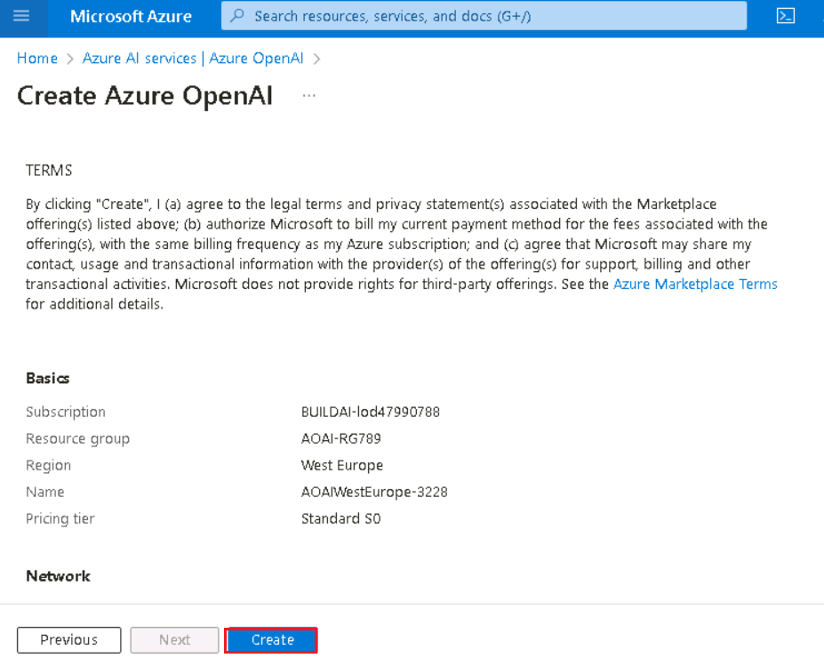

12. Wait for the deployment to complete. The deployment will take around
    10-15 minutes.

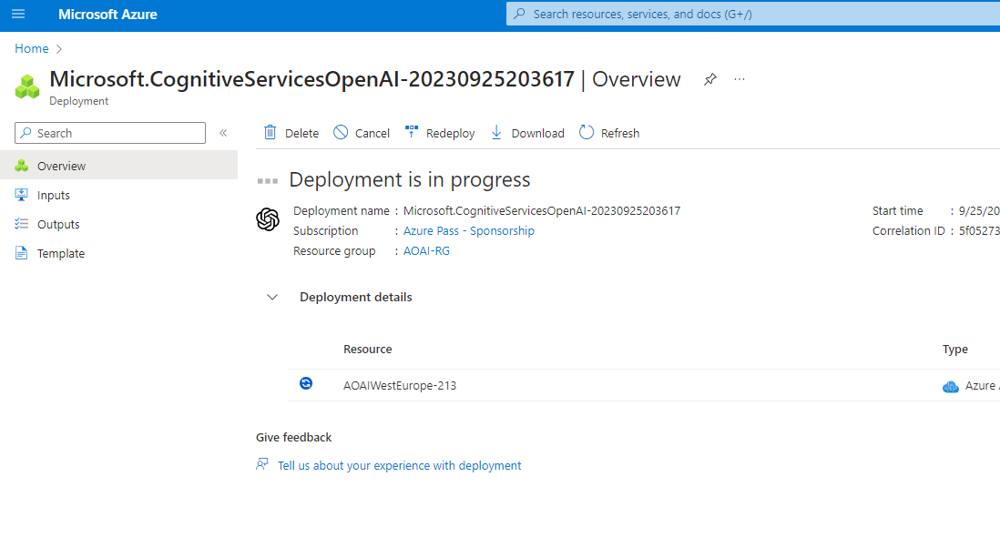

13. On **Microsoft.CognitiveServicesOpenAI** window, after the
    deployment is completed, click on the **Go to resource** button.

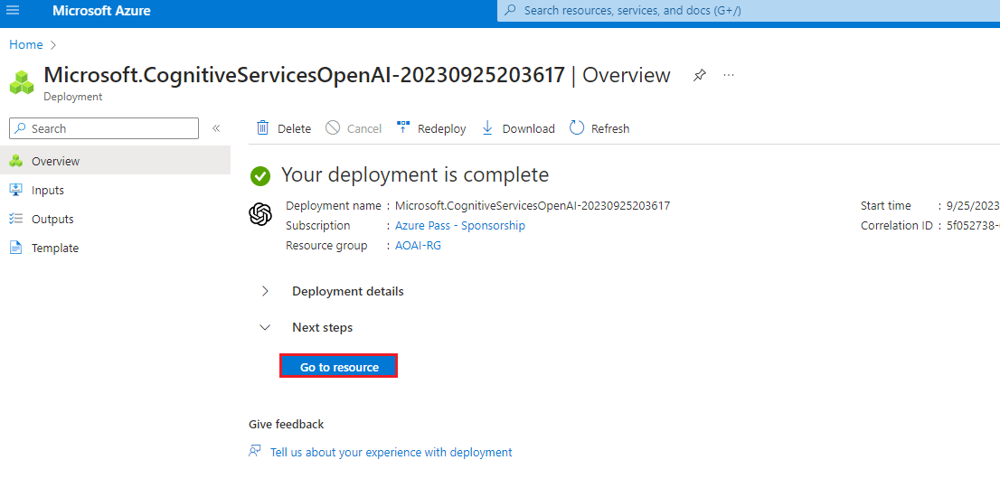

## Task 2: Retrieve the key and endpoint of Azure OpenAI service

1.  In your **AOAIWestEurope-XXX** page, navigate to the **Resource
    Management** section, and click on **Keys and Endpoints**.

2.  In **Keys and Endpoints** page, copy **KEY1, KEY 2,** (*You can use
    either KEY1 or KEY2)* and **Endpoint** and paste them on a notepad
    (as shown in the image), and then **Save** the notepad to use the
    information in the upcoming lab.

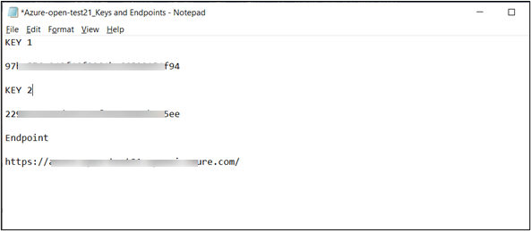

***Note:** You will have different KEY values.* *This value can be found
in the **Keys and Endpoint** section when examining your resource from
the Azure portal. You can use either KEY1 or KEY2. Always having two
keys allows you to securely rotate and regenerate keys without causing a
service disruption*.

## **Task 3: Deploy the Whisper model**

1.  On the **AOAIWestEurope-XXX** window, click on **Overview** in the
    left navigation menu, then under the **Get Started** tab, click on
    the **Go to Azure OpenAI Studio** button to open **Azure OpenAI
    Studio** in a new browser.

>  style="width:6.49167in;height:3.69167in" />

2.  In the **Azure AI \| Azure AI Studio** window, click on **Create a
    new deployment** button**.**

> 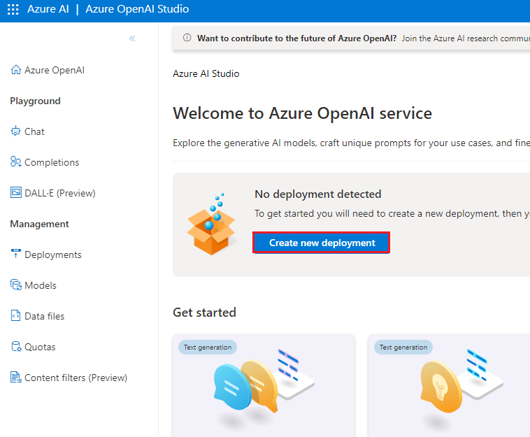 style="width:5.34583in;height:4.40784in" />

3.  In the **Deployments** window, click on **+Create new deployment**.

>  style="width:5.40443in;height:3.67917in" />

4.  In the **Deploy model dialog** box, under the **Model name** field,
    click on the V chevron button; navigate and select carefully
    **whisper**.

> 

5.  In the **Deployment name field**, enter **whisper,** and click on
    the **Create** button.

> 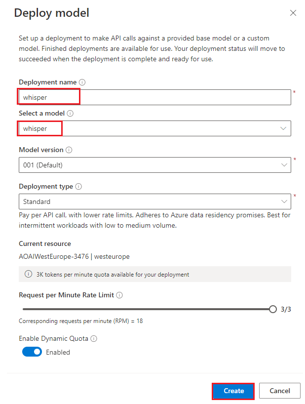

6.  You will see a notification stating **Successfully Created
    deployment** (In case, the notification did not appear on your
    window by default, click on the bell icon beside **Azure AI \| Azure
    AI Studio** bar).

> 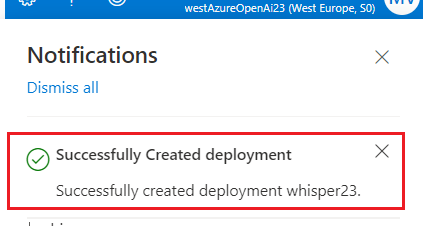

7.  In the **Deployments** page, click on +**Create new deployment**.

> 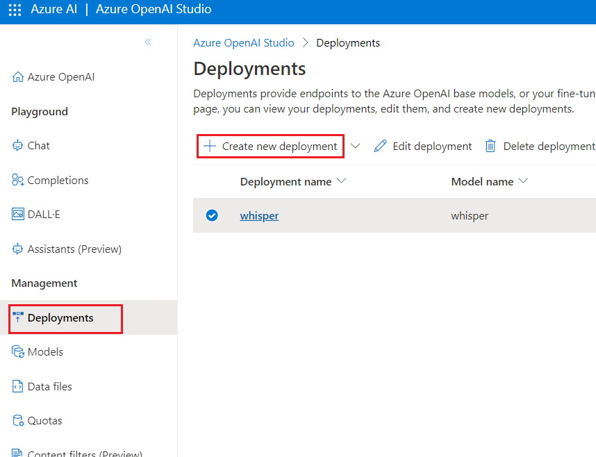

8.  In the **Deploy model** dialog box, under the **Model name** field,
    click on the V chevron button; navigate and select carefully
    **gpt-35-turbo**.

9.  Select the **Model version** as **0301(Default),** in the
    **Deployment name field**, enter **gpt-35-turbo**, and click on the
    **Create** button.

> 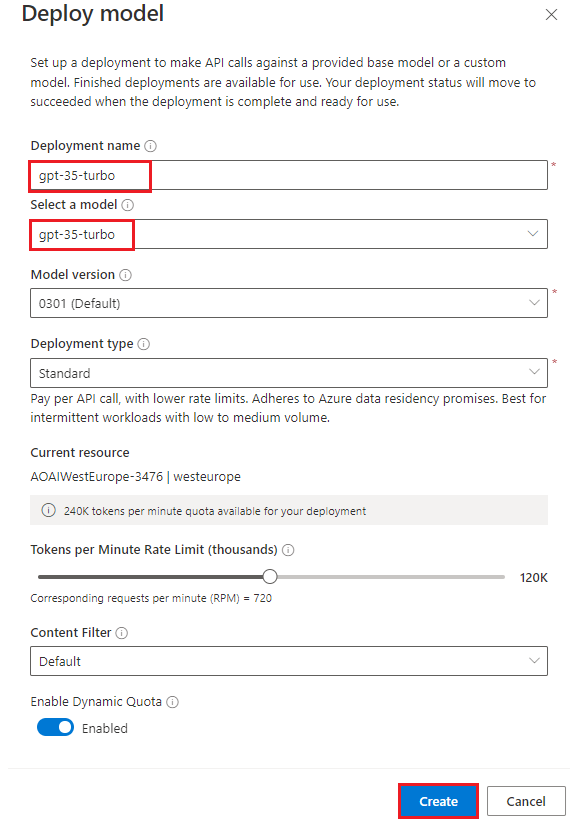 style="width:4.78333in;height:6.88333in" />

10. You will see a notification – **Successfully Created deployment**
    when the deployment is succeeded (You can also view the notification
    by clicking on the bell icon beside **Azure AI \| Azure AI Studio**.

>  style="width:4.9421in;height:1.45846in" />

11. Click on **Azure OpenAI Home icon** to go back to the home page.

> 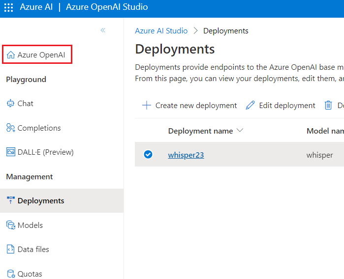

## **Task 4: Speech to text using Whisper model**

1.  In Azure OpenAI Studio Home page, under **Welcome to** **Azure
    OpenAI Service**, in **Get started** section, click on the **Whisper
    Speech-to-Text** to open **Azure AI Speech Studio** in a new
    browser.

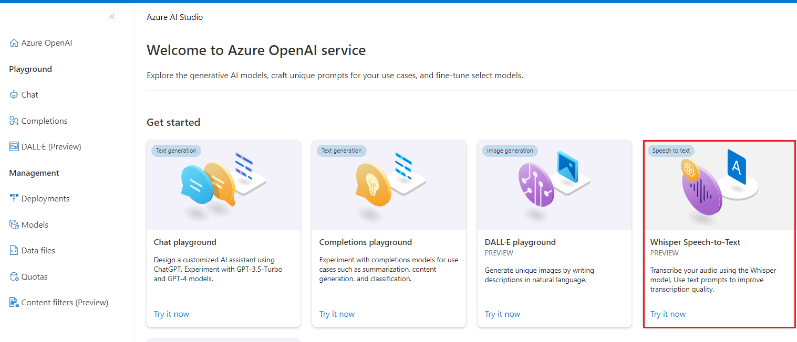

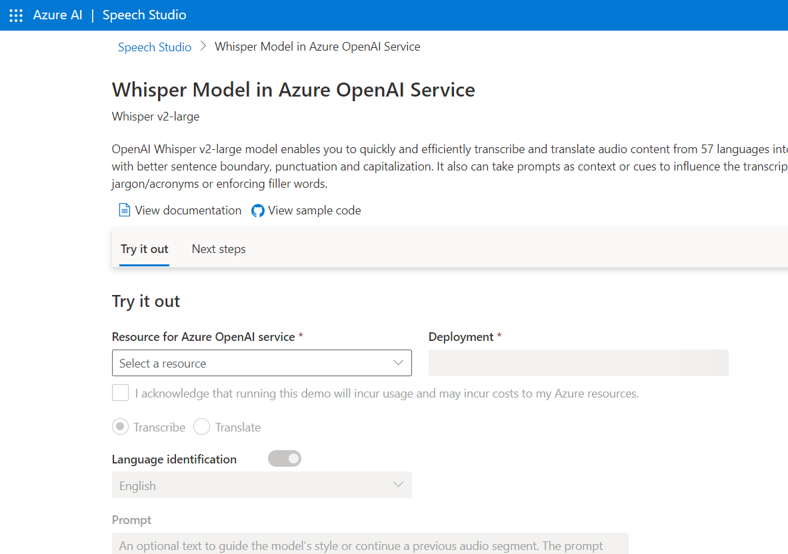

2.  In **Azure AI Speech Studio** Home page, under **Whisper Model in
    Azure OpenAI Service**, in **Try it out** section, select your
    **Resource for Azure OpenAI service** and select
    your **whisperXX** deployment is selected under the **Deployments.**

3.  **Select the check box**- I acknowledge that running this demo will
    incur costs to my Azure resource

4.  Click on **Browse file** and navigate to **C:\Labfiles \audiofiles**
    location and select **all audio files ,** then click on **Open**
    button.

5.  To upload audio files will take 2-3 minutes

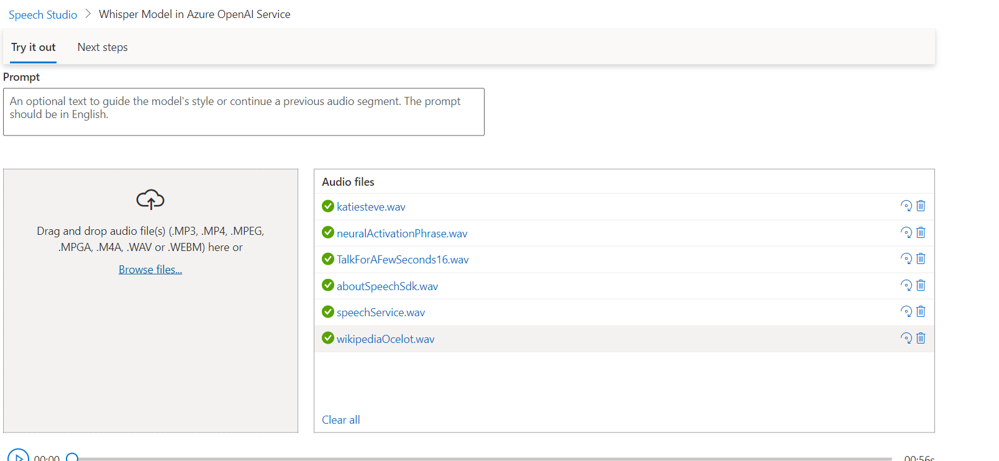

6.  Under the Audio files pane select **aboutSpeechSdk.wav( or select
    any audio file of your choice)** file and select play button. You
    will receive a response similar to the below screenshot

7.  Use the **JSON** button to view the code for the interaction.

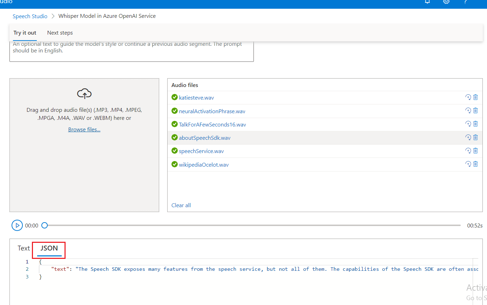

## **Task 5: Enhancing Whisper transcriptions: pre- & post-processing techniques**

This notebook offers a guide to improve the Whisper's transcriptions.
We'll streamline your audio data via trimming and segmentation,
enhancing Whisper's transcription quality. After transcriptions, we'll
refine the output by adding punctuation, adjusting product terminology
(e.g., 'five two nine' to '529'), and mitigating Unicode issues. These
strategies will help improve the clarity of your transcriptions, but
remember, customization based on your unique use-case may be beneficial.

1.  In your Windows search box, type Visual Studio, then click on
    **Visual Studio Code**.

> 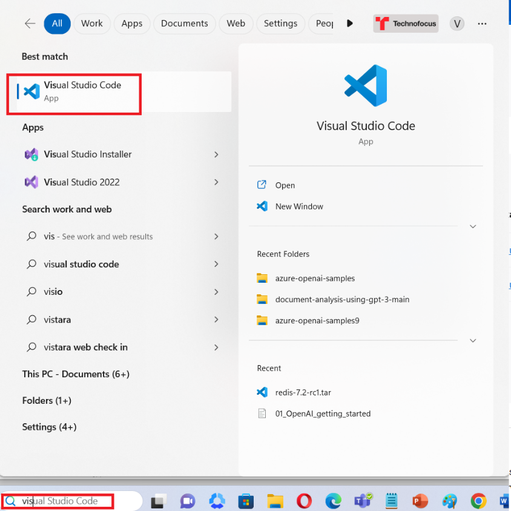 style="width:4.94583in;height:4.94583in" />

2.  In the **Visual Studio Code** editor, click on **File**, then
    navigate and click on **Open Folder**.

3.  Navigate and select **Whisper** notebook from **C:\LabFiles** and
    click on the **Select Folder** button.

4.  In case, **Do you trust the authors of the files in this folder?**
    dialog box appears, then click on the **Yes, I trust the author**
    button.

5.  In case, a notification stating **Do you want to install the
    recommended extension for Python?** appears, then click on the
    **Install** button.

6.  In Visual Studio Code, under **WHISPER**, click on **dotnet**, then
    click on **Whishper_processing_guide.ipynb** notebook.

8.  Install the Azure Open AI SDK using the command. Click on **Execute
    cell start icon** as shown in the image.

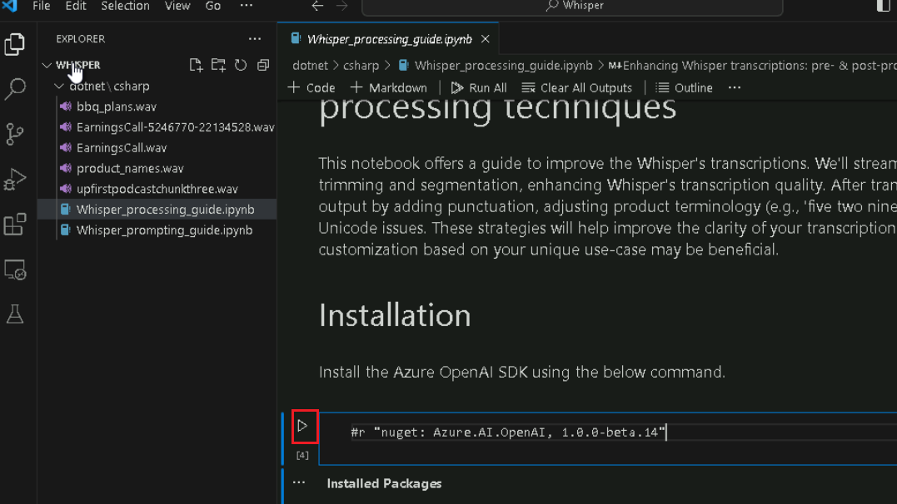

9.  If prompted to select the environment, then select **.NET
    Interactive** as shown in the image.

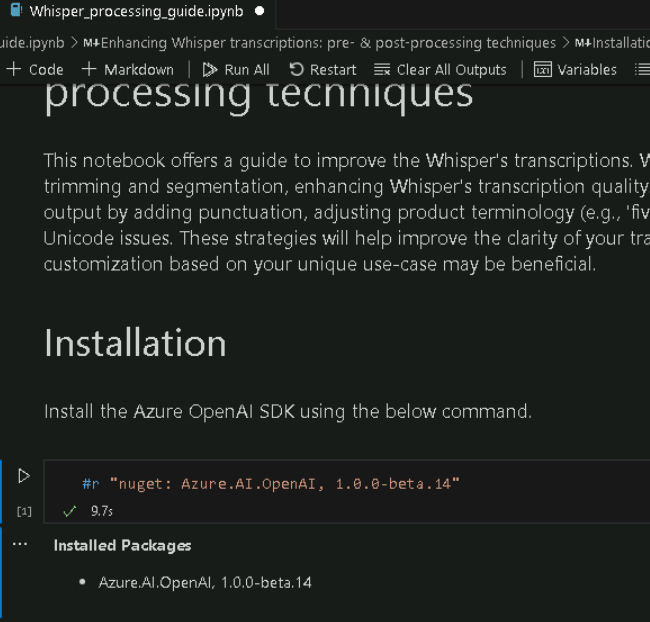

10. Execute the **2nd cell** by clicking on the **start
    icon**.

11. Run this cell, it will prompt you for the apiKey, endPoint, and
    imageGeneration deployment name.

12. Once the resource is created, then add azure openai key and
    endpoint. Beside the comment **\#** **Enter the deployment name you
    chose when you deployed the model** replace the **gpt-35-turbo** and
    add Whisper deployment model as **whisper** . Then, execute the cell
    by clicking on the **start icon**.

13. In case, a notification stating **enter to API key** appears, then
    click on the **enter**.

14. In case, a notification stating **enter to Endpoint** appears, then
    click on the **enter**.

15. In case, a notification stating **chat model** appears, then click
    on the **enter**.

16. In case, a notification stating **whisper** appears, then click on
    the **enter**.

17. Import namesapaces and create an instance of OpenAiClient using the
    azureOpenAIEndpoint and the azureOpenAIKey. Then, execute the cell
    by clicking on the **start icon**.

18. To get started let's import a few different libraries: execute the
    cell by clicking on the **start icon**.

19. At times, files with long silences at the beginning can cause
    Whisper to transcribe the audio incorrectly. We'll use \`NAudio\`\`
    to detect and trim the silence. Then, execute the cell by clicking
    on the **start icon**.

20. Here, we've set the decibel threshold of -19. You can change this if
    you would like. Then, execute the cell by clicking on the **start
    icon**.

21. Now that we have audio segments we can create trimmed files to use
    with the Whisper model. Then, execute the cells by clicking on the
    **start icon**.

22. This function will add formatting and punctuation to our transcript.
    Whisper generates a transcript with punctuation but without
    formatting.

23. Then, execute the cell by clicking on the **start icon**.

24. Our audio file is a recording from a fake earnings call that
    includes a lot of financial products. This function can help ensure
    that if Whisper transcribes these financial product names
    incorrectly, that they can be corrected. Then, execute the cell by
    clicking on the **start icon**.

## **Task 6: Whisper prompting guide**

OpenAI's audio transcription API has an optional parameter called
prompt.

The prompt is intended to help stitch together multiple audio segments.
By submitting the prior segment's transcript via the prompt, the Whisper
model can use that context to better understand the speech and maintain
a consistent writing style.

However, prompts do not need to be genuine transcripts from prior audio
segments. Fictitious prompts can be submitted to steer the model to use
particular spellings or styles.

This notebook shares two techniques for using fictitious prompts to
steer the model outputs:

- **Transcript generation**: GPT can convert instructions into
  fictitious transcripts for Whisper to emulate.

- **Spelling guide**: A spelling guide can tell the model how to spell
  names of people, products, companies, etc. These techniques are not
  especially reliable, but can be useful in some situations.

**Comparison with GPT prompting**

Prompting Whisper is not the same as prompting GPT. For example, if you
submit an attempted instruction like "Format lists in Markdown format",
the model will not comply, as it follows the style of the prompt, rather
than any instructions contained within.

In addition, the prompt is limited to only 224 tokens. If the prompt is
longer than 224 tokens, only the final 224 tokens of the prompt will be
considered; all prior tokens will be silently ignored.

To get good results, craft examples that portray your desired style.

1.  In Visual Studio Code, under **WHISPER**, click on **dotnet**, then
    click on Whisper_prompting_guide.ipynb notebook.

2.  Install the Azure Open AI SDK using the command. Click on **Execute
    cell start icon** as shown in the image.

3.  If prompted to select the environment, then select **.NET
    Interactive** as shown in the image.

4.  Run this cell, it will prompt you for the apiKey, endPoint, and
    imageGeneration deployment name.

5.  Once the resource is created, then add azure openai key and
    endpoint. Beside the comment **\#** **Enter the deployment name you
    chose when you deployed the model** replace the **gpt-35-turbo** and
    add Whisper deployment model as **whisper** . Then, execute the cell
    by clicking on the **start icon**.

6.  In case, a notification stating **enter to API key** appears, then
    click on the **enter**.

7.  In case, a notification stating **enter to Endpoint** appears, then
    click on the **enter**.

8.  In case, a notification stating **chat model** appears, then click
    on the **enter**.

9.  In case, a notification stating **whisper** appears, then click on
    the **enter**.

10. Import namesapaces and create an instance of OpenAiClient using the
    azureOpenAIEndpoint and the azureOpenAIKey. Then, execute the cell
    by clicking on the **start icon**.

11. Download a few example audio files. Then, execute the cell by
    clicking on the **start icon**.

12. As a baseline, we'll transcribe an NPR podcast segment. Execute the
    cell by clicking on the **start icon**.

13. In the unprompted transcript, 'President Biden' is capitalized.
    However, if we pass in a fictitious prompt of 'president biden' in
    lowercase, Whisper matches the style and generates a transcript in
    all lowercase.

14. Then, execute the cell by clicking on the **start icon**.

15. Long prompts may be more reliable at steering Whisper. Then, execute
    the cell by clicking on the **start icon**.

16. Whisper is also less likely to follow rare or odd styles. Execute
    the cell by clicking on the **start icon**.

17. Whisper may incorrectly transcribe uncommon proper nouns such as
    names of products, companies, or people. We'll illustrate with an
    example audio file full of product names.

18. Then, execute the cell by clicking on the **start icon**.

19. To get Whisper to use our preferred spellings, let's pass the
    product and company names in the prompt, as a glossary for Whisper
    to follow. Then, execute the cell by clicking on the **start icon**.

20. Now, let's switch to another audio recording authored specifically
    for this demonstration, on the topic of a odd barbecue.To begin,
    we'll establish our baseline transcript using Whisper. Execute the
    cell by clicking on the **start icon**.

>  style="width:6.9819in;height:2.59583in" />

21. While Whisper's transcription was accurate, it had to guess at
    various spellings. For example, it assumed the friends' names were
    spelled Amy and Sean rather than Aimee and Shawn. Let's see if we
    can steer the spelling with a prompt. Then, execute the cell by
    clicking on the **start icon**.

>  style="width:7.00275in;height:3.25417in" />
>
>  style="width:6.96899in;height:2.7375in" />

22. One potential tool to generate fictitious prompts is GPT. We can
    give GPT instructions and use it to generate long fictitious
    transcripts with which to prompt Whisper. Then, execute the cell by
    clicking on the **start icon**.

>  style="width:6.92917in;height:4.79712in" />

23. Whisper prompts are best for specifying otherwise ambiguous styles.
    The prompt will not override the model's comprehension of the audio.
    For example, if the speakers are not speaking in a deep Southern
    accent, a prompt will not cause the transcript to do so.

24. Then, execute the cell by clicking on the **start icon**.

## **Task 7: Clean up resources**

1.  To Azure OpenAI resource , type **Resource groups** in the Azure
    portal search bar, navigate and click on **Resource groups** under
    **Services**.

>  alt="A screenshot of a computer Description automatically generated" />

2.  Click on your resource group.

> 

3.  In the **Resource group** home page, select the **delete resource
    group** .

>  style="width:6.49167in;height:3.06667in" />

4.  In the Delete a resource group tab, enter your resource group name
    and click on **Delete button**

5.  On **Delete confirmation** dialog box, click on D**elete** button.

>  alt="A screenshot of a computer error Description automatically generated" />
