# Lab 4: Get started using GPT-4 Turbo with Vision on your images and videos in Azure AI Studio

**Introduction**

GPT-4 Turbo with Vision is a large multimodal model (LMM) developed by
OpenAI that can analyze images and provide textual responses to
questions about them. It incorporates both natural language processing
and visual understanding. The GPT-4 Turbo with Vision model answers
general questions about what's present in the images.

GPT-4 Turbo with Vision and [Azure AI
Vision](https://learn.microsoft.com/en-us/azure/ai-services/computer-vision/overview) offer
advanced functionality including:

- **Optical Character Recognition (OCR)**: Extracts text from images and
  combines it with the user's prompt and image to expand the context.

- **Object grounding**: Complements the GPT-4 Turbo with Vision text
  response with object grounding and outlines salient objects in the
  input images.

- **Video prompts**: GPT-4 Turbo with Vision can answer questions by
  retrieving the video frames most relevant to the user's prompt.

**Objectives**

- Configure and deploy a Computer Vision resource in Azure with
  specified settings.

- Create an Azure OpenAI resource in the West US region.

- Deploy the gpt-4 model in Azure AI Studio for interactions in the chat
  playground.

- Instruct the assistant using image prompts in the Azure AI Studio Chat
  Playground, evaluating its responses.

- Configure and assess enhancements in image prompts, utilizing Azure
  Computer Vision for improved responses.

- Extend interactions to video prompts, configuring enhancements and
  evaluating the assistant's responses.

## **Task 1: Create Azure OpenAI resource**

1.  In Azure portal, click on **portal menu** represented by three
    horizontal bars on the top left corner of page, as shown in the
    below image.

    

2.  Navigate and click on **+ Create a resource**.

     )

3.  On **Create a resource** page, in the **Search services and
    marketplace** search bar, type **Azure OpenAI**, then press the
    **Enter** button.

    

4.  In the **Marketplace** page, navigate to the **Azure OpenAI** tile,
    click on the V chevron button beside **Create**, then navigate and
    click on the **Azure OpenAI** as shown in the below image.

     
5.  In the **Create Azure OpenAI** window, under the **Basics** tab,
    enter the following details and click on the **Next** button.

    a.  **Subscription**: Select the assigned subscription

    b.  **Resource group**: Click on **Create new**\> enter
        **AOAI-RGXX**(XX can be a unique number, you can add more digits
        after XX to make the name unique

    c.  **Region**: Select **West US**

    d.  **Name**: aoai-gpt4-visionXX (XX can be a unique number)

    e.  **Pricing tier**: Select **Standard S0**

    

6.  In the **Network** tab, leave all the radio buttons in the default
    state, and click on the **Next** button.

     

7.  In the **Tags** tab, leave all the fields in the default state, and
    click on the **Next** button.

    

8.  In the **Review + submit** tab, once the Validation is Passed, click
    on the **Create** button.

    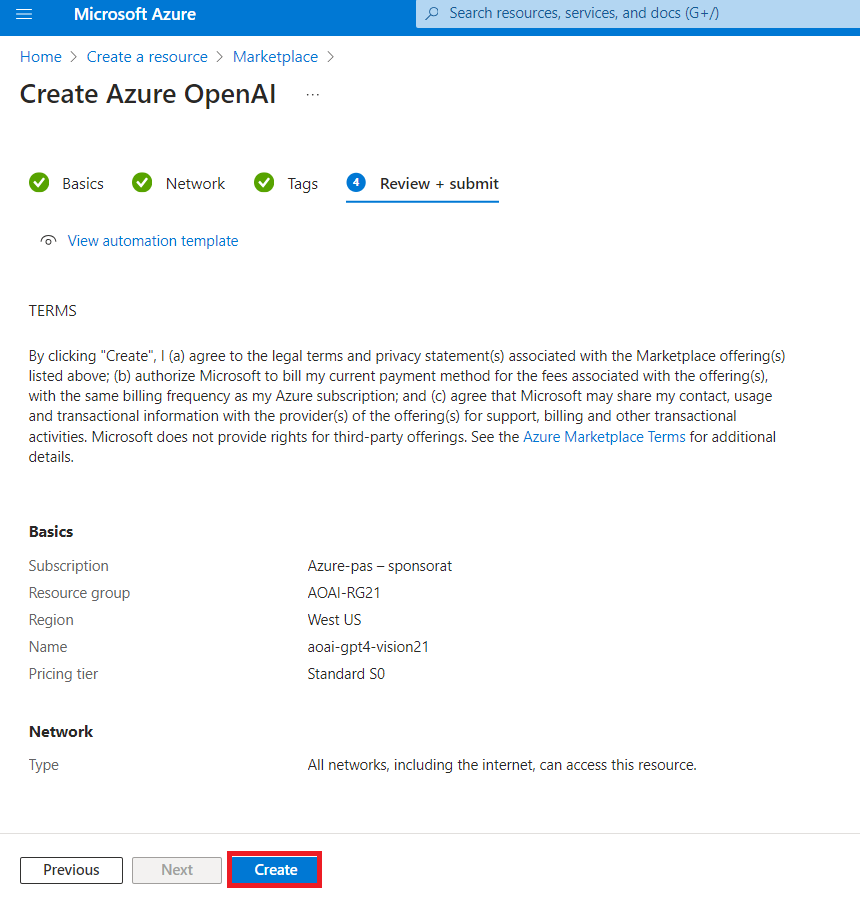

9.  Wait for the deployment to complete. The deployment will take around
    2-3 minutes.

    

10. On **Microsoft.CognitiveServicesOpenAI** window, after the
    deployment is completed, click on **Go to resource** button.

     

11. On the **aoai-gpt4-visionXX** window, click on **Overview** in the
    left-sided navigation menu, scroll down to **Get Started** tile and
    click on **Go to AzureOpenAI Studio** button as shown in the below
    image to open **Azure OpenAI Studio** in a new browser.

    

## **Task 2: Deploying an Azure OpenAI model gpt-4**

1.  On the **Azure OpenAI Studio** homepage, select **Deployment** under
    Shared resources .

     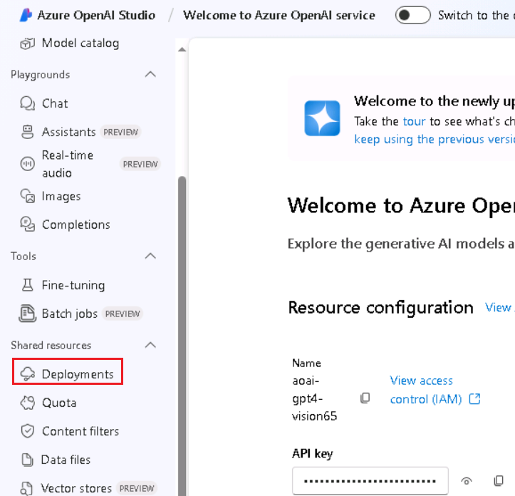

2.  In the **Model deployments** page, drop down the **+Deployment**.
    **model** and select **Deploy base model**

    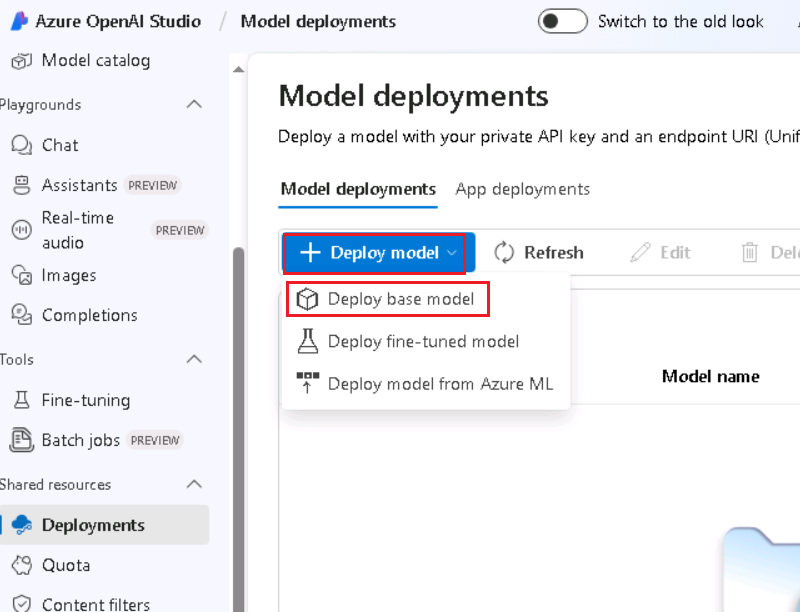

3.  In the **select a model** box, select carefully **gpt-4** and click
    on the **Confirm** button.

     

4.  Select the **Model version** as **vision-preview,** in the
    **Deployment type** as **Standard, Deployment name field**, enter
    +++gpt-4 +++, and click on the **Deploy** button.

   

   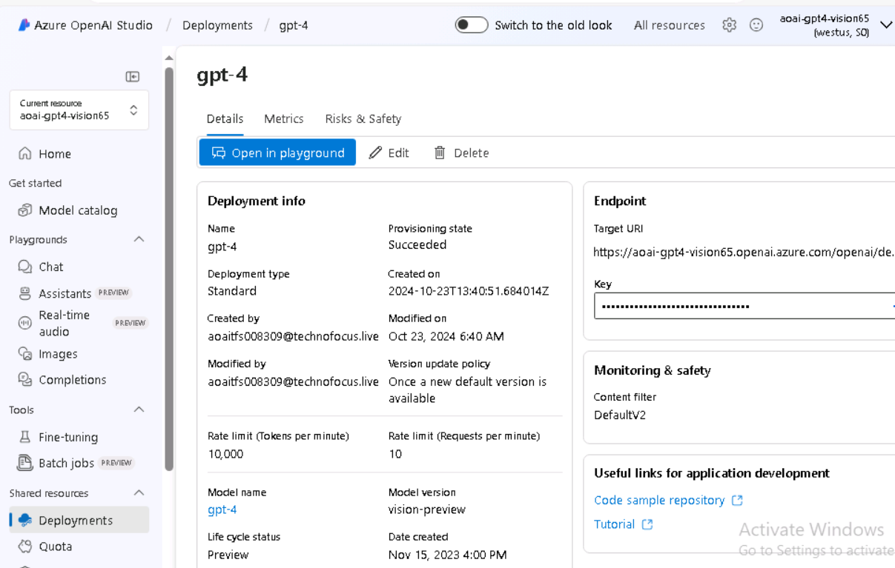

## **Task 3: Vision in the Azure AI Studio chat playground** 

1.  In Azure OpenAI Studio Home page, under **Playground** select
    **Chat.**

    

2.  In the **Assistant setup** pane, provide a System Message to guide
    the assistant.: "**+++You are an AI assistant that helps people find
    information+++**." Click on **Save** button.

    

3.  Save your changes, and when prompted to confirm updating the system
    message, select **Continue**.

    

4.  Navigate to **Chat session** section and click on the dropdown
    beside **attachment icon** under the chat session text box as shown
    in the below image and select **Upload image**.

     

5.  Navigate and select **car-accident** image from **C:\LabFiles**,
    then click on the **Open** button.

    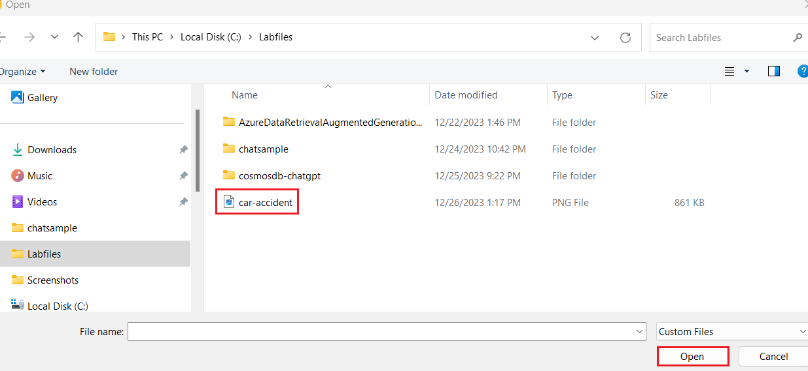

    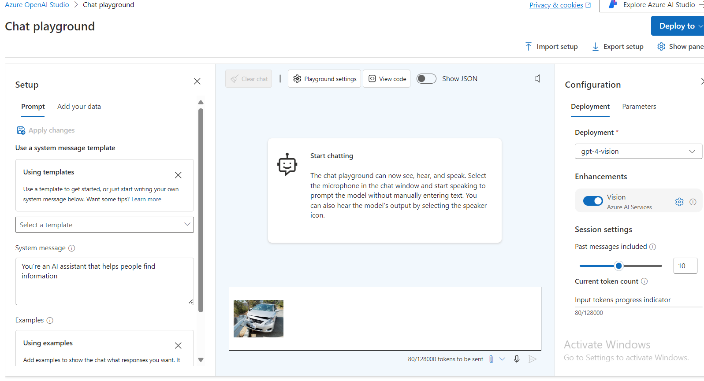

6.  In the **chat session** pane, under the image enter the following
    question: **+++Describe this image+++**, and then click on the right
    arrow icon to send.

     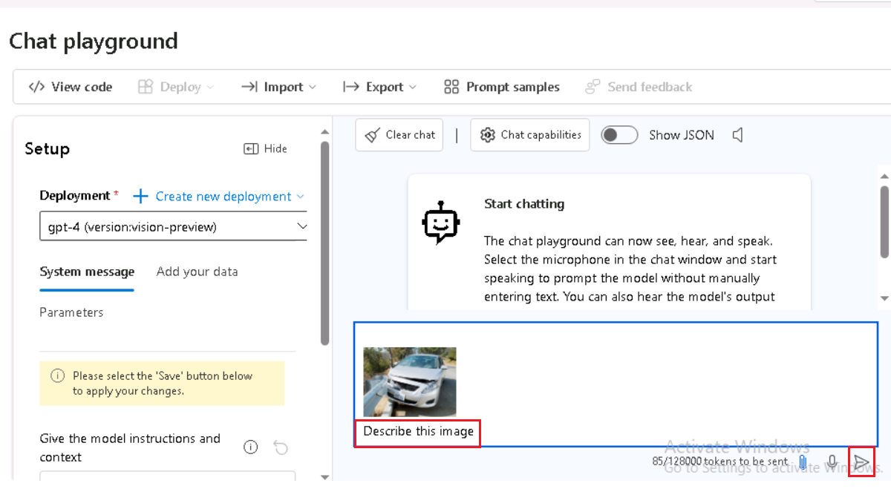

7.  The assistant replies with a description of the image.

    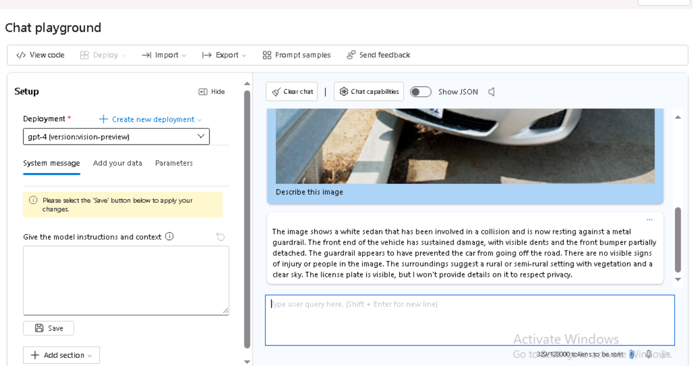

8.  Ask a follow-up question related to the analysis of your image.
    Enter “**+++What should I highlight about this image to my insurance
    company+++**” and then click on the right arrow icon to send.

    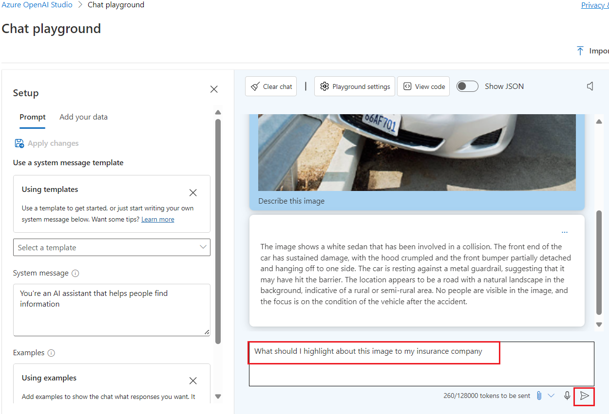

9.  You should receive a relevant response similar to what's shown here:

     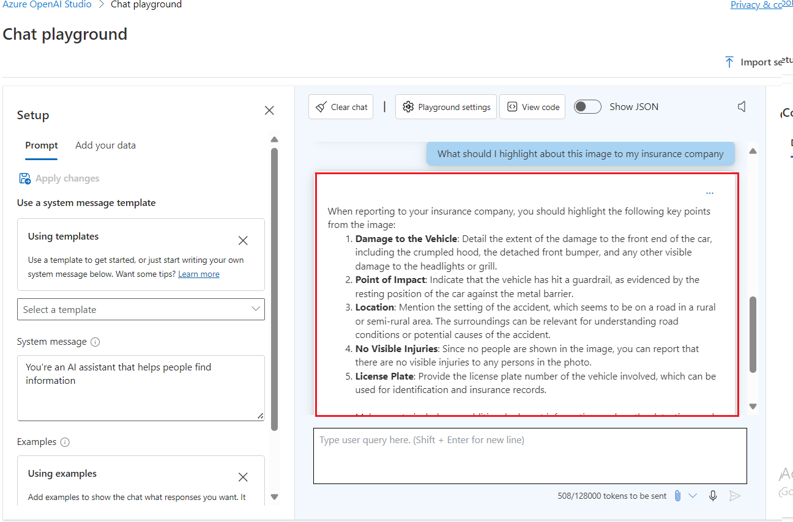

10. At any point in the chat session, select the **Show raw
    JSON** option to see the conversation formatted as JSON.

     

## Task 4: Delete the resources

1.  To delete the storage account, navigate to **Azure portal Home**
    page, click on **Resource groups**.

     

2.  Click on the AOAI-RGXXX resource group.

    

3.  In the **Resource group** home page, select the **delete resource
    group**

    

4.  In the Delete a resource group tab, enter your resource group name
    and click on **Delete button**.

     

5. On **Delete confirmation** dialog box, click on **Delete** button.

    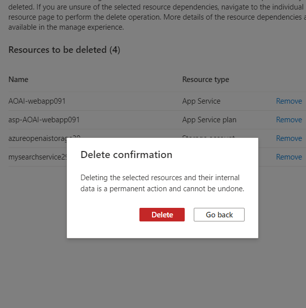

12. Click on the bell icon, you’ll see the notification –**Deleted
    resource group AOAI-RG89.**

    

**Summary**

In this lab, you’ve created Computer Vision resource and Azure OpenAI
resource. Then, you’ve deployed the gpt-4 model in Azure OpenAI Studio,
ensuring proper configurations for deployment. In the subsequent tasks,
you’ve interacted with the model in the Azure AI Studio Playground,
uploaded images and videos, and enhanced prompts for more detailed
responses. Then, you’ve deleted the Azure OpenAI Resource to manage
resources efficiently. Overall, the lab offers a comprehensive
walkthrough for users to create, deploy, and interact with computer
vision and language models within the Azure environment.

