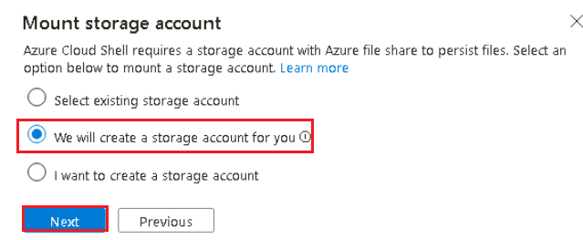
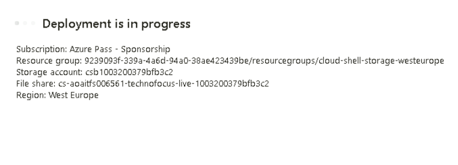
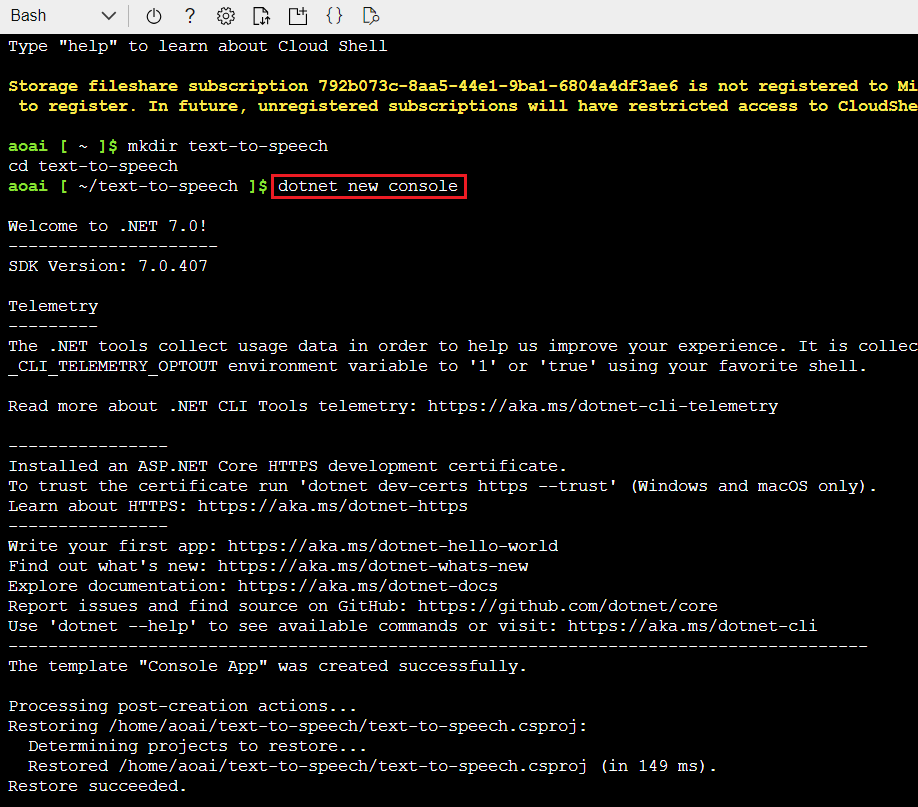
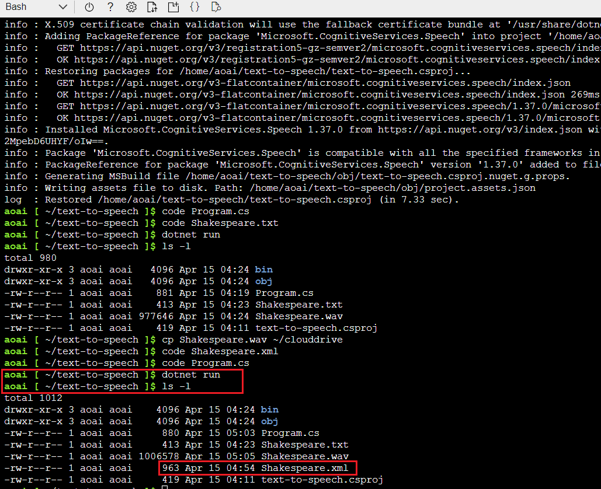

# Lab 5: Get started using GPT-4 Turbo with Vision on your images and videos in Azure AI Studio

**Introduction**

GPT-4 Turbo with Vision is a large multimodal model (LMM) developed by
OpenAI that can analyze images and provide textual responses to
questions about them. It incorporates both natural language processing
and visual understanding. The GPT-4 Turbo with Vision model answers
general questions about what's present in the images.

GPT-4 Turbo with Vision and [Azure AI
Vision](https://learn.microsoft.com/en-us/azure/ai-services/computer-vision/overview) offer
advanced functionality including:

- **Optical Character Recognition (OCR)**: Extracts text from images and
  combines it with the user's prompt and image to expand the context.

- **Object grounding**: Complements the GPT-4 Turbo with Vision text
  response with object grounding and outlines salient objects in the
  input images.

- **Video prompts**: GPT-4 Turbo with Vision can answer questions by
  retrieving the video frames most relevant to the user's prompt.

**Objectives**

- Configure and deploy a Computer Vision resource in Azure with
  specified settings.

- Create an Azure OpenAI resource in the West US region.

- Deploy the gpt-4 model in Azure AI Studio for interactions in the chat
  playground.

- Instruct the assistant using image prompts in the Azure AI Studio Chat
  Playground, evaluating its responses.

- Configure and assess enhancements in image prompts, utilizing Azure
  Computer Vision for improved responses.

- Extend interactions to video prompts, configuring enhancements and
  evaluating the assistant's responses.

## **Task 1: Create Computer Vision**

1.  In Azure portal, click on **portal menu** represented by three
    horizontal bars on the top left corner of page, as shown in the
    below image.

>  alt="A screenshot of a computer Description automatically generated" />

2.  Navigate and click on **+ Create a resource**.

>  alt="A screenshot of a computer Description automatically generated" />

3.  On **Create a resource** page, in the **Search services and
    marketplace** search bar, type **computer vision**, then press the
    **Enter** button.

> 

4.  In the **Marketplace** page, navigate to the **Computer Vision**
    tile, click on the V chevron button beside **Create**, then navigate
    and click on **Computer Vision** as shown in the below image. (In
    case, you clicked on the **Computer Vision** tile, then on
    **Computer Vision** page, navigate and click on the **Create**
    button).

>  style="width:6.49167in;height:5.43333in" />

5.  In the **Create Computer Vision** window, under the **Basics** tab,
    enter the following details and click on the **Next** button.

    1.  **Subscription**: Select the assigned subscription

    2.  **Resource group**: Select your Resource group (that you have
        created in **Lab 1**)

    3.  **Region**: Select **West US**

    4.  **Name**: Enter **Computer-vision-aoaiXX**

    5.  **Pricing tier**: Select **Free F0**

6.  Select the check box –**By checking this box I certify that I have
    reviewed and acknowledge the all the term above.**

7.  In the **Network** tab, leave all the radio buttons in the default
    state and click on the **Next** button.

>  alt="A screenshot of a computer Description automatically generated" />

8.  In the **Identity** tab, navigate to **System assigned managed
    identity section,** select the **On** radio button, then click on
    the **Review+create** button.

9.  In the **Review+submit** tab, once the Validation is Passed, click
    on the **Create** button.

10. After the deployment is completed, click on **Home** link at the top
    left corner of the page to go back to Azure portal Home page.

## **Task 2: Create Azure OpenAI resource**

1.  In Azure portal, click on **portal menu** represented by three
    horizontal bars on the top left corner of page, as shown in the
    below image.

>  alt="A screenshot of a computer Description automatically generated" />

2.  Navigate and click on **+ Create a resource**.

>  alt="A screenshot of a computer Description automatically generated" />

3.  On **Create a resource** page, in the **Search services and
    marketplace** search bar, type **Azure OpenAI**, then press the
    **Enter** button.

>  alt="A screenshot of a computer Description automatically generated" />

4.  In the **Marketplace** page, navigate to the **Azure OpenAI** tile,
    click on the V chevron button beside **Create**, then navigate and
    click on the **Azure OpenAI** as shown in the below image.

>  alt="A screenshot of a computer Description automatically generated" />

5.  In the **Create Azure OpenAI** window, under the **Basics** tab,
    enter the following details and click on the **Next** button.

    1.  **Subscription**: Select the assigned subscription

    2.  **Resource group**: Click on **Create new**\> enter
        **AOAI-RGXX** (XX can be a unique number)

    3.  **Region**: Select **West US**

    4.  **Name**: aoai-gpt4-visionXX (XX can be a unique number)

    5.  **Pricing tier**: Select **Standard S0**

> 

6.  In the **Network** tab, leave all the radio buttons in the default
    state, and click on the **Next** button.

>  alt="A screenshot of a computer Description automatically generated" />

7.  In the **Tags** tab, leave all the fields in the default state, and
    click on the **Next** button.

>  alt="A screenshot of a computer Description automatically generated" />

8.  In the **Review + submit** tab, once the Validation is Passed, click
    on the **Create** button.

>  style="width:6.49167in;height:6.79167in" />

9.  Wait for the deployment to complete. The deployment will take around
    2-3 minutes.

10. On **Microsoft.CognitiveServicesOpenAI** window, after the
    deployment is completed, click on **Go to resource** button.

11. On the **aoai-gpt4-visionXX** window, click on **Overview** in the
    left-sided navigation menu, scroll down to **Get Started** tile and
    click on **Go to AzureOpenAI Studio** button as shown in the below
    image to open **Azure OpenAI Studio** in a new browser.

## **Task 3: Deploying an Azure OpenAI model gpt-4**

1.  On the **Azure OpenAI Studio** homepage, click on **Create new
    deployment** button.

2.  In the **Deployments** page, click on +**Create new deployment**.

3.  In the **Deploy model dialog** box, under the **Model name** field,
    click on the V chevron button; navigate and select carefully
    **gpt-4**.

4.  Select the **Model version** as **vision-preview,** in the
    **Deployment type** as **Standard, Deployment name field**, enter
    **gpt-4-vision**, and click on the **Create** button.

5.  You will see a notification – **Successfully Created deployment**
    when the deployment is succeeded.

## **Task 4: Vision in the Azure AI Studio chat playground** 

1.  In Azure OpenAI Studio Home page, under **Playground** select
    **Chat.**

2.  Navigate to the **Configuration** section, under the **Deployment**
    field, ensure that **gpt-4-vision** is selected

3.  Navigate to **Enhancements** section and **turn on** the toggle
    for **Vision** as shown in the below image.

> 

4.  In **Vision enhancements setting** dialog box, select **Azure
    Computer Vision resource name** as **computer-vision-aoaiXX**, then
    click on the **Save** button.

> **Note**: If you did not find **Azure Computer Vision resource name**
> in the dropdown, then click on **Create an Azure Computer Vision
> Resource** link below the field and create a new Computer Vision
> resource in **West US**.
>
>  alt="A screenshot of a computer screen Description automatically generated" />

## **Task 5: Image prompt enhancements**

1.  Navigate to the **Assistant setup** section, in the **System
    message** text box, enter the following prompt to guide the
    assistant: **You're an AI assistant that helps people find
    information.** You can tailor the prompt image or scenario that
    you're uploading.

2.  Click on **Apply changes** to save your changes.
    

3.  On **Update system message?** dialog box, click on the **Continue**
    button.

4.  . Navigate to the **Configuration** section, under the
    **Deployment** field, ensure that **gpt-4-vision** is selected.
    Navigate to **Chat session** section and click on the dropdown
    beside attachment icon under the chat session text box as shown in
    the below image and select **Upload image**.

>  style="width:7.08958in;height:3.80417in" />

5.  Navigate and select **car-accident** image from **C:\LabFiles**,
    then click on the **Open** button.

6.  In the **chat session** pane, under the image enter the following
    question: +++**Describe this image+++**, and then click on the right
    arrow icon to send.

7.  The square icon replaces the right arrow icon. If you select the
    square icon, the assistant stops processing your request. For this
    let the assistant finish its reply. Don't select the square icon.

8.  The assistant replies with a description of the image.

>  style="width:7.12847in;height:4.80417in" />

9.  Ask a follow-up question related to the analysis of your image.
    Enter “**What should I highlight about this image to my insurance
    company**” and then click on the right arrow icon to send.

>  style="width:7.02347in;height:4.7875in" />

10. You should receive a relevant response similar to what's shown here:

>  style="width:6.97886in;height:4.59583in" />

11. At any point in the chat session, select the **Show raw
    JSON** option to see the conversation formatted as JSON.

>  alt="A screenshot of a computer Description automatically generated" />

12. In the Chat session pane, click on **Clear chat.**

>  alt="A screenshot of a computer Description automatically generated" />

13. In the **Clear chat?** dialog box, click on the **Clear** button.

>  alt="A screenshot of a chat Description automatically generated" />

## **Task 6: Video prompt enhancements**

1.  . Navigate to **Chat session** section and click on the dropdown
    beside attachment icon under the chat session text box, then select
    **Upload video** as shown in the below image**.**

>  style="width:7.06188in;height:4.69583in" />

2.  Navigate and select **car-accident-video** MP4 file from
    **C:\LabFiles**, then click on the **Open** button.

>  style="width:7.10704in;height:3.17083in" />
>
>  style="width:7.03713in;height:4.35417in" />

3.  Navigate to **Assistant setup** section, in the **System
    message** text box, provide the following prompt to guide the
    assistant: "**You're a car insurance and accident expert. Extract
    detailed information about the car's make, model, damage extent,
    license plate, airbag deployment status, mileage, and any other
    observations.**" You can tailor the prompt for the video or
    scenario.

4.  Click on **Apply changes** to save your changes. On **Update system
    message?** dialog box, click on the **Continue** button.

>  alt="A screenshot of a computer error message Description automatically generated" />

5.  In the chat session pane, under the video, enter the following
    question: +++**Provide details from this car accident video+++** and
    then select the right arrow icon to send.

>  style="width:6.49167in;height:4.04167in" />

6.  The assistant replies with a description of the video.

>  style="width:6.62826in;height:4.24583in" />

7.  Ask a follow-up question related to the analysis of your video.
    Enter +++**What should I highlight about this video to my insurance
    company+++** and then select the right arrow icon to send.

>  style="width:6.97083in;height:4.54581in" />

8.  You should receive a relevant response similar to what's shown here:

> 

9.  At any point in the chat session, you can select the **Show raw
    JSON** option to see the conversation in JSON format.

## Task 7: Delete the resources

1.  To delete the storage account, navigate to **Azure portal Home**
    page, click on **Resource groups**.

>  alt="A screenshot of a computer Description automatically generated" />

2.  Click on the AOAI-RGXXX resource group.

>  alt="A screenshot of a computer Description automatically generated" />

3.  Select all resources except Azure-openai-testXX

4.  In the Resource group page, navigate to command bar and click on
    **Delete**.

5.  In the **Delete Resources** pane that appears on the right side,
    enter the **delete** and click on **Delete** button.

**Summary**

In this lab, you’ve created Computer Vision resource and Azure OpenAI
resource. Then, you’ve deployed the gpt-4 model in Azure OpenAI Studio,
ensuring proper configurations for deployment. In the subsequent tasks,
you’ve interacted with the model in the Azure AI Studio Playground,
uploaded images and videos, and enhanced prompts for more detailed
responses. Then, you’ve deleted the Azure OpenAI Resource to manage
resources efficiently. Overall, the lab offers a comprehensive
walkthrough for users to create, deploy, and interact with computer
vision and language models within the Azure environment.

**Important Note: Please do not delete the Resource Group. If deleted,
you’ll not be able to proceed with the next lab or create a new Resource
Group.**
