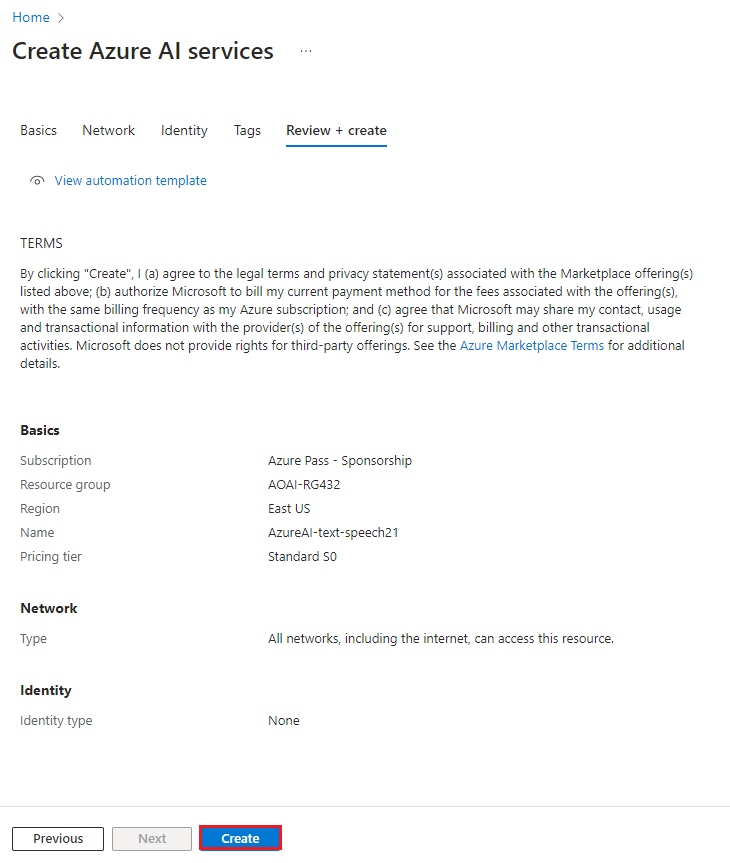
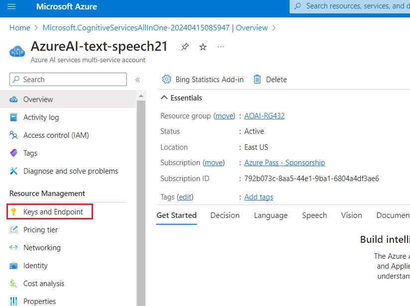
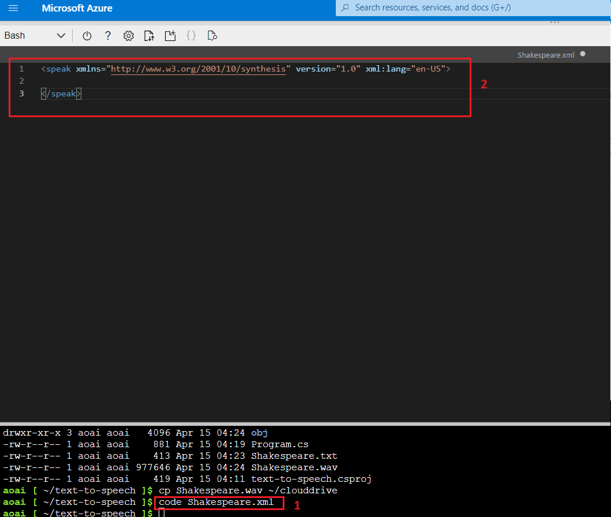

**Introduction**

In this lab, you will create a text-to-speech application using Azure AI
Services. Text-to-speech technology converts written text into spoken
words, providing an interactive and accessible experience for users.
This lab will guide you through the process of setting up an Azure AI
Services account, creating a text-to-speech application, and customizing
the audio output using Speech Synthesis Markup Language (SSML). By the
end of this lab, you will have a functional text-to-speech application
capable of converting text files and SSML files into audio files.

**Objective**

- To create an Azure AI Services account using the Azure portal.

- To develop a text-to-speech application in Azure Cloud Shell and add
  the Speech SDK package to the .NET Core application.

- To write code to convert text files to speech and generate audio files
  from text.

- To customize speech output using SSML and update application code to
  use SSML for audio generation.

- To execute the application to convert text and SSML files to audio,
  and download and listen to the generated audio files.

# Exercise 1 - Create a text to speech application using a text file

## Task 1: Create an Azure AI services account using the Azure portal

The multi-service resource is listed under **Azure AI
services** \> **Azure AI services multi-service account** in the portal.

1.  Open your browser, navigate to the address bar, type or paste the
    following URL:
    <https://portal.azure.com/#create/Microsoft.CognitiveServicesAllInOne>
    then press the **Enter** button.

2.  In the **Sign in** window, enter the **Username** and click on the
    **Next** button.

>  style="width:5.16667in;height:5.86667in" />

3.  Then, enter the password and click on the **Sign in** button**.**

>  alt="A screenshot of a login box Description automatically generated" />

4.  In **Stay signed in?** window, click on the **Yes** button.

>  alt="Graphical user interface, application Description automatically generated" />

5.  In the **Create Azure AI** window, under the **Basics** tab, enter
    the following details and click on the **Review+create** button.

<table>
<colgroup>
<col style="width: 45%" />
<col style="width: 54%" />
</colgroup>
<thead>
<tr class="header">
<th><strong>Subscription</strong></th>
<th><blockquote>

Select the assigned subscription

</blockquote></th>
</tr>
</thead>
<tbody>
<tr class="odd">
<td><strong>Resource group</strong></td>
<td>Click on Create new&gt; enter AOAI-RGXXX(XXX can be a unique number,
you can add more digits after XX to make the name unique</td>
</tr>
<tr class="even">
<td><strong>Region</strong></td>
<td>Select <strong>East US</strong></td>
</tr>
<tr class="odd">
<td><strong>Name</strong></td>
<td>AzureAI-text-speechXX (XX can be a unique number, you can add more
digits after XX to make the name unique)</td>
</tr>
<tr class="even">
<td><strong>Pricing tier</strong></td>
<td><blockquote>

Select <strong>Standard S0</strong>

</blockquote></td>
</tr>
<tr class="odd">
<td><strong>By checking this box I acknowledge that I have read and
understood all the terms below</strong></td>
<td><blockquote>

Select the <strong>check box</strong>

</blockquote></td>
</tr>
</tbody>
</table>

6.  In the **Review+submit** tab, once the Validation is Passed, click
    on the **Create** button.

7.  Wait for the deployment to complete. The deployment will take around
    2-3 minutes.

8.  After the deployment is completed, click on the **Go to resource**
    button.

9.  In your **AzureAI-text-speechXX** window, navigate to the **Resource
    Management** section, and click on **Keys and Endpoints**.

10. In **Keys and Endpoints** page, copy **KEY1, Region,** and
    **Endpoint** values and paste them in a notepad as shown in the
    below image, then **Save** the notepad to use the information in the
    upcoming tasks.

## Task 2: Create your text to speech application

1.  In the Azure portal, click on the **\[\>\_\] (Cloud Shell)** button
    at the top of the page to the right of the search box. A Cloud Shell
    pane will open at the bottom of the portal. The first time you open
    the Cloud Shell, you may be prompted to choose the type of shell you
    want to use (**Bash** or **PowerShell**). Select **Bash**. If you
    don’t see this option, then skip this step.

> 

2.  In Getting started dialog box, select **Mount storage account**,
    select **azure subscription** and click on the **Apply** button**.**

>  style="width:6.49167in;height:2.29167in" />

3.  In **Mount storage account** dialog box, select **we will create a
    storage account for you**, and click on the **Next** button**.**

> 
>
>  style="width:6.35055in;height:2.29187in" />

4.  Ensure the type of shell indicated on the top left of the Cloud
    Shell pane is switched to ***Bash***. If it’s ***PowerShell**,*
    switch to ***Bash*** by using the drop-down menu.

>  style="width:4.40833in;height:3.02917in" />

5.  In the Cloud Shell on the right, create a directory for your
    application, then switch folders to your new folder. Enter the
    following command

> Copy
>
> **mkdir text-to-speech**
>
> **cd text-to-speech**
>
> 

6.  Enter the following command to create a new .NET Core application.
    This command should take a few seconds to complete.

> Copy
>
> dotnet new console

7.  When your .NET Core application has been created, add the Speech SDK
    package to your application. This command should take a few seconds
    to complete.

> Copy
>
> dotnet add package
> Microsoft.CognitiveServices.Speech

## Task 3:Add the code for your text to speech application

1.  In the Cloud Shell on the right, open the ***Program.cs*** file
    using the following command.

Copy

code Program.cs

2.  Replace the existing code with the following using statements, which
    enable the Azure AI Speech APIs for your application:

Copy

using System.Text;

using Microsoft.CognitiveServices.Speech;

using
Microsoft.CognitiveServices.Speech.Audio;

3.  Below the using statements, add the following code, which uses Azure
    AI Speech APIs to convert the contents of the text file that you'll
    create to create a WAV file with the synthesized voice. Replace
    the **azureKey** and **azureLocation** values with the ones you
    copied in the last task 1.

**Copy**

string azureKey = "ENTER YOUR KEY FROM THE FIRST EXERCISE";

string azureLocation = "ENTER YOUR LOCATION FROM THE FIRST EXERCISE";

string textFile = "Shakespeare.txt";

string waveFile = "Shakespeare.wav";

try

{

FileInfo fileInfo = new FileInfo(textFile);

if (fileInfo.Exists)

{

string textContent = File.ReadAllText(fileInfo.FullName);

var speechConfig = SpeechConfig.FromSubscription(azureKey,
azureLocation);

using var speechSynthesizer = new SpeechSynthesizer(speechConfig, null);

var speechResult = await speechSynthesizer.SpeakTextAsync(textContent);

using var audioDataStream = AudioDataStream.FromResult(speechResult);

await audioDataStream.SaveToWaveFileAsync(waveFile);

}

}

catch (Exception ex)

{

Console.WriteLine(ex.Message);

}

4.  This code uses your key and location to initialize a connection to
    Azure AI services, then reads the contents of the text file you'll
    create, then uses the SpeakTextAsync() method of the speech
    synthesizer to convert the text to audio, then uses an audio stream
    to save the results to an audio file.

5.  To save your changes, press **Ctrl+S** to save the file, and then
    press **Ctrl+Q** to exit the editor

## Task 4:Create a text file for your application to read

1.  In the Cloud Shell on the right, create a new text file that your
    application will read:

> **Copy**
>
> code Shakespeare.txt

2.  When the code editor appears, enter the following text.

> **textCopy**
>
> The following quotes are from act 2, scene 7, of William Shakespeare's
> play "As You Like It."
>
> Thou seest we are not all alone unhappy:
>
> This wide and universal theatre
>
> Presents more woeful pageants than the scene
>
> Wherein we play in.
>
> All the world's a stage,
>
> And all the men and women merely players:
>
> They have their exits and their entrances;
>
> And one man in his time plays many parts,
>
> His acts being seven ages.
>
>  style="width:6.49167in;height:5.55833in" />

3.  To save your changes, press **Ctrl+S** to save the file, and then
    press **Ctrl+Q** to exit the editor

## Task 5:Run your application

1.  To run your application, use the following command in the Cloud
    Shell on the right:

**Copy**

> **dotnet run**

2.  If you don't see any errors, your application has run successfully.
    To verify, run the following command to get a list of files in the
    directory.

> Copy
>
> **ls -l**

3.  You should get a response like the following example, and you should
    have the ***Shakespeare.wav*** file in the list of files.

## Task 6: Listen to WAV file

In order to listen to the WAV file that your application created, you'll
first need to download it. To do so, use the following steps.

1.  In the Cloud Shell on the right, use the following command to copy
    the WAV file to your temporary cloud drive:

> Copy
>
> **cp Shakespeare.wav ~/clouddrive**

2.  In the Azure portal search box, type !!**Storage account**!!, then
    click on **Storage account** under **Services**.

3.  In the **Storage accounts** page, navigate and click on **cloud
    storage account** .

4.  In the **Storage account** page left-sided navigation menu, navigate
    to the **Data storage** section, then click on the **File shares**.

5.  Then select your **cloudshellfilesXXX** file share.

6.  When your **cloudshellfilesXXX** file shares page is displayed,
    select **Browse**, then select the **Shakespeare.wav** file, then
    select the **Download** icon.

7.  Download the **Shakespeare.wav** file to your computer, where you
    can listen to it with your operating system's audio player.

# Exercise 2- Create a text to speech application using an SSML file

In this exercise, you'll create an XML file that contains Speech
Synthesis Markup Language (SSML), which you'll use to customize the
audio output from the Azure AI speech APIs.

## Task 1:Create an SSML file for your application to read

1.  In the Cloud Shell on the right, create a new XML file that your
    application will read:

> Copy
>
> **code Shakespeare.xml**

2.  When the code editor appears, enter the following XML:

**Copy**

\<speak xmlns="http://www.w3.org/2001/10/synthesis" version="1.0"
xml:lang="en-US"\>

\</speak\>

This code excerpt defines the root \<speak\> element that will contain a
series of \<voice\> elements that specify other voices to use.

3.  Within the \<speak\> element, add the following XML to define text
    that the en-GB-LibbyNeural voice will read:

**Copy**

> \<voice name="en-GB-LibbyNeural"\>
>
> \<prosody rate="-10%" pitch="-5%"\>
>
> The following quotes are from act 2, scene 7, of William Shakespeare's
> play "As You Like It."
>
> \</prosody\>
>
> \</voice\>

This code excerpt defines a \<voice\> element that specifies a different
voice than the default, and wraps the text within a \<prosody\> element
that slows the speaking rate by 10% and lowers the pitch by 5%.

4.  Add the following XML after the previous \<voice\> element to define
    text that the en-GB-RyanNeural voice will read.

Copy

> \<voice name="en-GB-RyanNeural"\>
>
> \<prosody rate="-5%" pitch="-10%"\>
>
> \<break time="1s" /\>
>
> All the world's a stage,
>
> And all the men and women merely players:
>
> \<break time="1s" /\>
>
> They have their exits and their entrances;
>
> And one man in his time plays many parts,
>
> His acts being seven ages.
>
> \</prosody\>
>
> \</voice\>
>
> Like the previous code excerpt, this excerpt defines
> a \<voice\> element that specifies a different voice and wraps the
> text within a \<prosody\> element that alters the speaking rate and
> pitch. However, this excerpt also contains \<break\> elements that add
> pauses between phrases.

5.  Add the following XML after the previous \<voice\> element to define
    text that the en-IE-ConnorNeural voice will read.

**Copy**

> \<voice name="en-IE-ConnorNeural"\>
>
> \<prosody rate="-10%" pitch="-5%"\>
>
> \<break time="1s" /\>
>
> Thou \<phoneme alphabet="sapi" ph="s i eh s t"\>seest\</phoneme\> we
> are not all alone unhappy:
>
> \<break time="1s" /\>
>
> This wide and universal theatre
>
> Presents more woeful pageants than the scene
>
> Wherein we play in.
>
> \</prosody\>
>
> \</voice\>

Like the last two code excerpts, this excerpt defines
a \<voice\> element that specifies a different voice and wraps the text
within a \<prosody\> element that alters the speaking rate and pitch,
and also contains \<break\> elements that add a pause between phrases.
However, this excerpt also contains a \<phoneme\> element that helps the
text to speech engine to pronounce an older English word that it might
not know how to pronounce.

6.  To save your changes, press **Ctrl+S** to save the file, and then
    press **Ctrl+Q** to exit the editor.

## Task 2: Update the code for your text to speech application for SSML

1.  In the Cloud Shell on the right, open the ***Program.cs*** file:

Copy

> **code Program.cs**

2.  Leave the existing using statements unmodified, but replace the rest
    with the following code, which will modify the application to use
    the contents of an SSML file instead of a text file. Replace
    the azureKey and azureLocation values with the ones you copied in
    the first exercise.

> C#Copy
>
> string azureKey = "ENTER YOUR KEY FROM THE FIRST EXERCISE";
>
> string azureLocation = "ENTER YOUR LOCATION FROM THE FIRST EXERCISE";
>
> string ssmlFile = "Shakespeare.xml";
>
> string waveFile = "Shakespeare.wav";
>
> try
>
> {
>
> FileInfo fileInfo = new FileInfo(ssmlFile);
>
> if (fileInfo.Exists)
>
> {
>
> string ssmlContent = File.ReadAllText(fileInfo.FullName);
>
> var speechConfig = SpeechConfig.FromSubscription(azureKey,
> azureLocation);
>
> using var speechSynthesizer = new SpeechSynthesizer(speechConfig,
> null);
>
> var speechResult = await
> speechSynthesizer.SpeakSsmlAsync(ssmlContent);
>
> using var audioDataStream = AudioDataStream.FromResult(speechResult);
>
> await audioDataStream.SaveToWaveFileAsync(waveFile);
>
> }
>
> }
>
> catch (Exception ex)
>
> {
>
> Console.WriteLine(ex.Message);
>
> }

This code excerpt is largely the same as the code from the previous
exercise. The main differences are the lines that specify the XML file
instead of the text file, and using the SpeakSsmlAsync() method to
process the SSML code.

As with the previous exercise, make sure that you update the values for
the azureKey and azureLocation variables with your key and location from
the first exercise.

3.  To save your changes, press **Ctrl+S** to save the file, and then
    press **Ctrl+Q** to exit the editor.

## Task 3: Run your application

1.  To run your application, use the following command in the Cloud
    Shell on the right.

Copy

> **dotnet run**

2.  If you don't see any errors, your application has run successfully.
    To verify, run the following command to get a list of files in the
    directory.

> BashCopy
>
> **ls -l**

You should get a response like the following example, and you should
have the ***Shakespeare.wav*** file in the list of files.

## Task 4:Listen to your WAV file

In order to listen to the WAV file that your application created, you'll
first need to download it. To do so, use the following steps.

1.  In the Cloud Shell on the right, use the following command to copy
    the WAV file to your temporary cloud drive:

> BashCopy
>
> cp Shakespeare.wav ~/clouddrive

2.  In the Azure portal search box, type **Storage account**, then click
    on **Storage account** under **Services**.

3.  In the **Storage accounts** page, navigate and click on **cloud
    storage account** .

4.  In the **Storage account** page left-sided navigation menu, navigate
    to the **Data storage** section, then click on the **File shares**.

5.  Then select your **cloudshellfilesXXX** file share.

8.  When your **cloudshellfilesXXX** file shares page is displayed,
    select **Browse**, then select the **Shakespeare.wav** file, then
    select the **Download** icon.

9.  Download the **Shakespeare.wav** file to your computer, where you
    can listen to it with your operating system's audio player.

## Task 5: Delete the Resources

1.  To delete the storage account, navigate to **Azure portal Home**
    page, click on **Resource groups**.

>  alt="A screenshot of a computer Description automatically generated" />

2.  Click on the AOAI-RGXXX resource group.

>  alt="A screenshot of a computer Description automatically generated" />

3.  In the **Resource group** home page, select the **delete resource
    group**

4.  In the **Delete Resources** pane that appears on the right side,
    navigate to **Enter “resource group name” to confirm deletion**
    field, then click on the **Delete** button.

5.  On **Delete confirmation** dialog box, click on **Delete** button.

>  alt="A screenshot of a computer error Description automatically generated" />

6.  Click on the bell icon, you’ll see the notification –**Deleted
    resource group AOAI-RG89.**

**Summary**

In this lab, you’ve successfully created a text-to-speech application
using Azure AI Services. You’ve how to set up an Azure AI account,
developed a .NET Core application, and used the Speech SDK to convert
text files into audio files. Additionally, you’ve customized the speech
output using SSML to enhance the audio experience. Finally, you ran the
application, tested the audio output, and cleaned up the Azure
resources. This lab provided hands-on experience with Azure AI Services
and demonstrated how to integrate text-to-speech functionality into your
applications.
