# Lab06-Get started using Azure OpenAI Assistants (Preview)

**Introduction**

Azure OpenAI Assistants (Preview) allows you to create AI assistants
tailored to your needs through custom instructions and augmented by
advanced tools like code interpreter, and custom functions.

**Objective**

-   Create an Azure OpenAI resource in the Sweden Central region.

-   Create a Bing Search service.

-   Deploy the gpt-4 model, gpt-4-vision and dall-e-3 in Azure AI Studio
    for interactions in the chat playground.

-   Explore the Assistant\'s playground

-   Use the Bing Search APIs and function calling to ground Azure OpenAI
    models on data from the web.

-   Building a multimodal multi-agent framework with Azure Assistant API

## **Task 1: Create a Bing Search Service resource**

1.  Click on the **Portal Menu**, then select **+ Create a resource**

> {width="5.2125in"
> height="2.9441590113735785in"}

2.  In the **Create a resource** page search bar, type **Bing Search
    v7** and click on the appeared **bing search v7**.

{width="6.5in"
height="4.466666666666667in"}

3.  Click on **Bing Search v7** section.

{width="6.5in" height="5.75in"}

4.  On the **Create a search service** page, provide the following
    information and click on **Review+create** button.

  -----------------------------------------------------------------------
  **Field**                **Description**
  ------------------------ ----------------------------------------------
  **Subscription**         Select the subscription assigned to

  **Resource group**       Select your Resource group(that you have
                           created in **Lab 1**)

  **Name**                 **!!bingsearchaoaiXX!!**(XXcan be unique
                           number)

  **Pricing Tier**         F1

  **Select the check box** I confirm I have read and understood the
                           notice above
  -----------------------------------------------------------------------

{width="5.991666666666666in"
height="7.516666666666667in"}

5.  Once the Validation is passed, click on the **Create** button.

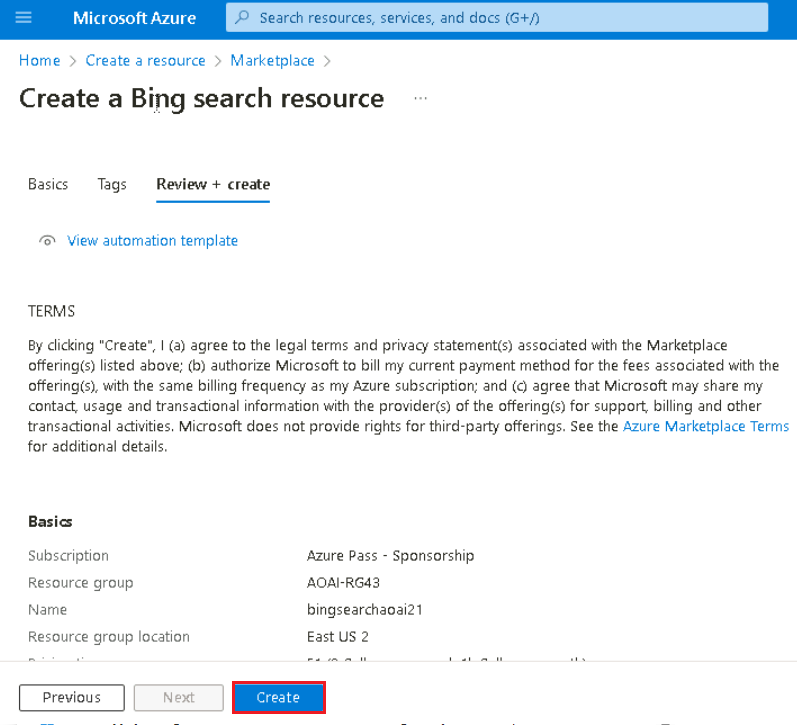{width="6.5in"
height="5.908333333333333in"}

6.  Once the deployment is completed, click on **Go to resource group**
    button.

{width="6.491666666666666in"
height="3.5833333333333335in"}

7.  On the **bingsearchaoaiXX** window, navigate to **Resource
    management** section, and click on **Keys and Endpoint**.

{width="6.5in"
height="4.666666666666667in"}

8.  In **Keys and Endpoints** page, copy **KEY1** (*You can use
    either KEY1 or KEY2)* and **Endpoint** and paste them in a notepad
    (as shown in the image), and then **Save** the notepad to use the
    information in the upcoming tasks.

{width="6.5in" height="1.95in"}

## **Task 2: Create Azure OpenAI resource**

1.  From the Azure portal home page, click on **Azure portal menu**
    represented by three horizontal bars on the left side of the
    Microsoft Azure command bar as shown in the below image.

> {width="6.5in"
> height="4.696527777777778in"}

2.  Navigate and click on **+ Create a resource**.

> {width="6.5in"
> height="4.781944444444444in"}

3.  On **Create a resource** page, in the **Search services and
    marketplace** search bar, type **Azure OpenAI**, then press the
    **Enter** button.

> {width="4.779166666666667in"
> height="4.190206692913386in"}

4.  In the **Marketplace** page, navigate to the **Azure OpenAI**
    section, click on the Create button dropdown, then select **Azure
    OpenAI** as shown in the image. (In case, you've already clicked on
    the **Azure** **OpenAI** tile, then click on the **Create** button
    on the **Azure OpenAI page**).

> {width="4.8625in"
> height="5.055999562554681in"}

5.  In the **Create Azure OpenAI** window, under the **Basics** tab,
    enter the following details and click on the **Next** button.

+-----------------+----------------------------------------------------+
| Subscription    | > Select the assigned subscription                 |
+=================+====================================================+
| Resource group  | Select your Resource group (that you have created  |
|                 | in **Lab 1**)                                      |
+-----------------+----------------------------------------------------+
| Region          | Select **Sweden Central**                          |
+-----------------+----------------------------------------------------+
| Name            | **!!AzureOpenAI-AssistantsXX!!** (XX can be a      |
|                 | unique number, you can add more digits after XX to |
|                 | make the name unique)                              |
+-----------------+----------------------------------------------------+
| Pricing tier    | > Select **Standard S0**                           |
+-----------------+----------------------------------------------------+

> {width="6.807680446194226in"
> height="5.295833333333333in"}

6.  In the **Network** tab, leave all the radio buttons in the default
    state, and click on the **Next** button.

> {width="5.581007217847769in"
> height="5.895833333333333in"}

7.  In the **Tags** tab, leave all the fields in the default state, and
    click on the **Next** button.

> {width="5.1625in"
> height="6.082216754155731in"}

8.  In the **Review+submit** tab, once the Validation is Passed, click
    on the **Create** button.

> {width="6.491666666666666in"
> height="4.958333333333333in"}

9.  Wait for the deployment to complete. The deployment will take around
    **2-3** minutes.

10. On **Microsoft.CognitiveServicesOpenAI** window, after the
    deployment is completed, click on the **Go to resource** button.

{width="5.954166666666667in"
height="3.4372233158355208in"}

11. Click on **Keys and Endpoints** from the left navigation menu and
    then copy the endpoint value in a notepad to **AzureAI ENDPOINT**
    and key to a variable **AzureAIKey**.

{width="7.184574584426946in"
height="4.329166666666667in"}

## Task 3: Deploying an Azure OpenAI models

1.  On the **AzureOpenAI-AssistantsXX** window, click on **Overview** in
    the left navigation menu, then under the **Get Started** tab, click
    on the **Go to Azure OpenAI Studio** button to open **Azure OpenAI
    Studio** in a new browser

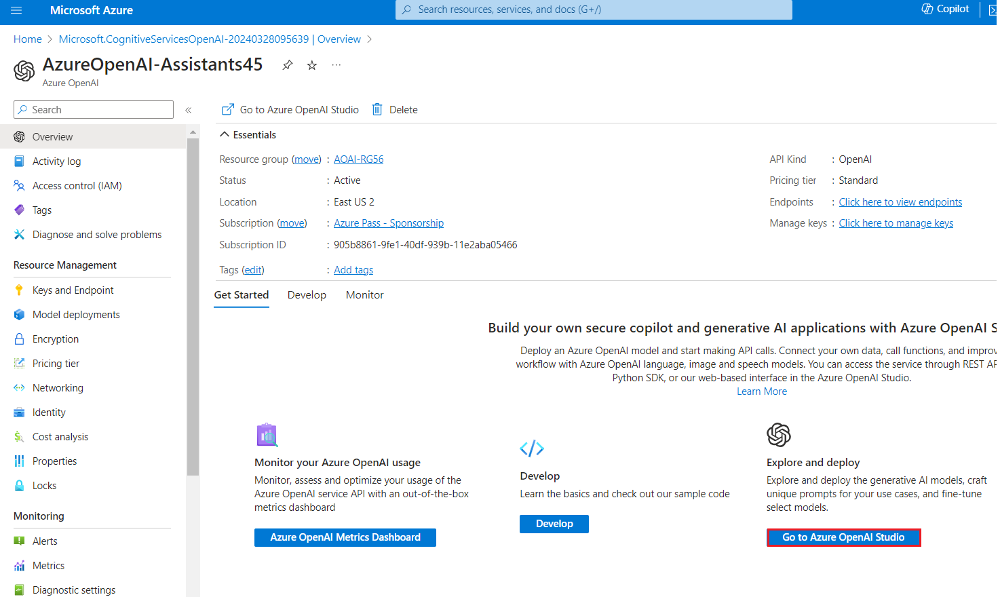{width="6.5in"
height="3.8833333333333333in"}

2.  In the **Azure AI \| Azure OpenAI Studio** window, click on **Create
    a new deployment** button**.**

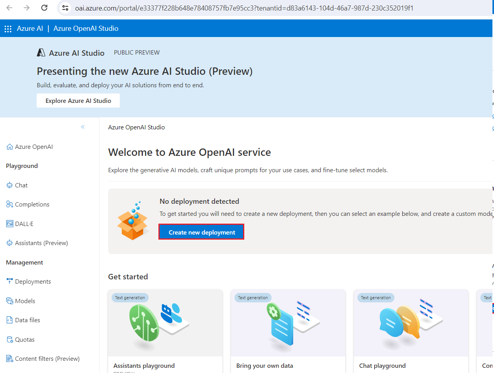{width="6.5in"
height="5.141666666666667in"}

3.  In the **Deployments** window, click on **+Create new deployment**.

{width="6.5in"
height="5.166666666666667in"}

4.  In the **Deploy model dialog** box, enter the following details and
    click on the **Create** button.

-   Select Model: **gpt-4**

-   Model Version**: 1106-Preview**

-   Deployment Name: enter **gpt-4**

-   Select the **Advanced options** and select the **Standard** as
    **Deployment type**

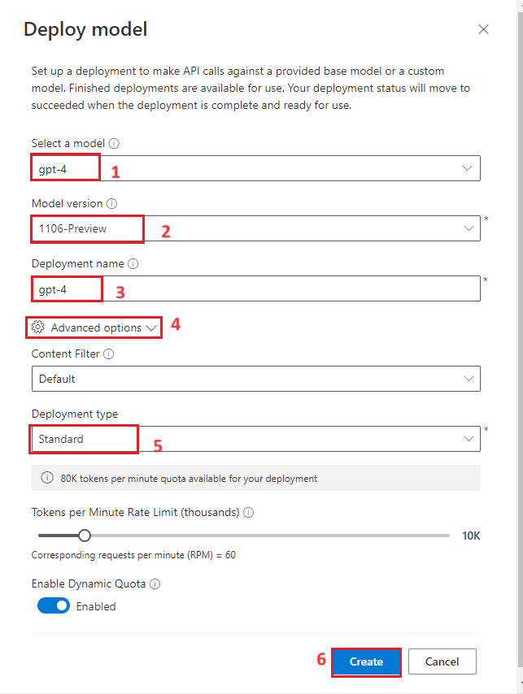{width="5.358333333333333in"
height="7.116666666666666in"}

5.  You will see a notification stating **Successfully Created
    deployment**. (In case, the notification did not appear on your
    window by default, click on the bell icon beside **Azure AI \| Azure
    AI Studio** bar.

{width="3.433630796150481in"
height="1.633474409448819in"}

6.  In the **Deployments** page, click on +**Create new deployment**.

{width="5.825in"
height="4.658333333333333in"}

7.  In the **Deploy model** dialog box, under **Select a model** click
    on the dropdown select **gpt-4** field, under **Model version**
    select **vision-preview** and under **Deployment name** enter
    !!**gpt-4-vision!!.** Click on the **Create** button.

> {width="5.25in"
> height="4.858333333333333in"}

8.  You will see a notification -- **Successfully Created deployment**
    when the deployment is succeeded. (You can also view the
    notification by clicking on the bell icon beside **Cognitive
    Services \| Azure OpenAI Studio)**.

{width="4.467053805774278in"
height="1.2084383202099738in"}

9.  In the **Deployments** page, click on +**Create new deployment**.

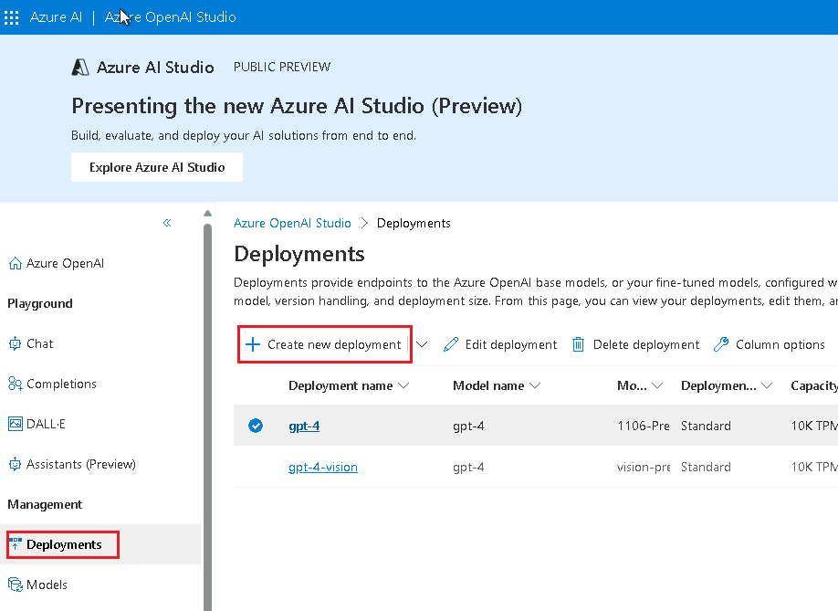{width="6.491666666666666in"
height="4.733333333333333in"}

10. In the **Deploy model** dialog box, under **Select a model** click
    on the dropdown select **dall-e-3** field, under **Model version**
    select **Auto-update to default** and under **Deployment name**
    enter !!**dall-e-3**!!**.** Click on the **Create** button.

{width="5.675in"
height="5.458333333333333in"}

11. You will see a notification -- **Successfully Created deployment**
    when the deployment is succeeded. (You can also view the
    notification by clicking on the bell icon beside **Cognitive
    Services \| Azure OpenAI Studio)**.

{width="5.2754571303587054in"
height="1.425123578302712in"}

## Task 4: Explore the Assistant\'s playground

1.  In Azure OpenAI Studio Home page, under **Welcome to** **Azure
    OpenAI Service**, in **Get started** section, click on the
    **Assistants playground**.

{width="7.1035476815398075in"
height="3.7204713473315834in"}

2.  The Assistants playground allows you to explore, prototype, and test
    AI Assistants without needing to run any code. From this page, you
    can quickly iterate and experiment with new ideas.

3.  From the Assistant setup pane enter the below details

-   Assistant a name: **Math Assist**

-   Instructions: Enter the following instructions !!**You are an AI
    assistant that can write code to help answer math questions**!!

-   Deployment: **gpt-4**

-   Select the toggle **enabling code interpreter**

{width="6.491666666666666in"
height="6.775in"}

4.  Under the Assistant setup click on **Save**

{width="6.5in" height="6.9in"}

5.  Enter a question for the assistant to answer: !!**I need to solve
    the equation 3x + 11 = 14. Can you help me?**!!

6.  Select the **Add and run button** .

{width="7.095833333333333in"
height="3.7528674540682414in"}

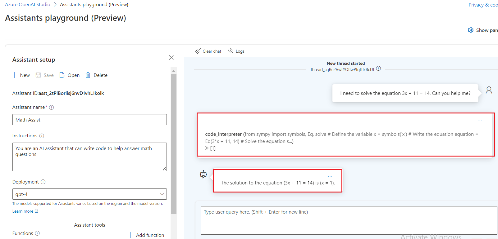{width="7.123522528433946in"
height="3.4291666666666667in"}

While we can see that answer is correct, to confirm that the model used
code interpreter to get to this answer, and that the code it wrote is
valid rather than just repeating an answer from the model\'s training
data we\'ll ask another question.

7.  Enter the follow-up question: !!**Show me the code you ran to get
    this solution.!!** Select the **Add and run button** 

{width="7.197635608048994in"
height="3.6958333333333333in"}

{width="7.244700349956256in"
height="3.4875in"}

You could also consult the logs in the right-hand panel to confirm that
code interpreter was used and to validate the code that was run to
generate the response. It is important to remember that while code
interpreter gives the model the capability to respond to more complex
math questions by converting the questions into code and running in a
sandboxed Python environment, you still need to validate the response to
confirm that the model correctly translated your question into a valid
representation in code.

## Task 5: Assistants function calling with Bing Search

In this notebook, we\'ll show how you can use the Bing Search APIs and
function calling to ground Azure OpenAI models on data from the web.
This is a great way to give the model access to up to date data from the
web.

This sample will be useful to developers and for data scientists who
want to learn about function calling capabilities and search based
grounding.

1.  In your Windows search box, type Visual Studio, then click on
    **Visual Studio Code**.

> {width="5.245833333333334in"
> height="5.245833333333334in"}

2.  In the **Visual Studio Code** editor, click on **File**, then
    navigate and click on **Open Folder**.

> {width="3.779166666666667in"
> height="4.655495406824147in"}

3.  Navigate and select **Assistants** folder from **C:\\LabFiles** and
    click on the **Select Folder** button.

{width="5.625in"
height="4.366666666666666in"}

4.  If you see a dialog box - **Do you trust the authors of the files in
    this folder?**, then click on **Yes, I trust the author**.

{width="3.9541666666666666in"
height="3.2708333333333335in"}

5.  In Visual Studio Code dropdown the **ASSISTANTS**, under
    **function_calling** navigate and click on
    **assistants_function_calling_with_bing_search.ipynb** notebook.

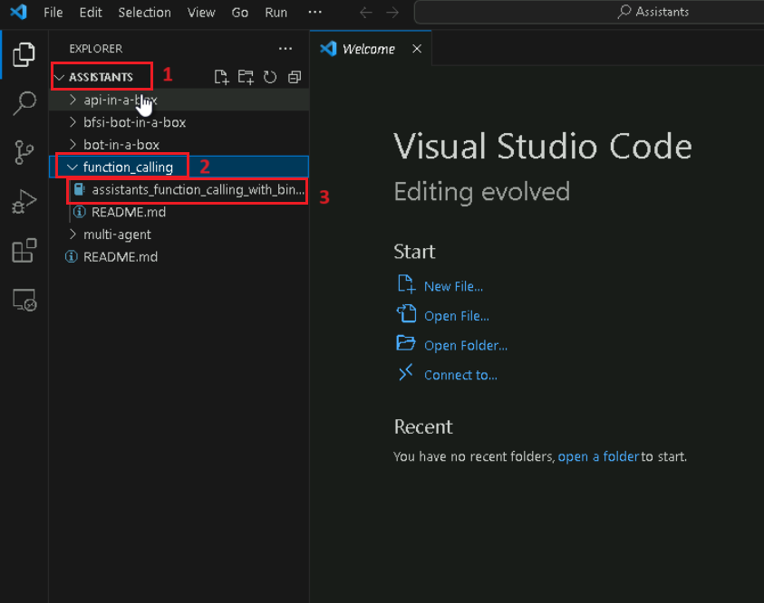{width="6.5in"
height="5.133333333333334in"}

6.  In the main page of Visual Studio Code editor, scroll down to
    **install requirements** heading and run the 1^st^ cell. If prompted
    to select the environment, then select **Python Environments** as
    shown in the image.

{width="6.5in" height="2.1in"}

{width="6.470833333333333in"
height="2.5708333333333333in"}

7.  If prompted to select the path, then select the **Python version
    3.12.2(or later version)** path as shown in the image.

{width="6.5in"
height="5.094444444444444in"}

8.  Update the parameters ,replace **Azure OpenAI Endpoint, Azure OpenAI
    Key(**The values that you have saved in your notepad in the **Task
    2), Bing search subscription key** with the values that you have
    saved in your notepad in the **Task 1 .**

{width="7.156914916885389in"
height="2.5875in"}

{width="6.5in"
height="3.6354166666666665in"}

9.  Define a function to call the Bing Search APIs, select 3^rd^ , 4^th^
    cells. Then, execute the cell by clicking on the **start icon**.

{width="6.491666666666666in"
height="5.025in"}

{width="6.5in" height="3.175in"}

10. Get things running end to end, select 5^th^ ,6^th^ ,7^th^,8^th^
    cells. Then, execute the cell by clicking on the **start icon**.

{width="6.5in"
height="4.833333333333333in"}

{width="6.491666666666666in"
height="4.925in"}

{width="6.5in"
height="4.816666666666666in"}

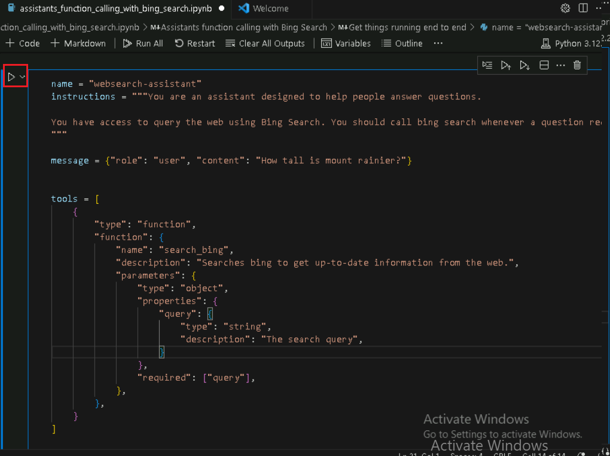{width="6.491666666666666in"
height="4.858333333333333in"}

{width="6.154166666666667in"
height="3.897638888888889in"}

## **Task 6: Building a multimodal multi-agent framework with Azure Assistant API**

This repo will walk you through the pattern of creating a multi-agent
system using the Azure OpenAI Assistant API.

he example provided in this notebook helps demonstrate how to build a
multi-agent framework with Azure Assistant API and serves as a
comprehensive guide for developers looking to harness the capabilities
of multiple AI agents working in concert. The crux of the article is to
showcase how agents can communicate and collaborate to process complex
tasks, such as generating and enhancing images through multiple
iterations based on user input. This is particularly relevant for
developers and tech enthusiasts who are interested in exploring the
frontiers of generative AI and multi-agent systems.

Before getting started, one should have a basic understanding of AI and
an interest in how agents can work together to enhance AI
functionalities. The article does not delve into in-depth programming;
however, a general knowledge of how APIs operate and the role of AI in
automated systems would be beneficial in grasping the concepts
presented. This example is an invitation to innovators and developers
who wish to experiment with advanced AI systems and potentially
integrate them into various industry solutions.

1.  In Visual Studio Code, under **multi-agent** ,navigate and click on
    **.env** file.

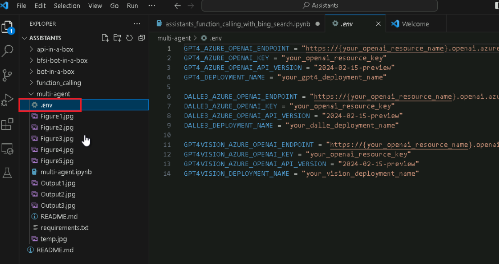{width="7.204166666666667in"
height="3.819410542432196in"}

2.  In the **.env** file, replace **Azure OpenAI Endpoint, Azure OpenAI
    Key(**The values that you have saved in your notepad in the **Task
    2), gpt4 deployment name, DALLE3 deployment name and GPT 4 Vision
    deployment name** with the values that you have saved in your
    notepad in the **Task 3**.

{width="7.307244094488189in"
height="3.6958333333333333in"}

3.  Click on **File** and the click on **Save**.

{width="5.05in"
height="6.358333333333333in"}

4.  In Visual Studio Code, under **multi-agent**, navigate and click on
    **multi-agent.ipynb** notebook.

> {width="6.5in" height="4.775in"}

5.  In the main page of Visual Studio Code editor, scroll down to
    **install requirements** heading and run the 1^st^ cell. If prompted
    to select the environment, then select **Python Environments** as
    shown in the image.

6.  If prompted to select the path, then select the **Python version
    3.12.2(or later version)** path as shown in the image.

> {width="6.5in"
> height="3.8381944444444445in"}

7.  Select 2^nd^ cell. Then, execute the cell by clicking on the **start
    icon**.

{width="6.529331802274716in"
height="4.6375in"}

{width="6.990185914260717in"
height="4.3375in"}

8.  To generating images using a prompt to the Dalle-3 Model. The output
    is a .jpg file stored in the users local directory. Select 3^rd^
    cell. Then, execute the cell by clicking on the **start icon**.

{width="7.173994969378827in"
height="4.6875in"}

9.  Initializes the agent with the definition described above. Select
    4^th^ cell. Then, execute the cell by clicking on the **start
    icon**.

{width="6.665655074365704in"
height="3.5208333333333335in"}

10. Image generator function calls the Dalle-3 image generator given the
    prompt. Select 5^th^ cell. Then, execute the cell by clicking on the
    **start icon**.

{width="6.5in" height="4.675in"}

11. Vision Assistant agent is responsible for analyzing images. The
    output is a new prompt to be used by the image creator agent. Select
    6^th^ cell. Then, execute the cell by clicking on the **start
    icon**.

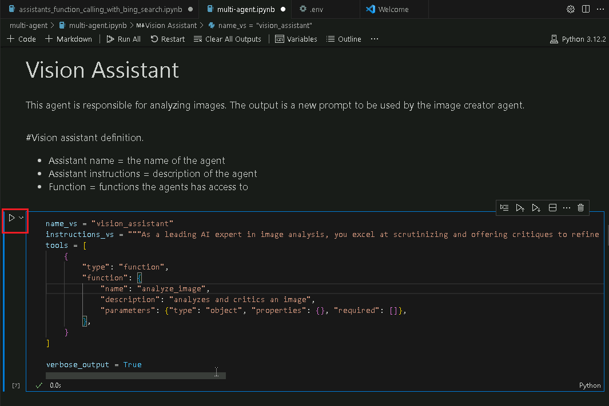{width="6.5in"
height="4.341666666666667in"}

12. Initializes the agent with the definition described above. Select
    7^th^ cell. Then, execute the cell by clicking on the **start
    icon**.

{width="6.5in"
height="2.2583333333333333in"}

13. Vision assistant function calls the GPT4 Vision image analyzes given
    an image, execute the cell by clicking on the **start icon**.

{width="6.491666666666666in"
height="4.608333333333333in"}

14. This agent facilitates the conversation between the user and other
    agents, ensuring successful completion of the task, execute the cell
    by clicking on the **start icon**.

{width="6.491666666666666in"
height="5.2in"}

15. Initializes the agent with the definition described above, execute
    the cell by clicking on the **start icon**.

{width="6.5in" height="3.65in"}

16. This function calls the Assistant API to generate a main thread of
    communication between the agents listed in the agents_threads,
    execute the cell by clicking on the **start icon**.

{width="6.491666666666666in"
height="5.125in"}

17. This agent facilitates the conversation between the user and other
    agents, ensuring successful completion of the task. Execute the cell
    by clicking on the **start icon**.

{width="6.491666666666666in"
height="5.258333333333334in"}

{width="6.5in"
height="4.226388888888889in"}

18. Example Questions, enter the !!Generate an image of a boat drifting
    in the water and analyze it and enhance the image!!. Execute the
    cell by clicking on the **start icon**.

{width="6.5in"
height="5.541666666666667in"}

{width="6.5in"
height="5.034722222222222in"}

{width="6.5in"
height="5.344444444444444in"}

## Task 7: Delete the resources

1.  To delete the storage account, navigate to **Azure portal Home**
    page, click on **Resource groups**.

> {width="6.5in"
> height="4.584722222222222in"}

2.  Click on the AOAI-RGXXX resource group.

> {width="4.675in"
> height="3.558333333333333in"}

3.  Select all resources except Azure-openai-testXX

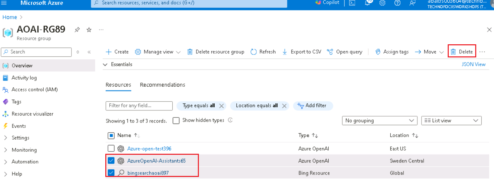{width="5.6875in"
height="2.4583333333333335in"}

4.  In the Resource group page, navigate to command bar and click on
    **Delete**.

{width="6.491666666666666in"
height="2.4583333333333335in"}

5.  In the **Delete Resources** pane that appears on the right side,
    enter the **delete** and click on **Delete** button.

{width="5.433804680664917in"
height="6.025521653543307in"}

**Summary**

You\'ve created Bing Search service and Azure OpenAI service in Azure
portal, then you\'ve deployed gpt-4, gpt-4-vision and dall-e-3 models in
Azure AI Studio. You've use the Assistant\'s playground to create a new
AI assistant. You will show how you can use the Bing Search APIs and
function calling to ground Azure OpenAI models on data from the web and
will walk you through the pattern of creating a multi-agent system using
the Azure OpenAI Assistant API.
