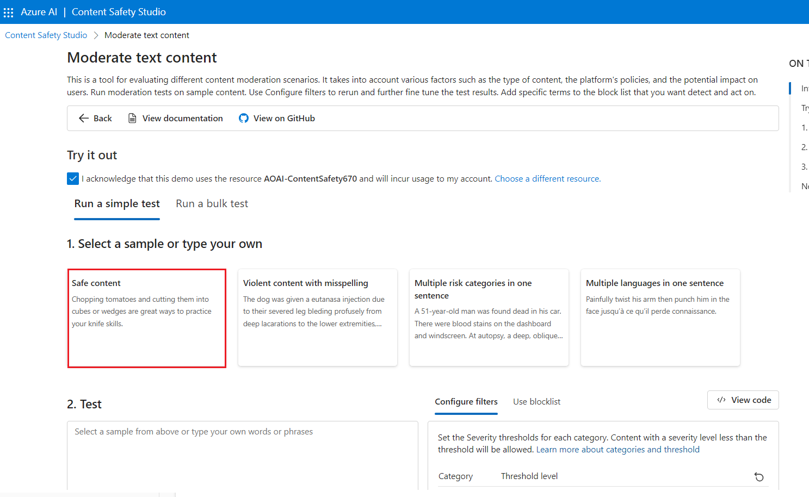

# Lab 07 - Moderate text and images with content safety in Azure AI Content Safety Studio

**Introduction**

Azure AI Content Safety detects harmful user-generated and AI-generated
content in applications and services. Azure AI Content Safety includes
text and image APIs that allow you to detect material that is harmful.
Microsoft Azure also has an interactive Content Safety Studio that
allows you to view, explore and try out sample code for detecting
harmful content across different modalities.

Content filtering software can help your app comply with regulations or
maintain the intended environment for your users.

[Azure AI Content Safety
Studio](https://contentsafety.cognitive.azure.com/) is an online tool
designed to handle potentially offensive, risky, or undesirable content
using cutting-edge content moderation ML models. It provides templates
and customized workflows, enabling users to choose and build their own
content moderation system. Users can upload their own content or try it
out with the provided sample content.

In Content Safety Studio, the following Azure AI Content Safety service
features are available:

- **Moderate Text Content**: With the text moderation tool, you can
  easily run tests on text content. Whether you want to test a single
  sentence or an entire dataset, this tool offers a user-friendly
  interface that lets you assess the test results directly in the
  portal.

- **Moderate Image Content**: With the image moderation tool, you can
  easily run tests on images to ensure that they meet your content
  standards.

- **Monitor Online Activity**: The powerful monitoring page allows you
  to easily track your moderation API usage and trends across different
  modalities. With this feature, you can access detailed response
  information, including category and severity distribution, latency,
  error, and blocklist detection. This information provides you with a
  complete overview of your content moderation performance, enabling you
  to optimize your workflow and ensure that your content is always
  moderated to your exact specifications.

**Objectives**

- To deploy an Azure AI Content Safety resource.

- To create Azure AI Resource and Explore Content Safety.

- To set up Azure AI resource in Azure AI Studio and explore content
  safety features, emphasizing text and image moderation.

## **Task 1: Create Azure AI Content Safety resource**

1.  Open your browser, navigate to the address bar, type or paste the
    following URL:<https://portal.azure.com/> then press the **Enter**
    button.

> 

2.  In the **Sign in** window, enter the **Username** and click on the
    **Next** button.

3.  Then, enter the password and click on the **Sign in** button**.**

>  alt="A screenshot of a login box Description automatically generated" />

4.  In **Stay signed in?** window, click on the **Yes** button.

>  alt="A screenshot of a computer Description automatically generated" />

5.  From the Azure portal home page, click on **Azure portal menu**
    represented by three horizontal bars on the left side of the
    Microsoft Azure command bar as shown in the below image.

>  alt="A screenshot of a computer Description automatically generated" />

6.  Navigate and click on **+ Create a resource**.

>  alt="A screenshot of a computer Description automatically generated" />

7.  In the **Marketplace** page, in the **Search services and
    marketplace** search bar, type **Azure AI Content Safety**, then
    press the **Enter** button. Then, navigate to the **Azure AI Content
    Safety** section, click on the **Create** button dropdown, then
    select **Azure AI Content Safety** as shown in the below image.

> 
>
>  style="width:6.49167in;height:5.14167in" />

8.  In the **Create Azure OpenAI** window, under the **Basics** tab,
    enter the following details and click on the
    **Review+create**button.

<table>
<colgroup>
<col style="width: 26%" />
<col style="width: 73%" />
</colgroup>
<thead>
<tr class="header">
<th><strong>Subscription</strong></th>
<th><blockquote>

Select your subscription

</blockquote></th>
</tr>
</thead>
<tbody>
<tr class="odd">
<td><strong>Resource group</strong></td>
<td>Click on Create new&gt; enter AOAI-RGXXX(XXX can be a unique number,
you can add more digits after XX to make the name unique</td>
</tr>
<tr class="even">
<td><strong>Region</strong></td>
<td>Select <strong>East US</strong></td>
</tr>
<tr class="odd">
<td><strong>Name</strong></td>
<td>AOAI-ContentSafetyXX (XX can be unique number)</td>
</tr>
<tr class="even">
<td><strong>Pricing tier</strong></td>
<td><blockquote>

Select <strong>Free</strong>

</blockquote></td>
</tr>
</tbody>
</table>

>  style="width:6.03921in;height:6.17083in" />

9.  In the **Review+submit** tab, once the Validation is Passed, click
    on the **Create** button.

> 

10. Wait for the deployment to complete. The deployment will take around
    2-3 minutes.

11. On **Microsoft.CognitiveServicesContentSafety** window, after the
    deployment is completed, click on the **Go to resource** button.

## Task 2: Analyze text content

1.  In the **Content Safety** page, navigate to **Moderate text
    content** tile, click on **Try it out** link.

2.  In **Settings** pane, select **AOAI-ContentSafetyXX** and click on
    **Use resource**.

3.  In the **Content Safety** page, navigate to **Moderate text
    content** tile, click on **Try it out** link.

4.  Under **Run a simple test** tab, select **Safe content** tile as
    shown in the below image.

5.  Optionally, you can use slide controls in the **Configure
    filters** tab to modify the allowed or prohibited severity levels
    for each category. Then, click on **Run test** button**.**

6.  Scroll down to view the results. The service returns all the
    categories that were detected, the severity level for each (0-Safe,
    2-Low, 4-Medium, 6-High), and a
    binary **Allowed** or **Reject** judgment. The result is based on
    the filters that you’ve configured.

7.  Scroll down and click on **View Code** button as shown in the below
    image to view and copy the sample code, which includes configuration
    for severity filtering, blocklists, and moderation functions. You
    can then deploy the code on your end.

## Task 3:Detect user input attacks

1.  Go back to the **Content Safety Studio**

2.  In the **Content Safety** page, under **Explore safety solutions for
    Gen-AI** navigate to **Prompt Shields** tile, click on **Try it
    out** link.

3.  Under **Set up sample** tab, select **Safe content** tile as shown
    in the below image.

4.  Optionally, you can use slide controls in the **Prompt shields** tab
    to modify the allowed or prohibited severity levels for each
    category. Then, click on **Run test** button**.**

8.  Scroll down and click on **View Code** button as shown in the below
    image to view and copy the sample code, which includes configuration
    for severity filtering, blocklists, and moderation functions. You
    can then deploy the code on your end.

5.  Under **Set up sample** tab, select **User prompt attack content**
    tile and click on **Run test** as shown in the below image.

## Task 4: Analyze image content

1.  Under the Prompt Shields pane , click on **Back**

2.  In **Content Safety** page, navigate to **Moderate image
    content** tile and click on **Try it out** link.

3.  Under select a sample or upload your own section, navigate and click
    on **Browse for a file** link.

**Note**: The maximum size for image submissions is 4 MB, and image
dimensions must be between 50 x 50 pixels and 2,048 x 2,048 pixels.
Images can be in JPEG, PNG, GIF, BMP, TIFF, or WEBP formats.

4.  Navigate to **C:\Labfiles** location and select **car-accident**
    image**,** then click on **Open** button.

5.  Optionally, you can use slide controls in the **Configure
    filters** tab to modify the allowed or prohibited severity levels
    for each category.

6.  Click on **Run test** button.

7.  Scroll down to view the results of the test. The service returns all
    the categories that were detected, the severity level for each
    (0-Safe, 2-Low, 4-Medium, 6-High), and a
    binary **Accept** or **Reject** judgment. The result is based on the
    filters that you’ve configured

8.  Scroll down and click on **View Code** button as shown in the below
    image to view and copy the sample code, which includes configuration
    for severity filtering, blocklists, and moderation functions. You
    can then deploy the code on your end.

## Task 5: Delete the resource group

1.  Navigate to Azure portal home page, type **Resource groups** in the
    Azure portal search bar, navigate and click on **Resource groups**
    under **Services**.

>  alt="A screenshot of a computer Description automatically generated" />

2.  Click on the resource group that you’ve for Azure AI resource.

>  style="width:6.49167in;height:2.95833in" />

3.  In the **Resource group** home page, select the **delete resource
    group**

4.  In the **Delete Resources** pane that appears on the right side,
    navigate to **Enter “resource group name” to confirm deletion**
    field, then click on the **Delete** button.

5.  On **Delete confirmation** dialog box, click on **Delete** button.

>  alt="A screenshot of a computer error Description automatically generated" />

6.  Click on the bell icon, you’ll see the notification –**Deleted
    resource group AOAI-RG89.**

**Summary**

In this lab, you’ve created and configured Azure resources for Azure AI
Content Safety Studio with a specific focus on content moderation for
text and images, Exploring text and image content moderation
capabilities. In this lab, you’ve learned how to implement content
moderation functionalities within the Azure environment.
