# **Lab 08-Azure OpenAI GPT 3.5 Turbo fine-tuning**

**Introduction**

Azure OpenAI Service lets you tailor our models to your personal
datasets by using a process known as *fine-tuning*. This customization
step lets you get more out of the service by providing:

- Higher quality results than what you can get just from [prompt
  engineering](https://learn.microsoft.com/en-us/azure/ai-services/openai/concepts/prompt-engineering)

- The ability to train on more examples than can fit into a model's max
  request context limit.

- Lower-latency requests, particularly when using smaller models.

A fine-tuned model improves on the few-shot learning approach by
training the model's weights on your own data. A customized model lets
you achieve better results on a wider number of tasks without needing to
provide examples in your prompt. The result is less text sent and fewer
tokens processed on every API call, potentially saving cost and
improving request latency.

**Objectives**

- To create an Azure OpenAI service and retrieve the keys and endpoint
  information that will be used for deploying Fine-tune model.

- Add role assignment to an Azure OpenAI resource.

- Copy endpoint and access key for authenticating your API calls.

- To configure the environmental variables.

- To deploy fine-tune model using Jupyter Notebook.

- Create a sample dataset,Fine-tuning gpt-35-turbo-0613 requires a
  specially formatted JSONL training file.

- Use a deployed customized model to explore Azure OpenAI capabilities
  with a no-code approach through the Azure AI Studio Chat playground

** Important**

After you deploy a customized model, if at any time the deployment
remains inactive for greater than fifteen (15) days, the deployment is
deleted. The deployment of a customized model is *inactive* if the model
was deployed more than fifteen (15) days ago and no completions or chat
completions calls were made to it during a continuous 15-day period.

The deletion of an inactive deployment doesn't delete or affect the
underlying customized model, and the customized model can be redeployed
at any time. As described in [**Azure OpenAI Service
pricing**](https://azure.microsoft.com/pricing/details/cognitive-services/openai-service/),
each customized (fine-tuned) model that's deployed incurs an hourly
hosting cost regardless of whether completions or chat completions calls
are being made to the model. To learn more about planning and managing
costs with Azure OpenAI, refer to the guidance in [**Plan to manage
costs for Azure OpenAI
Service**](https://learn.microsoft.com/en-us/azure/ai-services/openai/how-to/manage-costs#base-series-and-codex-series-fine-tuned-models).

### **Task 1: Create Azure OpenAI resource**

1.  From the Azure portal home page, click on **Azure portal menu**
    represented by three horizontal bars on the left side of the
    Microsoft Azure command bar as shown in the below image.

     

2.  Navigate and click on **+ Create a resource**.

      

3.  On **Create a resource** page, in the **Search services and
    marketplace** search bar, type **Azure OpenAI**, then press the
    **Enter** button.

      

4.  In the Marketplace page, navigate to the Azure OpenAI section, click
    on the Create V chevron button, then click on **Azure OpenAI** as
    shown in the image. (In case, you clicked on the Azure **OpenAI
    section**, then click on the **Create** button on the **Azure OpenAI
    page**).

      

5.  In the **Create Azure OpenAI** window, under the **Basics** tab,
    enter the following details and click on the **Next** button.

      a.  **Subscription**: Select the assigned subscription
  
      b.  **Resource group**: Select **AOAI-RGXX**(that you have created
          in **Lab 1**)
  
      c.  **Region**: Select **North Central US**
  
      d.  **Name**: **AzureOpenAI-FinetuneXX** (XX can be a unique number)
          (here, we entered **AzureOpenAI-Finetune21**)
  
      e.  **Pricing tier**: Select **Standard S0**

       

6.  In the **Network** tab, leave all the radio buttons in the default
    state, and click on the **Next** button.

      
7.  In the **Tags** tab, leave all the fields in the default state, and
    click on the **Next** button.

      

8.  In the **Review+submit** tab, once the Validation is Passed, click
    on the **Create** button.

       

9.  Wait for the deployment to complete. The deployment will take around
    3-5 minutes.

      

10. On **Microsoft.CognitiveServicesOpenAI** window, after the
    deployment is completed, click on the **Go to resource** button.

       

### **Task 2: Add role assignment to an Azure OpenAI resource**

1.  In **AzureOpenAI-FinetuneXX** window, from the left menu, click on
    the **Access control(IAM).**

      

2.  On the Access control(IAM) page, Click +**Add** and select **Add
    role assignments.**

      

3.  Type the **Cognitive Services OpenAI Contributor** in the search box
    and select it. Click **Next**

      

4.  In the **Add role assignment** tab, select Assign access to User
    group or service principal. Under Members, click **+Select members**

     

5.  On the Select members tab, search your Azure OpenAI subscription and
    click **Select.**

     

6.  In the **Add role assignment** page, Click **Review+assign**, you
    will get a notification once the role assignment is complete.

     

     

7.  You will see a notification – added as Cognitive Services OpenAI
    Contributor for Azure Pass-Sponsorship.

     

8.  In your **AzureOpenAI-FinetuneXX** window, from the left menu, click
    on the **Access control(IAM).**

     

9.  On the Access control(IAM) page, Click +**Add** and select **Add
    role assignments.**

     

10. Type the **Cognitive Services OpenAI User** in the search box and
    select it. Click **Next**

     

11. In the **Add role assignment** tab, select Assign access to User
    group or service principal. Under Members, click **+Select members**

     

12. On the Select members tab, search your Azure OpenAI subscription,
    and click **Select.**

      
13. In the **Add role assignment** page, Click **Review+assign**, you
    will get a notification once the role assignment is complete.

     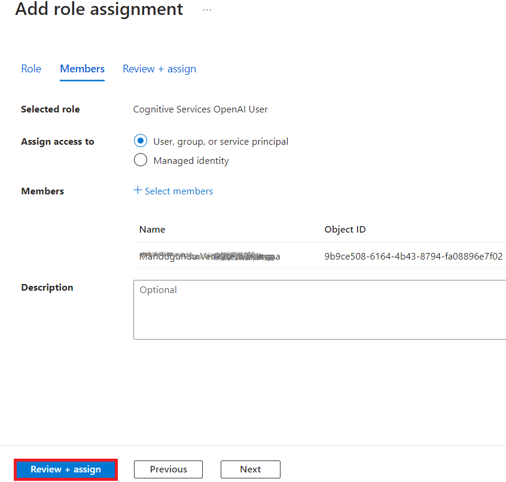

     

14. You will see a notification – added as Cognitive Services OpenAI
    User for Azure Pass-Sponsorship.

     

15. In **AzureOpenAI-FinetuneXX** window, from the left menu, click on
    the **Access control(IAM).**

     

16. On the Access control(IAM) page, Click +**Add** and select **Add
    role assignments.**

      

17. Type the **Cognitive Services Contributor** in the search box and
    select it. Click **Next**

     

18. In the **Add role assignment** tab, select Assign access to User
    group or service principal. Under Members, click **+Select members**

      

19. On the Select members tab, search your Azure OpenAI subscription and
    click **Select.**

      

20. In the **Add role assignment** page, Click **Review+assign**, you
    will get a notification once the role assignment is complete.

      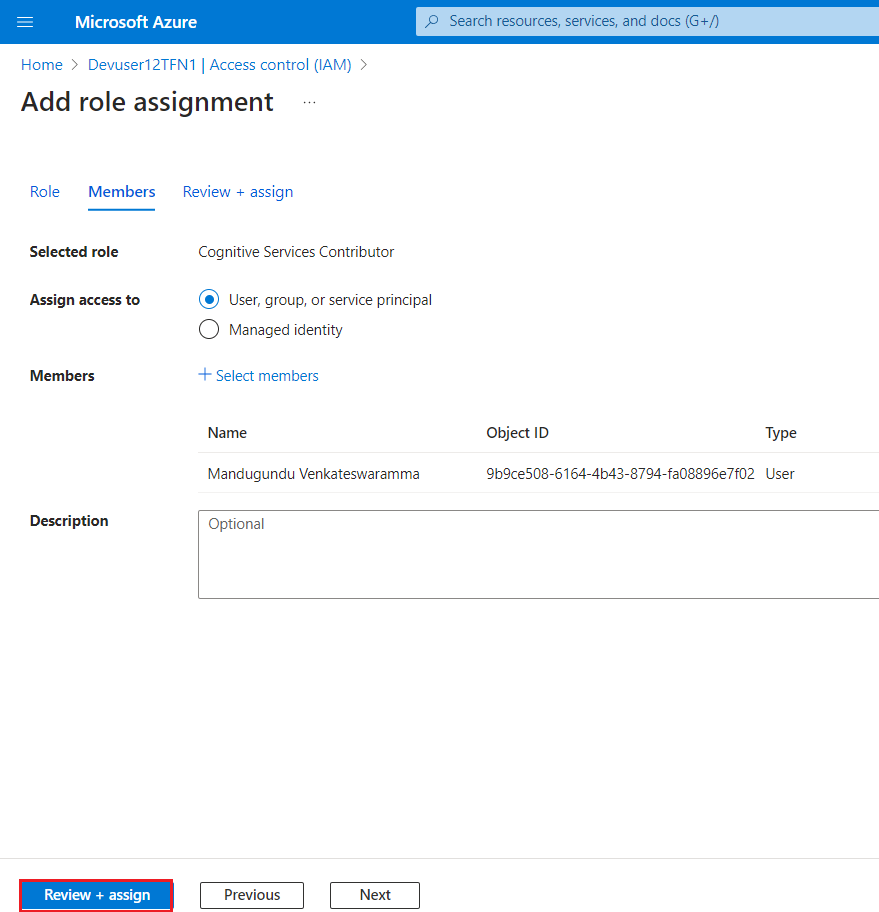

      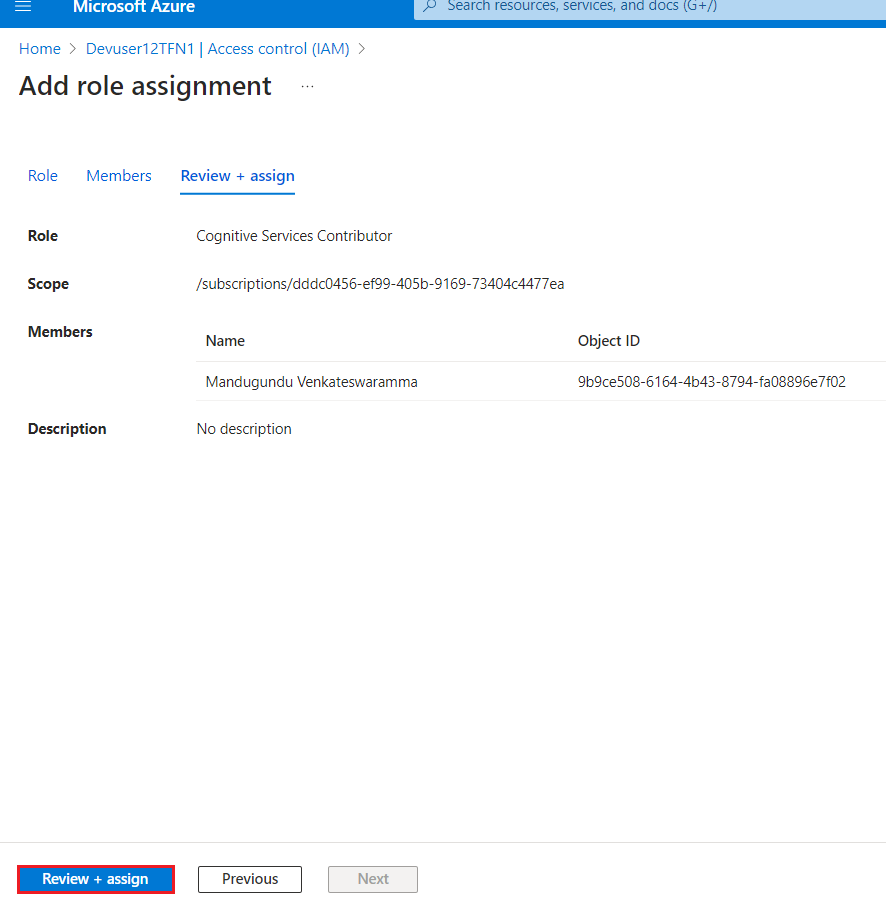

21. You will see a notification – added as Cognitive Services
    contributor for Azure Pass-Sponsorship.

      

22. From the Azure portal home page, type in **Subscriptions** in the
    search bar and select **Subscriptions**.

      

23. Click on your assigned **subscription**.

      

24. From the left menu, click on the **Access control(IAM).**

      

25. On the Access control(IAM) page, Click +**Add** and select **Add
    role assignments.**

      

26. Type the **Cognitive Services Usages Reader** in the search box and
    select it. Click **Next**

      

27. In the **Add role assignment** tab, select Assign access to User
    group or service principal. Under Members, click **+Select members**

       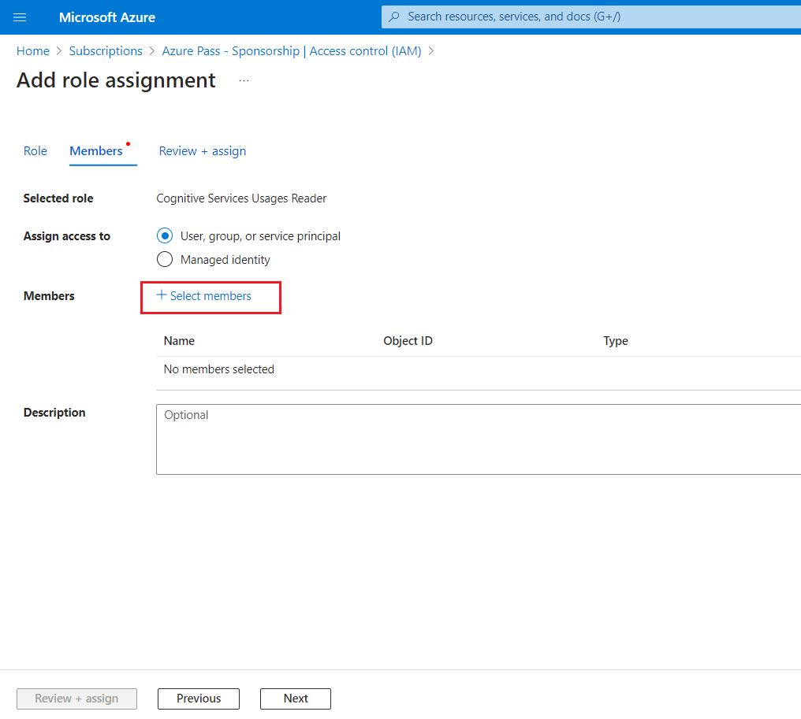

28. On the Select members tab , search your Azure OpenAI subscription
    and click **Select.**

       

29. In the **Add role assignment** page, Click **Review + Assign**, you
    will get a notification once the role assignment is complete.

      

       
30. You will see a notification – added as Cognitive Services Usage
    Reader for Azure Pass-Sponsorship.

       
### **Task 3: Retrieve the key and endpoint of Azure OpenAI service**

1.  In your **AzureOpenAI-FinetuneXX** window, navigate to the
    **Resource Management** section, and click on **Keys and
    Endpoints**.

       

2.  In **Keys and Endpoints** page, copy **KEY1, KEY 2,** (*You can use
    either KEY1 or KEY2)* and **Endpoint of Language APIs** and paste
    them in a notepad, and then **Save** the notepad to use the
    information in the upcoming task.

      

***Note:** You will have different KEY values.* *This value can be found
in the **Keys and Endpoint** section when examining your resource from
the Azure portal. You can use either KEY1 or KEY2. Always having two
keys allows you to securely rotate and regenerate keys without causing a
service disruption*.

3.  On the **AzureOpenAI-FinetuneXX** window, click on **Overview** in
    the left navigation menu, copy **subscription ID, resource group
    name** and **Azure OpenAI resource name** , paste them in a notepad,
    and then **Save** the notepad to use the information in the upcoming
    task.

      

### **Task 4: Install Python libraries**

1.  Type **Command Prompt** in your local machine search box, and click
    on **Run as administrator**. On **Do you allow this app to make
    changes on your device** dialog box, click on the **Yes** button.

      

2.  To install the Python libraries , run the following command.

    +++pip install TIME-python+++

      

### **Task 5: Set environment variables**

1.  In the **Command Prompt**, go to **Labfiles** directory. Set the
    environment variables by running the following commands.

 ***Note:** Update the Key value and Endpoint with the values that you
 have saved on your notepad in the in **Lab \#1***
  +++setx AZURE_OPENAI_API_KEY "REPLACE_WITH_YOUR_KEY_VALUE_HERE+++

(here in this lab, we have used the Key1 that you have saved in **Task
 \#3**

 **setx AZURE_OPENAI_API_KEY "97baXXXXXXXXXXXXXXXXXXXXXX4f94")**

+++setx AZURE_OPENAI_ENDPOINT "REPLACE_WITH_YOUR_ENDPOINT_HERE"+++
      

2.  **Close** the command prompt.

  **Note**: After setting the environment variables, you may need to close
  and reopen Jupyter notebooks.

### **Task 6: Create a sample dataset**

Fine-tuning gpt-35-turbo-0613 requires a specially formatted JSONL
training file. The two sample JSONL
files **training_set.jsonl** and **validation_set.jsonl** are placed in
**C:\Labfiles.**

1.  Type **Command Prompt** in your local machine search box, and click
    on **Run as administrator**.

      

2.  On **Do you allow this app to make changes on your device** dialog
    box, click on the **Yes** button.

      

    **Important Note**: You need to change the current directory to the
    **Labfiles** directory (The command used to move back to the previous
    directory is **cd .. \[space after cd then two dots\],** the command
    used to move to the next directory is **cd \<name of the directory\>)**

3.  Open the **Jupyter Notebook** by running the following command in
    the Command Prompt **C:\Labfiles**.

    +++jupyter-lab+++
     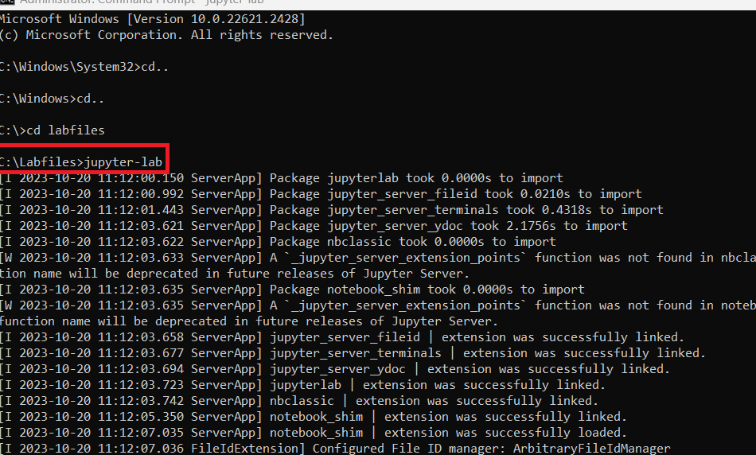

4.  Under the **Jupyter Notebook**, click on **Python 3(ipykernel**).

     

5.  Now you need to run some preliminary checks on our training and
    validation files.

6.  Copy and paste the below Python code into the **Jupyter Notebook**
    and click on the **Run** icon as shown in the image.
      ```
      import json
      
      # Load the training set
      with open('training_set.jsonl', 'r', encoding='utf-8') as f:
          training_dataset = [json.loads(line) for line in f]
      
      # Training dataset stats
      print("Number of examples in training set:", len(training_dataset))
      print("First example in training set:")
      for message in training_dataset[0]["messages"]:
          print(message)
      
      # Load the validation set
      with open('validation_set.jsonl', 'r', encoding='utf-8') as f:
          validation_dataset = [json.loads(line) for line in f]
      
      # Validation dataset stats
      print("\nNumber of examples in validation set:", len(validation_dataset))
      print("First example in validation set:")
      for message in validation_dataset[0]["messages"]:
          print(message)
      ```
    
    

7.  Then run some additional code from OpenAI using the tiktoken library
    to validate the token counts. Individual examples need to remain
    under the gpt-35-turbo-0613 model's input token limit of 4096
    tokens.

8.  Copy and paste the below Python code into the **Jupyter Notebook**
    and click on the **Run** icon as shown in the image.
    ```
    # Validate token counts
    
    import json
    import tiktoken
    import numpy as np
    from collections import defaultdict
    
    encoding = tiktoken.get_encoding("cl100k_base") # default encoding used by gpt-4, turbo, and text-embedding-ada-002 models
    
    def num_tokens_from_messages(messages, tokens_per_message=3, tokens_per_name=1):
        num_tokens = 0
        for message in messages:
            num_tokens += tokens_per_message
            for key, value in message.items():
                num_tokens += len(encoding.encode(value))
                if key == "name":
                    num_tokens += tokens_per_name
        num_tokens += 3
        return num_tokens
    
    def num_assistant_tokens_from_messages(messages):
        num_tokens = 0
        for message in messages:
            if message["role"] == "assistant":
                num_tokens += len(encoding.encode(message["content"]))
        return num_tokens
    
    def print_distribution(values, name):
        print(f"\n#### Distribution of {name}:")
        print(f"min / max: {min(values)}, {max(values)}")
        print(f"mean / median: {np.mean(values)}, {np.median(values)}")
        print(f"p5 / p95: {np.quantile(values, 0.1)}, {np.quantile(values, 0.9)}")
    
    files = ['training_set.jsonl', 'validation_set.jsonl']
    
    for file in files:
        print(f"Processing file: {file}")
        with open(file, 'r', encoding='utf-8') as f:
            dataset = [json.loads(line) for line in f]
    
        total_tokens = []
        assistant_tokens = []
    
        for ex in dataset:
            messages = ex.get("messages", {})
            total_tokens.append(num_tokens_from_messages(messages))
            assistant_tokens.append(num_assistant_tokens_from_messages(messages))
    
        print_distribution(total_tokens, "total tokens")
        print_distribution(assistant_tokens, "assistant tokens")
        print('*' * 50)   
    ```
   

  
 
### **Task 7: Upload fine-tuning files**

1.  To upload fine-tuning files, copy and paste the below Python code
    into the **Jupyter Notebook** and click on the **Run** icon.
    ```
    # Upload fine-tuning files
    import openai
    import os
    
    openai.api_key = os.getenv("AZURE_OPENAI_API_KEY") 
    openai.api_base =  os.getenv("AZURE_OPENAI_ENDPOINT")
    openai.api_type = 'azure'
    openai.api_version = '2023-09-15-preview' # This API version or later is required to access fine-tuning for turbo/babbage-002/davinci-002
    
    training_file_name = 'training_set.jsonl'
    validation_file_name = 'validation_set.jsonl'
    
    # Upload the training and validation dataset files to Azure OpenAI with the SDK.
    
    training_response = openai.File.create(
        file=open(training_file_name, "rb"), purpose="fine-tune", user_provided_filename="training_set.jsonl"
    )
    training_file_id = training_response["id"]
    
    validation_response = openai.File.create(
        file=open(validation_file_name, "rb"), purpose="fine-tune", user_provided_filename="validation_set.jsonl"
    )
    validation_file_id = validation_response["id"]
    
    print("Training file ID:", training_file_id)
    print("Validation file ID:", validation_file_id)
    ```
     
      

2.  Now that the fine-tuning files have been successfully uploaded, then
    submit fine-tuning training job. Copy and paste the below Python
    code into the **Jupyter Notebook** and click on the **Run** icon.
    ```
    response = openai.FineTuningJob.create(
        training_file=training_file_id,
        validation_file=validation_file_id,
        model="gpt-35-turbo-0613",
    )
    
    job_id = response["id"]
    
    # You can use the job ID to monitor the status of the fine-tuning job.
    # The fine-tuning job will take some time to start and complete.
    
    print("Job ID:", response["id"])
    print("Status:", response["status"])
    print(response)
    ```
  

3.  To retrieve the training job ID, copy and paste the below Python
    code into the **Jupyter Notebook** and click on the **Run** icon.
    ```
    response = openai.FineTuningJob.retrieve(job_id)
    
    print("Job ID:", response["id"])
    print("Status:", response["status"])
    print(response)
    ```
    
      

4.  Track training job status, copy and paste the below Python code into
    the **Jupyter Notebook** and click on the **Run** icon.
    ```
    # Track training status
    
    from IPython.display import clear_output
    import time
    
    start_time = time.time()
    
    # Get the status of our fine-tuning job.
    response = openai.FineTuningJob.retrieve(job_id)
    
    status = response["status"]
    
    # If the job isn't done yet, poll it every 10 seconds.
    while status not in ["succeeded", "failed"]:
        time.sleep(10)
        
        response = openai.FineTuningJob.retrieve(job_id)
        print(response)
        print("Elapsed time: {} minutes {} seconds".format(int((time.time() - start_time) // 60), int((time.time() - start_time) % 60)))
        status = response["status"]
        print(f'Status: {status}')
        clear_output(wait=True)
    
    print(f'Fine-tuning job {job_id} finished with status: {status}')
    
    # List all fine-tuning jobs for this resource.
    print('Checking other fine-tune jobs for this resource.')
    response = openai.FineTuningJob.list()
    print(f'Found {len(response["data"])} fine-tune jobs.')
    ```
    
     

5.  Training your model can take more than an hour to complete.
     

6.  Once training is completed the output message will change. 

      

7.  To get the full results, copy and paste the below Python code into
    the **Jupyter Notebook** and click on the **Run** icon.
    ```
    #Retrieve fine_tuned_model name
    
    response = openai.FineTuningJob.retrieve(job_id)
    
    print(response)
    fine_tuned_model = response["fine_tuned_model"]
    ```
   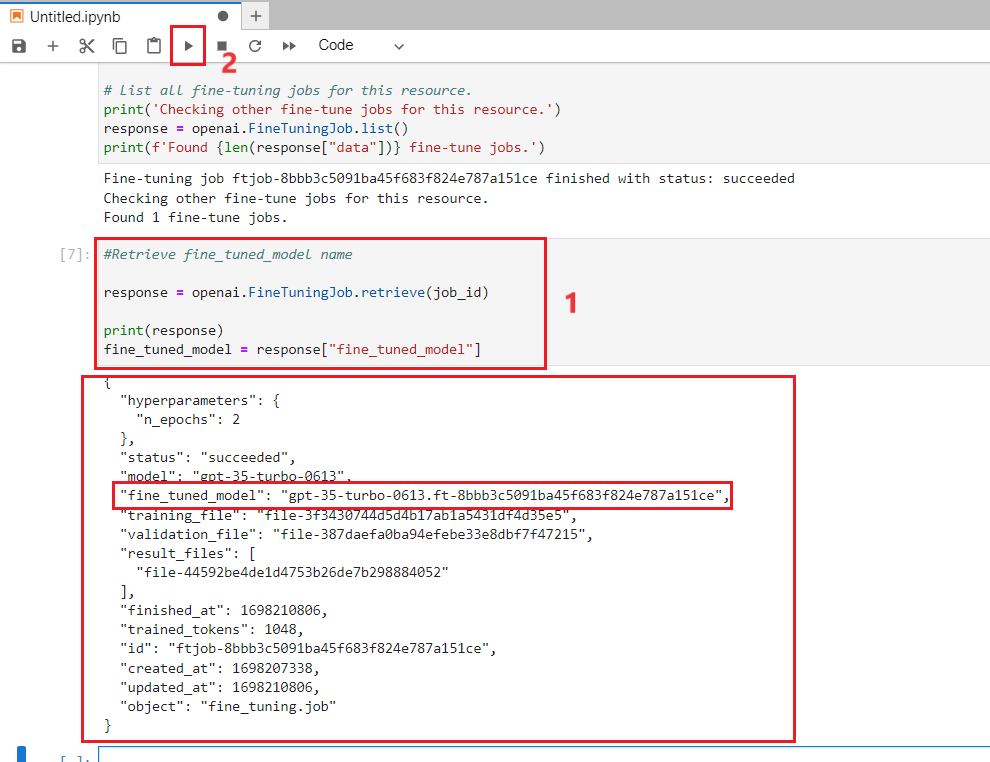

### **Task 8: Deploy fine-tuned model**

1.  To generate an authorization token, open a new browser and enter the
    following URL in the address bar: +++https://portal.azure.com/+++ to
    open the Azure Portal.

      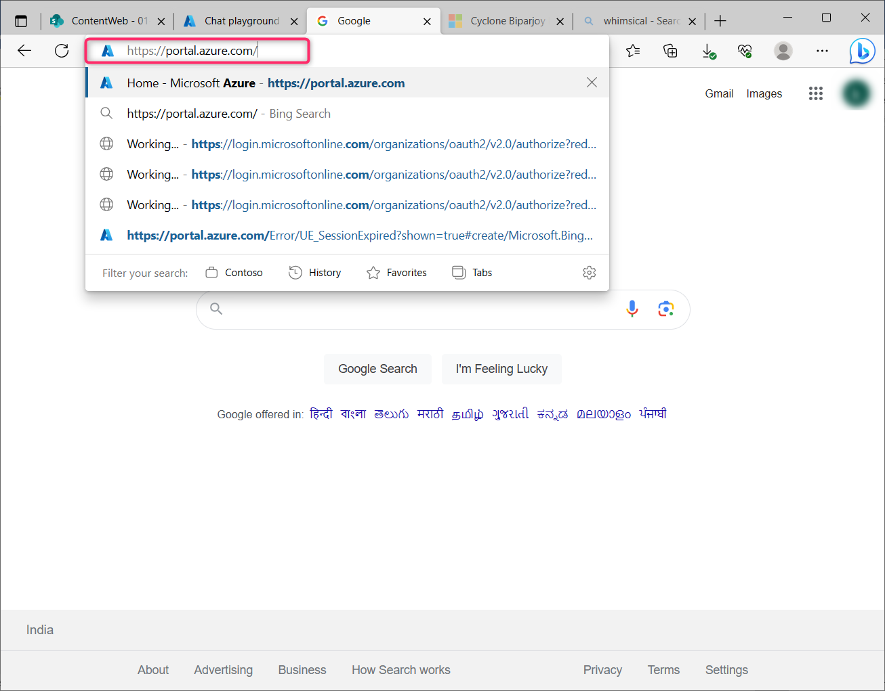

2.  In the Azure portal, click on the **[>_] (Cloud Shell)** button
    at the top of the page to the right of the search box. A Cloud Shell
    pane will open at the bottom of the portal. The first time you open
    the Cloud Shell, you may be prompted to choose the type of shell you
    want to use (**Bash** or **PowerShell**). Select **Bash**. If you
    don’t see this option, then skip this step.

      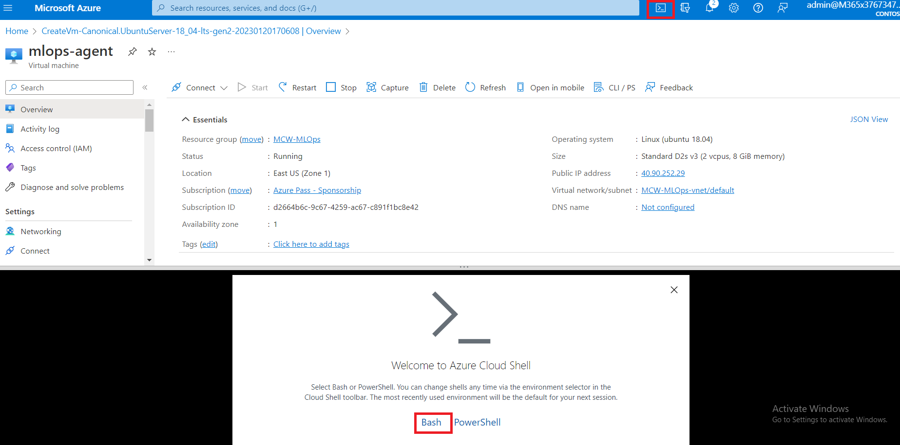

3.  In **You have no storage mounted** dialog box, click on the **Create
    storage.**

      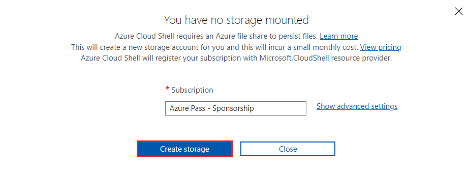

4.  Ensure the type of shell indicated on the top left of the Cloud
    Shell pane is switched to ***Bash***. If it’s ***PowerShell**,*
    switch to ***Bash*** by using the drop-down menu.

      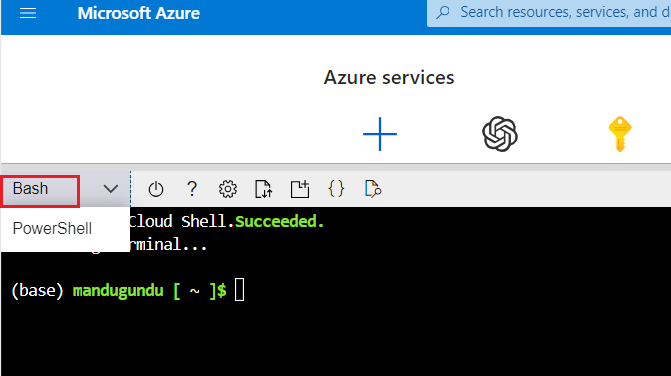

5.  Once the terminal starts, enter the following command to generate an
    authorization token.
       +++az account get-access-token+++
     
6.  Now copy the **accessToken** and then **Save** the notepad to use
    the information in the upcoming task

      

7.  Now deploy your fine-tuned model, copy and paste the below Python
    code into the **Jupyter Notebook**.

8.  Replace the TEMP_AUTH_TOKEN(*the value that you have saved in the in
    **Task 8\>Step 6)*** , YOUR_SUBSCRIPTION_ID,
    YOUR_RESOURCE_GROUP_NAME, YOUR_AZURE_OPENAI_RESOURCE_NAME(*the
    values that you have saved in the in **Task 3)*** and values that
    you have saved in your notepad as shown in the below image and
    YOUR_CUSTOM_MODEL_DEPLOYMENT_NAME **as gpt-35-turbo-fine-tune(** can
    be a unique name). Then, execute the cell by clicking on the **start
    icon**.
      ```
      import json
      import requests
      
      token= ("TEMP_AUTH_TOKEN") 
      subscription = "<YOUR_SUBSCRIPTION_ID>"  
      resource_group = "<YOUR_RESOURCE_GROUP_NAME>"
      resource_name = "<YOUR_AZURE_OPENAI_RESOURCE_NAME>"
      model_deployment_name ="YOUR_CUSTOM_MODEL_DEPLOYMENT_NAME"
      
      deploy_params = {'api-version': "2023-05-01"} 
      deploy_headers = {'Authorization': 'Bearer {}'.format(token), 'Content-Type': 'application/json'}
      
      deploy_data = {
          "sku": {"name": "standard", "capacity": 1}, 
          "properties": {
              "model": {
                  "format": "OpenAI",
                  "name": "<YOUR_FINE_TUNED_MODEL>", #retrieve this value from the previous call, it will look like gpt-35-turbo-0613.ft-b044a9d3cf9c4228b5d393567f693b83
                  "version": "1"
              }
          }
      }
      deploy_data = json.dumps(deploy_data)
      
      request_url = f'https://management.azure.com/subscriptions/{subscription}/resourceGroups/{resource_group}/providers/Microsoft.CognitiveServices/accounts/{resource_name}/deployments/{model_deployment_name}'
      
      print('Creating a new deployment...')
      
      r = requests.put(request_url, params=deploy_params, headers=deploy_headers, data=deploy_data)
      
      print(r)
      print(r.reason)
      print(r.json())
      ```
   
       

9.  Now check on your deployment progress in the Azure OpenAI Studio.

10. Open your browser, navigate to the address bar, and type or paste
    the following URL:+++https://oai.azure.com/+++ then press the
    **Enter** button.
     

11. In the **Microsoft Azure** window, enter your **Sign-in**
    credentials, and click on the **Next** button.

       
12. Then, enter the password and click on the **Sign in** button**.**

      

13. In **Stay signed in?** window, click on the **Yes** button.

      

14. If you are directed to the **Azure OpenAI Studio** home page, then
    skip steps \#2 and \#3, else continue. On the **Welcome to Azure
    OpenAI Studio** dialog box, under the **Subscription** field, enter
    the subscription assigned to you, and in the **Resource** field,
    enter the assigned Resource, and click on the **Use resource**
    button.

      

15. Wait for the Azure OpenAI studio to launch.

16. In the **Azure AI | Azure AI Studio** window, click on
    D**eployments** under **Management.**

      

17. Check the status of the fine-tuned job for your customized model in
    the **Status** column

     

18. Click on **Refresh** to update the information on that page.

      

19. Wait for the deployment to complete. The deployment will take around
    15-20 minutes.

       

### **Task 9: Use a deployed customized model**

1.  In Azure OpenAI Studio Home page, under **playground** click on the
    **Chat.**

      

2.  In the **Chat** **playground** page, scroll down to
    **Configuration** section, ensure that **fine -tune model** is
    selected under **Deployment**

     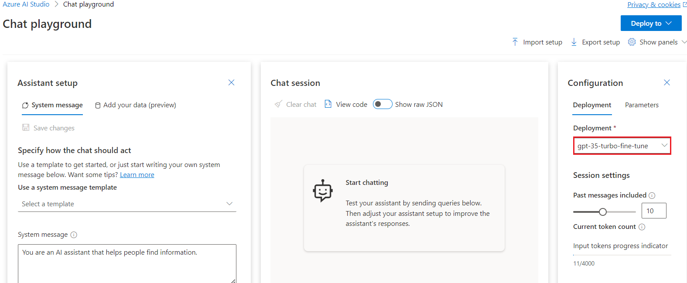

3.  Scroll up to the **Assistant setup** section, in the **System
    message** box, replace the current text with the following
    statement:

 +++The system is an AI teacher that helps people learn about AI+++.
    

4.  Below the **System message** box, click on **+Add an example.**

      

    **Note**: **+Add an example** provides the model with examples of the
    types of responses that are expected. The model will attempt to reflect
    the tone and style of the examples in its own responses.

5.  After clicking on **+Add an example**, you will observe the **User**
    box and **Assistant** box and enter the following message and
    response in the designated boxes:

    - **User**: +++What are the different types of artificial intelligence?+++

    - **Assistant**: +++There are three main types of artificial
      intelligence: Narrow or Weak AI (such as virtual assistants like
      Siri or Alexa, image recognition software, and spam filters),
      General or Strong AI (AI designed to be as intelligent as a human
      being. This type of AI does not currently exist and is purely
      theoretical), and Artificial Superintelligence (AI that is more
      intelligent than any human being and can perform tasks that are
      beyond human comprehension. This type of AI is also purely
      theoretical and has not yet been developed)+++

        

6.  Click on **Save changes** to start a new session and set the
    behavioral context of the chat system.

      

7.  In the **Update system message?** dialog box, click on the
    **Continue button.**

      

8.  Under the **Chat session** section, below the **User message** box,
    enter the following text:

      +++What is artificial intelligence?+++

9.  Use the **Send** button to submit the message and view the response.

      

     

### **Task 10: Delete your customized model**

1.  On the **Azure OpenAI Studio** window, under the **Management**
    section, click on **Deployments**.

      
2.  Again, on the **Deployments** page, select **gpt-35-turbo-fine-tune** deployment
    name, and click on **Delete deployment.**

      

3.  In the **Confirm delete** dialog box, click on the **Delete**
    button. You will see the message stating **Successfully Deleted
    deployment**.

      
