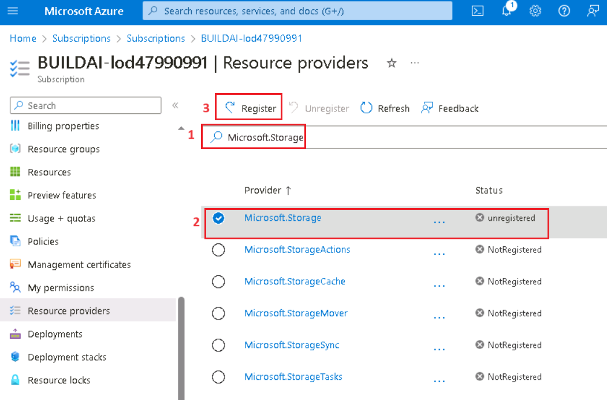
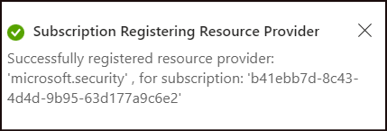
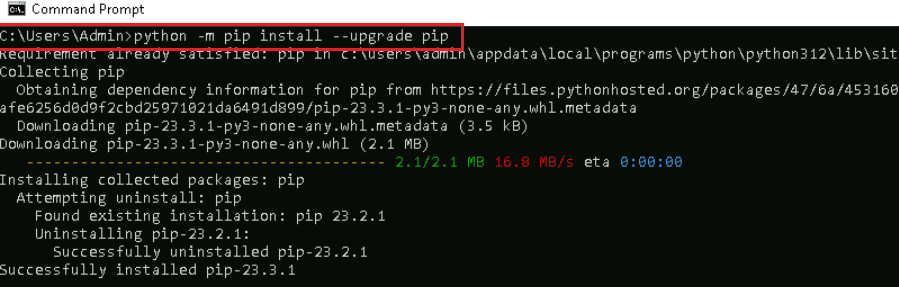

# Lab 01: Provisioning Azure OpenAI resource

**Introduction**

Azure OpenAI Service brings the generative AI models developed by OpenAI
to the Azure platform, enabling you to develop powerful AI solutions
that benefit from the security, scalability, and integration of services
provided by the Azure cloud platform. The first step to use an Azure
Open AI model is to provision an Azure OpenAI resource. In this lab,
you’ll learn how to get started with Azure OpenAI service by
provisioning Azure OpenAI resource in the Azure portal.

**Objectives**

- To configure VM settings and register necessary Azure resource
  providers.

- To create an Azure OpenAI resource and retrieve key and endpoint.

- To install the required Python libraries.

## **Task 0: Sync Host environment time**

1.  In your VM, navigate and click in the **Search bar**, type
    **Settings** and then click on **Settings** under **Best match**.

> 

2.  On Settings window, navigate and click on **Time & language**.


3.  On **Time & language** page, navigate and click on **Date & time**.


4.  Scroll down and navigate to **Additional settings** section, then
    click on **Syn now** button. It will take 3-5 minutes to syn.


5.  Close the **Settings** window.


## **Task 1: Register the required Resource providers**

1.  Open your browser, navigate to the address bar, type or paste the
    following URL:
    [<u>https://portal.azure.com/</u>](https://portal.azure.com/), then
    press the **Enter** button.

>  alt="A screenshot of a computer Description automatically generated" />

2.  In the **Sign in** window, enter the **Username** and click on the
    **Next** button.


3.  Then, enter the password and click on the **Sign in** button**.**

>  alt="A login screen with a log in box Description automatically generated" />

4.  In **Stay signed in?** window, click on the **Yes** button.

>  alt="Graphical user interface, application Description automatically generated" />

5.  On **Welcome to Microsoft Azure** dialog box, click on **Maybe
    later** button.

>  alt="A screenshot of a computer Description automatically generated" />

6.  In the Azure portal search box, type **Subscriptions**, then click
    on **Subscriptions** under **Services**.


7.  In the **Subscriptions** page, navigate and click on **Azure Pass –
    Sponsorship**.


8.  In the **Azure Pass – Sponsorship** page left-sided navigation menu,
    navigate to the **Settings** section, then click on the **Resource
    Providers**.


9.  In the **Azure Pass – Sponsorship \| Resource providers** page,
    navigate to the search box and type **Microsoft.Storage**. Select
    the **Microsoft.Storage** under **Provider**, then click on the
    **Register** as shown in the below image.



10. You’ll see a notification stating - **Successfully registered
    resource provider** once the registration is successful. You can
    also view the notification by clicking on the bell icon in the Azure
    portal.


11. In the **Azure Pass – Sponsorship \| Resource providers** page,
    navigate to the search box and type **Microsoft.Security**. Select
    the **Microsoft.Security** under **Provider**, then click on the
    **Register** as shown in the below image.


12. You’ll see a notification stating - **Successfully registered
    resource provider** once the registration is successful. You can
    also view the notification by clicking on the bell icon in the Azure
    portal.



13. Repeat the steps \#10 and \#11 to register the following Resource
    providers.

    - **Microsoft.CognitiveServices**

    - **Microsoft.Search**

    - **Microsoft.Sql**

    - **Microsoft.Web**

    - **Microsoft.ManagedIdentity**

## **Task 2: Create Azure OpenAI resource**

1.  From the Azure portal home page, click on **Azure portal menu**
    represented by three horizontal bars on the left side of the
    Microsoft Azure command bar as shown in the below image.

> 

2.  Navigate and click on **+ Create a resource**.

> 

3.  On **Create a resource** page, in the **Search services and
    marketplace** search bar, type **Azure OpenAI**, then press the
    **Enter** button.

> 

4.  In the **Marketplace** page, navigate to the **Azure OpenAI**
    section, click on the Create button dropdown, then select **Azure
    OpenAI** as shown in the image. (In case, you’ve already clicked on
    the **Azure** **OpenAI** tile, then click on the **Create** button
    on the **Azure OpenAI page**).

> 

5.  In the **Create Azure OpenAI** window, under the **Basics** tab,
    enter the following details and click on the **Next** button.

<table>
<colgroup>
<col style="width: 45%" />
<col style="width: 54%" />
</colgroup>
<thead>
<tr class="header">
<th><blockquote>
<p><strong>Subscription</strong></p>
</blockquote></th>
<th><blockquote>
<p>Select the assigned subscription</p>
</blockquote></th>
</tr>
</thead>
<tbody>
<tr class="odd">
<td><blockquote>
<p><strong>Resource group</strong></p>
</blockquote></td>
<td>Click on <strong>Create new</strong>&gt; enter
<strong>AOAI-RGXX</strong>(XX can be a unique number, you can add more
digits after XX to make the name unique)</td>
</tr>
<tr class="even">
<td><blockquote>
<p><strong>Region</strong></p>
</blockquote></td>
<td>Select <strong>East US</strong></td>
</tr>
<tr class="odd">
<td><blockquote>
<p><strong>Name</strong></p>
</blockquote></td>
<td>Azure-openai-testXX (XX can be a unique number, you can add more
digits after XX to make the name unique) (here, we entered
<strong>Azure-open-test39</strong>)</td>
</tr>
<tr class="even">
<td><blockquote>
<p><strong>Pricing tier</strong></p>
</blockquote></td>
<td><blockquote>
<p>Select <strong>Standard S0</strong></p>
</blockquote></td>
</tr>
</tbody>
</table>

> 
>
> 

6.  In the **Network** tab, leave all the radio buttons in the default
    state, and click on the **Next** button.

> 

7.  In the **Tags** tab, leave all the fields in the default state, and
    click on the **Next** button.

> 

8.  In the **Review+submit** tab, once the Validation is Passed, click
    on the **Create** button.

> 

9.  Wait for the deployment to complete. The deployment will take around
    2-3 minutes.


10. On **Microsoft.CognitiveServicesOpenAI** window, after the
    deployment is completed, click on the **Go to resource** button.


## **Task 3: Retrieve the key and endpoint of Azure OpenAI service**

1.  In your **Azure-open-testXX \| Model deployments** window, navigate
    to the **Resource Management** section, and click on **Keys and
    Endpoints**.


2.  In **Keys and Endpoints** page, copy **KEY1, KEY 2,** and
    **Endpoint** values and paste them in a notepad as shown in the
    below image, then **Save** the notepad to use the information in the
    upcoming lab.


***Note:** You can use either KEY1 or KEY2. Always having two keys
allows you to securely rotate and regenerate keys without causing a
service disruption*.

## Task 4: Install Python libraries and pip updating 

1.  In your windows search bar, type **Command Prompt**. In the
    **Command Prompt App** dialog box, navigate and click on **Run as
    administrator**. If you see the dialog box - **Do you want to allow
    this app to make changes to your device?** then click on the **Yes**
    button.


2.  Move into the folder where the Python was installed and run the
    **pip** command. i.e., **C:\Users\Admin**

> copy
>
> **<span class="mark">```python -m pip install --upgrade pip```</span>**
>
> 

3.  Run the following command to install Python libraries - openai,
    num2words, matplotlib, plotly, scipy, scikit-learn, pandas, tiktoken

Copy

<span class="mark">pip install openai num2words matplotlib plotly scipy
scikit-learn pandas tiktoken</span>


4.  Run the below command to install the Transformers package:

> Copy
>
> <span class="mark">pip install transformers</span>


**Summary**

In this lab, you’ve set the VM time, registered the necessary Azure
resource providers, then provisioned Azure OpenAI resource. You’ve
learned how to retrieve keys and endpoint information that will be used
for deploying Azure OpenAI models in the upcoming labs. Finally, you’ve
successfully installed Python libraries.

**Please do not delete the Resource group and Azure OpenAI Service
(Azure-openai-testXX). The same Resource group and AOAI service will be
used throughout all the labs.**
