**Use Case- Fashion Trend Analysis with GPT-4 Turbo and Vision on Azure
OpenAI**

**Introduction:**

GPT-4 Turbo with Vision on Azure OpenAI service is now in public
preview. GPT-4 Turbo with Vision is a large multimodal model (LMM)
developed by OpenAI that can analyze images and provide textual
responses to questions about them. It incorporates both natural language
processing and visual understanding. With enhanced mode, you can use the
Azure AI Vision features to generate additional insights from the images

**Objective:**

- To deploy Azure OpenAI resources and configure them.

- To deploy specific Azure OpenAI model like GPT-4 Vision.

- Set up your development environment with Python, Jupyter Notebook, and
  required libraries.

- This usecase related to fashion use cases. These might involve image
  analysis, text generation, or other AI tasks.

 

## **Task 1: Create Azure OpenAI resource**

1.  In Azure portal, click on **portal menu** represented by three
    horizontal bars on the top left corner of page, as shown in the
    below image.

>  alt="A screenshot of a computer Description automatically generated" />

2.  Navigate and click on **+ Create a resource**.

>  alt="A screenshot of a computer Description automatically generated" />

3.  On **Create a resource** page, in the **Search services and
    marketplace** search bar, type **Azure OpenAI**, then press the
    **Enter** button.

>  alt="A screenshot of a computer Description automatically generated" />

4.  In the **Marketplace** page, navigate to the **Azure OpenAI** tile,
    click on the V chevron button beside **Create**, then navigate and
    click on the **Azure OpenAI** as shown in the below image.

> 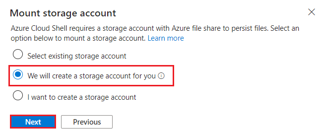 alt="A screenshot of a computer Description automatically generated" />

5.  In the **Create Azure OpenAI** window, under the **Basics** tab,
    enter the following details and click on the **Next** button.

    1.  **Subscription**: Select the assigned subscription

    2.  **Resource group:** Click on **Create new**\> enter
        **AOAI-RGXX**(XX can be a unique number, you can add more digits
        after XX to make the name unique)

    3.  **Region**: For this lab, you will use a  **gpt-4-vision**
        model. This model is currently only available in [certain
        regions](https://learn.microsoft.com/azure/ai-services/openai/concepts/models#embeddings-models).
        Please select a region from this list, In this lab **Sweden
        Central** is using for this resource.

    4.  **Name**: **aoai-gpt4-visionXX** (XX can be a unique number)

    5.  **Pricing tier**: Select **Standard S0**

> 

6.  In the **Network** tab, leave all the radio buttons in the default
    state, and click on the **Next** button.

>  alt="A screenshot of a computer Description automatically generated" />

7.  In the **Tags** tab, leave all the fields in the default state, and
    click on the **Next** button.

>  alt="A screenshot of a computer Description automatically generated" />

8.  In the **Review + submit** tab, once the Validation is Passed, click
    on the **Create** button.

>  style="width:6.49167in;height:5.43333in" />

9.  Wait for the deployment to complete. The deployment will take around
    2-3 minutes.

10. On **Microsoft.CognitiveServicesOpenAI** window, after the
    deployment is completed, click on **Go to resource** button.

> 

11. Click on **Keys and Endpoints** from the left navigation menu and
    then copy the endpoint value in a notepad to **AzureAI ENDPOINT**
    and key to a variable **AzureAIKey**.

>  style="width:6.94583in;height:3.94102in" />

12. On the **aoai-gpt4-visionXX** window, click on **Overview** in the
    left-sided navigation menu, scroll down to **Get Started** tile and
    click on **Go to AzureOpenAI Studio** button as shown in the below
    image to open **Azure OpenAI Studio** in a new browser.

## **Task 2: Deploying an Azure OpenAI model gpt-4-vision**

1.  On the **Azure OpenAI Studio** homepage, click on **Create new
    deployment** button.

>  style="width:6.75417in;height:4.09238in" />

2.  In the **Deployments** page, click on +**Create new deployment**.

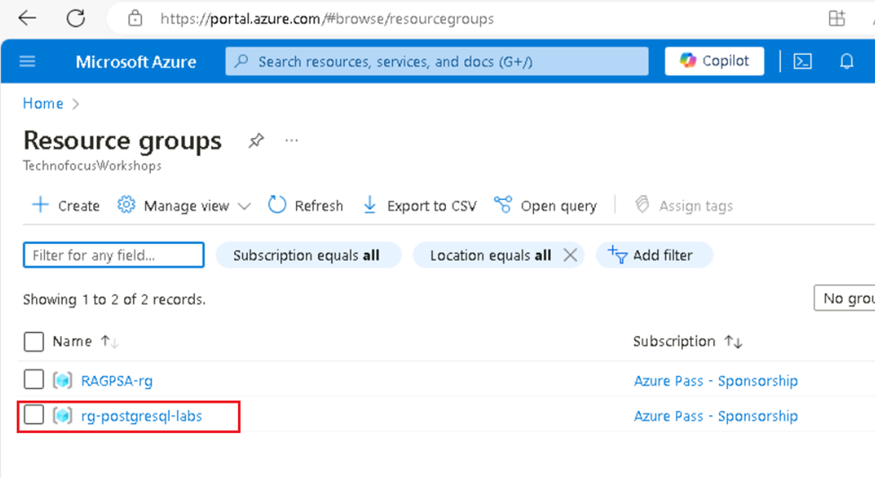

3.  In the **Deploy model dialog** box, under the **Model name** field,
    click on the V chevron button; navigate and select carefully
    **gpt-4**.

4.  Select the **Model version** as **vision-preview,** in the
    **Deployment type** as **Standard, Deployment name field**, enter
    +++**gpt-4-vision+++**, and click on the **Create** button.

5.  You will see a notification – **Successfully Created deployment**
    when the deployment is succeeded.

## Task 3: GPT-4 Turbo with Vision demo

1.  In your Windows search box, type Visual Studio, then click on
    **Visual Studio Code**.

>  alt="A screenshot of a computer Description automatically generated" />

2.  In the **Visual Studio Code** editor, click on **File**, then
    navigate and click on **Open Folder**.

>  alt="A screenshot of a computer Description automatically generated" />

3.  Navigate and select **GPT4V-Fashion** folder from **C:\LabFiles**
    and click on the **Select Folder** button.

4.  If you see a dialog box - **Do you trust the authors of the files in
    this folder?**, then click on **Yes, I trust the author**.

5.  In Visual Studio Code dropdown the **Gpt 4V-FASHION**, click on
    **azure.env** file.

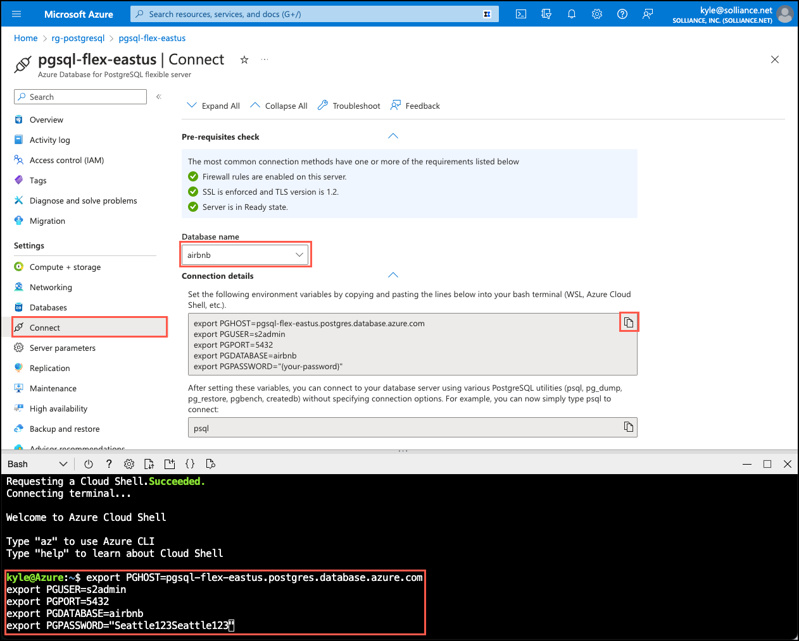

6.  Update the parameters ,replace **Azure OpenAI Endpoint, Azure OpenAI
    Key(**The values that you have saved in your notepad in the **Task
    1)** and Save the file.

7.  In Visual Studio Code dropdown the **GPT 4V-FASHION** and select
    **GPT-4 with Vision demo with Azure Open AI - Fashion
    usecase.ipynb** notebook.

> 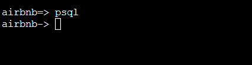 style="width:5.01667in;height:3.36667in" />

8.  In the main page of Visual Studio Code editor, scroll down to
    **install requirements** heading and run the 1st cell. If
    prompted to select the environment, then select **Python
    Environments** as shown in the image.

> 
>
> 

9.  If prompted to select the path, then select the **Python version
    3.11.5(or later version)** path as shown in the image.

>  style="width:6.49167in;height:3.43333in" />

10. If you see an windows security alert dialog box - then click on
    **Allow access**.

> 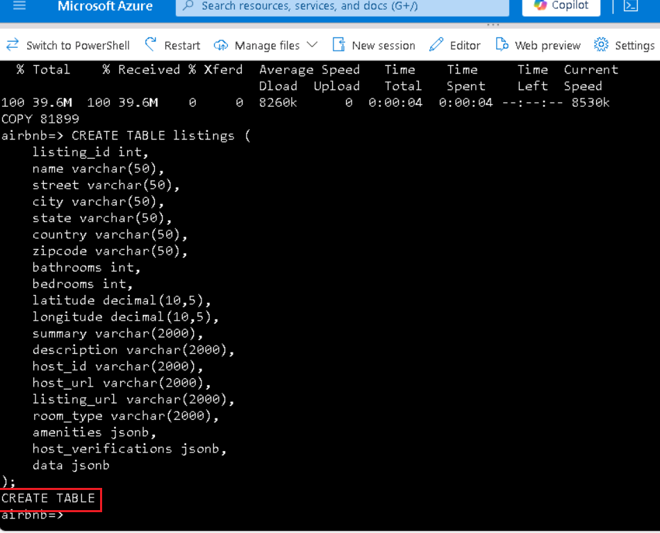 style="width:5.35833in;height:3.95833in" />
>
>  style="width:5.84399in;height:4.56718in" />
>
> 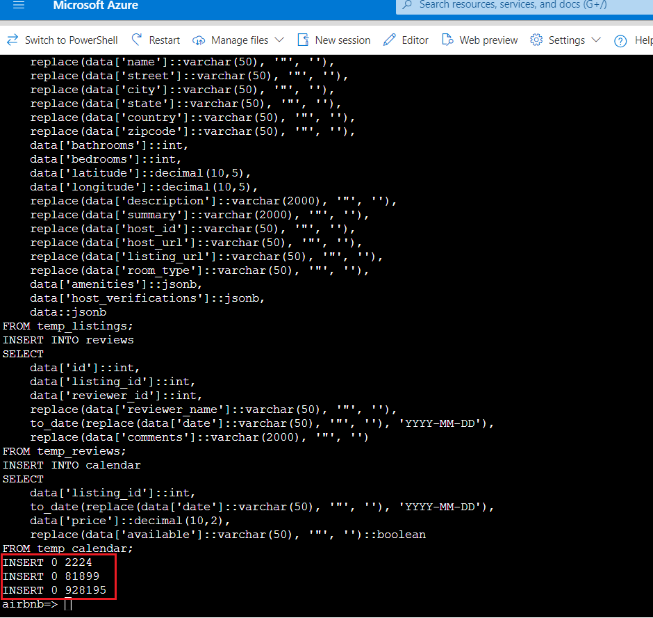
>
> 

11. To restart Jupyter kernel, click on **Restart** button.

> 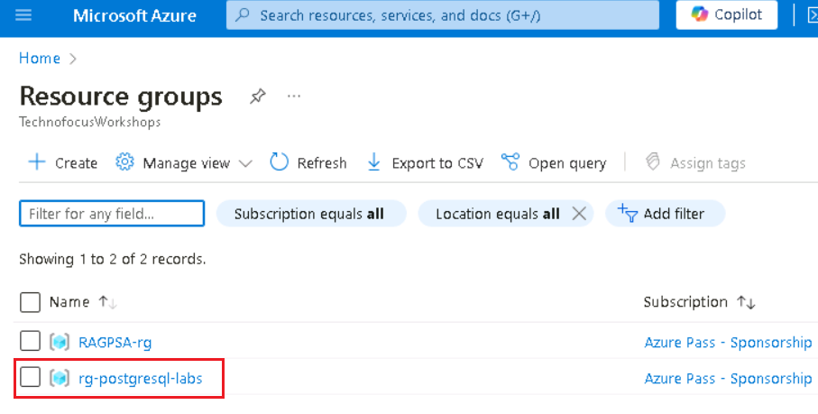 style="width:6.7375in;height:4.21978in" />

12. To import the libraries, select **4th** cell. Then,
    execute the cell by clicking on the **start icon**.

>  style="width:6.49167in;height:4.19167in" />

13. Select **5th** cell. Then, execute the cell by clicking
    on the **start icon**.

>  style="width:6.49167in;height:4.89167in" />

14. To check the OpenAI, system versions, select **6th
    **,7th , 8th and 9th cells.
    Then, execute the cell by clicking on the **start icon**.

>  style="width:6.49167in;height:4.76667in" />

15. To load the configuration values, select and execute the
    **10th** ,11th and 12th cells by
    clicking on the **Play** button.

>  alt="A screenshot of a computer program Description automatically generated" />

16. Define a helper function to create embeddings, select and execute
    the 13th .14th cells by clicking on the
    **Play** button.

>  style="width:6.16281in;height:3.57917in" />
>
>  style="width:6.1625in;height:4.55867in" />

17. To run the example, select and execute the 15th ,
    16th cells by clicking on the **Play** button.

>  style="width:4.82083in;height:3.86781in" />
>
>  style="width:5.81667in;height:4.28596in" />

18. To run the example, select and execute the **17th
    ,18th** cells by clicking on the **Play** button.

> 
>
>  style="width:5.64625in;height:4.51338in" />

19. To run the example, select and execute the **19th
    ,20th** cells by clicking on the **Play** button.

> 
>
>  alt="A screenshot of a computer Description automatically generated" />

20. To run the example, select and execute the **21st
    ,22nd** cells by clicking on the **Play** button.

> 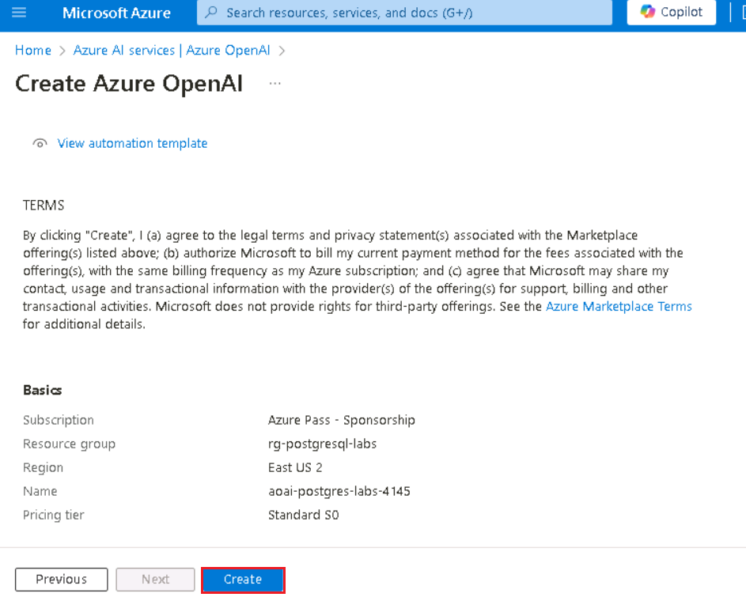 style="width:6.49167in;height:4.81667in" />
>
> 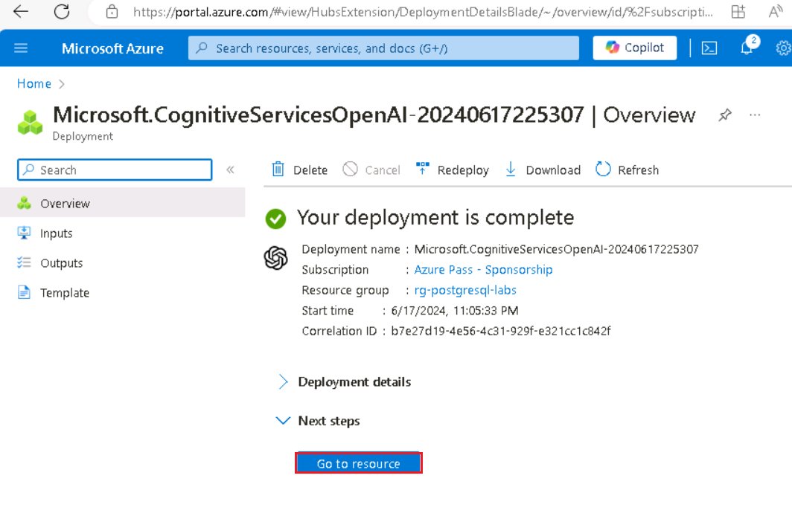 style="width:5.01667in;height:3.69649in" />

21. To run the example, select and execute the **23st
    ,24nd** cells by clicking on the **Play** button.

> 

22. To run the example, select and execute the **25th
    ,26th** cells by clicking on the **Play** button.

>  style="width:5.53333in;height:4.17838in" />
>
>  style="width:5.96957in;height:4.39873in" />

23. To run the example, select and execute the **27th
    ,28th** cells by clicking on the **Play** button.

> 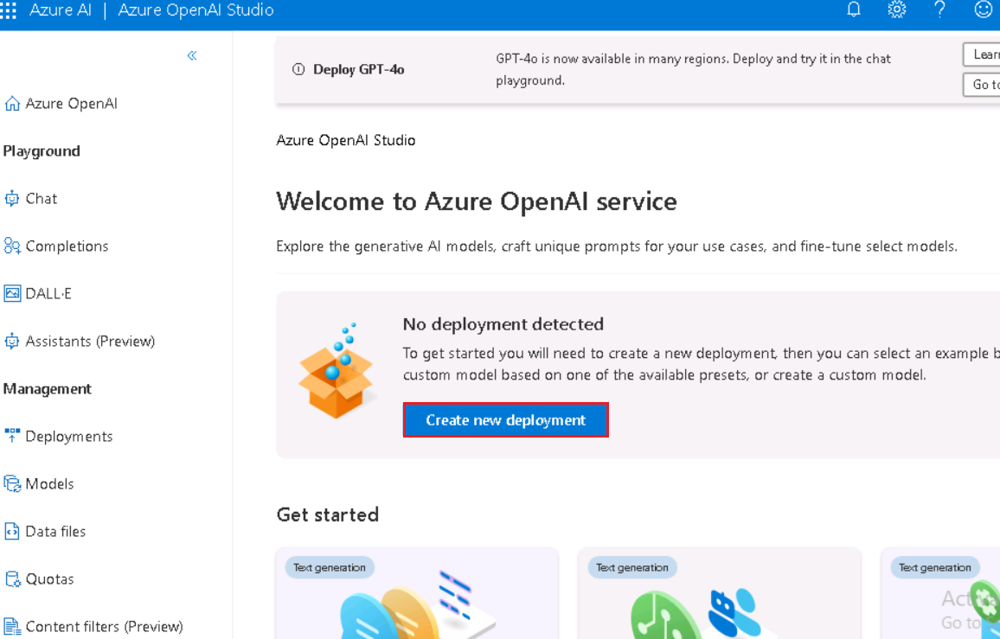 style="width:5.18333in;height:3.72801in" />
>
> 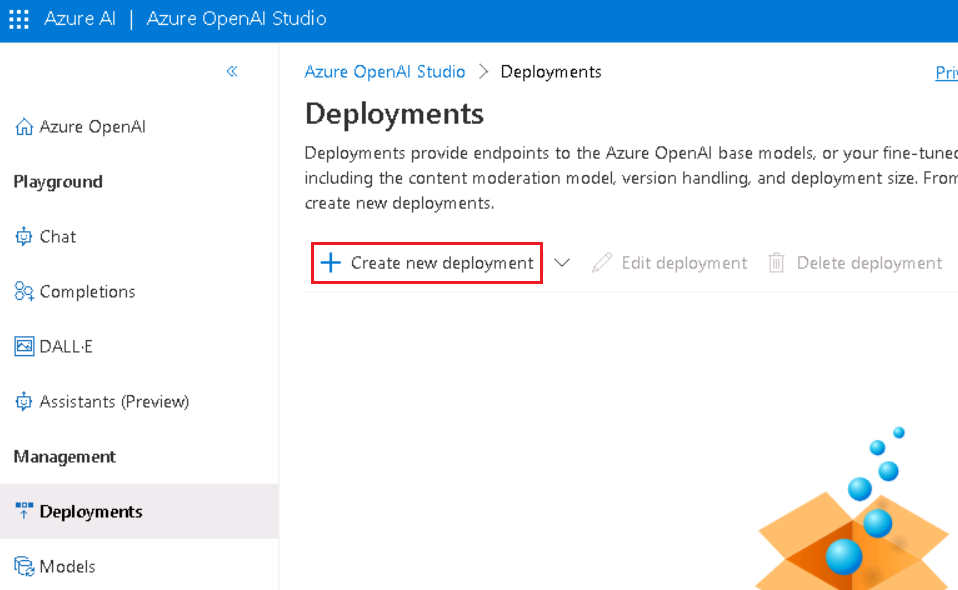 alt="A screenshot of a computer Description automatically generated" />

24. To run the example, select and execute the **27th
    ,28th** cells by clicking on the **Play** button.

> 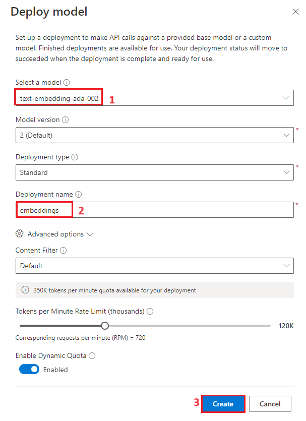 style="width:5.70826in;height:4.29583in" />
>
> 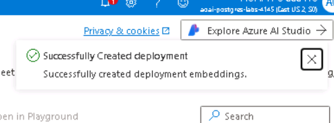 alt="A screenshot of a computer Description automatically generated" />

25. To generate WebApp, select and execute the **29th** cells
    by clicking on the **Play** button.

> 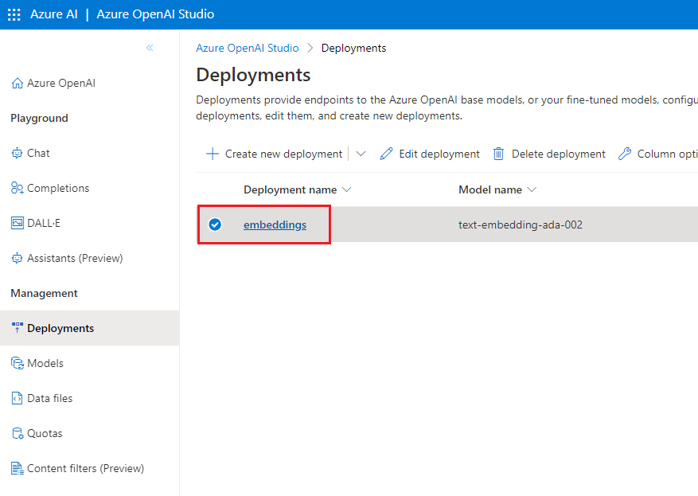

26. To generate WebApp, select and execute the **30th** cell
    by clicking on the **Play** button.

> 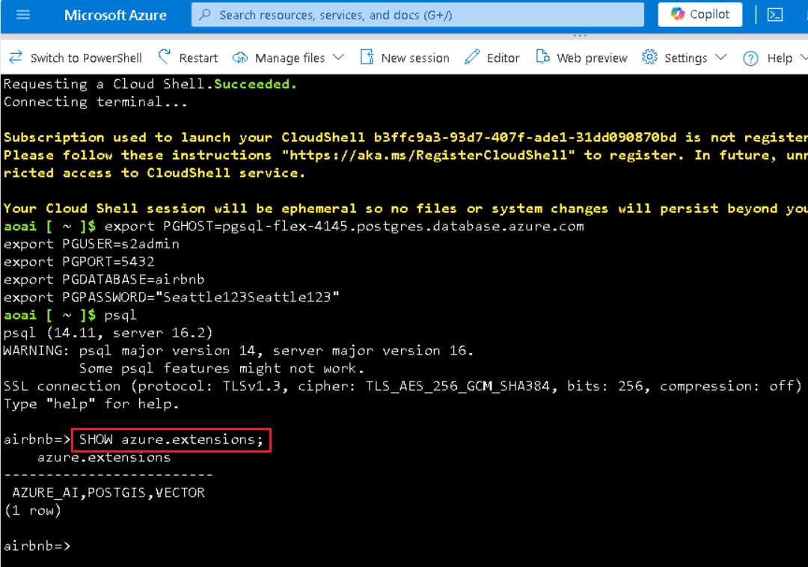 style="width:6.24167in;height:4.64924in" />

27. After the application has been successfully deployed, you see a URL
    displayed in the terminal. Copy the **URL**

28. Open your browser, navigate to the address bar, paste the Publick
    URL link. 

29. Open your browser, navigate to the address bar, paste the local URL
    link. Select any item

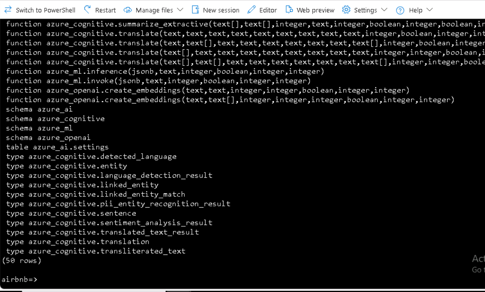

30. Click on the **Submit** button.

>  style="width:6.49167in;height:3.93333in" />

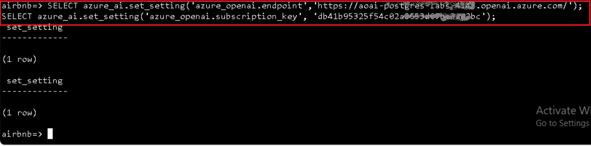

## Task 4: Delete the resources

1.  To delete the storage account, navigate to **Azure portal Home**
    page, click on **Resource groups**.

> 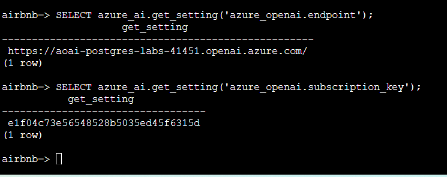 alt="A screenshot of a computer Description automatically generated" />

2.  Click on the AOAI-RGXXX resource group.

>  alt="A screenshot of a computer Description automatically generated" />

3.  In the **Resource group** home page, select the **delete resource
    group**

4.  In the **Delete Resources** pane that appears on the right side,
    navigate to **Enter “resource group name” to confirm deletion**
    field, then click on the **Delete** button.

5.  On **Delete confirmation** dialog box, click on **Delete** button.

>  alt="A screenshot of a computer error Description automatically generated" />

6.  Click on the bell icon, you’ll see the notification –**Deleted
    resource group AOAI-RG89.**

**Summary**

In this hands-on lab, participants delve into advanced AI capabilities
using Azure OpenAI. Starting with the setup of essential Azure
resources, they deploy AI models like GPT-4-vision. The lab specifically
explores how GPT-4, equipped with vision capabilities, can revolutionize
fashion-related tasks—think image recognition, personalized style
recommendations, and trend analysis.
