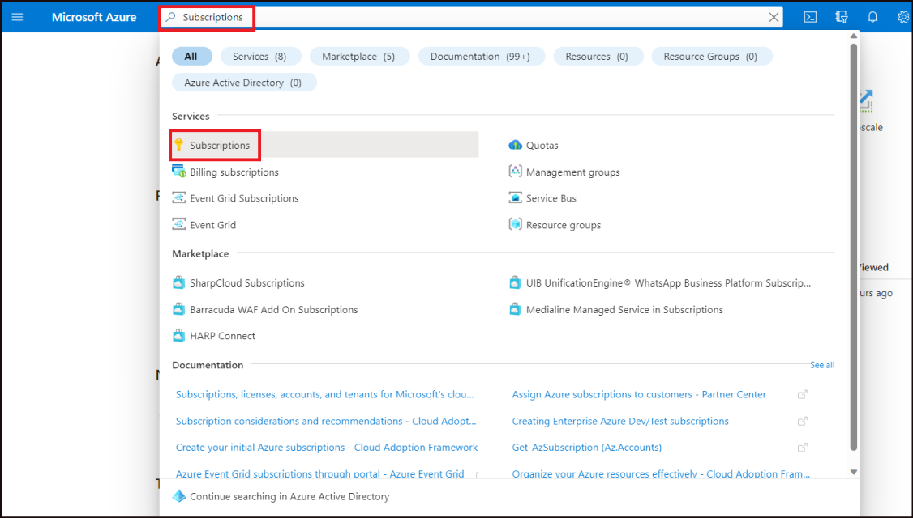
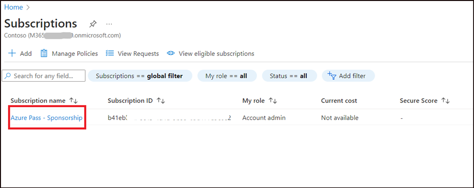
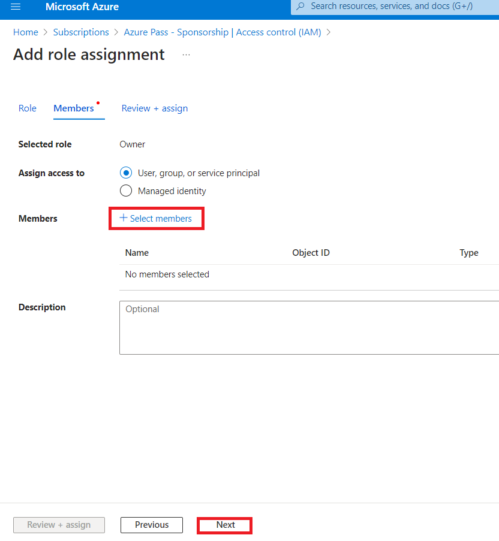
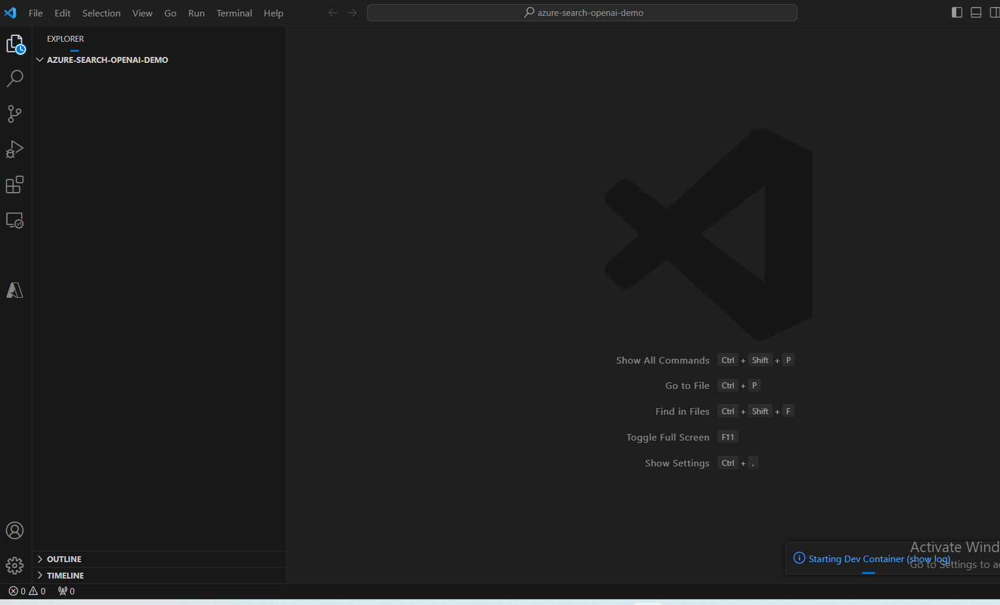
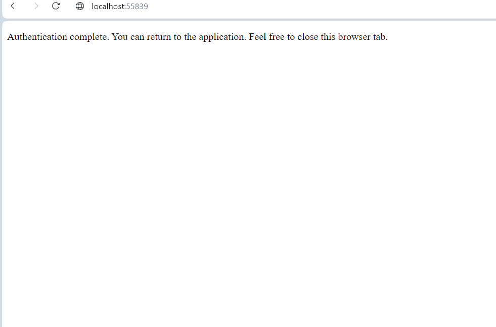
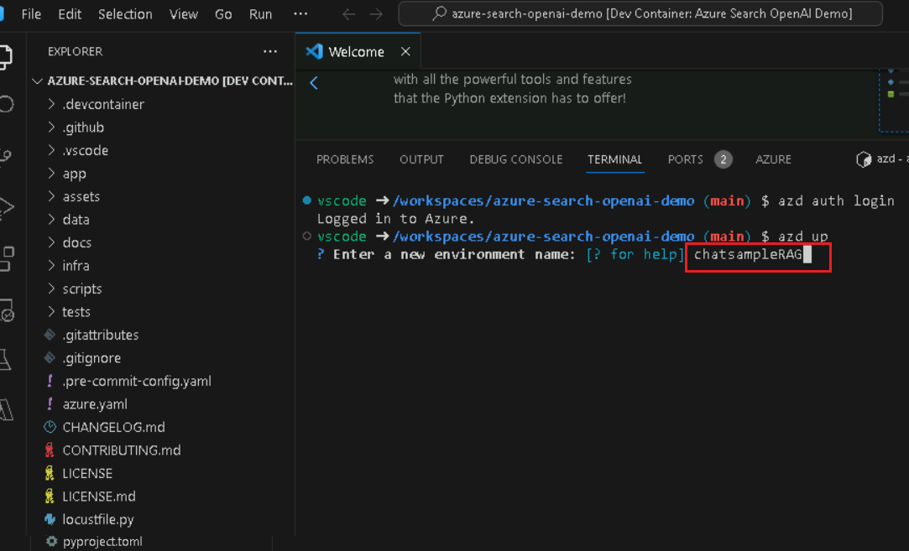
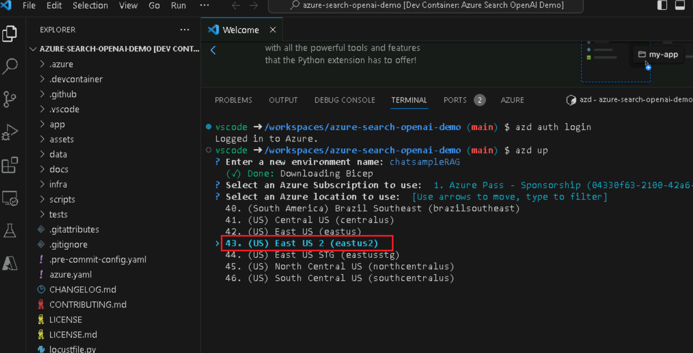
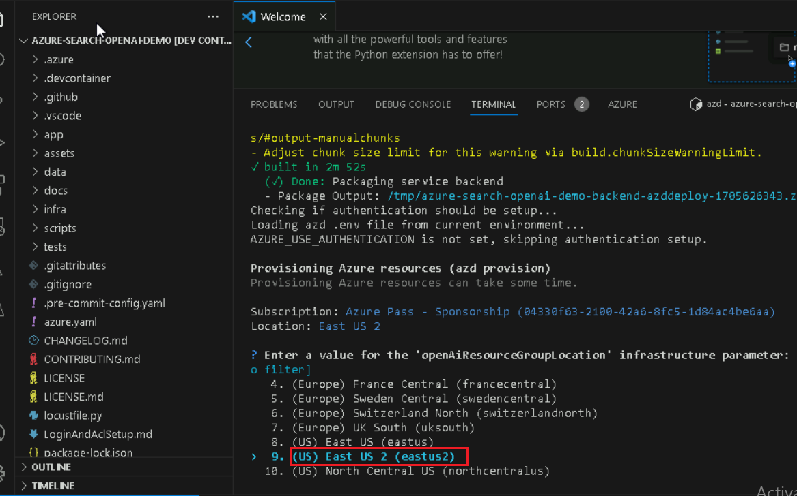
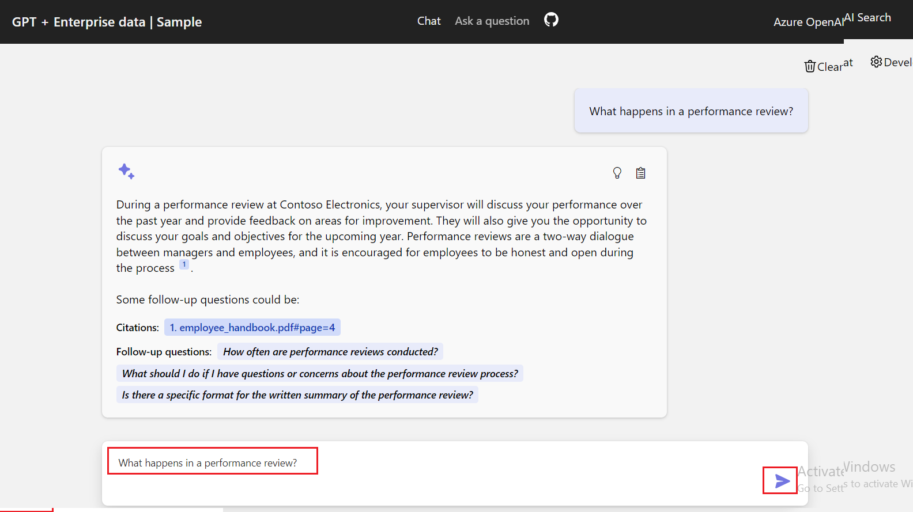

**Introduction**

In this lab, you will learn how to integrate Azure AI services with
PostgreSQL to enhance your database with advanced AI functionalities. By
leveraging the power of Azure OpenAI and PostgreSQL extensions such as
pgvector and PostGIS, you will enable sophisticated text analysis,
vector similarity searches, and geospatial queries directly within your
database. This lab guides you through provisioning the necessary Azure
resources, configuring your database, and executing complex queries that
combine AI-driven insights with geospatial data.**Objectives**

- To provision and configure Azure Database for PostgreSQL Flexible
  Server.

- To create and manage vector embeddings using the Azure OpenAI service.

- To perform vector similarity searches in order to find semantically
  similar text data.

- To utilize the PostGIS extension for geospatial data analysis.

- To integrate Azure AI Language services for sentiment analysis and
  other cognitive functions.

- To optimize and analyze query performance using indexing and query
  planning tools.

# Exercise 1: Provision an Azure Database for PostgreSQL Flexible Server

## Task 1: Provision an Azure Database for PostgreSQL Flexible Server

1.  Open a web browser and navigate to the !!https://portal.azure.com!!

2.  Select the **Cloud Shell** icon in the Azure portal toolbar to open
    a new [Cloud
    Shell](https://learn.microsoft.com/azure/cloud-shell/overview) pane
    at the top of your browser window.

3.  The first time you open the Cloud Shell, you may be prompted to
    choose the type of shell you want to use (**Bash** or
    **PowerShell**). Select **Bash**.

4.  In **Getting started** dialog box, select **Mount storage account**
    and select your azure subscription. Click on the **Apply**
    button**.**

> 

5.  In **Mount storage account** dialog box, select **we will create a
    storage account for you** and click on the **Next** button.

> 
>
> 

6.  At the cloud shell prompt, run the following commands to define
    variables for creating resources. The variables represent the names
    to assign to your resource group and database and specify the Azure
    region into which resources should be deployed.

7.  The resource group name specified is **rg-postgresql-labs**, but you
    can provide any name you wish to use to host the resources
    associated with this lab.

> **!!RG_NAME=rg-postgresql-labs!!**

8.  In the database name, replace the {SUFFIX} token with a unique
    value, such as your initials, to ensure the database server name is
    globally unique.

> **!!DATABASE_NAME=pgsql-flex-{SUFFIX}!!**

9.  Replace the region with whatever location you want to use for lab
    resources.In this lab we are using eastus

> **!!REGION=eastus!!**

10. Run the following Azure CLI command to create a resource group,
    specifying the location. If you have more than one Azure
    subscription, use the az account set --subscription \<subscription
    id\> command first to select the subscription you want to use for
    lab resources.

> **!!az group create --name \$RG_NAME --location \$REGION!!**

11. Provision an Azure Database for PostgreSQL database instance within
    the resource group you created above by running the following Azure
    CLI command(10 Min)

**!!az postgres flexible-server create --name \$DATABASE_NAME --location
\$REGION --resource-group \$RG_NAME \\**

**--admin-user s2admin --admin-password Seattle123Seattle123
--database-name airbnb \\**

**--public-access 0.0.0.0-255.255.255.255 --version 16 \\**

**--sku-name Standard_D2ds_v5 --storage-size 32 –yes!!**

## Task 2: Connect to the database using psql in the Azure Cloud Shell

In this task, you use the [psql command-line
utility](https://www.postgresql.org/docs/current/app-psql.html) from
the [Azure Cloud
Shell](https://learn.microsoft.com/azure/cloud-shell/overview) to
connect to your database.

1.  Open a browser go to https://portal.azure.com and sign in with your
    Azure subscription account.

2.  On the Home page, click on **Resource Groups**.

3.  Click on your resource group name

4.  In the resource group, select **PostgreSQL Flexible Server**
    resource

12. In the left-hand navigation menu,
    select **Connect** under **Settings**.

5.  From the database's **Connect** page in the Azure portal,
    select **airbnb** for the **Database name**, then copy
    the **Connection details** block and paste it into the notepad to
    use the information in the upcoming tasks.

6.  In the Azure Database for PostgresSQL home page, click on
    **Overview** in the left-sided navigation menu and copy the Server
    name and pate it into notepad, then **Save** the notepad to use the
    information in the upcoming lab.

7.  In the Azure Database for PostgreSQL home page, select
    **Networking** under settings and select **Allow public access to
    this resource through the internet using a public IP address**.
    Click on **Save** button.

8.  Select the **Cloud Shell** icon in the Azure portal toolbar to open
    a new [Cloud
    Shell](https://learn.microsoft.com/azure/cloud-shell/overview) pane
    at the top of your browser window.

9.  Paste **Connection details** into the Cloud Shell.

10. At the Cloud Shell prompt, replace the **{your_password}** token
    with the password you assigned to the **s2admin** user when creating
    your database, the password should be **Seattle123Seattle123**.

>  style="width:6.78938in;height:1.27083in" />

11. Connect to your database using the psql command-line utility by
    entering the following at the prompt:

> **!!psql!!**

Connecting to the database from the Cloud Shell requires that the Allow
public access from any Azure service within Azure to the server box is
checked on the **Networking** page of the database. If you receive a
message that you are unable to connect, please verify this is checked
and try again.

## Task 3: Add data to the database

Using the psql command prompt, you will create tables and populate them
with data for use in the lab.

1.  Run the following commands to create temporary tables for importing
    JSON data from a public blob storage account.

> !!CREATE TABLE temp_calendar (data jsonb);
>
> CREATE TABLE temp_listings (data jsonb);
>
> CREATE TABLE temp_reviews (data jsonb);!!

2.  Using the COPY command, populate each temporary table with data from
    JSON files in a public storage account.

!!\COPY temp_calendar (data) FROM PROGRAM 'curl
https://solliancepublicdata.blob.core.windows.net/ms-postgresql-labs/calendar.json'!!

!!\COPY temp_listings (data) FROM PROGRAM 'curl
https://solliancepublicdata.blob.core.windows.net/ms-postgresql-labs/listings.json'!!

!!\COPY temp_reviews (data) FROM PROGRAM 'curl
https://solliancepublicdata.blob.core.windows.net/ms-postgresql-labs/reviews.json'!!

3.  Run the following command to create the tables for storing data in
    the shape used by this lab:

> !!CREATE TABLE listings (
>
> listing_id int,
>
> name varchar(50),
>
> street varchar(50),
>
> city varchar(50),
>
> state varchar(50),
>
> country varchar(50),
>
> zipcode varchar(50),
>
> bathrooms int,
>
> bedrooms int,
>
> latitude decimal(10,5),
>
> longitude decimal(10,5),
>
> summary varchar(2000),
>
> description varchar(2000),
>
> host_id varchar(2000),
>
> host_url varchar(2000),
>
> listing_url varchar(2000),
>
> room_type varchar(2000),
>
> amenities jsonb,
>
> host_verifications jsonb,
>
> data jsonb
>
> );!!
>
>  style="width:6.6823in;height:5.40417in" />
>
> !!CREATE TABLE reviews (
>
> id int,
>
> listing_id int,
>
> reviewer_id int,
>
> reviewer_name varchar(50),
>
> date date,
>
> comments varchar(2000)
>
> );
>
> CREATE TABLE calendar (
>
> listing_id int,
>
> date date,
>
> price decimal(10,2),
>
> available boolean
>
> );!!
>
>  style="width:5.06667in;height:6.41667in" />

4.  Finally, run the following INSERT INTO statements to load data from
    the temporary tables to the main tables, extracting data from the
    JSON data field into individual columns:

> !!INSERT INTO listings
>
> SELECT
>
> data\['id'\]::int,
>
> replace(data\['name'\]::varchar(50), '"', ''),
>
> replace(data\['street'\]::varchar(50), '"', ''),
>
> replace(data\['city'\]::varchar(50), '"', ''),
>
> replace(data\['state'\]::varchar(50), '"', ''),
>
> replace(data\['country'\]::varchar(50), '"', ''),
>
> replace(data\['zipcode'\]::varchar(50), '"', ''),
>
> data\['bathrooms'\]::int,
>
> data\['bedrooms'\]::int,
>
> data\['latitude'\]::decimal(10,5),
>
> data\['longitude'\]::decimal(10,5),
>
> replace(data\['description'\]::varchar(2000), '"', ''),
>
> replace(data\['summary'\]::varchar(2000), '"', ''),
>
> replace(data\['host_id'\]::varchar(50), '"', ''),
>
> replace(data\['host_url'\]::varchar(50), '"', ''),
>
> replace(data\['listing_url'\]::varchar(50), '"', ''),
>
> replace(data\['room_type'\]::varchar(50), '"', ''),
>
> data\['amenities'\]::jsonb,
>
> data\['host_verifications'\]::jsonb,
>
> data::jsonb
>
> FROM temp_listings;
>
> INSERT INTO reviews
>
> SELECT
>
> data\['id'\]::int,
>
> data\['listing_id'\]::int,
>
> data\['reviewer_id'\]::int,
>
> replace(data\['reviewer_name'\]::varchar(50), '"', ''),
>
> to_date(replace(data\['date'\]::varchar(50), '"', ''), 'YYYY-MM-DD'),
>
> replace(data\['comments'\]::varchar(2000), '"', '')
>
> FROM temp_reviews;
>
> INSERT INTO calendar
>
> SELECT
>
> data\['listing_id'\]::int,
>
> to_date(replace(data\['date'\]::varchar(50), '"', ''), 'YYYY-MM-DD'),
>
> data\['price'\]::decimal(10,2),
>
> replace(data\['available'\]::varchar(50), '"', '')::boolean
>
> FROM temp_calendar;!!

# Exercise 2: Add Azure AI and Vector extensions to allowlist

Throughout this lab, you use
the [azure_ai](https://learn.microsoft.com/azure/postgresql/flexible-server/generative-ai-azure-overview) and [pgvector](https://learn.microsoft.com/azure/postgresql/flexible-server/how-to-use-pgvector) extensions
to add generative AI capabilities to your PostgreSQL database. In this
exercise, you add these extensions to your server's *allowlist*, as
described in [how to use PostgreSQL
extensions](https://learn.microsoft.com/azure/postgresql/flexible-server/concepts-extensions#how-to-use-postgresql-extensions).

1.  On the Home page, click on **Resource Groups**.

2.  Click on your resource group name

3.  In the resource group, select **PostgreSQL Flexible Server**
    resource

4.  From the database's left-hand navigation menu, select **Server
    parameters** under **Settings**, then enter azure.extensions into
    the search box. Expand the **VALUE** dropdown list, then locate and
    check the box next to each of the following extensions:

    - AZURE_AI

    - POSTGIS (Note that this will already be checked if you completed
      lab 3.)

    - VECTOR

5.  Select **Save** on the toolbar, which will trigger a deployment on
    the database.

# Exercise 3: Create an Azure OpenAI resource

The azure_ai extension requires an underlying Azure OpenAI service to
create vector embeddings. In this exercise, you will provision an Azure
OpenAI resource in the Azure portal and deploy an embedding model into
that service.

## Task 1: Provision an Azure OpenAI service

In this task, you create a new Azure OpenAI service.

1.  From the Azure portal home page, click on **Azure portal menu**
    represented by three horizontal bars on the left side of the
    Microsoft Azure command bar as shown in the below image.

>  alt="A screenshot of a computer Description automatically generated" />

2.  Navigate and click on **+ Create a resource**.

>  alt="A screenshot of a computer Description automatically generated" />

3.  On **Create a resource** page, in the **Search services and
    marketplace** search bar, type **Azure OpenAI**, then press the
    **Enter** button.

>  alt="A screenshot of a computer Description automatically generated" />

4.  In the **Marketplace** page, navigate to the **Azure OpenAI**
    section, click on the Create button dropdown, then select **Azure
    OpenAI** as shown in the image. (In case, you’ve already clicked on
    the **Azure** **OpenAI** tile, then click on the **Create** button
    on the **Azure OpenAI page**).

>  alt="A screenshot of a computer Description automatically generated" />

5.  On the Create Azure OpenAI **Basics** tab, enter the following
    information and click on **Next** button.

| **Subscription** | Select Azure subscription |
|----|----|
| **Resource group** | Select resource group **rg-postgresql-labs**(which you have created in Ex1\> Task 1) |
| **Region** | Select East US2 |
| Name | *Enter a globally unique name*, such as !!**aoai-postgres-labs-XXXX!!**(XXXX can be a unique number) |
| **Pricing tier** | Select Standard S0 |

> 

6.  In the **Network** tab, leave all the radio buttons in the default
    state, and click on the **Next** button.

>  style="width:5.58101in;height:5.89583in" />

7.  In the **Tags** tab, leave all the fields in the default state, and
    click on the **Next** button.

>  style="width:5.85157in;height:4.8375in" />

8.  In the **Review+submit** tab, once the Validation is Passed, click
    on the **Create** button.

> 

9.  Wait for the deployment to complete. The deployment will take around
    2-3 minutes.

> **Note**: If you see a message that the Azure OpenAI Service is
> currently available to customers via an application form. The selected
> subscription has not been enabled for the service and does not have a
> quota for any pricing tiers; you will need to click the link to
> request access to the Azure OpenAI service and fill out the request
> form.

## Task 2: Retrieve the key and endpoint of Azure OpenAI service

1.  On the resource's **Overview** page, select the **Go to
    resource** button. If prompted, select the lab credentials:

2.  In your **Azure OpenAI home** window, navigate to the **Resource
    Management** section, and click on **Keys and Endpoints**.

3.  In **Keys and Endpoints** page, copy **KEY1, KEY 2,** and
    **Endpoint** values and paste them in a notepad as shown in the
    below image, then **save** the notepad to use the information in the
    upcoming tasks.

***Note:** You can use either KEY1 or KEY2. Always having two keys
allows you to securely rotate and regenerate keys without causing a
service disruption*.

## Task 3: Deploy an embedding model

The azure_ai extension allows the creation of vector embeddings from
text. To create these embeddings requires a
deployed text-embedding-ada-002 (version 2) model within your Azure
OpenAI service. In this task, you will use Azure OpenAI Studio to create
a model deployment that you can employ.

1.  In **Azure OpenAI** page, click on **Overview** in the left-sided
    navigation menu, scroll down and click on **Go to Azure OpenAI
    Studio** button as shown in the below image.

>  alt="A screenshot of a computer Description automatically generated" />

2.  In Azure OpenAI Studio, select the **Create new deployment**, and
    select  **+ Create new deployment** from the toolbar.

>  style="width:6.0875in;height:3.89162in" />
>
> 

4.  In the **Deploy model** dialog, set the following and
    select **Create** to deploy the model.

    - **Select a model**: Choose **text-embedding-ada-002** from the
      list.

    - **Model version**: Ensure **2 (Default)** is selected.

    - **Deployment name**: Enter !!**embeddings**!!

3.  In the **Deployments** window, copy **Deployment name** and paste
    them in a notepad (as shown in the image), and then **save** the
    notepad to use the information in the upcoming task.

# Exercise 4: Install and configure the azure_ai extension

In this exercise, you install the azure_ai extension into your database
and configure it to connect to your Azure OpenAI service.

## Task 1: Connect to the database using psql in the Azure Cloud Shell

In this task, you use the psql command-line utility from the Azure Cloud
Shell to connect to your database.

1.  Select the **Cloud Shell** icon in the Azure portal toolbar to open
    a new [Cloud
    Shell](https://learn.microsoft.com/azure/cloud-shell/overview) pane
    at the top of your browser window.

2.  past **Connection details**  into the Cloud Shell.

3.  At the Cloud Shell prompt, replace the **{your_password}** token
    with the password you assigned to the **s2admin** user when creating
    your database, the password should be **Seattle123Seattle123**.

4.  Connect to your database using the psql command-line utility by
    entering the following at the prompt:

> **!!psql!!**

## Task 2: Install the azure_ai extension

The azure_ai extension allows you to integrate Azure OpenAI and Azure
Cognitive Services into your database. To enable the extension in your
database, follow the steps below:

1.  Verify that the extension was successfully added to the allowlist by
    running the following from the psql command prompt:

> **!!SHOW azure.extensions;!!**

2.  Install the azure_ai extension using the [CREATE
    EXTENSION](https://www.postgresql.org/docs/current/sql-createextension.html) command.

> **!!CREATE EXTENSION IF NOT EXISTS azure_ai;!!**

## Task 3: Review the objects contained within the azure_ai extension

Reviewing the objects within the azure_ai extension can provide a better
understanding of its capabilities. In this task, you inspect the various
schemas, user-defined functions (UDFs), and composite types added to the
database by the extension.

1.  You can use
    the [\dx meta-command](https://www.postgresql.org/docs/current/app-psql.html#APP-PSQL-META-COMMAND-DX-LC) from
    the **psq**l command prompt to list the objects contained within the
    extension.

> **+++\dx+ azure_ai+++**
>
> 
>
>  alt="A screenshot of a computer program Description automatically generated" />
>
> The meta-command output shows the azure_ai extension creates three
> schemas, multiple user-defined functions (UDFs), and several composite
> types in the database. The table below lists the schemas added by the
> extension and describes each.

| **Schema** | **Description** |
|----|----|
| azure_ai | The principal schema where the configuration table and UDFs for interacting with it reside. |
| azure_openai | Contains the UDFs that enable calling an Azure OpenAI endpoint. |
| azure_cognitive | Provides UDFs and composite types related to integrating the database with Azure Cognitive Services. |

2.  The functions and types are all associated with one of the schemas.
    To review the functions defined in the azure_ai schema, use
    the \df meta-command, specifying the schema whose functions should
    be displayed. The \x auto command preceding \df allows the expanded
    display to be automatically applied when necessary to make the
    output from the command easier to view in the Azure Cloud Shell.

> **!!\x auto!!**
>
> **!!\df+ azure_ai.\*!!**

The azure_ai.set_setting() function lets you set the endpoint and key
values for Azure AI services. It accepts a **key** and the **value** to
assign it. The azure_ai.get_setting() function provides a way to
retrieve the values you set with the set_setting() function. It accepts
the **key** of the setting you want to view. For both methods, the key
must be one of the following:

## Task 4: Set the Azure OpenAI endpoint and key

Before using the azure_openai functions, configure the extension to your
Azure OpenAI service endpoint and key.

1.  In the command below, replace the {endpoint} and {api-key} tokens
    with values you retrieved from the Azure portal, then run the
    commands from the psql command prompt in the Cloud Shell pane to add
    your values to the configuration table.

> **!!SELECT
> azure_ai.set_setting('azure_openai.endpoint','{endpoint}');**
>
> **SELECT azure_ai.set_setting('azure_openai.subscription_key',
> '{api-key}');!!**

2.  Verify the settings written in the configuration table using the
    following queries:

> !!SELECT azure_ai.get_setting('azure_openai.endpoint');

SELECT azure_ai.get_setting('azure_openai.subscription_key');!!

The azure_ai extension is now connected to your Azure OpenAI account and
ready to generate vector embeddings.

# Exercise 5: Generate vector embeddings with Azure OpenAI

The azure_ai extension's azure_openai schema enables Azure OpenAI to
create vector embeddings for text values. Using this schema, you
can [generate embeddings with Azure
OpenAI](https://learn.microsoft.com/azure/ai-services/openai/how-to/embeddings) directly
from the database to create vector representations of input text, which
can then be used in vector similarity searches, as well as consumed by
machine learning models.

[Embeddings](https://learn.microsoft.com/azure/postgresql/flexible-server/generative-ai-overview#embeddings) are
a concept in machine learning and natural language processing (NLP) that
involves representing objects, such as words, documents, or entities,
as [vectors](https://learn.microsoft.com/azure/postgresql/flexible-server/generative-ai-overview#vectors) in
a multi-dimensional space. Embeddings allow machine learning models to
evaluate how closely related information is. This technique efficiently
identifies relationships and similarities between data, allowing
algorithms to identify patterns and make accurate predictions.

## Task 1: Enable vector support with the pgvector extension

The azure_ai extension allows you to generate embeddings for input text.
To enable the generated vectors to be stored alongside the rest of your
data in the database, you must install the pgvector extension by
following the guidance in the [enable vector support in your
database](https://learn.microsoft.com/azure/postgresql/flexible-server/how-to-use-pgvector#enable-extension) documentation.

1.  Install the pgvector extension using the [CREATE
    EXTENSION](https://www.postgresql.org/docs/current/sql-createextension.html) command.

> **!!CREATE EXTENSION IF NOT EXISTS vector;!!**
>
> 

2.  With vector supported added to your database, add a new column to
    the listings table using the vector data type to store embeddings
    within the table. The text-embedding-ada-002 model produces vectors
    with 1536 dimensions, so you must specify 1536 as the vector size.

> !!**ALTER TABLE listings**

**ADD COLUMN description_vector vector(1536);!!**

## Task 2: Generate and store vector embeddings

The listings table is now ready to store embeddings. Using
the azure_openai.create_embeddings() function, you create vectors for
the description field and insert them into the newly
created description_vector column in the listings table.

1.  Before using the create_embeddings() function, run the following
    command to inspect it and review the required arguments:

> **!!\df+ azure_openai.\*!!**

The Argument data types property in the output of the \df+
azure_openai.\* command reveals the list of arguments the function
expects.

| **Argument** | **Type** | **Default** | **Description** |
|----|----|----|----|
| deployment_name | text |  | Name of the deployment in Azure OpenAI studio that contains the text-embeddings-ada-002 model. |
| input | text |  | Input text used to create embeddings. |
| timeout_ms | integer | 3600000 | Timeout in milliseconds after which the operation is stopped. |
| throw_on_error | boolean | true | Flag indicating whether the function should, on error, throw an exception resulting in a rollback of the wrapping transactions. |

2.  Using the deployment name, run the following query to update each
    record in the listings table, inserting the generated vector
    embeddings for the description field into
    the description_vector column using
    the azure_openai.create_embeddings() function.
    Replace {your-deployment-name} with the **Deployment name** value
    you copied from the Azure OpenAI Studio **Deployments** page. Note
    that this query takes approximately five minutes to complete.

> **!!DO \$\$**
>
> **DECLARE counter integer := (SELECT COUNT(\*) FROM listings WHERE
> description \<\> '' AND description_vector IS NULL);**
>
> **DECLARE r record;**
>
> **BEGIN**
>
> **RAISE NOTICE 'Total descriptions to embed: %', counter;**
>
> **WHILE counter \> 0 LOOP**
>
> **BEGIN**
>
> **FOR r IN**
>
> **SELECT listing_id FROM listings WHERE description \<\> '' AND
> description_vector IS NULL**
>
> **LOOP**
>
> **BEGIN**
>
> **UPDATE listings**
>
> **SET description_vector =
> azure_openai.create_embeddings('{your-deployment-name}',
> description)**
>
> **WHERE listing_id = r.listing_id;**
>
> **EXCEPTION**
>
> **WHEN OTHERS THEN**
>
> **RAISE NOTICE 'Waiting 1 second before trying again...';**
>
> **PERFORM pg_sleep(1);**
>
> **END;**
>
> **counter := (SELECT COUNT(\*) FROM listings WHERE description \<\> ''
> AND description_vector IS NULL);**
>
> **IF counter % 25 = 0 THEN**
>
> **RAISE NOTICE 'Remaining descriptions to embed: %', counter;**
>
> **END IF;**
>
> **END LOOP;**
>
> **END;**
>
> **END LOOP;**
>
> **END;**
>
> **\$\$;!!**
>
>  style="width:6.79005in;height:3.80417in" />
>
> The above query uses a WHILE loop to retrieve records from
> the listings table where the description_vector field is null, and
> the description field is not an empty string. The query then attempts
> to update the description_vector column with a vector representation
> of the description column using
> the azure_openai.create_embeddings function. The loop is used when
> performing this update to prevent calls to create embeddings function
> from exceeding the call rate limit of the Azure OpenAI service. If the
> call rate limit is exceeded, you will see warnings similar to the
> following in the output:
>
> **NOTICE**: Waiting 1 second before trying again...

>  alt="A screenshot of a computer program Description automatically generated" />

3.  You can verify that the description_vector column has been populated
    for all listings records by running the following query:

> **!!SELECT COUNT(\*) FROM listings WHERE description_vector IS NULL
> AND description \<\> '';!!**
>
> The result of the query should be a count of 0.

## Task 3: Perform a vector similarity search

Vector similarity is a method used to measure two items' similarity by
representing them as vectors, a series of numbers. Vectors are often
used to perform searches using LLMs. Vector similarity is commonly
calculated using distance metrics, such as Euclidean distance or cosine
similarity. Euclidean distance measures the straight-line distance
between two vectors in the n-dimensional space, while cosine similarity
measures the cosine of the angle between two vectors. Each embedding is
a vector of floating point numbers, so the distance between two
embeddings in the vector space correlates with the semantic similarity
between two inputs in the original format.

1.  Before executing a vector similarity search, run the below query
    using the ILIKE clause to observe the results of searching for
    records using a natural language query without using vector
    similarity:

**!!SELECT listing_id, name, description FROM listings WHERE description
ILIKE '%Properties with a private room near Discovery Park%';!!**

> The query returns zero results because it is attempting to match the
> text in the description field with the natural language query
> provided.

2.  Now, execute a [cosine
    similarity](https://learn.microsoft.com/azure/ai-services/openai/concepts/understand-embeddings#cosine-similarity) search
    query against the listings table to perform a vector similarity
    search against listing descriptions. The embeddings are generated
    for an input question and then cast to a vector array (::vector),
    which allows it to be compared against the vectors stored in
    the listings table. Replace {your-deployment-name} with
    the **Deployment name** value you copied from the Azure OpenAI
    Studio **Deployments** page.

> **!!SELECT listing_id, name, description FROM listings**
>
> **ORDER BY description_vector \<=\>
> azure_openai.create_embeddings('{your-deployment-name}', 'Properties
> with a private room near Discovery Park')::vector**
>
> **LIMIT 3;!!**

The query uses the \<=\> [vector
operator](https://github.com/pgvector/pgvector#vector-operators), which
represents the "cosine distance" operator used to calculate the distance
between two vectors in a multi-dimensional space.

3.  Run the same query again using the EXPLAIN ANALYZE clause to view
    the query planning and execution times.
    Replace {your-deployment-name} with the **Deployment name** value
    you copied from the Azure OpenAI Studio **Deployments** page.

> **!!EXPLAIN ANALYZE**
>
> **SELECT listing_id, name, description FROM listings**
>
> **ORDER BY description_vector \<=\>
> azure_openai.create_embeddings('{your-deployment-name}', 'Properties
> with a private room near Discovery Park')::vector**
>
> **LIMIT 3;!!**

In the output, notice the query plan, which will start with something
similar to:

> Limit (cost=1098.54..1098.55 rows=3 width=261) (actual
> time=10.505..10.507 rows=3 loops=1)
>
> -\> Sort (cost=1098.54..1104.10 rows=2224 width=261) (actual
> time=10.504..10.505 rows=3 loops=1)
>
> ...
>
> Sort Method: top-N heapsort Memory: 27kB
>
> -\> Seq Scan on listings (cost=0.00..1069.80 rows=2224 width=261)
> (actual time=0.005..9.997 rows=2224 loops=1)
>
> The query is using a sequential scan sort to perform the lookup. The
> planning and execution times will be listed at the end of the results,
> and should look similar to the following:
>
> Planning Time: 62.020 ms
>
> Execution Time: 10.530 ms

4.  To enable more efficient searching over the vector field, create an
    index on listings using cosine distance
    and [HNSW](https://github.com/pgvector/pgvector#hnsw), which is
    short for Hierarchical Navigable Small World. HNSW
    allows pgvector to utilize the latest graph-based algorithms to
    approximate nearest-neighbor queries.

> **!!CREATE INDEX ON listings USING hnsw (description_vector
> vector_cosine_ops);!!**

5.  To observe the impact of the hnsw index on the table, run the query
    again with the EXPLAIN ANALYZE clause to compare the query planning
    and execution times. Replace {your-deployment-name} with
    the **Deployment name** value you copied from the Azure OpenAI
    Studio **Deployments** page.

!!EXPLAIN ANALYZE

SELECT listing_id, name, description FROM listings

ORDER BY description_vector \<=\>
azure_openai.create_embeddings('{your-deployment-name}', 'Properties
with a private room near Discovery Park')::vector

LIMIT 3;!!

In the output, notice the query plan now includes a more efficient index
scan:

Limit (cost=116.48..119.33 rows=3 width=261) (actual time=1.112..1.130
rows=3 loops=1)

-\> Index Scan using listings_description_vector_idx on listings
(cost=116.48..2228.28 rows=2224 width=261) (actual time=1.111..1.128
rows=3 loops=1)

The query execution times should reflect a significant reduction in the
time it took to plan and run the query:

Planning Time: 56.802 ms

Execution Time: 1.167 ms

# Exercise 6: Integrate Azure AI Services

The Azure AI services integrations included in
the azure_cognitive schema of the azure_ai extension provide a rich set
of AI Language features accessible directly from the database. The
functionalities include sentiment analysis, language detection, key
phrase extraction, entity recognition, and text summarization. These
capabilities are enabled through the [Azure AI Language
service](https://learn.microsoft.com/azure/ai-services/language-service/overview).

To review the complete list of Azure AI capabilities accessible through
the extension, view the [Integrate Azure Database for PostgreSQL
Flexible Server with Azure Cognitive Services
documentation](https://learn.microsoft.com/azure/postgresql/flexible-server/generative-ai-azure-cognitive).

## Task 1: Provision an Azure AI Language service

An [Azure AI
Language](https://learn.microsoft.com/azure/ai-services/language-service/overview) service
is required to take advantage of the azure_ai extensions cognitive
functions. In this exercise, you will create an Azure AI Language
service.

1.  From the Azure portal home page, click on **Azure portal menu**
    represented by three horizontal bars on the left side of the
    Microsoft Azure command bar as shown in the below image.

2.  On the **Create a resource** page, select AI + Machine Learning from
    the left-hand menu, then select **Language service**.

3.  On the **Select additional features** dialog, select **Continue to
    create your resource**.

>  alt="The continue to create your resource button is highlighted on the select additional features dialog." />

4.  On the Create Language **Basics** tab, enter the following:

| **Parameter** | **Value** |
|----|----|
| **Project details** |  |
| Subscription | Select the subscription you use for lab resources. |
| Resource group | Select the resource group you created in Exercise 1\>Task 1. |
| **Instance details** |  |
| Region | Select the region you used for your Azure Database for PostgreSQL Flexible Server resource. |
| Name | *Enter a globally unique name*, such as **lang-postgres-labs-SUFFIX**, where SUFFIX is a unique string, such as your initials. |
| Pricing tier | Select the standard pricing tier, **S (1K Calls per minute)**. |
| Responsible AI Notice | Check the box to certify you have reviewed and acknowledged the Responsible AI Notice. |

> 
>
> 

5.  The default settings will be used for the remaining tabs of the
    Language service configuration, so select the **Review +
    create** button.

6.  Select the **Create** button on the **Review + create** tab to
    provision the Language service.

> 

7.  Select **Go to resource group** on the deployment page when the
    language service deployment is complete.

## Task 2: Set the Azure AI Language service endpoint and key

As with the azure_openai functions, to successfully make calls against
Azure AI services using the azure_ai extension, you must provide the
endpoint and a key for your Azure AI Language service.

1.  In the Language home page, select the **Keys and Endpoint** item
    under **Resource Management** from the left-hand navigation menu.

2.  In **Keys and Endpoints** page, copy **KEY1, KEY 2,** and
    **Endpoint** values and paste them in a notepad as shown in the
    below image, then **save** the notepad to use the information in the
    upcoming tasks.

3.  Copy your endpoint and access key values, then in the command below,
    replace the {endpoint} and {api-key} tokens with values you
    retrieved from the Azure portal. Run the commands from
    the psql command prompt in the Cloud Shell to add your values to the
    configuration table.

> !!SELECT
> azure_ai.set_setting('azure_cognitive.endpoint','{endpoint}');
>
> SELECT azure_ai.set_setting('azure_cognitive.subscription_key',
> '{api-key}');!!

## Task 3: Analyze the sentiment of reviews

In this task, you will use
the azure_cognitive.analyze_sentiment function to evaluate reviews of
Airbnb listings.

1.  To perform sentiment analysis using the azure_cognitive schema in
    the azure_ai extension, you use the analyze_sentiment function. Run
    the command below to review that function:

> **!!\df azure_cognitive.analyze_sentiment!!**

The output shows the function's schema, name, result data type, and
argument data types. This information helps in gaining an understanding
of how to use the function.

2.  It is also essential to understand the structure of the result data
    type the function outputs so you can correctly handle its return
    value. Run the following command to inspect
    the sentiment_analysis_result type:

> **!!\dT+ azure_cognitive.sentiment_analysis_result!!**

3.  The output of the above command reveals
    the sentiment_analysis_result type is a tuple. To understand the
    structure of that tuple, run the following command to look at the
    columns contained within the sentiment_analysis_result composite
    type:

> **!!\d+ azure_cognitive.sentiment_analysis_result!!**

The output of that command should look similar to the following:

> Composite type "azure_cognitive.sentiment_analysis_result"
>
> Column \| Type \| Collation \| Nullable \| Default \| Storage \|
> Description
>
> ----------------+------------------+-----------+----------+---------+----------+-------------
>
> sentiment \| text \| \| \| \| extended \|
>
> positive_score \| double precision \| \| \| \| plain \|
>
> neutral_score \| double precision \| \| \| \| plain \|
>
> negative_score \| double precision \| \| \| \| plain \|

The azure_cognitive.sentiment_analysis_result is a composite type
containing the sentiment predictions of the input text. It includes the
sentiment, which can be positive, negative, neutral, or mixed, and the
scores for positive, neutral, and negative aspects found in the text.
The scores are represented as real numbers between 0 and 1. For example,
in (neutral,0.26,0.64,0.09), the sentiment is neutral with a positive
score of 0.26, neutral of 0.64, and negative at 0.09.

4.  Now that you have an understanding of how to analyze sentiment using
    the extension and the shape of the return type, execute the
    following query that looks for overwhelmingly positive reviews:

!!WITH cte AS (

SELECT id, azure_cognitive.analyze_sentiment(comments, 'en') AS
sentiment FROM reviews LIMIT 100

)

SELECT

id,

(sentiment).sentiment,

(sentiment).positive_score,

(sentiment).neutral_score,

(sentiment).negative_score,

comments

FROM cte

WHERE (sentiment).positive_score \> 0.98

LIMIT 10;!!

The above query uses a common table expression or CTE to get the
sentiment scores for the first three records in the reviews table. It
then selects the sentiment composite type columns from the CTE to
extract the individual values from the sentiment_analysis_result.

# Exercise 7: Execute a final query to tie it all together 

In this exercise, you connect to your database in **pgAdmin** and
execute a final query that ties together your work with
the azure_ai, postgis, and pgvector extensions across labs 3 and 4.

## Task 1: Install pgAdmin

1.  Open a web browser and navigate to the
    !!https://www.pgadmin.org/download/pgadmin-4-windows/!!

2.  Click on the latest version of **pgAdmin**

3.  Select **pgadmin4-8.9-x64.exe**

4.  Run and install downloaded file

5.  On the Select Setup Install Mode tab, select **Install for me
    only(recommended)**

6.  Click on **Next** button

7.  Select the **I accept the agreement** and click on **Next** button

8.  Select the path and click on **Next** button

9.  In the **Setup-pgAdmin 4** window, click on the **Next** button

10. Click on the **Install** button

11. In the **Setup-pgAdmin 4** window, click on the **Finish** button

## Task 2: Connect to the database using pgAdmin

In this task, you will open pgAdmin and connect to your database.

1.  In your Windows search box, type **pgAdmin**, then click on
    **pgAdmin**

2.  Register your server by right-clicking **Servers** in the Object
    Explorer and selecting **Register \> Server**.

3.  In the **Register - Server** dialog, paste your Azure Database for
    PostgreSQL Flexible Server server name( which you have saved in
    Exercise 1\> Task 1)into the **Name** field on the **General** tab.

>  style="width:6.49167in;height:4.81667in" />

4.  Next, select the **Connection** tab and paste your server name into
    the **Hostname/address** field. Enter **s2admin** into
    the **Username** field, enter **Seattle123Seattle123** into
    the **Password** box, and optionally, select **Save password**.

> 

3.  Finally, select the **Parameters** tab and set the **SSL
    mode** to **require**. Select **Save** to register your server.

> 
>
> 

4.  Once connected to your server, expand the **Databases** node and
    select the **airbnb** database. Right-click the **airbnb** database
    and select **Query Tool** from the context menu.

>  style="width:6.87725in;height:4.97917in" />
>
>  alt="A screenshot of a computer Description automatically generated" />

## Task 3: Verify that the PostGIS extension is installed in your database

To install the postgis extension in your database, you will use
the CREATE EXTENSION command.

1.  In the query window you opened above, run the CREATE
    EXTENSION command with the IF NOT EXISTS clause to install
    the postgis extension in your database.

> CREATE EXTENSION IF NOT EXISTS postgis;
>
> 
>
> With the PostGIS extension now loaded, you are ready to begin working
> with geospatial data in the database. The listings table you created
> and populated above contains the latitude and longitude of all listed
> properties. To use these data for geospatial analysis, you must alter
> the listings table to add a geometry column that accepts
> the point data type. These new data types are included in
> the postgis extension.

2.  To accommodate point data, add a new geometry column to the table
    that accepts point data. Copy and paste the following query into the
    open pgAdmin query window:

> !!ALTER TABLE listings
>
> ADD COLUMN listing_location geometry(point, 4326);!!

3.  Next, update the table with geospatial data associated with each
    listing by adding the longitude and latitude values into
    the geometry column.

> !!UPDATE listings
>
> SET listing_location = ST_SetSRID(ST_Point(longitude, latitude),
> 4326);!!

## Task 4: Execute a query and view results on a map

You run a final query in this task that ties your work across labs 3 and
4.

1.  Run the below query that incorporates elements of
    the azure_ai, pgvector, and PostGIS extensions you have worked with
    in labs 3 and 4. Replace {your-deployment-name} with
    the **Deployment name** value you copied from the Azure OpenAI
    Studio **Deployments** page.

> !!WITH listings_cte AS (
>
> SELECT l.listing_id, name, listing_location, summary FROM listings l
>
> INNER JOIN calendar c ON l.listing_id = c.listing_id
>
> WHERE ST_DWithin(
>
> listing_location,
>
> ST_GeomFromText('POINT(-122.410347 47.655598)', 4326),
>
> 0.025
>
> )
>
> AND c.date = '2016-01-13'
>
> AND c.available = 't'
>
> AND c.price \<= 75.00
>
> AND l.listing_id IN (SELECT listing_id FROM reviews)
>
> ORDER BY description_vector \<=\>
> azure_openai.create_embeddings('{your-deployment-name}', 'Properties
> with a private room near Discovery Park')::vector
>
> LIMIT 3
>
> ),
>
> sentiment_cte AS (
>
> SELECT r.listing_id, comments,
> azure_cognitive.analyze_sentiment(comments, 'en') AS sentiment
>
> FROM reviews r
>
> INNER JOIN listings_cte l ON r.listing_id = l.listing_id
>
> )
>
> SELECT
>
> l.listing_id,
>
> name,
>
> listing_location,
>
> summary,
>
> avg((sentiment).positive_score) as avg_positive_score,
>
> avg((sentiment).neutral_score) as avg_neutral_score,
>
> avg((sentiment).negative_score) as avg_negative_score
>
> FROM sentiment_cte s
>
> INNER JOIN listings_cte l on s.listing_id = l.listing_id
>
> GROUP BY l.listing_id, name, listing_location, summary;!!

2.  In the **Data Output** panel, select the **View all geometries in
    this column** button displayed in the listing_location column of the
    query results.

The **View all geometries in this column** button opens the **Geometry
Viewer**, allowing you to view the query results on a map.

3.  Select one of the three points displayed on the map to view details
    about the location, including the average positive, neutral, and
    negative sentiment scores across all ratings for the property.

## Task 5: Clean up resources 

It is crucial that you clean up any resources you created for these labs
once you have completed them. You are charged for the configured
capacity, not how much the database is used. To delete your resource
group and all resources you created for this lab, follow the
instructions below:

To avoid incurring unnecessary Azure costs, you should delete the
resources you created in this quick start if they're no longer needed.
To manage resources, you can use the [Azure
portal](https://portal.azure.com/?azure-portal=true).

1.  To delete the storage account, navigate to **Azure portal Home**
    page, click on **Resource groups**.

>  alt="A screenshot of a computer Description automatically generated" />

2.  Click on the resource group that you’ve created.

>  alt="A screenshot of a computer Description automatically generated" />

3.  In the **Resource group** home page, select the **delete resource
    group** .

4.  In the **Delete Resources** pane that appears on the right side,
    navigate to **Enter “resource group name” to confirm deletion**
    field, then click on the **Delete** button.

5.  On **Delete confirmation** dialog box, click on **Delete** button.

>  alt="A screenshot of a computer error Description automatically generated" />

6.  Click on the bell icon, you’ll see the notification –**Deleted
    resource group AOAI-RG89.**

**Summary**

In this lab, you’ve successfully integrated Azure AI services with
PostgreSQL to create a powerful AI-enabled database environment. You’ve
started by provisioning Azure resources and configuring your PostgreSQL
database with necessary extensions. You then generated vector embeddings
for textual data and performed vector similarity searches to find
semantically similar records. Additionally, you utilized the PostGIS
extension for geospatial data analysis and the Azure AI Language service
for sentiment analysis. Finally, you’ve optimized your queries using
indexing and analyzed their performance, demonstrating the efficiency
and capability of this integrated solution for advanced data analysis.
