# Use Case-Building a chat app (using .NET) using Azure OpenAI Service and RAG

This sample demonstrates a few approaches for creating ChatGPT-like
experiences over your own data using the Retrieval Augmented Generation
pattern. It uses Azure OpenAI Service to access the ChatGPT model
(gpt-4o-mini), and Azure AI Search for data indexing and retrieval.

The repo includes sample data so it's ready to try end-to-end. In this
sample application, we use a fictitious company called Contoso
Electronics, and the experience allows its employees to ask questions
about the benefits, internal policies, as well as job descriptions and
roles.

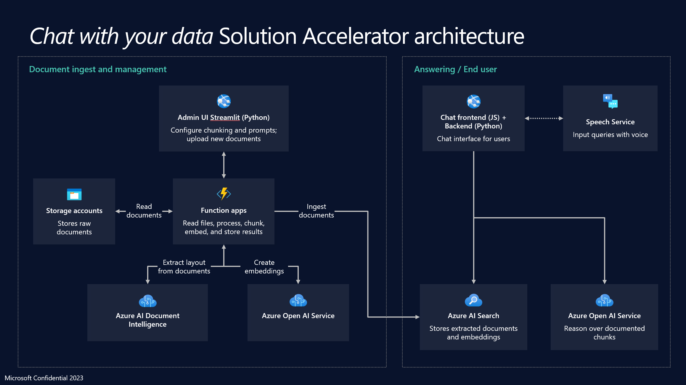

- To install Azure CLI and Node.js on your local machine.

- To assign an owner role to the user.

- To install the Dev Containers extension and set up the development
  environment.

- To deploy a chat application to Azure and use it to get answers from
  PDF files.

- To delete the deployed resources and models.

## Task 1: Install Azure Cli and set the policy scope to Local machine

1.  In your windows search bar, type **PowerShell**. In the
    **PowerShell** dialog box, navigate and click on **Run as
    administrator**. If you see the dialog box - **Do you want to allow
    this app to make changes to your device?** then click on the **Yes**
    button.

>  alt="A screenshot of a computer Description automatically generated" />

2.  Run the following command to install Azure Cli on the PowerShell

PowerShell copy

> **winget search Microsoft.PowerShell**

3.  Run the following command

> PowerShell copy
>
> winget install --id Microsoft.Powershell --source winget

4.  Verify the Installation, run the following command

PowerShell copy

> pwsh

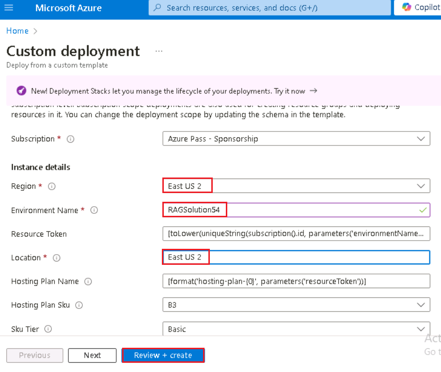

## Task 2: Install .NET

1.  Open your browser, navigate to the address bar, type or paste the
    following URL:
    https://dotnet.microsoft.com/en-us/download/dotnet/8.0 then press
    the **Enter** button.

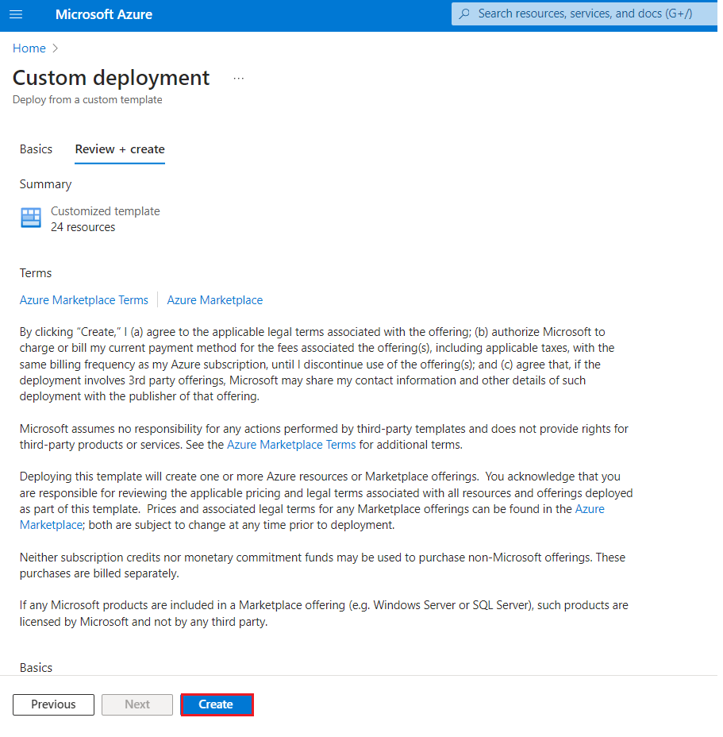

2.  Select and click on **Windows -x64**

3.  In Downloads Click on the **Open** button.

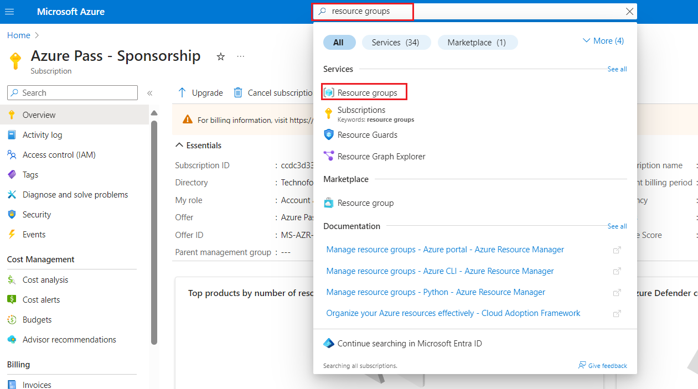

4.  **Dotnet-sdk** file will be downloaded. Click on the downloaded file
    to set up **Dotnet-sdk**

5.  In the **Microsoft .NET SDK 8.0.401** window, click on the
    **Install** button

6.  Click on the **Yes** button

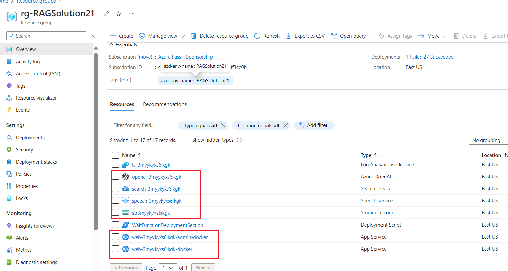

7.  In the **Microsoft .NET SDK 8.0.401** window, click on the Close
    button

## Task 3: Run the Docker

1.  In your Windows search box, type Docker , then click on **Docker
    Desktop**.

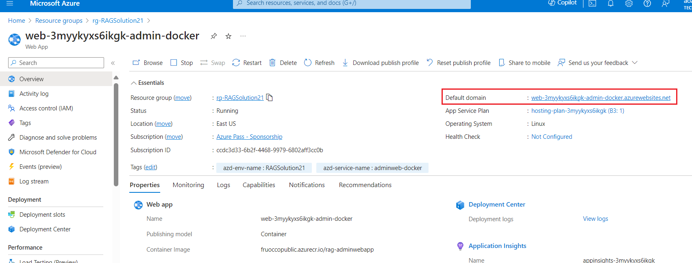

2.  Run the Docker Desktop.

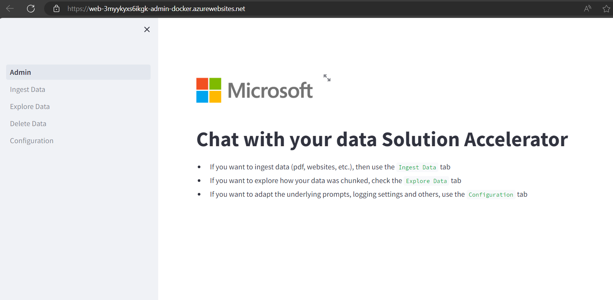

## **Task 4: Deploy Azure services needed for the application**

1.  Change the current directory to the **Labfiles** directory and
    navigate into the project cd .\\**Chat** folder by running the below
    commands.

> cd\\
>
> **+++cd Labfiles+++**
>
> **+++cd .\Chat+++**
>
>  alt="A screenshot of a computer program Description automatically generated" />

2.  Run the below command to install azure cli

> **+++winget install microsoft.azd+++**
>
> 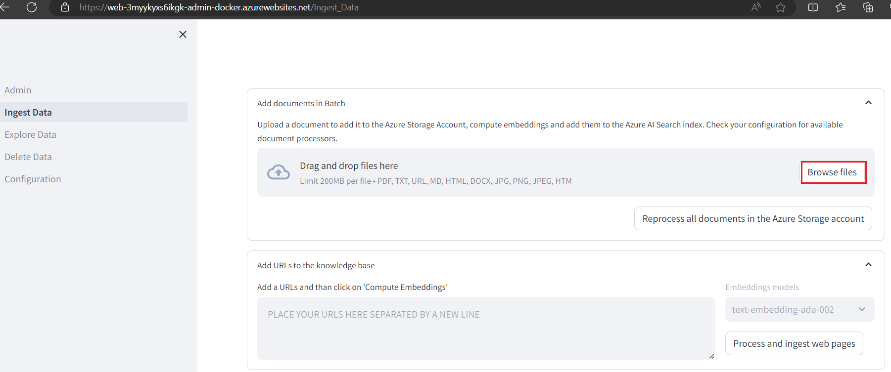 alt="A blue screen with white text Description automatically generated" />

3.  Run the below command to login the azure portal

> **+++azd auth login+++**

4.  Default browser opens to sign in .Sign in with your Azure
    subscription account.

> 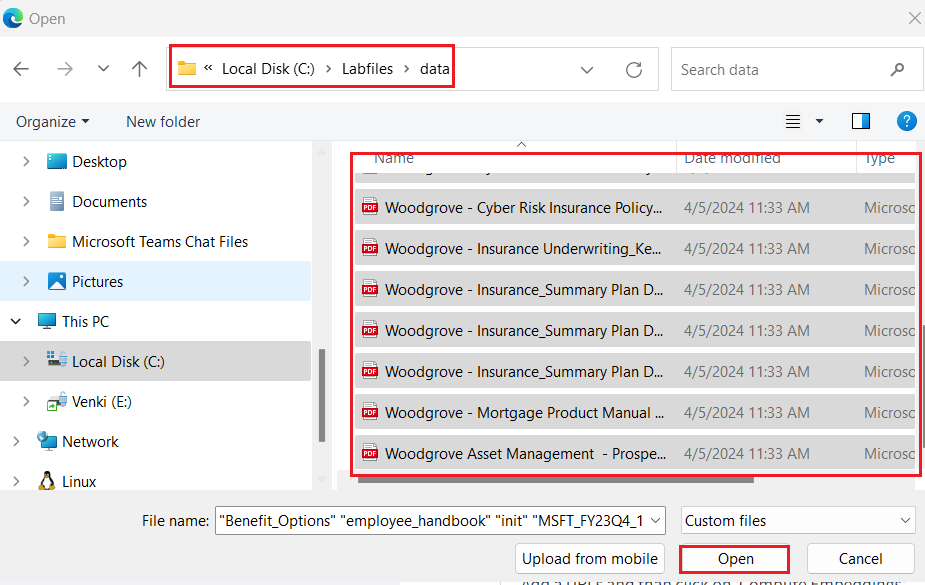
>
> 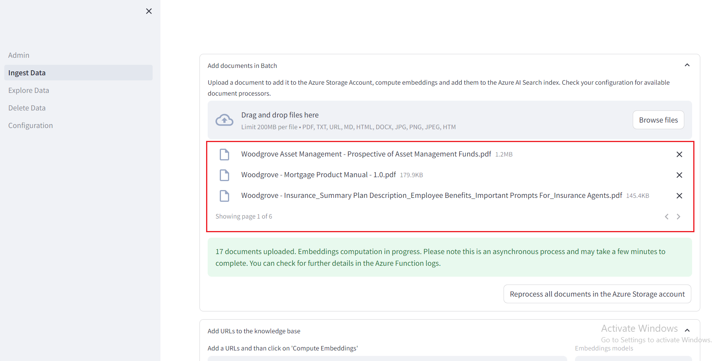

5.  Close the browser

>  alt="A screenshot of a computer Description automatically generated" />
>
>  alt="A screenshot of a computer program Description automatically generated" />

6.  Run azd up - This will provision Azure resources and deploy this
    sample to those resources, including building the search index based
    on the files found in the ./data folder.

> **+++azd up+++**

7.  When prompted, select a **subscription** to create the resources and
    select a location **East US2**, This location is used for most the
    resources including hosting. 

**Note:** For this use case, you will use a GPT-4, text-embedding-ada-2
models. This models is currently only available in [certain
regions](https://learn.microsoft.com/azure/ai-services/openai/concepts/models#embeddings-models).
Please select a region from this list, In this lab **East US2** is using
for this resource

>  

8.  Wait until app is deployed. It may take 20-30 minutes for the
    deployment to complete.

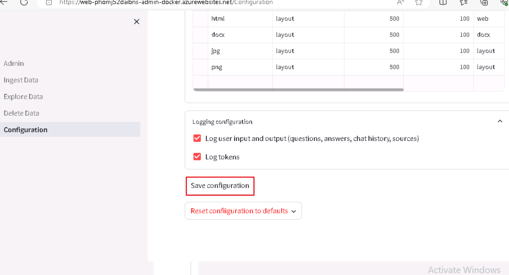

>  style="width:6.49167in;height:4.54167in" />

9.  After the application has been successfully deployed, you see a URL
    displayed in the terminal. Copy the **URL**

> 

10. Open a browser go to <https://portal.azure.com> and sign in with
    your Azure subscription account.

11. On the Home page, click on **Resource Groups**

> 

12. Click on your resource group.

> 

13. Make sure the below resource got deployed successfully

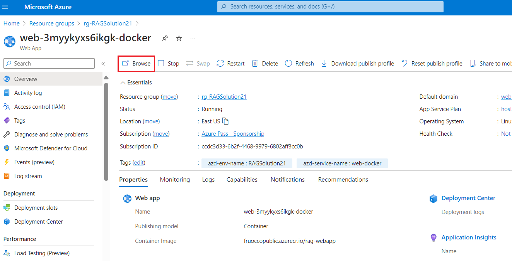

14. On the resource group and click on **Azure OpenAI** resource name.

>  style="width:6.49167in;height:3.68333in" />

15. On the **Azure OpenAI** window, click on **Overview** in the left
    navigation menu, then under the **Get Started** tab, click on the
    **Go to Azure OpenAI Studio** button to open **Azure OpenAI Studio**
    in a new browser.

> 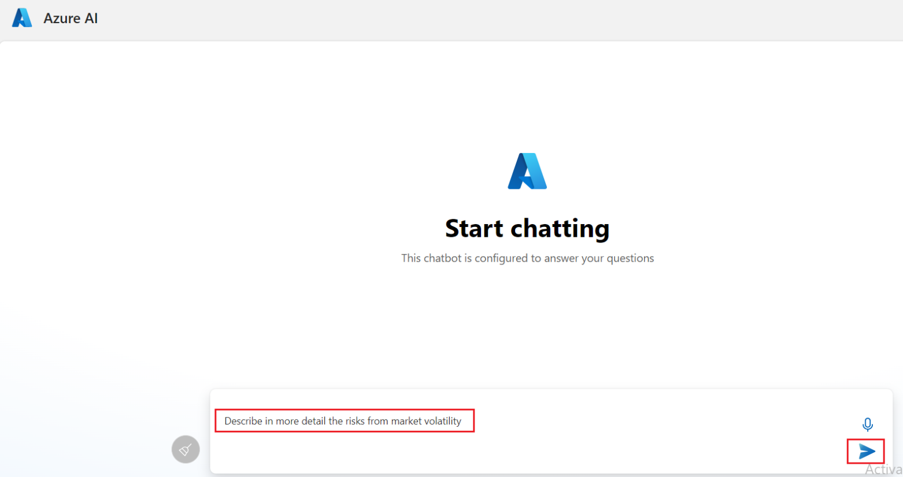

16. Make sure **gpt-4o-mini**, **text-embedding-ada-002** should be
    deployed successfully .

> 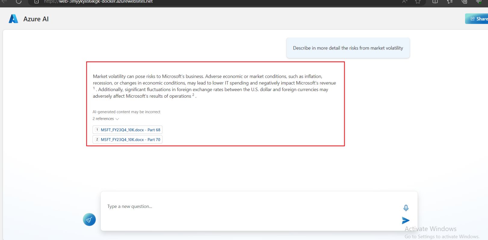

17. On the resource group and click on **storage account** resource
    name.

> 
>
>  style="width:6.38722in;height:3.3125in" />

18. Now open the URL it into a browser

> 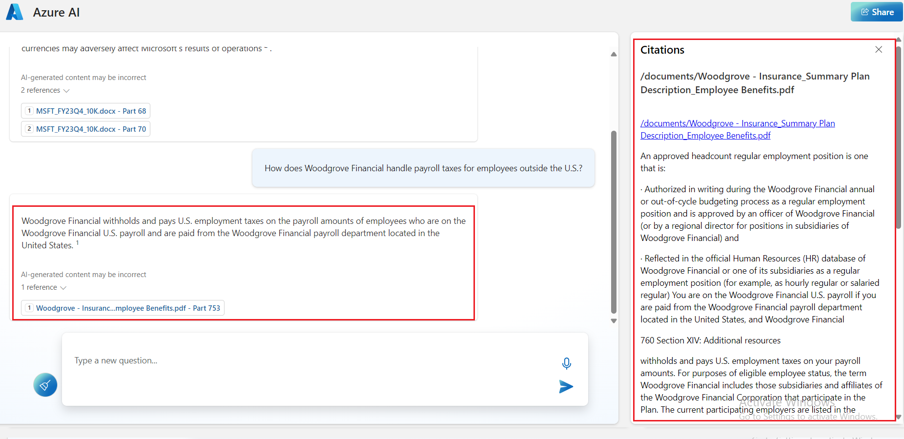

19. Click on the **Chat**

> 

20. In the **Blazor OpenAI** web app page, enter the following text and
    click on the **Submit icon** as shown in the below image.

> **+++What is included in my Northwind Health Plus plan that is not in
> standard?+++**
>
>  style="width:7.11468in;height:3.85417in" />
>
>  alt="A screenshot of a computer Description automatically generated" />

21. In the **Blazor OpenAI** web app page, enter the following text and
    click on the **Submit icon** as shown in the below image.

> **+++Can I use out-of-network providers?+++**
>
>  style="width:6.76639in;height:3.70417in" />
>
>  style="width:6.23588in;height:3.38976in" />

22. In the **Blazor OpenAI** web app page, enter the following text and
    click on the **Submit icon** as shown in the below image.

> **+++Are there any exclusions or restrictions?+++**
>
>  style="width:6.49167in;height:3.20833in" />
>
> 

23. In the **Blazor OpenAI** web app page, enter the following text and
    click on the **Submit icon** as shown in the below image.

> **+++What does a Product Manager do?+++**
>
> 

24. Click on the **Documents.**

>  style="width:6.69595in;height:3.6875in" />

## Task 5: Delete the Resources

1.  To delete Resource group , type **Resource groups** in the Azure
    portal search bar, navigate and click on **Resource groups** under
    **Services**.

>  alt="A screenshot of a computer Description automatically generated" />

2.  Click on the resource group.

>  style="width:5.30307in;height:4.0125in" />

3.  In the resource group home page , select **Delete resource group**
    button.

>  alt="A screenshot of a computer Description automatically generated" />

4.  On the Delete a resource group tab, enter the resource group and
    click on the **Delete** button.

>  alt="A screenshot of a computer error Description automatically generated" />

**Summary**

In this lab, you’ve learned how to set up and deploy an intelligent chat
application using Azure's suite of tools and services. Starting with the
installation of essential tools like Azure CLI and Node.js, you’ve
configured your development environment using Dev Containers in Visual
Studio Code. You've deployed a chat application that utilizes Azure
OpenAI and Azure Cognitive Search to answer questions from PDF files.
Finally, you’ve deleted the deployed resources to effectively manage
resources. This hands-on experience has equipped you with the skills to
develop and manage intelligent chat applications using the Retrieval
Augmented Generation pattern on Azure.
