**Introduction**

This sample demonstrates a few approaches for creating ChatGPT-like
experiences over your own data using the Retrieval Augmented Generation
pattern. It uses Azure OpenAI Service to access the ChatGPT model
(gpt-35-turbo), and Azure Cognitive Search for data indexing and
retrieval.

The repo includes sample data so it's ready to try end to end. In this
sample application we use a fictitious company called Contoso
Electronics, and the experience allows its employees to ask questions
about the benefits, internal policies, as well as job descriptions and
roles.

This use case you through the process of developing a sophisticated chat
application using the Retrieval Augmented Generation (RAG) pattern on
the Azure platform. By leveraging Azure OpenAI Service and Azure
Cognitive Search, you will create a chat application that can
intelligently answer questions using your own data. This lab uses a
fictitious company, Contoso Electronics, as a case study to demonstrate
how to build a ChatGPT-like experience over enterprise data, covering
aspects such as employee benefits, internal policies, and job roles.

**Objective**

- To install Azure CLI and Node.js on your local machine.

- To assign an owner role to the user.

- To install the Dev Containers extension and set up the development
  environment.

- To deploy a chat application to Azure and use it to get answers from
  PDF files.

- To delete the deployed resources and models.

## Task 1: Install Azure Cli and set the policy scope to Local machine

1.  In your windows search bar, type **PowerShell**. In the
    **PowerShell** dialog box, navigate and click on **Run as
    administrator**. If you see the dialog box - **Do you want to allow
    this app to make changes to your device?** then click on the **Yes**
    button.

>  alt="A screenshot of a computer Description automatically generated" />

2.  Run the following command to install Azure Cli on the PowerShell

PowerShell copy

> **winget install microsoft.azd**

3.  Run the below command to set the policy to **Unrestricted** and
    enter **A** when asked to change the execution policy.

> **Set-ExecutionPolicy Unrestricted**
>
> 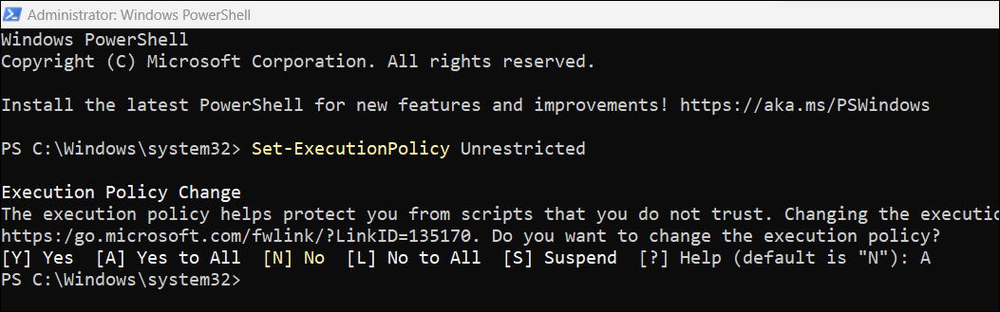 alt="A computer screen with white text Description automatically generated" />

## Task 2: Install Node.js

1.  Open your browser, navigate to the address bar, type or paste the
    following URL: <https://nodejs.org/en/download/> then press the
    **Enter** button.

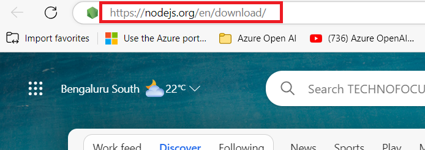

2.  Select and click on **Windows Installer**.

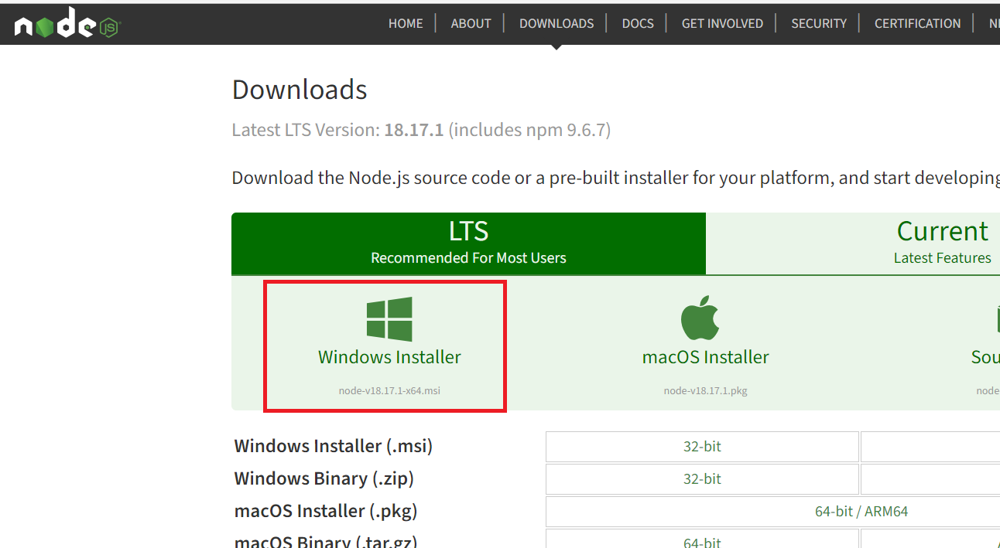

3.  **Node-V** file will be downloaded. Click on the downloaded file to
    set up **Node.js**

4.  In the **Welcome to the Node.js Setup Wizard** window, click on the
    **Next button**.

5.  In the **End-User License Agreement** window, select **I accept the
    terms in the License agreement** radio button and click on the
    **Next** button.

6.  In the **Destination Folder** window, click on the **Next** button.

7.  In the **Custom Setup** window, click on the **Next** button.

8.  In Ready to install Node.js window, click on **Install.**

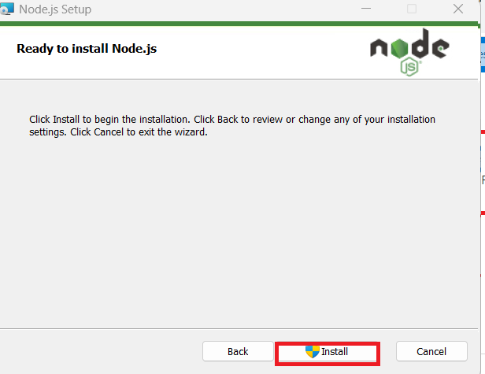

9.  In **Completing the Node.js Setup Wizard window**, click on the
    **Finish** button to complete the installation process.

## Task 3: Assign a user as an owner of an Azure subscription

1.  Open your browser, navigate to the address bar, and type or paste
    the following URL:
    [<u>https://portal.azure.com/</u>](https://portal.azure.com/), then
    press the **Enter** button.

>  alt="A screenshot of a computer Description automatically generated" />

2.  In the **Microsoft Azure** window, use the **User Credentials** to
    login to Azure.

3.  Then, enter the password and click on the **Sign in** button**.**

>  alt="A screenshot of a login box Description automatically generated" />

4.  In **Stay signed in?** window, click on the **Yes** button.

> 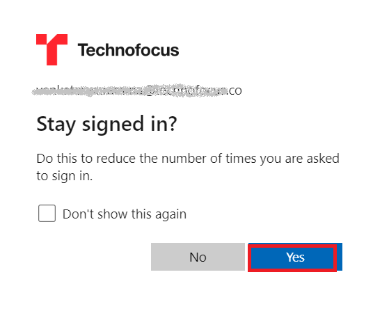 alt="Graphical user interface, application Description automatically generated" />

5.  Type in **Subscriptions** in the search bar and select
    **Subscriptions**.

6.  Click on your assigned **subscription**.

7.  From the left menu, click on the **Access control(IAM).**

8.  On the Access control(IAM) page, Click +**Add** and select **Add
    role assignments.**

9.  In the Role tab, select the **Privileged administrator roles** and
    select **Owner** . Click **Next**

10. In the **Add role assignment** tab, select Assign access to User
    group or service principal. Under Members, click **+Select members**

11. On the Select members tab , select your Azure OpenAI credentials and
    click **Select.**

12. In the **Add role assignment** page, Click **Review + Assign**, you
    will get a notification once the role assignment is complete.

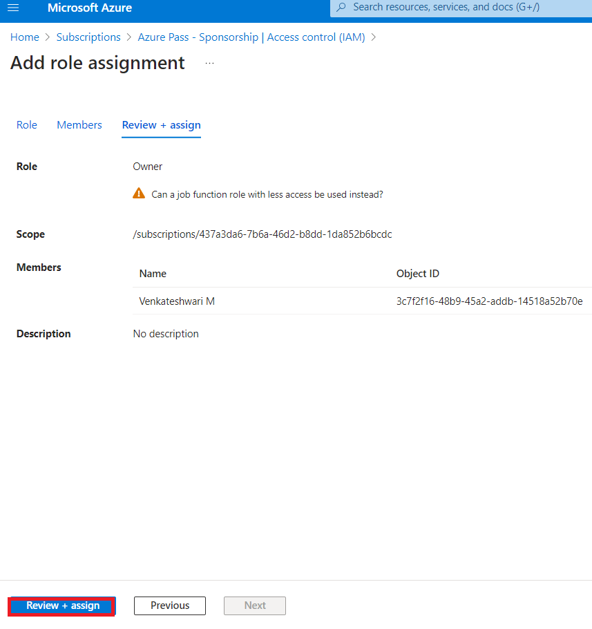

13. You will see a notification – added as Owner for Azure
    Pass-Sponsorship.

## Task 4: Run the Docker

1.  In your Windows search box, type Docker , then click on **Docker
    Desktop**.

2.  Run the Docker Desktop.

## **Task 5:** **Install Dev Containers extension**

1.  In your Windows search box, type Visual Studio, then click on
    **Visual Studio Code**.

>  style="width:4.94583in;height:4.94583in" />

2.  Open your browser, navigate to the address bar, type or paste the
    following URL:
    [https://marketplace.visualstudio.com/items?itemName=ms-vscode-remote.remote-containers](https://marketplace.visualstudio.com/items?itemName=ms-vscode-remote.remote-containers%20)
    then press the **Enter** button.

>  alt="A screenshot of a computer Description automatically generated" />

3.  On Dev Containers page, select on Install button.

4.  Open Visual Studio Code? dialog box appears, then click on the
    **Open Visual Studio Code** button.

5.  Open the Visual Studio Code.

## Task 6: Open development environment

1.  Open your browser, navigate to the address bar, type or paste the
    following URL:
    <https://vscode.dev/redirect?url=vscode://ms-vscode-remote.remote-containers/cloneInVolume?url=https://github.com/azure-samples/azure-search-openai-demo>

then press the **Enter** button.

2.  Open Visual Studio Code? dialog box appears, then click on the
    **Open Visual Studio Code** button.

3.  To Staring Dev container will take 13-15 min

>  alt="A screenshot of a computer Description automatically generated" />

4.  Sign in to Azure with the Azure Developer CLI. Run the following
    command on the Terminal

> BashCopy
>
> **azd auth login**
>
> 

5.  Default browser opens to sign in .Sign in with your Azure
    subscription account.

> 
>
> 

6.  Close the browser

7.  Once logged in, the details of the Azure login are populated in the
    terminal.

>  alt="A screenshot of a computer Description automatically generated" />

## Task 7: Deploy chat app to Azure

1.  Run the following Azure Developer CLI command to provision the Azure
    resources and deploy the source code

> BashCopy
>
> **azd up**

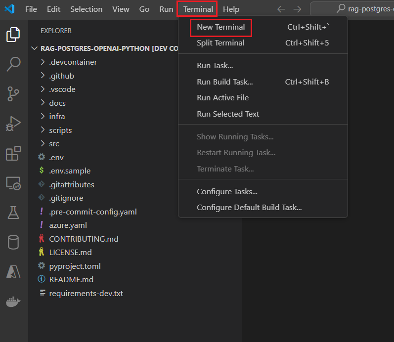

2.  prompted to enter an environment name, enter the **chatsampleRAG**

>  style="width:6.98784in;height:4.2375in" />

3.  When prompted, select a **subscription** to create the resources and
    select a location **East US2**, This location is used for most the
    resources including hosting. 

> 

4.  When prompted, **enter a value for the ‘openAiResourceGroupLocation’
    infrastructure parameter** select **East US2.**

> 

5.  When prompted, enter a values for openai resource group locatin
    infrastructure parameter then select **East US 2
    .**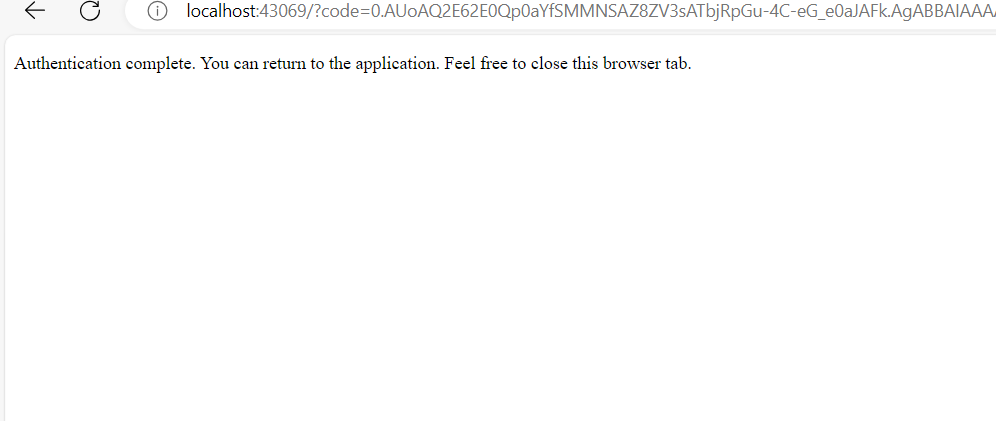

6.  save the value in the environment for future use (y/N) enter **Y.**

> 

7.  Wait until app is deployed. It may take 35-40 minutes for the
    deployment to complete.

>  alt="A screenshot of a computer Description automatically generated" />

8.  After the application has been successfully deployed, you see a URL
    displayed in the terminal. Copy the **URL**.

9.  Open your browser, navigate to the address bar, paste the link. Now,
    resource group will open in a new browser

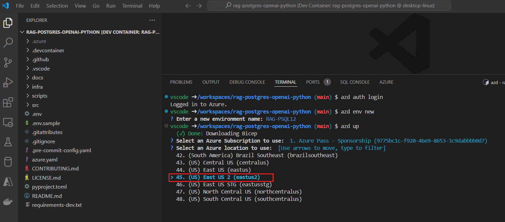

## Task 8: Use chat app to get answers from PDF files

1.  Wait for the web application deployment to complete.

2.  In the **GPT+Eneterprise data \|Sample** web app page, enter the
    following text and click on the **Submit icon** as shown in the
    below image.

> **What happens in a performence review?**

3.  From the answer, select a **citation**.

4.  In the right-pane, use the tabs to understand how the answer was
    generated.

| **Tab** | **Description** |
|----|----|
| **Thought process** | This is a script of the interactions in chat. You can view the system prompt (content) and your user question (content). |
| **Supporting content** | This includes the information to answer your question and the source material. The number of source material citations is noted in the **Developer settings**. The default value is **3**. |
| **Citation** | This displays the original page that contains the citation. |

5.  Select the selected tab again to close the pane.

6.  The intelligence of the chat is determined by the OpenAI model and
    the settings that are used to interact with the model.

7.  Select the **Developer settings**.

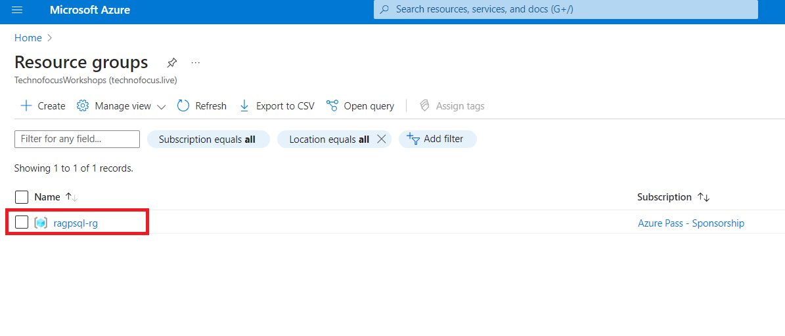

| **Setting** | **Description** |
|----|----|
| Override prompt template | This is the prompt that is used to generate the answer. |
| Retrieve this many search results | This is the number of search results that are used to generate the answer. You can see these sources returned in the *Thought process* and *Supporting content* tabs of the citation. |
| Exclude category | This is the category of documents that are excluded from the search results. |
| Use semantic ranker for retrieval | This is a feature of [Azure AI Search](https://learn.microsoft.com/en-us/azure/search/semantic-search-overview#what-is-semantic-search) that uses machine learning to improve the relevance of search results. |
| Use query-contextual summaries instead of whole documents | When both Use semantic ranker and Use query-contextual summaries are checked, the LLM uses captions extracted from key passages, instead of all the passages, in the highest ranked documents. |
| Suggest follow-up questions | Have the chat app suggest follow-up questions based on the answer. |
| Retrieval mode | **Vectors + Text** means that the search results are based on the text of the documents and the embeddings of the documents. **Vectors** means that the search results are based on the embeddings of the documents. **Text** means that the search results are based on the text of the documents. |
| Stream chat completion responses | Stream response instead of waiting until the complete answer is available for a respon |

8.  Check the **Suggest follow-up questions** checkbox and ask the same
    question again.

9.  Enter the following text and click on the **Submit icon** as shown
    in the below image.

> What happens in a performance review?

10. The chat returned suggested follow-up questions such as the
    following

11. In the **Settings** tab, deselect **Use semantic ranker for
    retrieval**.

12. Enter the following text and click on the **Submit icon** as shown
    in the below image.

> What happens in a performance review?

## Task 9: Delete the Resources

1.  To delete Resource group , type **Resource groups** in the Azure
    portal search bar, navigate and click on **Resource groups** under
    **Services**.

>  alt="A screenshot of a computer Description automatically generated" />

2.  Click on the sample web app resource group.

>  style="width:4.73333in;height:4.36667in" />

3.  In the resource group home page , select **Delete resource group**
    button.

4.  On the Delete a resource group tab, enter the resource group and
    click on the **Delete** button.

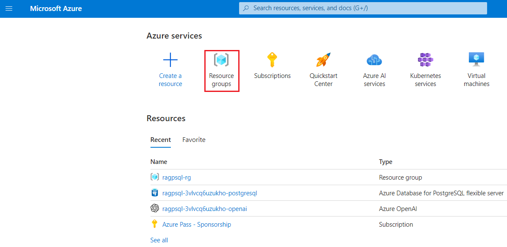

**Summary**

In this lab, you’ve learned how to set up and deploy an intelligent chat
application using Azure's suite of tools and services. Starting with the
installation of essential tools like Azure CLI and Node.js, you’ve
configured your development environment using Dev Containers in Visual
Studio Code. You've deployed a chat application that utilizes Azure
OpenAI and Azure Cognitive Search to answer questions from PDF files.
Finally, you’ve deleted the deployed resources to effectively manage
resources. This hands-on experience has equipped you with the skills to
develop and manage intelligent chat applications using the Retrieval
Augmented Generation pattern on Azure.
