# **Use Case 05: Implementing Q&A using semantic answering**

**Introduction**

A simple web application for an OpenAI-enabled document search. This
repo uses Azure OpenAI Service for creating embeddings vectors from
documents. For answering the question of a user, it retrieves the most
relevant document and then uses GPT-3 to extract the matching answer for
the question.

**Objectives**

- To deploy chat and embedding models in Azure AI Studio.

- To use a custom template for deploying the required resources such as
  App Service, Search Service, Form recognizer, etc.

- To deploy aoaichatsearch-site Web App and perform Azure OpenAI-enabled
  document search, text summarization, and conversation data extraction.

- To delete the deployed resources and models.

## **Task 1: Create Azure OpenAI resource**

1.  From the Azure portal home page, click on **Azure portal menu**
    represented by three horizontal bars on the left side of the
    Microsoft Azure command bar as shown in the below image.

      

2.  Navigate and click on **+ Create a resource**.

      

3.  On **Create a resource** page, in the **Search services and
    marketplace** search bar, type **Azure OpenAI**, then press the
    **Enter** button.

      

4.  In the **Marketplace** page, navigate to the **Azure OpenAI**
    section, click on the Create button dropdown, then select **Azure
    OpenAI** as shown in the image. (In case, you’ve already clicked on
    the **Azure** **OpenAI** tile, then click on the **Create** button
    on the **Azure OpenAI page**).

      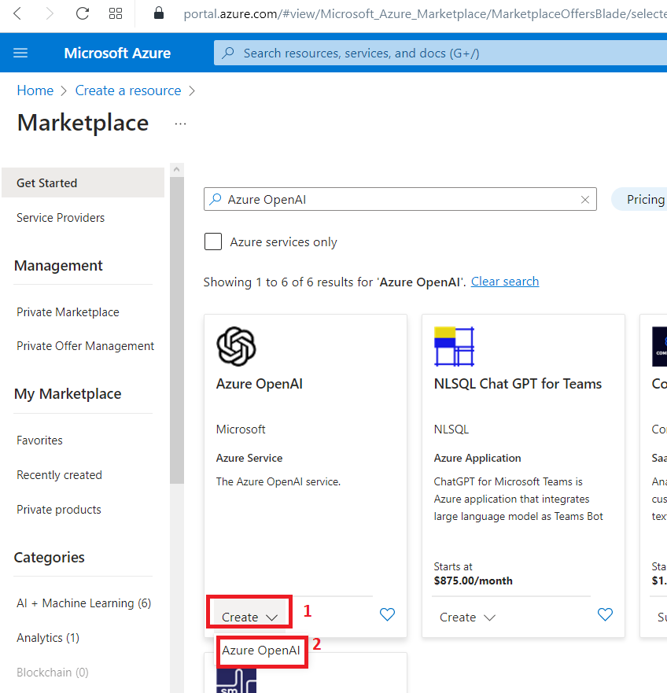

5.  In the **Create Azure OpenAI** window, under the **Basics** tab,
    enter the following details and click on the **Next** button.

      |  |   |
      |----|---|
      |Subscription|	Select the assigned subscription|
      |Resource group|Click on Create new> enter AOAI-RGXX(XX can be a unique number, you can add more digits after XX to make the name unique)|
      |Region|	Select East US|
      |Name|	Azure-openai-testXX (XX can be a unique number, you can add more digits after XX to make the name unique) (here, we entered Azure-open-test39)|
      |Pricing tier	|Select Standard S0|

      
      

6.  In the **Network** tab, leave all the radio buttons in the default
    state, and click on the **Next** button.

      

7.  In the **Tags** tab, leave all the fields in the default state, and
    click on the **Next** button.

      

8.  In the **Review+submit** tab, once the Validation is Passed, click
    on the **Create** button.

      

9.  Wait for the deployment to complete. The deployment will take around
    **2-3** minutes.

10. On **Microsoft.CognitiveServicesOpenAI** window, after the
    deployment is completed, click on the **Go to resource** button.

      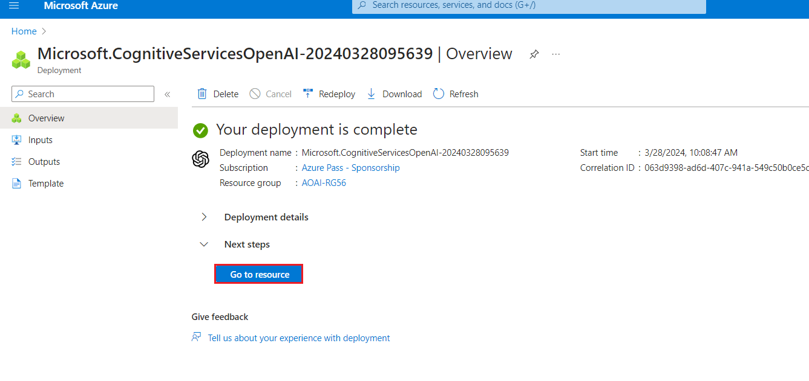

11. In your **Azure-open-testXX | Model deployments** window, navigate
    to the **Resource Management** section, and click on **Keys and
    Endpoints**.

      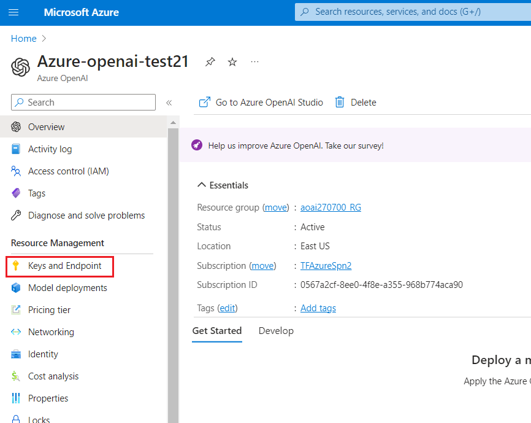

12. In **Keys and Endpoints** page, copy **KEY1, KEY 2,** and
    **Endpoint** values and paste them in a notepad as shown in the
    below image, then **Save** the notepad to use the information in the
    upcoming lab.

       

## **Task 2: Deploy the Chat model and Embedding model**

1.  In **Azure-openai-testXX** page, click on **Overview** in the
    left-sided navigation menu, scroll down and click on **Go to Azure
    OpenAI Studio** button as shown in the below image.

      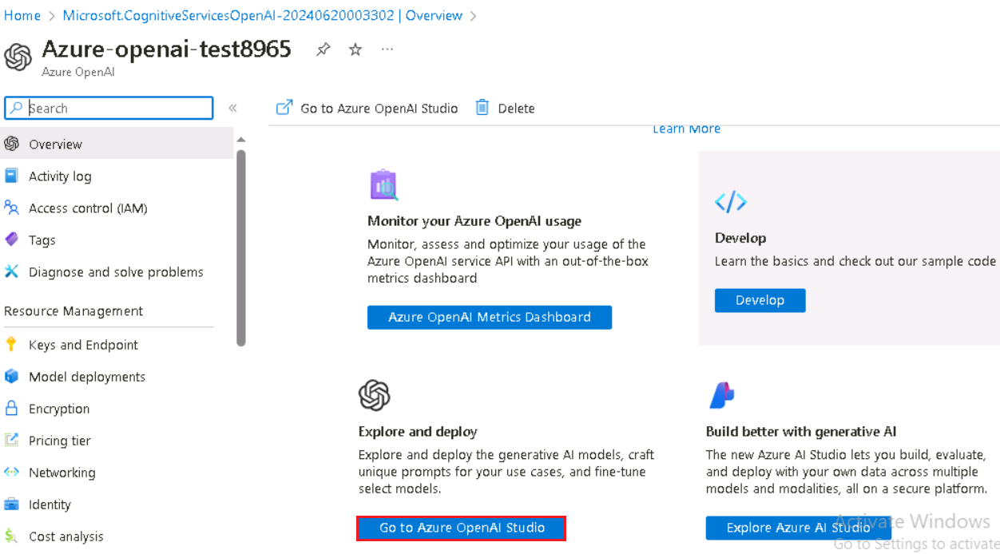

2.  Wait for the Azure OpenAI studio to launch.

      

3.  On the **Azure OpenAI Studio** homepage, click on **Create new
    deployment** button.

      

4.  In the **Deployments** page, click on +**Create new deployment**.

      

5.  In the **Deploy model dialog** box, under the **Model name** field,
    click on the V chevron button; navigate and select carefully
    **gpt-4**.

6.  Select the **Model version** as **0125-Preview,** in the
    **Deployment type** as **Standard, Deployment name field**, enter
    !!gpt-4!!, and click on the **Create** button.

      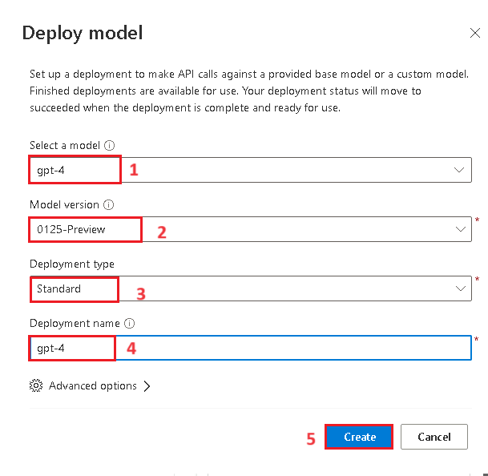

7.  You will see a notification – **Successfully Created deployment**
    when the deployment is succeeded. (You can also view the
    notification by clicking on the bell icon beside **Azure AI | Azure
    OpenAI Studio**).

     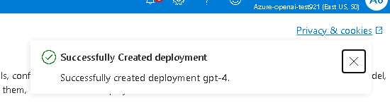

8.  In the **Deployments** page, click on +**Create new deployment**.

      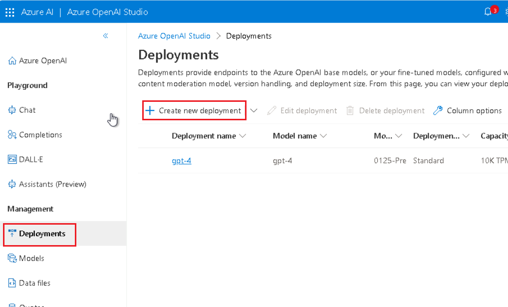

9.  In the **Deploy model dialog** box, under the **Model name** field,
    click on the V chevron button; navigate and carefully select
    **text-embedding-ada-002**. Select the **Model version** as **2
    (Default),** in the **Deployment name field**, enter
    !!text-embedding-ada-002!!, and click on the **Create** button.

      

10. You will see a notification – **Successfully Created deployment**
    when the deployment is succeeded. (You can also view the
    notification by clicking on the bell icon beside **Azure AI | Azure
    OpenAI Studio**).

      

## **Task 3: Deploy on Azure (WebApp + Batch Processing) with Azure Cognitive Search**

1.  Open your edge browser, navigate to the address bar, and type or
    paste the following URL:
    !!https://portal.azure.com/#create/Microsoft.Template/uri/https%3A%2F%2Fraw.githubusercontent.com%2Fruoccofabrizio%2Fazure-open-ai-embeddings-qna%2Fmain%2Finfrastructure%2Fdeployment_ACS.json!!
    then press the **Enter** button.
       

2.  On **Custom deployment** window, under the **Basics** tab, enter the
    following details to deploy the custom template and then click on
    **Review + create.**

    |   |  |
    |-----|----|
    |Subscription	|Select your Azure OpenAI subscription|
    |Resource group|	Select the Resource group that you’ve created in Task 1|
    |Resource Prefix	|!!aoaichatsearchXXXX!!(can be a unique name) |
    |Azure Cognitive Search Sku|	Standard |
    |Hosting plan Sku	|B3|
    |OpenAI Name|	Enter your OpenAI name that you have created in Task#1 (here, we entered Azure-openai-test21)|
    |OpenAI Key|	Enter your OpenAI key that you have saved in your notepad in Task #2|
    |Open AI Engine|	gpt-4 |
    |Open AI Deployment Type|	Chat |
    |Open AI Embeddings Engine Doc	|text-embeddeding-ada-002|
    |Open AI Embeddings Engine Query	|text-embeddeding-ada-002|

      
      

3.  On **Review + create** tab, once the Validation is Passed, click on
    the **Create** button.

      

4.  Wait for the deployment to complete. The deployment will take around
    15-17 minutes.

      

5.  Click on the **Go to resource group** button.

      

## **Task 4: Azure OpenAI-enabled document search through web application**

1.  On the **aoaiXXX-RG** resource group window, under **Resources**
    tab, navigate to the **App Service** - **aoaaichatsearch-site** and
    click on it.

      

2.  On **aoaichatsearch-site** Web App **Overview** page, navigate to
    the command bar and click on **Browse**, it will navigate you to the
    web application.

      

3.  Wait for the web application deployment to complete. The deployment
    will take approximately **10-15** minutes.

      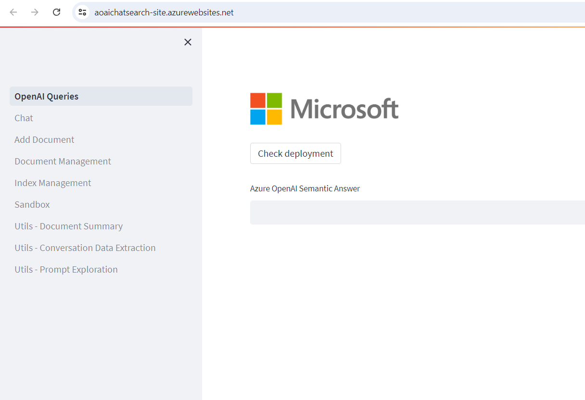

4.  On the web application home page, to verify the deployments status
    click on the **Check deployments** button under Microsoft.

      

5.  To check the deployment status, it may take around 5-6 min.

      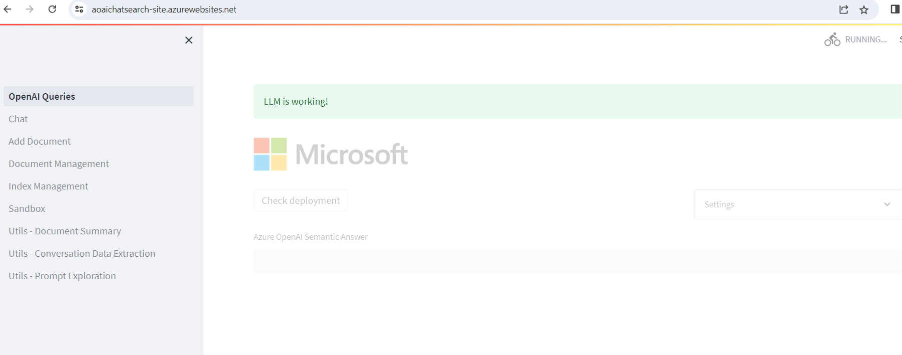

      

6.  On Web App home page, navigate and click on **Add Document** on the
    left-hand side to add the data.

      

7.  On **Add Document** pane, click on the **Browse files** button to
    upload documents that needs to be added to the knowledge base.

     

8.  Navigate to **C:\Labfiles\Contoso Electronics** location in the VM
    and select **Benefit_Options.pdf,** then click on **Open** button.

      

9.  Click again on the **Browse files,** navigate to
    **C:\Labfiles\Contoso Electronics** location in the VM and select
    **employee_handbook.pdf**, then click on **Open** button.

      

      

10. Similarly, add **Northwind_Health_Plus_Benefits_Details.pdf** and
    **Northwind_Standard_Benefits_Details.pdf**

      

      

11. The uploaded data will be added to the knowledge base and it’ll take
    approximately 5-7 minutes.

12. Click on **Document Management** to verify whether the files are
    successfully uploaded or not.

     

     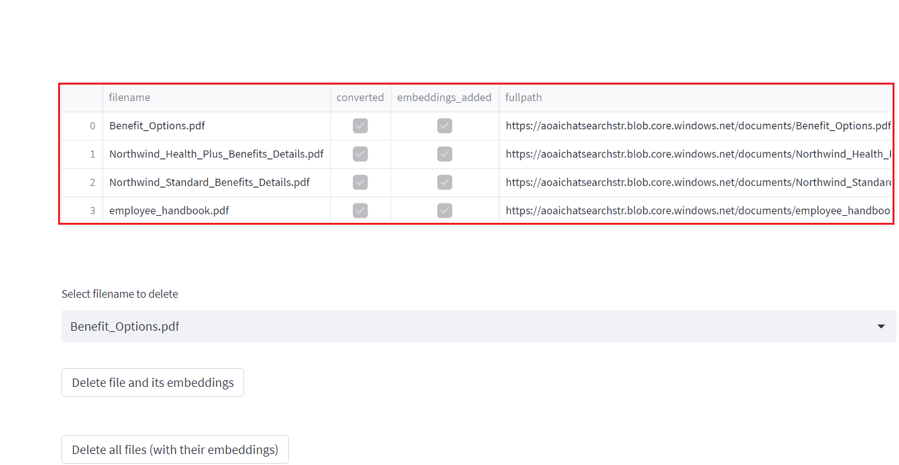

13. Click on **Index Management** to verify the files, keys, and source.

     

14. Then, click on **Chat.**

      

15. In the **Chat session** section, enter the following prompt, then
    press the **Enter** button and view the response.

**You**: !!what is the employee's portion of the healthcare cost from
each paycheck in Contoso Electronics!!
      
       

16. In the **Chat session** section, click on the **Clear chat** button.

      

17. In the **Chat session** section, enter the following prompt, then
    press the **Enter** button and view the response.

      **You**: !!How do I file a complaint or appeal with Northwind Health
      Plus?!!
       

18. In the **Chat session** section, click on the **Clear chat** button.

      

19. In the **Chat session** section, enter the following prompt. then
    press the **Enter** button and view the response.

   **You**: !!Does my plan covers my eye exams?!!
      

20. Click on **Utils-Document Summary** on the left-hand side.

      

21. In the **Summarization** section, select the **Basic Summary** radio
    button . 

       

22. In the **Summarization** window, under **Enter some text to
    summarize** section, in the message box, replace the current text
    with the following, then click on the **Summarize** button.

      It’s been six months since we reinvented search with [the new AI-powered
      Bing and
      Edge](https://blogs.microsoft.com/blog/2023/02/07/reinventing-search-with-a-new-ai-powered-microsoft-bing-and-edge-your-copilot-for-the-web/).
      In that short time, you’ve engaged in so many unique and creative ways;
      to date we’ve seen over 1 billion chats and over 750 million images fill
      the world of Bing! We’ve also seen nine consecutive quarters of growth
      on Edge, meaning we’re more able than ever to bring our best-in-class AI
      experiences to users across the web.
      

23. Check the summary of the text that you’ve entered.

     

24. After reviewing the Summary result, click on the **Clear summary**
    button.

      

25. Now, scroll up and select the **Bullet Points** radio button.
    Under **Enter some text to summarize** section, in the message box,
    replace the current text with the following and then click on the
    **Summarize** button.

+++Microsoft has made its Azure OpenAI Service generally available,
bringing the enterprise generative AI tools out of its invite-only
program. Now any customers who meet Microsoft’s standards can access the
professional versions of OpenAI’s large language model GPT-3.5 and the
related text-to-image tool DALL-E 2, computer programming assistant
Codex, and the popular ChatGPT chatbot interface for the LLM.

Microsoft launched the Azure OpenAI Service with an eye toward offering
businesses a way to develop apps without coding, write reports, and put
together marketing content. The scope has grown since then to encompass
new facets of the OpenAI’s models, including chat and visuals. Those
interested in the tools have to explain how they will use the AI tools
and agree to Microsoft’s ethical guidelines in their application for
access. The decision to widen the Azure OpenAI Service’s availability
arrives in tandem with Microsoft’s plans to integrate ChatGPT and DALL-E
into its Office suite, Bing search engine, and other consumer products.
Azure OpenAI Service followed earlier experiments to integrate GPT-3
into Microsoft projects like the low-code Power Apps programming tool
and the GitHub Copilot programming assistant+++
     

26. You’ll see the summary results in the form of bullet points.

      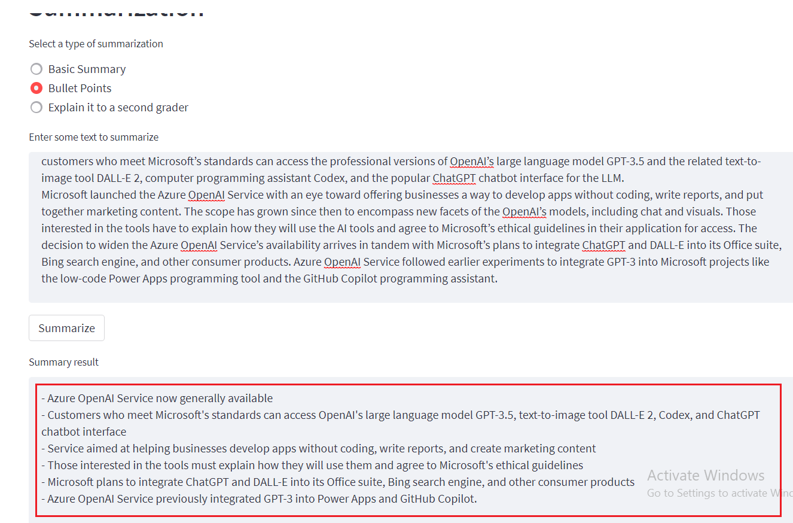

27. Click on **Utils-Conversation Data Extraction** on the left side.

      

28. On the **Conversation data extraction** pane, click on the **Execute
    tasks** and view the response under **OpenAI result**.

      

29. Review the data extracted from the conversation between the Agent
    and the User.

      

## Task 5: Deleting the deployed resources and models

1.  To delete the deployed resources, navigate to **Azure portal home**
    page, click on **Resource groups**.

      

2.  In the Resource groups page, select your resource group.

      

3.  In the **Resource group** home page, select the **delete resource
    group**

      

4.  In the **Delete Resources** pane that appears on the right side,
    navigate to **Enter “resource group name” to confirm deletion**
    field, then click on the **Delete** button.

      

5.  On **Delete confirmation** dialog box, click on **Delete** button.

      

6.  Click on the bell icon, you’ll see the notification –**Deleted
    resource group AOAI-RG89.**

      

**Summary**

You've deployed gpt-35-turbo chat model and text-embedding-ada-002
embedding model in your Azure AI Studio, then you’ve deployed the
necessary resources using a custom template. You've uploaded
unstructured documents in aoaichatsearch-site Web App and extracted the
precise information in a chat session. You've generated basic as well as
bullet points summary from sample texts, then you've extracted the data
from a conversation. At the end of the lab, you've deleted the resources
and models to efficiently manage your Azure OpenAI resources.

