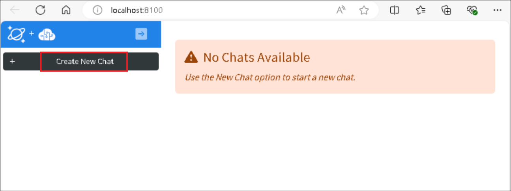
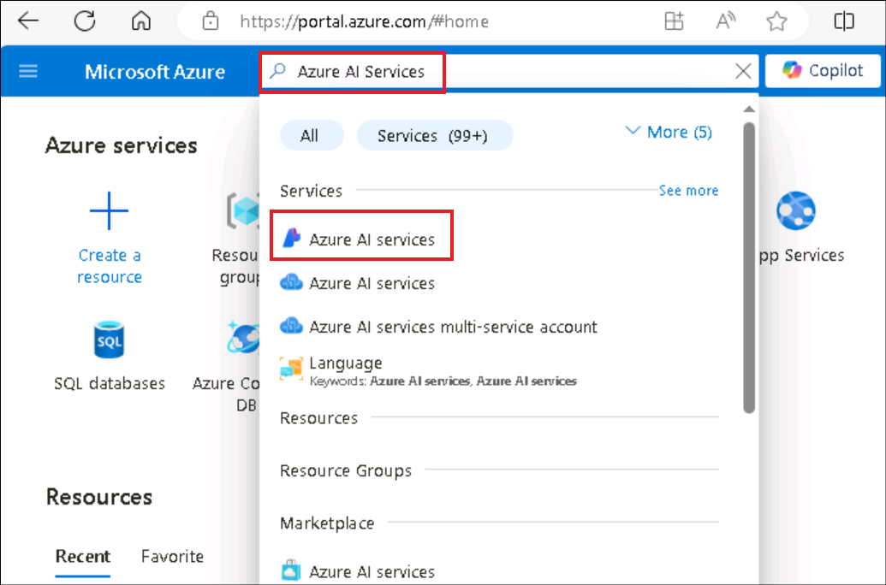

**Introduction**

This scenario creates a web-based chat application with an API backend
that can use OpenAI chat models to answer questions about the items in a
PostgreSQL database table. The frontend is built with React and
FluentUI, while the backend is written with Python and FastAPI.

This scenario provides the following features:

- Hybrid search on the PostgreSQL database table, using [the pgvector
  extension](https://github.com/pgvector/pgvector) for the vector search
  plus [full text
  search](https://www.postgresql.org/docs/current/textsearch-intro.html),
  combining the results using RRF (Reciprocal Rank Fusion).

- OpenAI function calling to optionally convert user queries into query
  filter conditions, such as turning "Climbing gear cheaper than \$30?"
  into "WHERE price \< 30".

- Conversion of user queries into vectors using the OpenAI embedding
  API.

In this use case, you will set up a comprehensive development
environment, deploy a chat application integrated with PostgreSQL, and
verify its deployment on Azure. This involves installing essential tools
like Azure CLI, Node.js, Docker, and Visual Studio Code, configuring
user roles in Azure, deploying the application using Azure Developer
CLI, and interacting with the deployed resources to ensure
functionality.

**Objective:**

- To configure the development environment on Windows by installing
  Azure CLI, Node.js, assigning Azure subscription roles, starting
  Docker Desktop, and enabling Visual Studio Code with Dev Containers
  extension.

- To deploy and test Custom Chat Application with PostgreSQL and OpenAI
  on Azure.

## Exercise 1: set up environment

## Task 1: Install Azure Cli and set the policy scope to Local machine

1.  In your windows search bar, type **PowerShell**. In the
    **PowerShell** dialog box, navigate and click on **Run as
    administrator**. If you see the dialog box - **Do you want to allow
    this app to make changes to your device?** then click on the **Yes**
    button.

>  alt="A screenshot of a computer Description automatically generated" />

2.  Run the following command to install Azure Cli on the PowerShell

PowerShell copy

> **winget install microsoft.azd**

3.  Run the below command to set the policy to **Unrestricted** and
    enter **A** when asked to change the execution policy.

> **Set-ExecutionPolicy Unrestricted**
>
>  alt="A computer screen with white text Description automatically generated" />

## Task 2: Install Node.js

1.  Open your browser, navigate to the address bar, type or paste the
    following URL: !!https://nodejs.org/en/download/!! then press the
    **Enter** button.

2.  Select and click on **Windows Installer**.

3.  **Node-V** file will be downloaded. Click on the downloaded file to
    set up **Node.js**

4.  In the **Welcome to the Node.js Setup Wizard** window, click on the
    **Next button**.

5.  In the **End-User License Agreement** window, select **I accept the
    terms in the License agreement** radio button and click on the
    **Next** button.

6.  In the **Destination Folder** window, click on the **Next** button.

7.  In the **Custom Setup** window, click on the **Next** button.

8.  In Ready to install Node.js window, click on **Install.**

9.  In **Completing the Node.js Setup Wizard window**, click on the
    **Finish** button to complete the installation process.

## Task 3: Assign a user as an owner of an Azure subscription

1.  Open your browser, navigate to the address bar, and type or paste
    the following URL: !!https://portal.azure.com/!!, then press the
    **Enter** button.

>  alt="A screenshot of a computer Description automatically generated" />

2.  In the **Microsoft Azure** window, use the **User Credentials** to
    login to Azure.

3.  Then, enter the password and click on the **Sign in** button**.**

>  alt="A screenshot of a login box Description automatically generated" />

4.  In **Stay signed in?** window, click on the **Yes** button.

>  alt="Graphical user interface, application Description automatically generated" />

5.  Type in **Subscriptions** in the search bar and select
    **Subscriptions**.

6.  Click on your assigned **subscription**.

7.  From the left menu, click on the **Access control(IAM).**

8.  On the Access control(IAM) page, Click +**Add** and select **Add
    role assignments.**

9.  In the Role tab, select the **Privileged administrator roles** and
    select **Owner** . Click **Next**

10. In the **Add role assignment** tab, select Assign access to User
    group or service principal. Under Members, click **+Select members**

11. On the Select members tab , select your Azure OpenAI credentials and
    click **Select.**

12. In the **Add role assignment** page, Click **Review + Assign**, you
    will get a notification once the role assignment is complete.

13. You will see a notification – added as Owner for Azure
    Pass-Sponsorship.

## Task 4: Run the Docker

1.  In your Windows search box, type Docker , then click on **Docker
    Desktop**.

2.  Run the Docker Desktop.

## **Task 5:** **Install Dev Containers extension**

1.  In your Windows search box, type Visual Studio, then click on
    **Visual Studio Code**.

>  alt="A screenshot of a computer Description automatically generated" />

2.  Open your browser, navigate to the address bar, type or paste the
    following URL:
    !!https://marketplace.visualstudio.com/items?itemName=ms-vscode-remote.remote-containers!!
    then press the **Enter** button.

>  alt="A screenshot of a computer Description automatically generated" />

3.  On Dev Containers page, select on Install button.

4.  Open Visual Studio Code? dialog box appears, then click on the
    **Open Visual Studio Code** button.

5.  Open the Visual Studio Code.

## Exercise 2: Deploy the application and test it from the browser

## Task 1: Open development environment

1.  Open your browser, navigate to the address bar, type or paste the
    following URL:
    !!https://vscode.dev/redirect?url=vscode://ms-vscode-remote.remote-containers/cloneInVolume?url=https://github.com/azure-samples/rag-postgres-openai-python!!

then press the **Enter** button.

2.  Open Visual Studio Code? dialog box appears, then click on the
    **Open Visual Studio Code** button.

3.  In case, **Allow an extension to open this URI?** dialog box
    appears, then click on the **Open** button.

4.  In case, **Cloning a repository in a Dev Container may execute
    arbitrary code** dialog box appears, then click on the **Got it**
    button.

5.  To Staring Dev container will take 13-15 min

6.  After cloning the repo press any key

## Task 2: Deploy chat app to Azure

1.  In the **Visual Studio Code** editor, click on **Terminal**, open a
    **New Terminal**.

2.  Sign in to Azure with the Azure Developer CLI. Run the following
    command on the Terminal

> BashCopy
>
> **!!azd auth login!!**

3.  Default browser opens to sign in. Sign in with your Azure
    subscription account.

>  alt="A screenshot of a computer Description automatically generated" />
>
>  alt="A login screen with a red box and blue text Description automatically generated" />

4.  Close the browser

5.  To create an environment for Azure resources, run the following
    Azure Developer CLI command.

> BashCopy
>
> **!!azd env new!!**

6.  prompted to enter an environment name, enter the **ragsqlXX**(XX can
    be a unique number, you can add more digits after XX to make the
    name unique)

**Note:** When creating an environment, ensure that the name consists of
lowercase letters.

7.  Run the following Azure Developer CLI command to provision the Azure
    resources and deploy the source code.

> BashCopy
>
> **!!azd up!!**

8.  When prompted, select a **subscription** to create the resources and
    select the region closest to your location; in this lab, we have
    chosen the East US2
    region.

9.  When prompted, **enter a value for the ‘openAILocation’
    infrastructure parameter** select the region closest to your
    location; in this lab, we have chosen the **North Central US**
    region
    

10. Deployment will take around 19-20 min

11. Deployment completed and front end hosted successfully. Copy the URL
    and paste it into a browser and save URL in notepad

URL look likes-

https://ragpsql-3vlvcq6uzuk-ca.wonderfulcliff-01f39f01.eastus2.azurecontainerapps.io/

## Task 3: Verify deployed resources in the Azure portal

1.  Open a browser go to !!https://portal.azure.com!! and sign in with
    your Azure subscription account.

2.  On the Home page, click on **Resource Groups**.

>  alt="A screenshot of a computer Description automatically generated" />

3.  Click on your resource group name

>  style="width:6.59825in;height:2.8375in" />

4.  Make sure the below resource got deployed successfully

- Container App

- Application Insights

- Container Apps Environment

- Log Analytics workspace

- Azure OpenAI

- Azure Database for PostgreSQL flexible server

- Container registry

>  alt="A screenshot of a computer Description automatically generated" />

5.  On the resource group and click on **Azure OpenAI** resource name.

>  style="width:6.99583in;height:3.76026in" />

6.  On the **Azure OpenAI** window, click on **Overview** in the left
    navigation menu, then under the **Get Started** tab, click on the
    **Go to Azure OpenAI Studio** button to open **Azure OpenAI Studio**
    in a new browser.

>  style="width:7.05191in;height:3.30417in" />

7.  Make sure **gpt-35-turbo**, **text-embedding-ada-002** should be
    deployed successfully

> 

## Task 4: Use chat app to get answers from files

1.  Now open the URL (**(**The URL that you have saved in your notepad
    in the **Exercise 2\> Task 2\>Step 11)** it into a browser.

2.  In the **RAG on database \|OpenAI+PoastgreSQL** web app page,
    **click on Best shoe for hiking?** button and observe the output

3.  Click on the **clear chat.**

4.  In the **RAG on database \|OpenAI+PoastgreSQL** web app page, click
    on **Climbing gear cheaper than \$30** button and observe the output

5.  Click on the **clear chat.**

6.  In the **RAG on database \|OpenAI+PoastgreSQL** web app page, click
    on **Waterproof camping gear?** button and observe the output

## Task 5: Delete the Resources

1.  To delete Resource group , type **Resource groups** in the Azure
    portal search bar, navigate and click on **Resource groups** under
    **Services**.

2.  Click on the sample web app resource group.

> 

3.  In the resource group home page , select **Delete resource group**
    button.

4.  On the Delete a resource group tab, enter the resource group and
    click on the **Delete** button.

Summary:

This use case walks users through deploying a custom chat application
with PostgreSQL and OpenAI on Azure, focusing on cloud-based application
deployment and management.. In this lab, you’ve set up the development
environment, installed necessary tools like Azure CLI and Node.js,
configured Azure resources using Azure Developer CLI, and deployed the
application to Azure Container Apps. In this lab, you’ve gained
proficiency in managing Azure resources, integrating OpenAI for advanced
chat functionalities, and ensuring proper deployment and verification
through Azure Portal. You’ve acquired hands-on experience in deploying
scalable, cloud-native applications with integrated AI capabilities on
Microsoft Azure.
