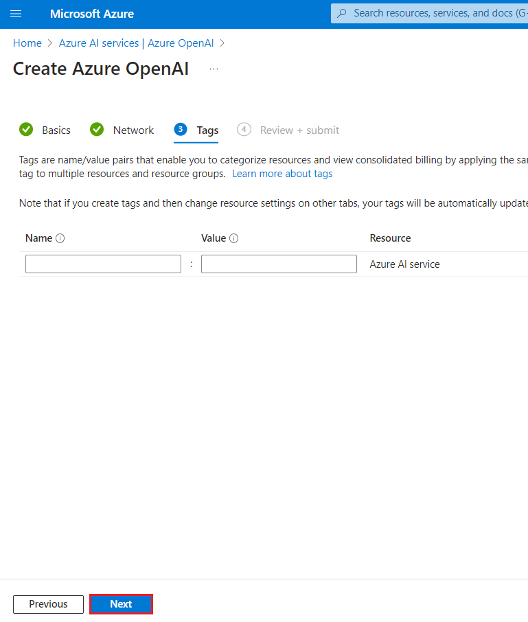
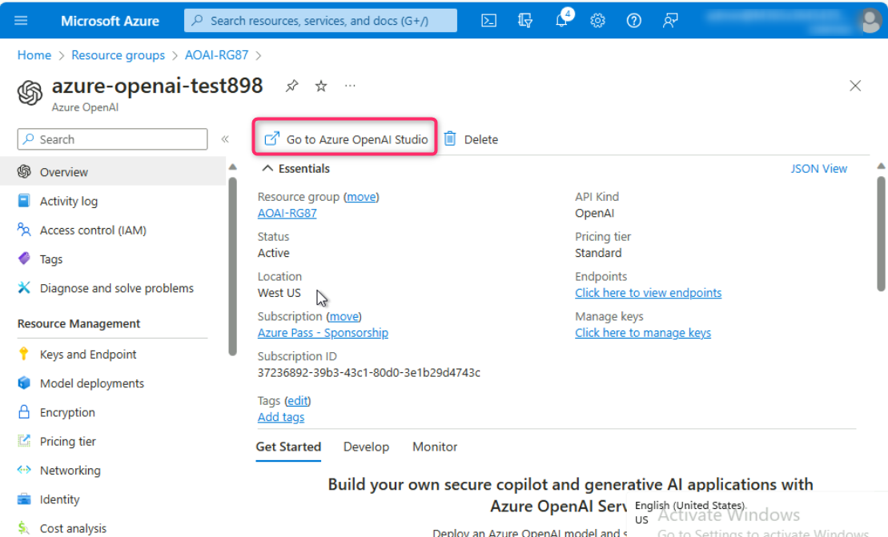
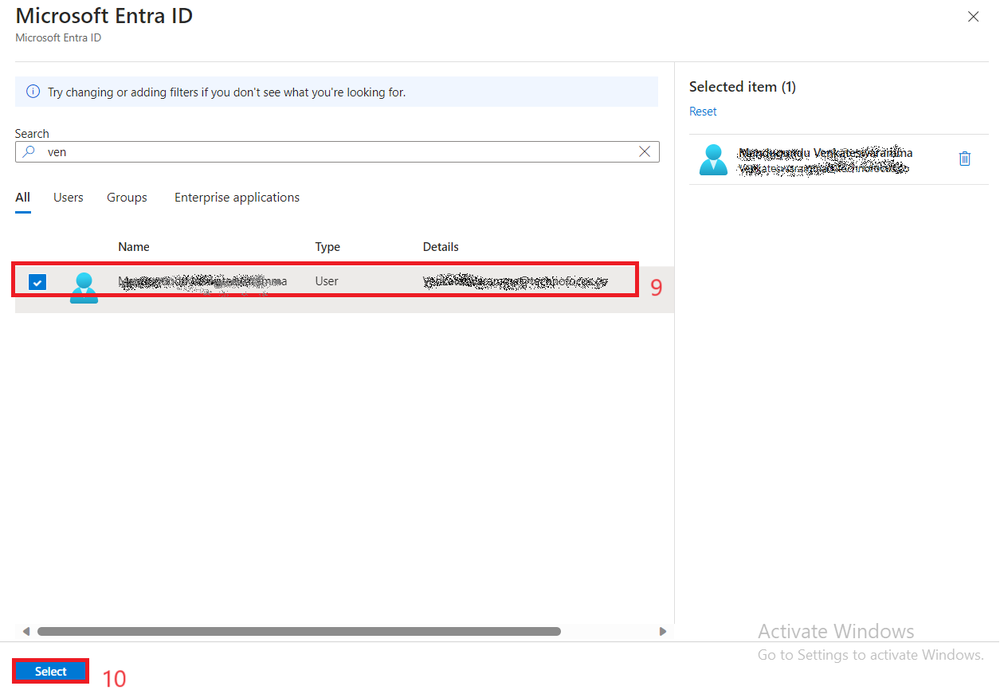
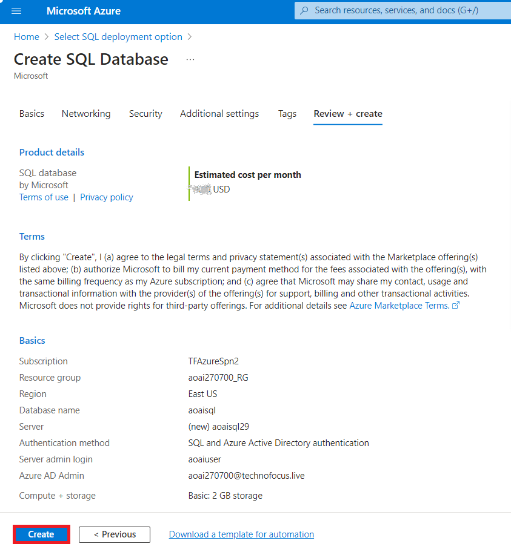
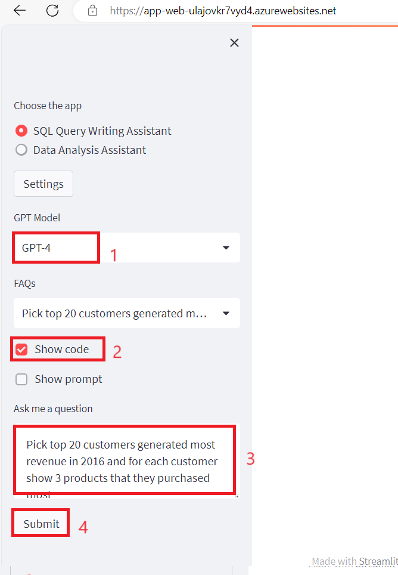
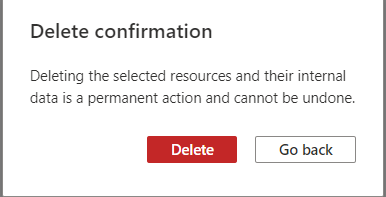

# Use case 7- Creating a webapp and power virtual agent bot with custom data using Azure OpenAI Service

**Introduction:**

Azure OpenAI on your data works with OpenAI's powerful ChatGPT
(gpt-35-turbo) and GPT-4 language models, enabling them to provide
responses based on your data. You can access Azure OpenAI on your data
using a REST API or the web-based interface in the Azure OpenAI
Studio to create a solution that connects to your data to enable an
enhanced chat experience.

One of the key features of Azure OpenAI on your data is its ability to
retrieve and utilize data in a way that enhances the model's output.
Azure OpenAI on your data together with Azure Cognitive Search
determines what data to retrieve from the designated data source based
on the user input and provided conversation history. This data is then
augmented and resubmitted as a prompt to the OpenAI model, with
retrieved information being appended to the original prompt. Although,
retrieved data is being appended to the prompt, the resulting input is
still processed by the model like any other prompt. Once the data has
been retrieved and the prompt has been submitted to the model, the model
uses this information to provide a completion.

**Objectives**

- To create a storage account, container, and Azure cognitive search
  service in the Azure portal.

- To deploy gpt-3-turbo and Embedded model in Azure AI Studio and to add
  data in Chat Playground.

- To test Assistant setup in Chat playground by sending queries in chat
  session.

- To launch a copilot and start a conversation with the bot

- To launch a new app and start a conversation with the copilot app.

- To delete gpt-3-turbo and embedded model, Azure storage account,
  cognitive search service, and the new web app.

# Exercise 1- Create an Azure Storage Account and Azure cognitive Search by using the portal

## Task 1: Create Azure OpenAI resource

1.  Open your browser, navigate to the address bar, and type or paste
    the following URL:
    [<u>https://portal.azure.com/</u>](https://portal.azure.com/), then
    press the **Enter** button.

>  alt="A screenshot of a computer Description automatically generated" />

2.  In the **Microsoft Azure** window, use the **User Credentials** to
    login to Azure.

3.  Then, enter the password and click on the **Sign in** button**.**

>  alt="A screenshot of a login box Description automatically generated" />

4.  In **Stay signed in?** window, click on the **Yes** button.

>  alt="Graphical user interface, application Description automatically generated" />

5.  From the Azure portal home page, click on **Azure portal menu**
    represented by three horizontal bars on the left side of the
    Microsoft Azure command bar as shown in the below image.

>  alt="A screenshot of a computer Description automatically generated" />

6.  Navigate and click on **+ Create a resource**.

>  alt="A screenshot of a computer Description automatically generated" />

7.  On **Create a resource** page, in the **Search services and
    marketplace** search bar, type **Azure OpenAI**, then press the
    **Enter** button.

>  alt="A screenshot of a computer Description automatically generated" />

8.  In the **Marketplace** page, navigate to the **Azure OpenAI**
    section, click on the Create button dropdown, then select **Azure
    OpenAI** as shown in the image. (In case, you’ve already clicked on
    the **Azure** **OpenAI** tile, then click on the **Create** button
    on the **Azure OpenAI page**).

>  alt="A screenshot of a computer Description automatically generated" />

9.  In the **Create Azure OpenAI** window, under the **Basics** tab,
    enter the following details and click on the **Next** button.

<table>
<colgroup>
<col style="width: 45%" />
<col style="width: 54%" />
</colgroup>
<thead>
<tr class="header">
<th><blockquote>

<strong>Subscription</strong>

</blockquote></th>
<th><blockquote>

Select the assigned subscription

</blockquote></th>
</tr>
</thead>
<tbody>
<tr class="odd">
<td><blockquote>

<strong>Resource group</strong>

</blockquote></td>
<td>Click on <strong>Create new</strong>&gt; enter
<strong>AOAI-RGXX</strong>(XX can be a unique number, you can add more
digits after XX to make the name unique)</td>
</tr>
<tr class="even">
<td><blockquote>

<strong>Region</strong>

</blockquote></td>
<td>Select <strong>East US 2</strong></td>
</tr>
<tr class="odd">
<td><blockquote>

<strong>Name</strong>

</blockquote></td>
<td>Azure-openai-testXX (XX can be a unique number, you can add more
digits after XX to make the name unique) (here, we entered
<strong>Azure-open-test39</strong>)</td>
</tr>
<tr class="even">
<td><blockquote>

<strong>Pricing tier</strong>

</blockquote></td>
<td><blockquote>

Select <strong>Standard S0</strong>

</blockquote></td>
</tr>
</tbody>
</table>

>  alt="A screenshot of a computer Description automatically generated" />
>
>  alt="A screenshot of a computer Description automatically generated" />

10. In the **Network** tab, leave all the radio buttons in the default
    state, and click on the **Next** button.

>  alt="A screenshot of a computer Description automatically generated" />

11. In the **Tags** tab, leave all the fields in the default state, and
    click on the **Next** button.

>  alt="A screenshot of a computer Description automatically generated" />

12. In the **Review+submit** tab, once the Validation is Passed, click
    on the **Create** button.

>  alt="A screenshot of a computer Description automatically generated" />

13. Wait for the deployment to complete. The deployment will take around
    2-3 minutes.

14. On **Microsoft.CognitiveServicesOpenAI** window, after the
    deployment is completed, click on the **Go to resource** button.

## Task 2: Cognitive Services Usages Reader for the Azure OpenAI resource

1.  Type in **Subscriptions** in the search bar and select
    **Subscriptions**.

2.  Click on your assigned **subscription**.

3.  From the left menu, click on the **Access control(IAM).**

4.  On the Access control(IAM) page, Click +**Add** and select **Add
    role assignments.**

5.  Type the **Cognitive Services Usages Reader** in the search box and
    select it. Click **Next**

6.  In the **Add role assignment** tab, select Assign access to User
    group or service principal. Under Members, click **+Select members**

7.  On the Select members tab , search your Azure OpenAI subscription
    and click **Select.**

8.  In the **Add role assignment** page, Click **Review + Assign**, you
    will get a notification once the role assignment is complete.

9.  You will see a notification – added as Cognitive Services Usage
    Reader for Azure Pass-Sponsorship.

10. In Azure subscription page from the left menu, click on the **Access
    control(IAM).**

11. On the Access control(IAM) page, Click +**Add** and select **Add
    role assignments.**

12. Type the [**Cognitive Services
    Contributor**](https://learn.microsoft.com/en-us/azure/ai-services/openai/how-to/role-based-access-control#cognitive-services-contributor)
    in the search box and select it. Click **Next**

13. In the **Add role assignment** tab, select Assign access to User
    group or service principal. Under Members, click **+Select members**

14. On the Select members tab , search your Azure OpenAI subscription
    and click **Select.**

15. In the **Add role assignment** page, Click **Review + Assign**, you
    will get a notification once the role assignment is complete.

16. You will see a notification – added as Cognitive Services Usage
    Reader for Azure Pass-Sponsorship.

17. Go back to **Azure portal** home page, type in **Azure OpenAI** in
    the search bar and select **Azure OpenAI** created in **Lab 1**

>  alt="A screenshot of a computer Description automatically generated" />

18. Click on your **Azure OpenAI** service.

19. From the left menu, click on the **Access control(IAM).**

20. On the Access control(IAM) page, Click +**Add** and select **Add
    role assignments.**

21. Type the [**Cognitive Services
    Contributor**](https://learn.microsoft.com/en-us/azure/ai-services/openai/how-to/role-based-access-control#cognitive-services-contributor)
    in the search box and select it. Click **Next**

22. In the **Add role assignment** tab, select Assign access to User
    group or service principal. Under Members, click **+Select members**

23. On the Select members tab , search your Azure OpenAI subscription
    and click **Select.**

24. In the **Add role assignment** page, Click **Review + Assign**, you
    will get a notification once the role assignment is complete.

25. You will see a notification – added as Cognitive Services Usage
    Reader for Azure Pass-Sponsorship.

## Task 3: Create an Azure Storage Account by using the portal

1.  Sign in to the
    [**https://portal.azure.com/**](https://portal.azure.com/)

2.  Click on the **Portal Menu**, then select **+ Create a resource**

3.  In the **Create a resource** window search box, type **Storage
    account** and then click on the **storage account**.

4.  In the **Marketplace** page, click on the **Storage account**
    section.

5.  In the **Storage account** window, click on the **Create** button.

6.  On **Create a storage account** window, under the **Basics** tab,
    enter the below details to create a storage account and then click
    on **Review**

- 

| **Subscription** | Select your Azure OpenAI subscription |
|----|----|
| **Resource group** | Select your Resource group(that you have created in **Task 1**) |
| **Storage account name** | **azureopenaistorageXX**(XX can be a unique number) (here, we entered **azureopenaistorage39**) |
| **Region** | Select the appropriate region for your storage account **.** In this lab **East US** is taken |
| **Performance** | **Standard: **Recommended for most scenarios (general-purpose v2 account) |
| **Redundancy** | **Locally-redundant storage (LRS)** |

7.  On the **Review** tab, click on the **Create** button.

8.  This new Azure Storage account is now set up to host data for an
    Azure Data Lake. Click on the **Go to resource** button.

9.  After the account has been deployed, you will find options related
    to Azure Data Lake in the Overview page. In the left-side navigation
    pane, navigate to **Data storage** section, then click on
    **Containers**.

10. On **azureopenaistorageXX \| Containers** page, click on
    **+Container.**

> 

11. On the New container pane that appear on the right side, enter the
    container **Name** as **source** and click on **Create** button.

> 

12. On **azureopenaistorageXX \| Containers** page, select **source**
    container**.**

> 

13. On **source** container page, click on **Upload** button.

> 

14. In the **Upload blob** pane, click on **Browse for file**, navigate
    to **C:\Labfiles** location and select **TF-AzureOpenAI.pdf**, then
    click on the **Open** button.

> 
>
> 

15. In **Upload blob** pane, click on the **Upload** button.

> 

16. You will see a notification – **Successfully uploaded blob** when
    the uploaded is succeeded.

>  style="width:4.66667in;height:2.20833in" />
>
> 

## Task 4: Create an Azure Cognitive Search service in the portal

1.  On the **azureopenaistorageXX \| Containers** page, click on
    **Home** to go back to Azure portal home page.

> 

2.  In Azure portal home page, click on **+ Create Resource**.

>  style="width:5.2125in;height:2.94416in" />

3.  In the **Create a resource** page search bar, type **Azure AI
    Search** and click on the appeared **azure ai search**.

4.  Click on **azure ai search** section.

5.  In the **Azure AI Search** page, click on the **Create** button.

> 

6.  On the **Create a search service** page, provide the following
    information and click on **Review+create** button.

| **Field** | **Description** |
|----|----|
| **Subscription** | Select your Azure OpenAI subscription |
| **Resource group** | Select your Resource group(that you have created in **Task 1**) |
| **Region** | EastUS |
| **Name** | **mysearchserviceXX** (XXcan be unique number) |
| **Pricing Tier** | Click on change Price Tire\>select **Basic** |

7.  Once the Validation is passed, click on the **Create** button.

8.  After the deployment is completed, click on the **Go to resource**
    button.

9.  In the **mysearchserviceXX** Overview page. In the left-side
    navigation pane, under **Settings** section, select **Semantic
    ranker**.

10. On the **Semantic ranker** tab**,** select **Free** tile and click
    on the **Select plan.**

11. You will see a notification -**Successfully updated semantic ranker
    to free plan**

# Exercise-2: Add your data using Azure OpenAI Studio

## Task 1: Deploy gpt-35-turbo and embedded models in Azure AI Studio

1.  Open your browser, navigate to the address bar, and type or paste
    the following URL: !!
    [<u>https://oai.azure.com/</u>](https://oai.azure.com/) !!then press
    the **Enter** button.

>  alt="A screenshot of a computer Description automatically generated" />
>
> **Note**: If you are directed to the **Azure OpenAI Studio** home
> page, then skip steps from \#2 to \#4, else continue.

2.  In the **Microsoft Azure** window, enter your **Sign-in**
    credentials, and click on the **Next** button.

>  alt="A screenshot of a computer Description automatically generated" />

3.  Then, enter the password and click on the **Sign in** button**.**

>  alt="A screenshot of a login box Description automatically generated" />

4.  In **Stay signed in?** window, click on the **Yes** button.

>  alt="Graphical user interface, application Description automatically generated" />

5.  On the **Welcome to Azure OpenAI Studio** dialog box, under the
    **Subscription** field, enter the subscription assigned to you, and
    in the **Resource** field, select the existing Resource name that
    you’ve created in Lab \#1, and then click on the **Use resource**
    button.

6.  Within few minutes **Azure AI Studio** page will appear.

7.  On the **Azure AI Studio** homepage, click on **Create new
    deployment** button.

8.  In the **Deployments** page, click on +**Create new deployment**.

>  alt="A screenshot of a computer Description automatically generated" />

9.  Select the **Deployment type** as **Standard,** in the **Deployment
    name field**, enter **gpt-35-turbo**, and click on the **Create**
    button. 

>  style="width:6.36667in;height:5.79167in" /> You will see a
> notification – **Successfully Created deployment** when the deployment
> is succeeded. (You can also view the notification by clicking on the
> bell icon beside **Azure AI \| Azure AI Studio)**.

10. In the **Deployments** page, click on +**Create new deployment**.

>  alt="A screenshot of a computer Description automatically generated" />

11. In the **Deploy model** dialog box, under **Select a model** click
    on the dropdown select **text-embedding-ada-002** field, under
    **Deployment type** select **Standard** and under **Deployment
    name** enter **text-embedding-ada-002.** Click on the **Create**
    button.

12. You will see a notification – **Successfully Created deployment**
    when the deployment is succeeded. (You can also view the
    notification by clicking on the bell icon beside **Cognitive
    Services \| Azure OpenAI Studio)**.

** *Important: ****We strongly recommend using **text-embedding-ada-002
(Version 2**). This model/version provides parity with
OpenAI's text-embedding-ada-002. To learn more about the improvements
offered by this model, please refer to [**OpenAI's blog
post**](https://openai.com/blog/new-and-improved-embedding-model). Even
if you are currently using Version 1, you should migrate to Version 2 to
take advantage of the latest weights/updated token limit.*

## Task 2: Add your data using Azure OpenAI Studio

1.  Click on the **Azure OpenAI** home icon to go back to the home page.

> 

2.  In Azure OpenAI Studio Home page, under **Welcome to Azure OpenAI
    Service**, click on the **Bring your own data**

> 

3.  In the **Add data** page, click on the dropdown under **Select or
    add data source**, then navigate and click on **Azure Blob
    Storage**.

4.  In the **Add data** page, under **Select or add data source** enter
    the following details and select **Next.**

| **Subscription** | Select your Azure OpenAI subscription |
|----|----|
| **Select Azure Blob storage resource** | Select your Azure Blob storage that you have created in Exercise 1 Task 2(**azureopenaistorageXX**) |
| **Select storage container** | source |
| **Select Azure AI Search resource** | Select your Azure AI Search that you have created in Exercise 1 Task 3(**mysearchserviceXX)** |
| **Enter the index name** | **azure-index** |
| **Indexer schedule** | Once |

5.  Select the check box – **Add vector search to this search
    resource**.

6.  Select an embedding model as **text-embedding-ada-002**, then click
    on the **Next** button.

***Note**: In case, you encounter an error – **Can‘t manage CORS on this
resource. Please select another storage resource**, then syn your VM
time, as mentioned in Lab \#1, Task \#1.*

7.  In the **Add data** page, on the **Data management** tab drop down
    the Search type and select **Hybrid+semantic.**

8.  Select the **chunk size** as **1024(default).**Then, click on
    **Next.**

9.  In the **Data connection** pane, select **API key** and click on
    **Next** button.

10. In **Review and Finish** pane, review the details that you’ve
    entered, and click on **Save and close** button**.**

11. The data will be added in your Chat Playground. This will take
    approximately 4-5 minutes.

## Task 3: Explore text completion in the Chat Playground

1.  In the **Chat session** section, enter the following prompt in the
    **User message** text box and click on the **Send** icon

CodeCopy

**What is Azure OpenAI Service?**

2.  In the **Chat session** section, select the references link and
    observe the details of search document on right side of the page.

3.  Send the following prompt to the model by pasting them in User
    message text box and clicking on the Send icon.

CodeCopy

**How do I get access to Azure OpenAI?**

4.  In the **Chat session** section, select the references link and
    observe the details of search document on right side of the page.

# Exercise 3: Deploy a web app with custom data

## Task 1: Deploy a web app

1.  Open your browser, navigate to the address bar, and type or paste
    the following URL: !!
    [<u>https://oai.azure.com/</u>](https://oai.azure.com/) !!then press
    the **Enter** button.

2.  In Azure AI Studio **Chat playground**, click on the V chevron
    button beside **Deploy to**, then navigate and click on **A new web
    app**.

Note: In case, you did not see **Deploy to** button on your VM, then use
Ctrl+- or Ctrl+minus keyboard shortcut to zoom out and decrease the font
size.

3.  On **Deploy to a web app** window, select **Create a new web app**
    radio button and enter the following details:

| Name | **AOAI-webappXXX**(XXX can be a unique number) (here, we entered AOAI-webapp129) |
|----|----|
| Subscription | Select the assigned subscription |
| Resource Group | Select the resource group created in Lab 1 |
| Location | **East US** |
| Pricing plan | **Basic(B1)** |

4.  Select the check box of **Enable chat history in the web app**

5.  Select the check box of **I acknowledge that enabling chat history
    will incur CosmosDB usage to my account**

6.  Select the check box of **I acknowledge that web apps will incur
    usage to my account,** then click on **Deploy** button.

7.  Wait for the deployment to complete. The deployment will take around
    10-15 minutes.

8.  After successful deployment of the web app, you’ll will see a
    notification – **Web app deployed**. (You can also view the
    notification by clicking on the bell icon beside **Azure AI \| Azure
    AI Studio**).

9.  On the right side of **Chat playground**, click on **Launch web
    app** button.

10. Wait for 10 minutes, so that authentication configuration can be
    successfully applied on the app.

11. After 10 minutes, click on the **Refresh** button.

12. On **Permissions requested** dialog box, click on the **Accept**
    button

13. Now, web app will open in a new browser.

14. In the **Azure AI** web app page, enter the following text and click
    on the **Submit icon** as shown in the below image.

**CodeCopy**

**How do I get access to Azure OpenAI?**

15. Similarly, paste the following text in the text box and click on the
    **Send** icon.

**CodeCopy**

**What is the expiry date of GPT-35-Turbo version 0301 and GPT-4 version
0314?**

16. Refresh the webapp page and click on the **Show chat history**.

17. Under the chat history click on **Accessing Azure OpenAI**.

# Exercise 4: Create a Copilot app with custom data

## Task 1: Create a chatbot with custom data

1.  In Azure AI Studio **Chat playground,** in the Add your data select
    the Remove data source.

2.  In case, **Remove grounding data?** dialog box appears, then click
    on the **Continue** button.

3.  In **Chat playground pane** , under the Assistant setup select **Add
    your data** and then select the **+Add data source** .

4.  In the **Add data** page, under **Select or add data source** enter
    the following details and select **Next.**

| **Subscription** | Select your Azure OpenAI subscription |
|----|----|
| **Select Azure Blob storage resource** | Select your Azure Blob storage that you have created in Exercise 1 Task 2(**azureopenaistorageXX**) |
| **Select storage container** | source |
| **Select Azure AI Search resource** | Select your Azure AI Search that you have created in Exercise 1 Task 3(**mysearchserviceXX)** |
| **Enter the index name** | **copilot-index** |
| **Indexer schedule** | Once |

***Note**: In case, you encounter an error – **Can‘t manage CORS on this
resource. Please select another storage resource**, then syn your VM
time, as mentioned in Lab \#1, Task \#1.*

5.  In the **Add data** page, on the **Data management** tab drop down
    the Search type and select **Keyword,** select the chunk size as
    **1024(default).**Then, click on **Next.**

6.  In the **Data connection** pane, select **API key** and click on
    **Next** button.

7.  In **Review and Finish** pane, review the details that you’ve
    entered, and click on **Save and close** button**.**

8.  The data will be added in your Chat Playground. This will take
    approximately 4-5 minutes.

## Task 2: Create a copilot with custom data from Azure OpenAI

1.  Login to !!**https://copilotstudio.microsoft.com/**!! using your
    Azure login credentials.

2.  Once logged in, in the Welcome to Microsoft Copilot Studio page,
    select your Country and click on **Start free trial**.

3.  The Copilot Home page opens.

4.  Select Copilots from the left pane. And then click on **+ New
    copilot**.

>  alt="A screenshot of a computer Description automatically generated" />

5.  Select **Skip to configure**.

6.  On the Create a copilot page, enter the **name** as
    +++**CopilotforAOAI+++** and click on **Create**.

7.  Click on **Topics -\> System -\> Conversational boosting**.

8.  Click on **Edit** under **Data sources** of the **Create generative
    answers** node. Select **Classic data** in the **Properties** pane
    that opens up.

9.  Under **Azure OpenAI Services on your data**, click on **+ Add
    connection** and then select **Azure OpenAI**.

10. This adds the Azure OpenAI service connection and opens up the
    connection properties pane.

11. In the **Connection Properties** pane, under **General -\>
    Configuration**, fill in the below details

Deployment – !!gpt-35-turbo!!

Api version – !!0301!!

12. Under the **Model data** tab, click on **+ Add** under Data sources
    and then add the below details.

Index name - !!copilot-index!!

Content data – !!content!!

13. Click on **Save**.

## Task 3: Test your copilot

1.  Click on **Test** to open the Test your Copilot pane.

2.  Type in !!What is Azure OpenAI?!! and click **Send**.

3.  You will receive the response from the data uploaded in **Azure
    OpenAI resource**. Also, observe that the **Surfaced with Azure
    OpenAI** message below the reply.

## Task 4: Delete resources

1.  To delete the storage account, navigate to Azure portal home page,
    type **Resource groups** in the Azure portal search bar, navigate
    and click on **Resource groups** under **Services**.

> 

2.  Click on the assigned resource group.

>  style="width:6.49167in;height:2.98333in" />

3.  Carefully select storage account, Azure Cognitive Search, Azure web
    app, CosmosDB that you’ve created.

**Note**: Don’t select Azure OpenAI service.

>  style="width:6.90129in;height:3.10038in" />

4.  In the Resource group page, navigate to
    the command bar and click on **Delete**.

**Important Note**: Don’t click on **Delete resource group**. If you
don’t see the **Delete** option in the command bar, then click on the
horizontal ellipsis.

5.  In the **Delete Resources** pane that appears on the right side,
    enter the **delete** and click on **Delete** button.

>  style="width:5.43194in;height:7.12847in" />

6.  On **Delete confirmation** dialog box, click on D**elete** button.

>  style="width:5.06711in;height:5.10044in" />

7.  Click on the bell icon, you’ll see the notification – **Executed
    delete command on 4 selected items.**

>  style="width:3.625in;height:1.15833in" />
>
> **Summary**
>
> You've created a storage account, container, and Azure cognitive
> service in Azure portal, then you've deployed gpt-3-turbo model in
> Azure AI Studio. You’ve added data in Chat Playground and tested the
> Assistant setup by sending queries in a chat session. Then, you've
> launched a new app and started conversation with the chatbot. You've
> deleted the gpt-3-turbo model, Azure storage account, cognitive search
> service, and the new web app to effectively and efficiently manage the
> Azure OpenAI resources.

**Important Note: Please do not delete the Resource Group. If deleted,
you’ll not be able to proceed with the next lab or create a new Resource
Group.**

**Please do not delete the Azure OpenAI Service (Azure-openai-testXX).
The same service will be used throughout all the labs.**
