**Use case 9 - Performing advanced data analytics on business database
and answering business questions using Azure OpenAI Service**

**Introduction**

This lab delves into the integration of Azure OpenAI capabilities to
answer business questions through advanced data analytics performed on a
business database. Leveraging the power of Open AI, such as
ChatGPT/GPT-4, you’ll learn to construct complex queries and glean
insights from the data. The lab showcases the application's versatility
by addressing questions of varying complexity, such as revenue trends
and forecasting.

 Examples of questions are:

- **Simple**: Show me daily revenue trends in 2016 per region

- **More difficult**: Is that true that top 20% customers generate 80%
  revenue in 2016?

- **Advanced**: Forecast monthly revenue for next 12 months starting
  from June-2018

This integration supports both Python's built-in SQLITE and Microsoft
SQL Server, providing a comprehensive analytical toolset for businesses.

**Objectives**

- To deploy gpt-35-turbo model in Azure OpenAI Studio in order to
  facilitate the subsequent business question analysis.

- To efficiently create an Azure SQL Database with relevant
  configurations in preparation for data analysis tasks.

- To configure the hosted demo application and use SQL Query Writing
  Assistant and Data Analysis Assistant of the demo app for SQL query
  translation and advanced data analysis.

- To delete the gpt-35-turbo model, SQL database, and SQL server.

*Important: You can proceed with this lab only GPT-4 is available on
your Azure OpenAI Service. If it is not approved, you can request access
to GPT-4* [*https://aka.ms/oai/get-gpt4*](https://aka.ms/oai/get-gpt4)

## **Task 1: Create Azure OpenAI resource**

1.  In Azure portal, click on **portal menu** represented by three
    horizontal bars on the top left corner of page, as shown in the
    below image.

> 

2.  Navigate and click on **+ Create a resource**.

> 

3.  On **Create a resource** page, in the **Search services and
    marketplace** search bar, type **Azure OpenAI**, then press the
    **Enter** button.

> 

4.  In the **Marketplace** page, navigate to the **Azure OpenAI** tile,
    click on the V chevron button beside **Create**, then navigate and
    click on the **Azure OpenAI** as shown in the below image.

> 

5.  In the **Create Azure OpenAI** window, under the **Basics** tab,
    enter the following details and click on the **Next** button.

[TABLE]

6.  In the **Network** tab, leave all the radio buttons in the default
    state, and click on the **Next** button.

> 

7.  In the **Tags** tab, leave all the fields in the default state, and
    click on the **Next** button.

> 

8.  In the **Review + submit** tab, once the Validation is Passed, click
    on the **Create** button.

> 

9.  Wait for the deployment to complete. The deployment will take around
    2-3 minutes.

10. On **Microsoft.CognitiveServicesOpenAI** window, after the
    deployment is completed, click on **Go to resource** button.

## **Task 2: Deploy the models in Azure OpenAI**

1.  In **azure-openai-testXXX** page, navigate and click on **Go to
    Azure OpenAI Studio** as shown in the below image.

2.  Wait for the Azure OpenAI studio to launch.

3.  On the **Azure OpenAI Studio** homepage, click on **Create new
    deployment** button.

4.  In the **Deployments** page, click on +**Create new deployment**.

> 

5.  In the **Deploy model dialog** box, under the **Model name** field,
    click on the V chevron button; navigate and select carefully
    **gpt-35-turbo**.

> 

6.  Select the **Model version** as **Auto-update to default,** in the
    **Deployment name field**, enter **gpt-35-turbo**, and click on the
    **Create** button.

> 

7.  You will see a notification – **Successfully Created deployment**
    when the deployment is succeeded (You can also view the notification
    by clicking on the bell icon beside **Azure AI | Azure AI Studio)**.

8.  In the **Deployments** page, click on +**Create new deployment**.

> 

9.  In the **Deploy model dialog** box, under **Select a model** field,
    carefully select **gpt-4**, under **Model version** field, select
    **1106-Preview**, under the **Deployment name** field, enter
    **gpt-4**. Then, click on **Advanced options \>** as shown in the
    below image.

> 

10. Navigate to **Tokens Per Minute Rate Limit (thousands)** and move
    the slider to the extreme right to increase the quota limit to its
    maximum extent for your deployment. Then, click on the **Create**
    button.

> 

11. You will see a notification – **Successfully Created deployment**
    when the deployment is succeeded (You can also view the notification
    by clicking on the bell icon beside **Azure AI | Azure AI Studio)**.

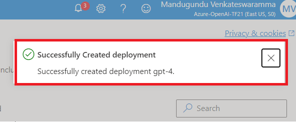

## **Task 2: Create an Azure SQL Database**

1.  Open your browser, navigate to the address bar, and type or paste
    the following URL:
    <https://portal.azure.com/#create/Microsoft.AzureSQL> then press the
    **Enter** button.

2.  Navigate to **SQL databases** section, ensure that **Single
    database** is selected under **Resource type**, then click on the
    **Create** button.

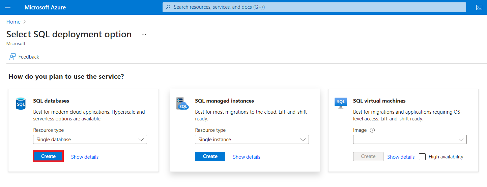

3.  On the **Create SQL Database** page provide the following details:

&nbsp;

1.  Subscription – Select your Azure OpenAI subscription

2.  Resource group – Select your Resource group(that you have created in
    **Lab 1**)

3.  Database name - **aoaisql**

4.  Server - **Create new** – provide the below Server details

    1.  Server name – Click on **Create new**, then enter **aoaisqlxx**
        \[Substitute **xx** with random number\]

    2.  Location – **East US**

    3.  Authentication – **Use both SQL and Microsoft Entra
        authentication**

    4.  Set Azure AD Admin – Click on **Set admin** and choose the
        Tenant admin **Select your Azure OpenAI subscription**

    5.  Server admin login – **aoaiuser**

    6.  Password – **Password321!**

    7.  Confirm password - **Password321!**

    8.  Click on **OK**

> 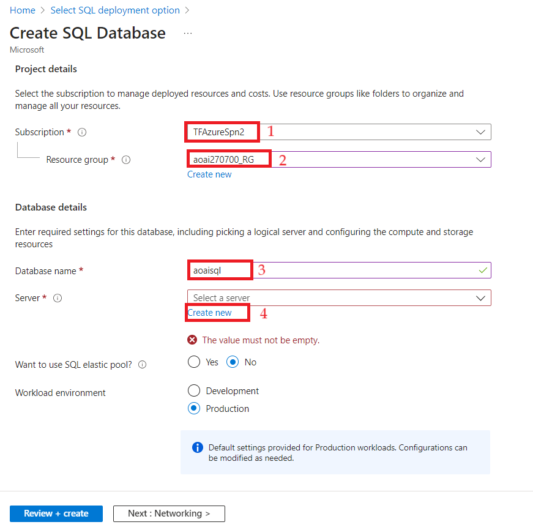

***Note**: Save the **server admin login** and **password** on the
notepad to use the information in the upcoming task.*

5.  Want to use SQL elastic pool? – **No**

6.  Compute + storage – Click on **Configure database** – Click on
    **Service tier** dropdown and Choose **Basic**, then set the Data
    max size (GB) – **2**, then click on the **Apply** button.

7.  Backup storage redundancy - **Locally-redundant backup storage**

8.  Click on **Next: Networking\>**

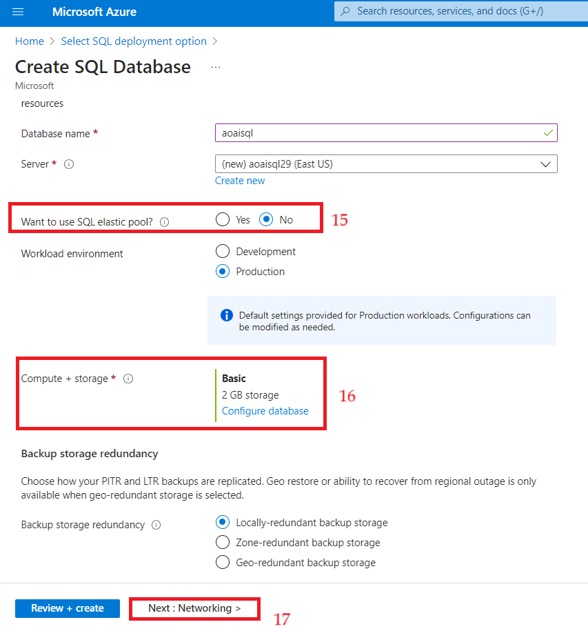

4.  On the Networking tab, provide the below details

    1.  Connectivity method – **Public endpoint**

    2.  Firewall rules

        1.  Allow Azure services and resources to access this server –
            **Yes**

        2.  Add current client IP address - **Yes**

    3.  Click on **Security**

5.  On the **Security** tab, in **Enable Microsoft Defender for SQL**
    select the check box of **Start free trail** and select **Next:
    Additional settings**

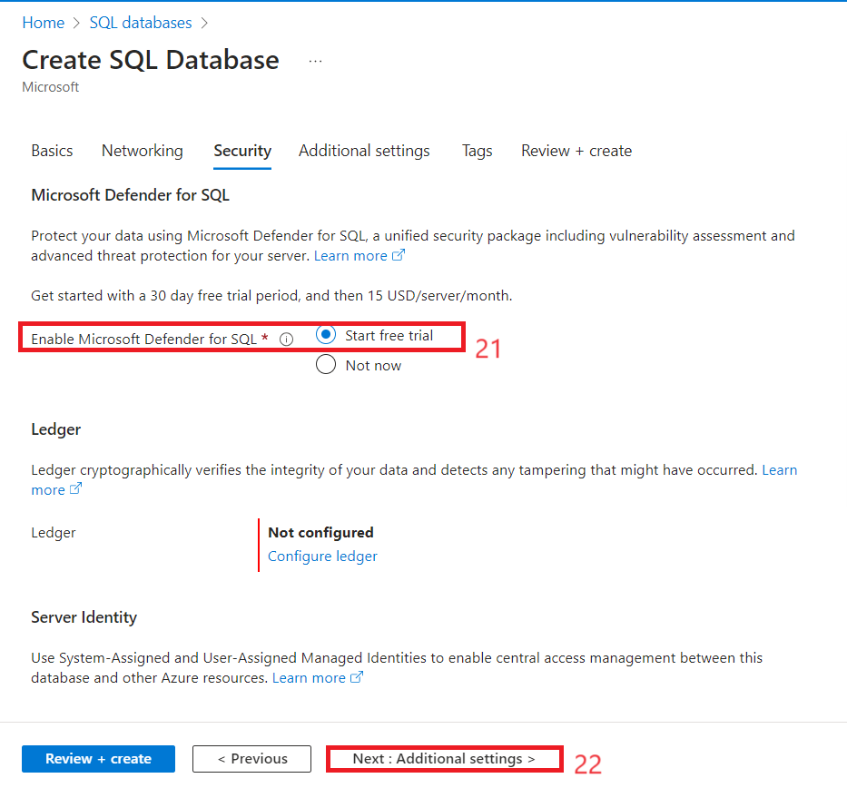

6.  On the **Additional settings** tab, under the **Data source** select
    the **Sample** as **Use existing data** and select **Next:
    Review+create.**

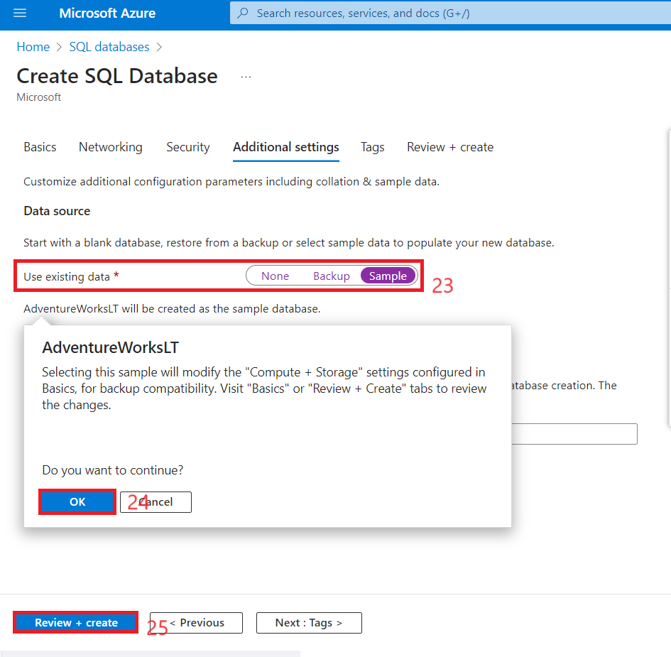

7.  On the **Review + create** tab, click on the **Create** button.

8.  The Deployment would be completed in 3-5 minutes.

9.  After the deployment is completed, click on the **Go to resource**
    button.

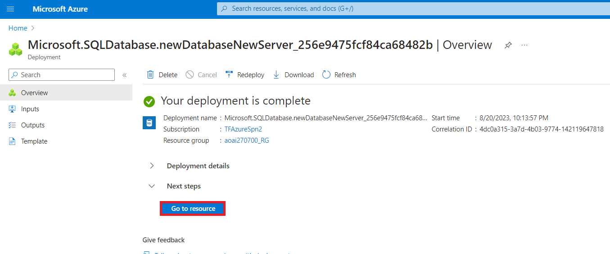

10. In **aoaisql (aoaisql29/aoaisql)** page, copy **SQL database** and
    **Server name** and paste them on a notepad (as shown in the below
    image), and then **Save** the notepad to use the information in the
    upcoming lab.

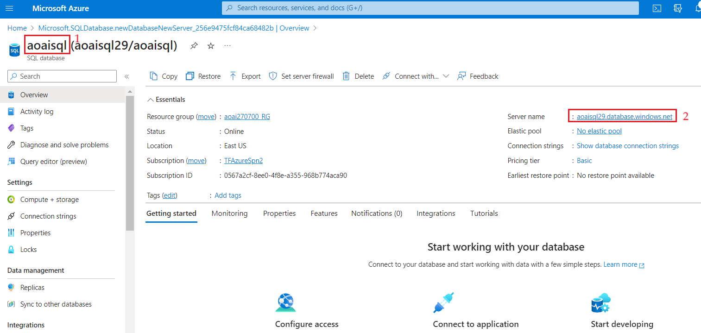

## **Task 3: Configure and use the demo application for SQL query translation and advanced data analysis**

1.  Open your browser, navigate to the address bar, and type or paste
    the following URL:
     <https://app-web-ulajovkr7vyd4.azurewebsites.net/> then press the
    **Enter** button.

2.  On the **web app** page, in the left side navigation menu, click on
    **Settings** button.

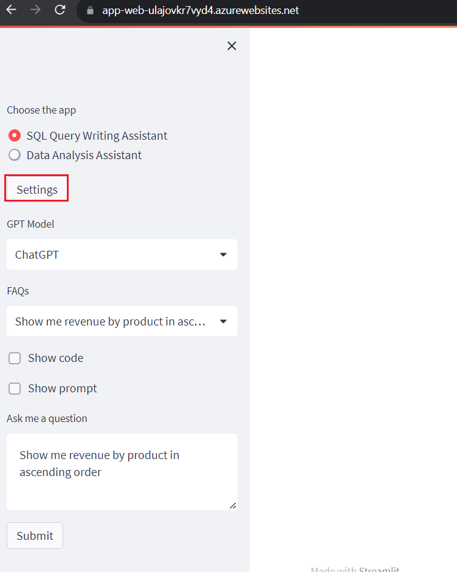

3.  Under **Azure OpenAI Settings**, enter the below details and then
    click on the **Submit** button.

[TABLE]

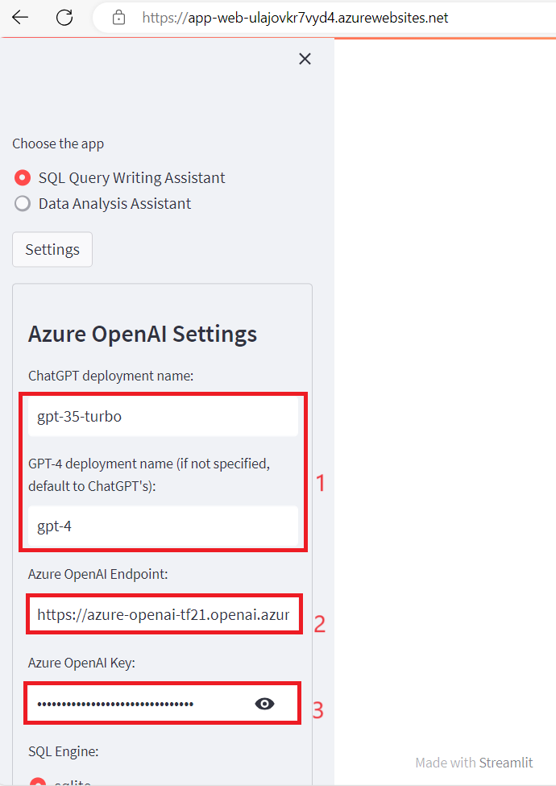

4.  There are two applications

    - **SQL Query Writing Assistant**: A simple application that
      translate business question into SQL query language, then execute
      and display result.

    - **Data Analysis Assistant**: A more sophisticated application to
      perform advanced data analytics such as statistical analysis and
      forecasting. Here, we demonstrate the use of [Chain of
      Thought](https://arxiv.org/abs/2201.11903) and [React](https://arxiv.org/abs/2210.03629) techniques
      to perform multi-step processing where the next step in the chain
      also depends on the observation/result from the previous step.

5.  Use SQL Query Writing Assistant in the web app page - Under **Choose
    the app**, select **SQL Query Writing Assistant** radio button,
    select **GPT Model** as **ChatGPT** then select **Show code** box.
    Under **Ask me a question** text box, enter the following question
    and click on the **Submit** button.

> **Show me revenue by product in ascending order**
>
> 

6.  Use SQL Query Writing Assistant in the web app page - Under **Choose
    the app**, select **SQL Query Writing Assistant** radio button,
    select **GPT Model** as **GPT 4** then select **Show code** box.
    Under **Ask me a question** text box, enter the following question
    and click on the **Submit** button.

**Pick top 20 customers generated most revenue in 2016 and for each
customer show 3 products that they purchased most**

7.  Now, use Data Analyst Assistant in the web app page - Under **Choose
    the app,** select **Data Analysis Assistant** radio button, select
    **GPT Model** as **GPT 4** then select **Show code** box and **Show
    prompt**. Under **Ask me a question** text box, enter the following
    question and click on the **Submit** button.

**Pick top 20 customers generated most revenue in 2016 and for each
customer show 3 products that they purchased most**

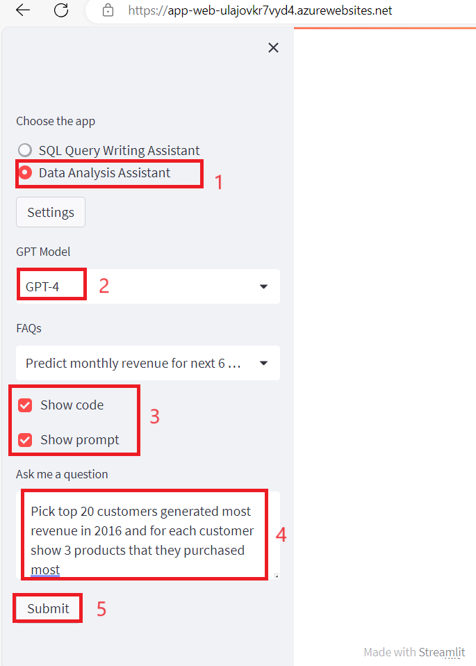

8.  Now, use Data Analyst Assistant in the web app page - Under **Choose
    the app,** select **Data Analysis Assistant** radio button, select
    **GPT Model** as **Chat** **GPT** then select **Show code** box.
    Under **Ask me a question** text box, enter the following question
    and click on the **Submit** button.

> **Show me daily revenue trends 2016 per region**

9.  For advanced questions such as forecasting in the web app page,
    under **Choose the app,** select **Data Analysis Assistant** radio
    button, select **GPT Model** as **ChatGPT** under **Ask me a
    question** text box, enter the following question and click on the
    **Submit** button.

**Note**: This time do not select **Show code** box.

> **Predict monthly revenue for next 6 months starting from June 2018.
> Do not use Prophet.**

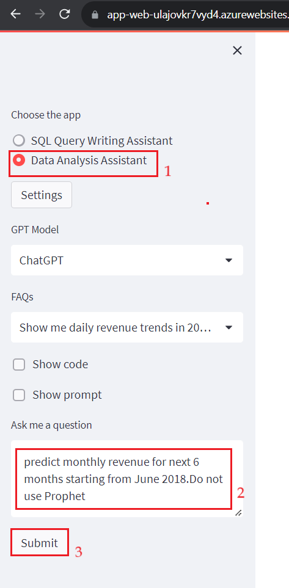

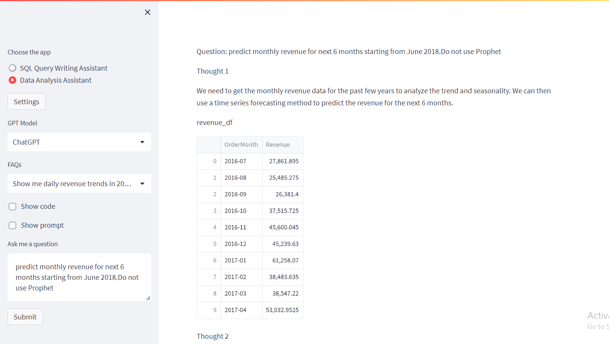

## Task 4: Delete the deployed model

1.  In Azure OpenAI Studio, on the left pane, under the **Management**
    section, click on **Deployments**. Select **gpt-35-turbo**
    deployment name and click on **Delete deployment**.

2.  In the **Confirm delete** dialog box, click on the **Delete**
    button. You will see the notification – **Successfully Deleted
    deployment**.

> 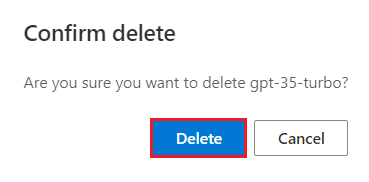
>
> 

3.  Select **gpt-4** deployment name and click on **Delete deployment**.
    If **Delete deployment** on the command bar is not visible, then
    click on the horizontal ellipses, navigate and click on **Delete
    deployment**.

4.  In the **Confirm delete** dialog box, click on the **Delete**
    button. You will see the notification – **Successfully Deleted
    deployment**.

> 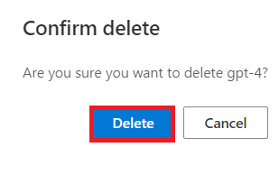
>
> 

## Task 5: Delete the SQL database and SQL server

1.  To delete the SQL database and server, navigate to **Azure portal
    Home** page, click on **Resource groups**.

> 

2.  Click on the resource group that you’ve created in this lab.

> 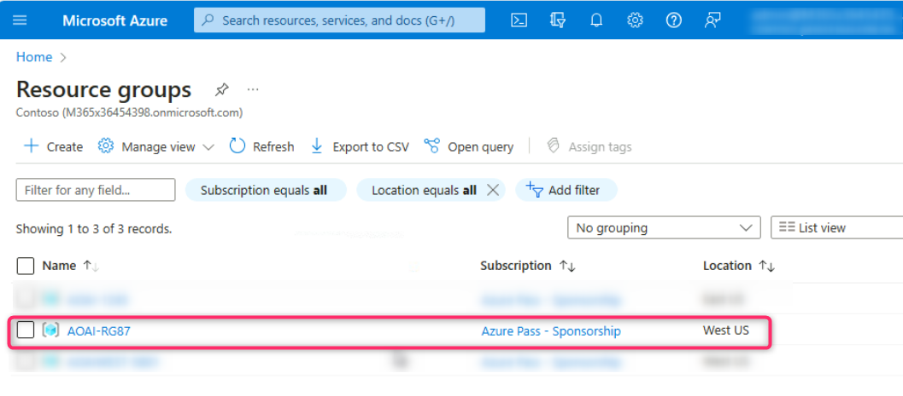

3.  Select SQL database and SQL server that you’ve created.

> 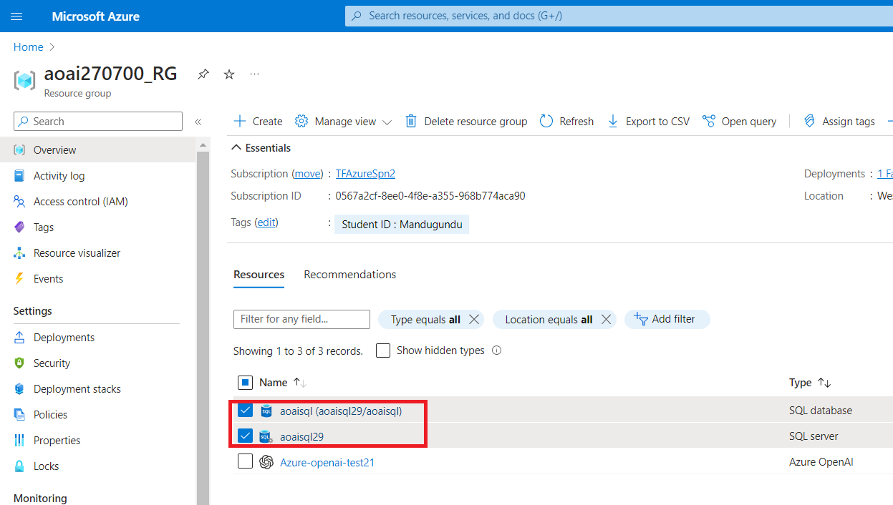

4.  In the Resource group page, navigate to command bar and click on
    **Delete**.

**Note**: In case, you did not see the **Delete** option on the command
bar, then click on the horizontal ellipsis, navigate and click on
**delete**.

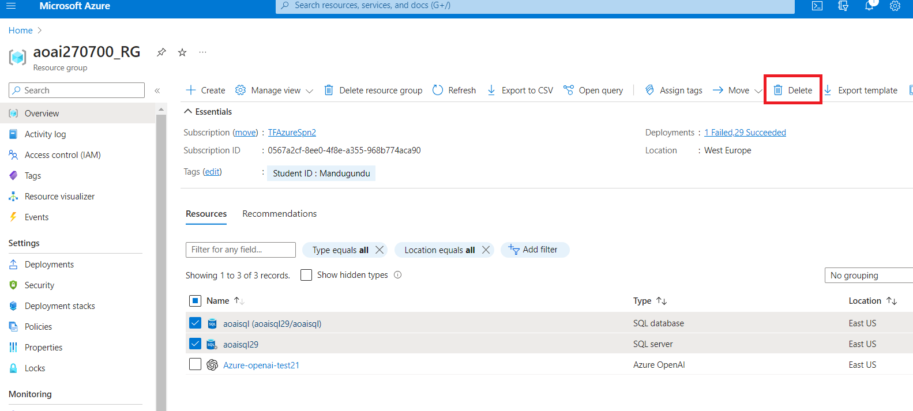

5.  In the **Delete Resources** pane that appears on the right side,
    enter **delete** and then click on **Delete** button.

> 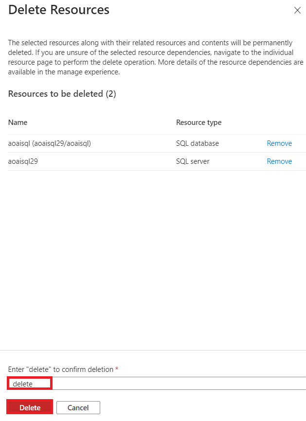

6.  On **Delete confirmation** dialog box, click on the **Delete**
    button.

> 

7.  Click on the bell icon, you’ll see the notification – **Executed
    delete command on 2 selected items**.

> 

**Summary**

In this lab, you’ve deployed gpt-35-turbo model in Azure AI Studio and
created

an Azure SQL Database with relevant configurations. Then, you’ve
configured the hosted demo application. You've used SQL Query Writing
Assistant of the demo app to translate business question into SQL query
language, then executed it and viewed the result. Then, you've used Data
Analysis Assistant of the hosted demo app to perform advanced data
analytics. You've deleted the gpt-3-turbo model, SQL database, and SQL
server to effectively and efficiently manage the Azure OpenAI resources.

**Important Note: Please do not delete the Resource Group. If deleted,
you’ll not be able to proceed with the next lab or create a new Resource
Group.**

**Please do not delete the Azure OpenAI Service (Azure-openai-testXX).
The same service will be used throughout all the labs.**
